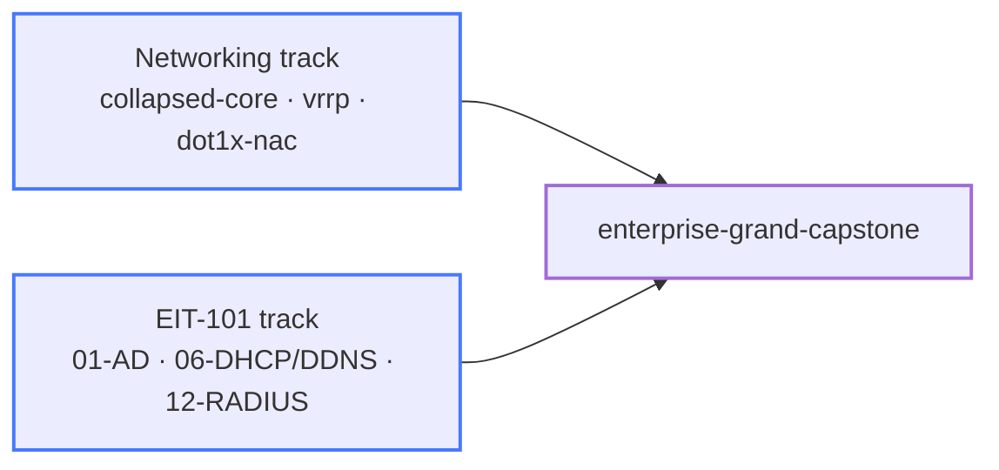

# Study Paths

## Pre-CCNA On-Ramp (start here)

If you're new to networking — or if subnetting, ARP, or "what actually happens when I
ping" feel shaky — run this short sequence before any track below. Every later lab
assumes these mechanics.

```
On-ramp:  vlan-trunks-switchport-basics → two-routers → packet-analysis-basics
          → dhcp-dns-troubleshooting → acl-basics
```

What each step gives you:

1. **vlan-trunks-switchport-basics** — access ports, trunks, and 802.1q tags: how
   frames actually move through a switch.
2. **two-routers** — the smallest possible routed network: interfaces, subnets,
   static routes, and why a router needs a route *back*.
3. **packet-analysis-basics** — tcpdump/Wireshark as a habit. Watch ARP, DHCP, and
   ICMP on the wire; after this, "shaky on ARP" stops being a thing.
4. **dhcp-dns-troubleshooting** — the two services every user-visible outage blames
   first.
5. **acl-basics** — your first taste of policy: match, permit, deny, and the
   order-matters rule.

After the on-ramp you're ready for the CCNP path below — start with its OSPF line.
If you want more Layer 2 reps first, `stp-operations` and `lacp-etherchannel` slot
in naturally after step 1.

## CCNP Enterprise (ENCOR + ENARSI)

Preparing for the exams? The [CCNP coverage map](coverage-map.md) shows exactly which
blueprint topics these labs cover, which they cover on non-Cisco syntax, and which
they don't. Read the fidelity section below first so you know what you're signing
up for.

### Platform fidelity: what these labs do and don't teach

These labs run **FRR, Arista cEOS, VyOS, Nokia SR-Linux, and plain Linux** — not
IOS-XE. The CCNP exams test IOS-XE. That trade-off is deliberate, and you should
understand it before building a study plan around this repo.

**What transfers directly (the hard 80%):** protocol behavior and troubleshooting
method. OSPF LSA types, BGP best-path selection, EIGRP feasibility conditions,
spanning-tree convergence, NHRP resolution, RPF checks, redistribution loops — these
are protocol facts, not vendor facts. A student who can debug a stuck-in-INIT OSPF
adjacency on FRR can debug it on IOS-XE; the *reasoning* is the skill. cEOS syntax in
particular is close enough to IOS that most `show` commands and config stanzas map
one-to-one.

**What does not transfer (the visible 20%):** IOS-XE-specific syntax and
Cisco-proprietary features. Concretely, the exams will test things no lab here can
show you:

| Exam expects | What this repo has instead |
|--------------|---------------------------|
| **Named-mode EIGRP** (`router eigrp NAME` + address families) | FRR EIGRP is classic-mode, IPv4-only, no auth |
| **MQC QoS** (`class-map`/`policy-map`/`service-policy`) | Linux `tc` classification and scheduling (`qos-enterprise`) |
| **HSRP and GLBP** | VRRP (`vrrp`, `ha-network-design-ceos`) — same FHRP concept, different protocol and CLI |
| **Cisco NHRP/DMVPN syntax** (`ip nhrp map`, `tunnel mode gre multipoint`) | VyOS DMVPN (`dmvpn-phase1/2/3`) — identical NHRP behavior, different config grammar |
| **IOS NAT** (`ip nat inside/outside`) | nftables and OPNsense NAT |
| **LDP via IOS `mpls ip` syntax** | Real LDP on FRR (`mpls-ldp`) — identical protocol, FRR's `mpls ldp` config block instead; plus the SR alternative (`mpls-sr-*`) |
| **Catalyst Center (DNA Center), SD-WAN Manager (vManage), ISE, EEM, LISP, TrustSec** | Nothing — these are products, not protocols, and can't be containerized here |

**The recommended bridge:** do the labs here first — they build the protocol
understanding that makes exam study fast — then close the syntax gap with a focused
IOS-XE pass before the exam:

1. **Cisco Modeling Labs (CML)** or the free **DevNet sandboxes** to re-type the
   configs you already understand in IOS-XE syntax (named EIGRP, MQC, HSRP, DMVPN).
2. A **Boson ExSim** (or equivalent) practice-exam pass to catch product/feature
   trivia (Catalyst Center workflows, SD-WAN components, licensing) that no lab —
   here or in CML — teaches efficiently.
3. The [coverage map](coverage-map.md) tells you where to spend that bridge time:
   every 🟡 row is a syntax-drill item, every ❌ row is a reading item.

```
OSPF:     two-routers → ospf-multiarea → ospf-auth → ospf-summarization
          → ospf-default-route → ospf-nssa → ospf-virtual-link
EIGRP:    eigrp-basics → eigrp-variance → eigrp-stub
BGP:      bgp-basics → bgp-path-selection → bgp-filtering → bgp-communities → bgp-aggregation
Redist:   ospf-bgp-redist → redistribution-tags → route-maps-pbr
Tunnels:  gre-basics → ipsec-basics → gre-ipsec → dmvpn-phase1
HA:       bfd-ospf → bfd-bgp → vrrp
IS-IS:    isis-basics → isis-multiarea
IPv6:     ipv6-ospf3 → ipv6-bgp
```

## Service Provider

```
Prereq:   CCNP path above
BGP-LU:   bgp-labeled-unicast
IS-IS:    isis-basics → isis-multiarea
MPLS:     mpls-sr-blank → mpls-sr-isis-bgp (reference) → mpls-sr-srlinux (reference)
L2VPN:    mpls-l2vpn
IPv6:     ipv6-transition
```

## Data Center / EVPN

```
Prereq:   bgp-basics → bgp-path-selection
Fabric:   spine-leaf
VXLAN:    vxlan-evpn → evpn-border-ceos → dci-evpn-multisite
SR-Linux: vxlan-evpn-srlinux (reference)
VRF:      vrf-lite
```

## Enterprise Design

```
Prereq:   ospf-multiarea, bgp-basics, vrrp
Reference: enterprise-collapsed-core → enterprise-campus → enterprise-routed-access
Edge:     enterprise-wan-edge
Hybrid:   enterprise-wan-edge → cloud-hybrid-networking
DMZ:      enterprise-dmz
Security: enterprise-access-security → enterprise-edge-nat-firewall
Services: enterprise-services-infra
Multicast: enterprise-multicast
HA:       ha-network-design-ceos
Capstones: enterprise-collapsed-core-capstone → enterprise-campus-capstone
           → enterprise-routed-access-capstone → enterprise-wan-edge-capstone
```

## Security

```
acl-basics → bgp-prefix-security → bgp-rpki
ipsec-basics → opnsense-ipsec-nat-t → gre-ipsec → black-core-routing → flexvpn-basics
wireguard → opnsense-remote-access-concentrator
macsec-basics → dot1x-nac → dot1x-ceos-practice
→ wireless-auth-control-operations
urpf-antispoofing → copp-basics
enterprise-edge-nat-firewall → opnsense-ngfw-basics
```

## Security Infrastructure / SOC

```
Prereq:   packet-analysis-basics → network-assurance → enterprise-dmz
SOC:      soc-dmz-foundation → soc-zeek-analysis → soc-suricata-ids
Files:    soc-yara-file-pipeline
SIEM:     soc-elk-ingest → soc-kibana-hvt-dashboard → soc-arkime-pcap
Ops:      soc-adversary-simulation → soc-threat-intel-misp → soc-ir-case-management
```

## Network Operations

```
management-access-control → dhcp-dns-troubleshooting → aaa-ops-troubleshooting
→ packet-analysis-basics → mtu-pmtud-troubleshooting → ipv6-access-services
→ cloud-hybrid-networking → automation-fundamentals → network-automation-netbox
→ suzieq-network-observability → network-gitops-change-pipeline
→ telemetry-monitoring-hybrid → wireless-auth-control-operations
```

## DMVPN Progression

```
dmvpn-phase1 (VyOS) → dmvpn-phase2 → dmvpn-phase3
```

## Troubleshooting Practice

Start with guided failures, then move into blind proctored incidents:

```
debug-ospf-multiarea → debug-bgp-basics → debug-eigrp-basics → debug-isis-basics
→ debug-bgp-filtering → debug-gre-basics → debug-spine-leaf
→ debug-vxlan-evpn → debug-mpls-sr-isis-bgp
→ troubleshooting-range → troubleshooting-range-advanced
→ wireless-auth-control-operations (certificate-trust Break-It)
```

See the [Troubleshooting & Assessment track](tracks/troubleshooting/index.md)
for the differences between guided debug labs and proctored ranges.

## Checking what stuck

Every path above ends with labs that pass or fail on a running network. The
[written assessments](assessments/index.md) check the other half: a
[topic quiz](assessments/quizzes/README.md) after a small group of related labs, and one
of the five cumulative exams after a whole path. Both are closed-book paper tests on
unfamiliar topologies, so remembering a lab's solution toggle is not enough.

## Enterprise IT 101

A cumulative curriculum — each lab extends the previous one. Uses Docker Compose, not
ContainerLab; drive it with `enterprise-it-101/eit.sh`.

```
Foundation:  01-active-directory → 02-ntp-time-services
             → 03-certificate-authority → 04-domain-join
Core:        05-dns-deep-dive → 06-dhcp-dynamic-dns
             → 07-file-shares → 08-group-policy → 09-email-gateway
Advanced:    10-sso-federation → 11-web-proxy → 12-radius
Operations:  13-monitoring → 14-siem-logging
             → 15-backup-recovery → 16-capstone
```

Labs 01–16 are all built (13 monitoring, 14 SIEM, 15 backup, 16 capstone).

---

## Cross-track grand capstone

The summit of the whole repo — the one lab that runs the **networking** and **enterprise-IT**
tracks together. A Cisco-style campus (cEOS collapsed core + Linux/hostapd access) whose
users authenticate and get services from the *real* EIT-101 stack (AD, RADIUS, Kea, DNS):
802.1X → RADIUS → AD → dynamic VLAN → DHCP → DDNS → Kerberos, plus guest segmentation,
finished by a four-fault cross-layer troubleshooting drill.



Runs ContainerLab **and** Docker Compose together — drive it with
`labs/enterprise-grand-capstone/gcap.sh`. Do it last; it assumes the pieces from both tracks.
