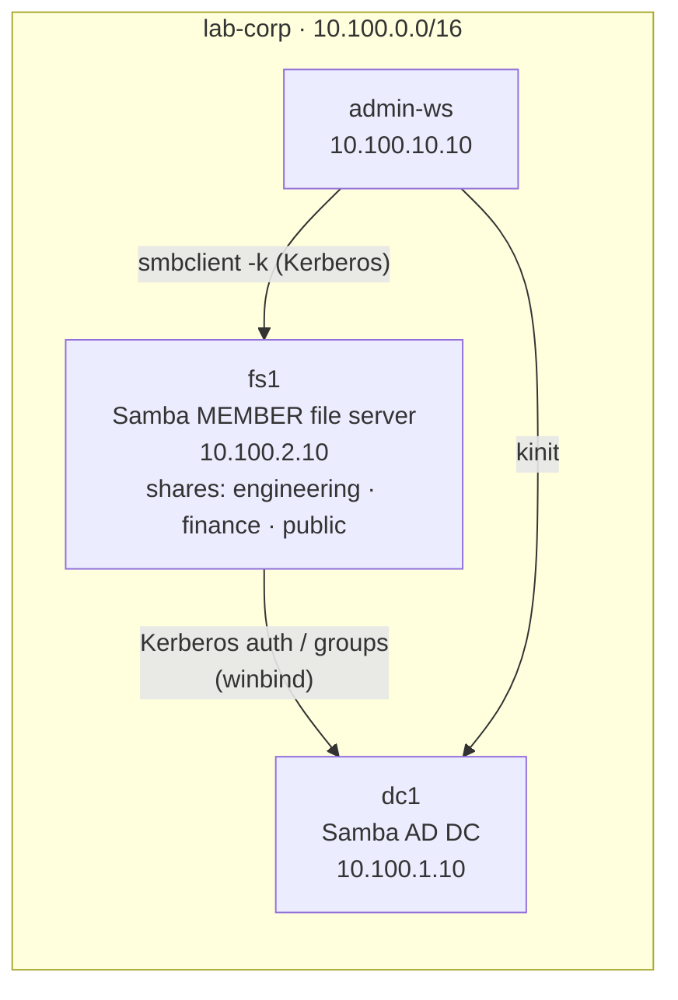

# Lab 07 — File Shares & ACLs

File sharing is the oldest enterprise service there is, and the one users notice
the moment it breaks. In this lab you take `fs1` — a Samba server already
**joined to the domain as a member** (not a DC) — and turn it into a file server
where access is governed by **AD group membership**: engineers reach the
engineering share, finance reaches finance, nobody reaches what they shouldn't.
The interesting part is that Samba sits astride **two** permission systems — the
SMB share ("who may connect") and POSIX/filesystem ACLs ("who may touch the
bytes") — and you'll make them agree, then watch what happens when they don't.

## Topology



| Container | Image | IP | Role |
|-----------|-------|----|------|
| `dc1` | `samba-ad:local` | `10.100.1.10` | AD DC — Kerberos + the engineering/finance/all-staff groups (foundation) |
| `fs1` | `samba-ad:local` (member mode) | `10.100.2.10` | Samba **member** file server — **you configure shares + ACLs** |
| `admin-ws` | `workstation:local` | `10.100.10.10` | Client — `kinit` as alice/bob, reach shares with `smbclient` |

## How to use this lab

This is a **practice lab**, not a tutorial. Each task gives you an **objective**
and **hints**. Then:

- **Predict before you run.** Commit to an answer first.
- **Reveal the solution only after you've tried.** Reach for
  `man smb.conf`, `testparm`, `man setfacl`, and `wbinfo --help` first.
- **Observe, don't just verify.** The `Check your work` blocks explain the
  *mechanism*.

You edit `/etc/samba/smb.conf` on `fs1` and apply changes with
`smbcontrol smbd reload-config`. You test from `admin-ws` with `smbclient`.

## Prerequisites

- **Labs 01–06 foundation.** Build the images if needed:

```bash
cd enterprise-it-101
docker build -t samba-ad:local   images/samba-ad/
docker build -t workstation:local images/workstation/
```

## Deploy

```bash
cd enterprise-it-101
docker compose -f base/docker-compose.yml \
               -f labs/07-file-shares/docker-compose.override.yml up -d
```

`fs1` joins the domain on first boot (watch it: `docker logs -f fs1` until you
see `Joined 'FS1' to dns domain 'lab.corp'` and `smbd … started`). This takes
~20–40 s after `dc1` is up.

## Destroy

```bash
docker compose -f base/docker-compose.yml \
               -f labs/07-file-shares/docker-compose.override.yml down -v
```

---

## What is pre-built

- `dc1` — the DC, with the `engineering` (alice), `finance` (bob), and
  `all-staff` (alice/bob/charlie) groups from Lab 01.
- `fs1` — **already joined as a member server** (`security = ADS`), winbind
  running so AD users/groups resolve to local UIDs/GIDs. The empty share
  directories `/srv/shares/{engineering,finance,public}` exist. The `[global]`
  section of `smb.conf` is done; **the share stanzas are not** — that's you.
- `admin-ws` — client with `kinit` and `smbclient`.

## What you configure

The `[engineering]`, `[finance]`, `[public]` share definitions in
`smb.conf` and the matching POSIX ACLs on disk, then you test access as
different users.

---

## Task 1 — Confirm fs1 really is a domain member

**Objective:** Before sharing anything, prove `fs1` can see the domain: it can
talk to the DC and it resolves AD users and groups to local identities. This is
what makes group-based file permissions possible.

??? question "Predict first"
    `fs1` is a *member*, not a DC — it has no copy of the user database. When you
    run `id alice` on `fs1`, where does the answer come from, and what makes
    alice's UID the *same* every time even though it was never created in
    `/etc/passwd`?

??? note "Hints"
    - `wbinfo --ping-dc` checks the secure channel to the DC.
    - `wbinfo -u` / `wbinfo -g` list domain users / groups winbind can see.
    - `id alice` resolves alice through NSS → winbind. Look at her **groups**.

??? note "Solution"
    ```bash
    docker exec fs1 wbinfo --ping-dc
    docker exec fs1 wbinfo -u
    docker exec fs1 id alice
    docker exec fs1 getent group engineering
    ```

??? success "Check your work"
    `wbinfo --ping-dc` reports the NETLOGON connection to `dc1.lab.corp`
    succeeded — `fs1` has a working machine account and secure channel. `id
    alice` returns something like:
    ```
    uid=11103(alice) gid=10513(domain users)
    groups=10513(domain users),11106(engineering),11108(all-staff),…
    ```
    Those are the **AD groups from Lab 01**, resolved on `fs1` with no local
    account for alice. The answer to the prediction: identities come from the DC
    via **winbind**, and the `idmap config LAB : backend = rid` line in
    `smb.conf` makes each AD object's RID map to the *same* UID/GID every time,
    so POSIX file ownership on disk lines up with AD membership. Without stable
    idmap, file ownership would scramble on every reboot.

---

## Task 2 — Create the engineering share

**Objective:** Define an `[engineering]` share backed by
`/srv/shares/engineering`, writable, restricted to members of the `engineering`
group. Set the directory's POSIX ownership/permissions to match.

??? question "Predict first"
    You'll restrict the share with `valid users = @engineering` *and* set the
    directory group to `engineering`. Why both — what does each layer actually
    enforce, and could a user with a valid Kerberos ticket who is *not* in
    engineering get past the first layer but be stopped by the second (or vice
    versa)?

??? note "Hints"
    - A share stanza: `[engineering]` with `path`, `read only = no`, and
      `valid users = @engineering` (the `@` means "the group").
    - Apply config changes with `docker exec fs1 smbcontrol smbd reload-config`
      (no restart needed). Validate syntax with `testparm -s`.
    - Filesystem side: `chgrp engineering <dir>`, `chmod 2770 <dir>` (the `2`
      is setgid so new files inherit the group), and optionally an explicit
      `setfacl -m g:engineering:rwx <dir>`.

??? note "Solution"
    On `fs1`, append to `/etc/samba/smb.conf`:
    ```ini
    [engineering]
        path = /srv/shares/engineering
        read only = no
        valid users = @engineering
    ```
    Set ownership + permissions and reload:
    ```bash
    docker exec fs1 bash -c '
      chgrp engineering /srv/shares/engineering
      chmod 2770 /srv/shares/engineering
      setfacl -m g:engineering:rwx /srv/shares/engineering
      smbcontrol smbd reload-config'
    docker exec fs1 testparm -s 2>/dev/null | grep -A3 "\[engineering\]"
    ```

??? success "Check your work"
    `testparm` shows the `[engineering]` share with `valid users = @engineering`.
    The prediction: the **two layers are independent**. `valid users` is the SMB
    *share* gate — it decides who may even connect. The directory group + mode +
    POSIX ACL is the *filesystem* gate — it decides who may read/write the actual
    files. A request must pass **both**. Samba's whole job here is to bridge the
    Windows-style share ACL and the Unix-style POSIX ACL, and you'll see in
    Task 6 exactly what happens when they disagree.

---

## Task 3 — Add the finance and public shares

**Objective:** Add `[finance]` (writable, `finance` group only) and `[public]`
(readable by `all-staff`, writable by no one).

??? question "Predict first"
    For `[public]` you want *everyone in all-staff* to read but *nobody* to write.
    Which single `smb.conf` directive makes a share read-only regardless of the
    underlying filesystem permissions — and why is enforcing read-only at the
    share level safer than relying on POSIX perms alone?

??? note "Hints"
    - `read only = yes` makes a share read-only at the SMB layer.
    - `valid users = @all-staff` for `[public]`.
    - Mirror the directory groups: `finance` → `finance`, `public` → `all-staff`.

??? note "Solution"
    ```ini
    [finance]
        path = /srv/shares/finance
        read only = no
        valid users = @finance

    [public]
        path = /srv/shares/public
        read only = yes
        valid users = @all-staff
    ```
    ```bash
    docker exec fs1 bash -c '
      chgrp finance  /srv/shares/finance;  chmod 2770 /srv/shares/finance
      chgrp all-staff /srv/shares/public;  chmod 2775 /srv/shares/public
      setfacl -m g:finance:rwx /srv/shares/finance
      smbcontrol smbd reload-config'
    ```

??? success "Check your work"
    Three shares now exist. The prediction: `read only = yes` enforces read-only
    at the **share** layer — even if the filesystem perms would allow a write,
    Samba refuses it. That's safer than POSIX-only because it's one obvious line
    a reviewer can audit, and it can't be defeated by a stray `chmod` on disk.
    Defense in depth: the share says read-only, *and* the directory isn't
    group-writable.

---

## Task 4 — Access the shares as alice and bob (Kerberos)

**Objective:** From `admin-ws`, authenticate as alice and bob with Kerberos and
prove the access matrix: alice reaches engineering, bob does not; bob reaches
finance, alice does not; both reach public.

??? question "Predict first"
    alice is in `engineering` and `all-staff`. bob is in `finance` and
    `all-staff`. Before running anything, fill in the matrix — for each of
    {alice, bob} × {engineering, finance, public}, will the connection
    **succeed** or be **denied**?

??? note "Hints"
    - `kinit alice@LAB.CORP` (password `P@ssw0rd1`) gets a ticket.
    - `smbclient //fs1.lab.corp/<share> -N --use-kerberos=required -c "ls"`
      connects using the ticket (`-N` = don't prompt for a password; the ticket
      is used).
    - List all shares: `smbclient -L //fs1.lab.corp -N --use-kerberos=required`.
    - A denied connection returns `tree connect failed: NT_STATUS_ACCESS_DENIED`.

??? note "Solution"
    ```bash
    # as alice
    docker exec admin-ws bash -c 'kdestroy 2>/dev/null; kinit alice@LAB.CORP <<< "P@ssw0rd1"
      echo hi > /tmp/a.txt
      smbclient //fs1.lab.corp/engineering -N --use-kerberos=required -c "put /tmp/a.txt alice.txt; ls"
      smbclient //fs1.lab.corp/finance     -N --use-kerberos=required -c "ls"'   # denied

    # as bob
    docker exec admin-ws bash -c 'kdestroy 2>/dev/null; kinit bob@LAB.CORP <<< "P@ssw0rd1"
      smbclient //fs1.lab.corp/engineering -N --use-kerberos=required -c "ls"     # denied
      smbclient //fs1.lab.corp/finance     -N --use-kerberos=required -c "ls"'    # ok
    ```

??? success "Check your work"
    The matrix:

    | | engineering | finance | public |
    |--|--|--|--|
    | **alice** | ✅ connect+write | ❌ `ACCESS_DENIED` | ✅ read |
    | **bob** | ❌ `ACCESS_DENIED` | ✅ connect+write | ✅ read |

    alice writes `alice.txt` into engineering; bob is refused at *tree connect*
    (the share's `valid users` gate rejects him before any file is touched).
    Nobody created a single per-user permission — access is purely a function of
    **AD group membership**, evaluated from the Kerberos ticket alice/bob present.
    Change someone's group on the DC and their file access changes everywhere,
    with no edits on `fs1`. That's the entire value proposition of centralized
    identity for file services.

---

## Task 5 — Prove the password never touches fs1 (capture)

**Objective (make the invisible visible):** Capture alice's session to `fs1` and
confirm her password is never transmitted — `fs1` authenticates her without ever
seeing her secret. Then inspect the share's security descriptor with `smbcacls`.

??? question "Predict first"
    alice typed her password into `kinit` on `admin-ws`. When she then connects
    to `fs1`, does `fs1` receive her password (or a hash of it) to verify? If
    not, what does `fs1` receive that proves who she is?

??? note "Hints"
    - Capture on `admin-ws`: `tcpdump -n -i eth0 -w /tmp/smb.pcap host 10.100.2.10`,
      run an `smbclient` access in another shell, then grep the capture for
      `P@ssw0rd1`.
    - `smbcacls //fs1.lab.corp/engineering / -N --use-kerberos=required` prints
      the share root's ACL — note the **group** names in it.

??? note "Solution"
    ```bash
    docker exec admin-ws bash -c 'kdestroy 2>/dev/null; kinit alice@LAB.CORP <<< "P@ssw0rd1"'
    docker exec -d admin-ws bash -c 'tcpdump -n -i eth0 -w /tmp/smb.pcap host 10.100.2.10'
    docker exec admin-ws smbclient //fs1.lab.corp/engineering -N --use-kerberos=required -c "ls"
    docker exec admin-ws bash -c 'pkill tcpdump; sleep 1;
      tcpdump -r /tmp/smb.pcap -A 2>/dev/null | grep -c "P@ssw0rd1"'   # → 0
    docker exec admin-ws smbcacls //fs1.lab.corp/engineering / -N --use-kerberos=required
    ```

??? success "Check your work"
    The grep finds the password **zero** times. `fs1` never receives alice's
    secret: she presents a **Kerberos service ticket** (which the DC issued and
    encrypted for `fs1`'s machine account), and `fs1` validates it with its own
    key. The file server authenticates users it has never seen the passwords of —
    which is why compromising a file server doesn't hand the attacker anyone's
    credentials. `smbcacls` shows `GROUP:LAB\engineering` and
    `ACL:LAB\engineering:ALLOWED/…/FULL` — the AD group is written straight into
    the object's security descriptor.

    !!! note "Mounting it like a drive (`sec=krb5`)"
        In production you'd mount the share:
        `mount -t cifs //fs1.lab.corp/engineering /mnt -o sec=krb5`. The
        `sec=krb5` option uses the **same ticket mechanism** you just proved —
        the kernel client authenticates with Kerberos, no password to the server.
        We don't mount inside the lab because `mount.cifs` needs `CAP_SYS_ADMIN`
        and a kernel cifs upcall that aren't available in an unprivileged
        container; `smbclient` exercises the identical auth + ACL path.

---

## Task 6 — Break it: make the two permission layers disagree

**Objective (required):** Break access at the **filesystem** layer while leaving
the **share** layer intact, producing the most confusing real-world symptom:
"I can connect to the share but I can't open anything." Diagnose which layer
failed, then repair.

??? question "Predict first"
    You'll change `/srv/shares/engineering` so its group is no longer
    `engineering` (and strip its ACL), but leave `valid users = @engineering` in
    `smb.conf`. When alice connects, will the **tree connect** succeed? Will the
    **directory listing** succeed? Which layer is now saying no?

**Break it** on `fs1` — strip the filesystem's engineering access but keep the
share definition:
```bash
docker exec fs1 bash -c 'chgrp root /srv/shares/engineering; setfacl -b /srv/shares/engineering; ls -ld /srv/shares/engineering'
```

**Now diagnose** from `admin-ws` as alice:
```bash
docker exec admin-ws bash -c 'kdestroy 2>/dev/null; kinit alice@LAB.CORP <<< "P@ssw0rd1"
  smbclient //fs1.lab.corp/engineering -N --use-kerberos=required -c "ls; put /tmp/a.txt brk.txt"'
```

??? note "Diagnosis hints (try before revealing)"
    - Did the connection (tree connect) succeed, or fail like bob's did in
      Task 4? That tells you whether it's a *share* problem or a *filesystem*
      problem.
    - On `fs1`, compare `ls -ld /srv/shares/engineering` and `getfacl
      /srv/shares/engineering` to a working share like `/srv/shares/finance`.
    - Which AD group does alice belong to, and does the directory grant that
      group anything anymore?

??? success "What you should observe"
    The **tree connect succeeds** — `valid users = @engineering` still admits
    alice (she *is* in engineering) — but every operation inside fails:
    `NT_STATUS_ACCESS_DENIED listing \*` and `…opening remote file \brk.txt`.
    That split is the entire lesson: **the share let her in, the filesystem
    threw her out.** `ls -ld` shows the directory is now `root root` with no
    engineering ACL, so even a legitimate engineer has no POSIX rights to the
    bytes. "Connects but can't read" almost always means the *filesystem* ACL,
    not the share or the user's group — a junior admin checks `valid users` and
    AD membership (both fine) and gets stuck.

**Repair it:**
```bash
docker exec fs1 bash -c '
  chgrp engineering /srv/shares/engineering
  chmod 2770 /srv/shares/engineering
  setfacl -m g:engineering:rwx /srv/shares/engineering'
docker exec admin-ws smbclient //fs1.lab.corp/engineering -N --use-kerberos=required \
  -c "put /tmp/a.txt ok.txt; ls"
```
The write succeeds again once the filesystem layer agrees with the share layer.

---

## Verification Checklist

```bash
# fs1 is a working member: secure channel + AD identity resolution
docker exec fs1 wbinfo --ping-dc
docker exec fs1 id alice | grep -o engineering

# The three shares exist
docker exec admin-ws bash -c 'kdestroy 2>/dev/null; kinit alice@LAB.CORP <<< "P@ssw0rd1"
  smbclient -L //fs1.lab.corp -N --use-kerberos=required' | grep -E "engineering|finance|public"

# Access matrix (group-based)
docker exec admin-ws smbclient //fs1.lab.corp/engineering -N --use-kerberos=required -c "ls" # alice: ok
docker exec admin-ws bash -c 'kdestroy 2>/dev/null; kinit bob@LAB.CORP <<< "P@ssw0rd1"
  smbclient //fs1.lab.corp/engineering -N --use-kerberos=required -c "ls"'                   # bob: denied
```

---

## Challenge Questions

1. **Two gates, one request.** Draw the decision path for a single
   `smbclient //fs1/engineering` from alice: list every check (Kerberos ticket
   validity, share `valid users`, POSIX/ACL) in the order Samba applies them.
   At which step is bob rejected, and at which step was alice rejected in Task 6?

2. **Stable UIDs.** `idmap config LAB : backend = rid` gives each AD object a
   deterministic UID. What would break if `fs1` and a *second* file server used
   *different* idmap ranges or backends, and a user's files were copied between
   them? Why does this matter for backups and migrations specifically?

3. **The "I can see it but can't open it" ticket.** A user reports they can
   browse a share's folder list but get "access denied" opening any file.
   Given Task 6, what's your first diagnostic command, and why is checking their
   AD group membership a waste of time here?

4. **Read-only that isn't.** Someone sets `[public]` to `read only = yes` but
   also `chmod 2775` the directory (group-writable). Is the share writable? Now
   they flip to `read only = no` but leave the directory `2755`. Now? Explain
   how the two layers combine for writes.

5. **Design extension.** You're asked to add a share only the `helpdesk` group
   can read but only `engineering` can write. Sketch the `smb.conf` directives
   and the POSIX ACLs. Which requirement is awkward to express, and how would you
   do it (`write list`? a second group ACL?)?

---

## Key Concepts

**A member server vs. a DC.** `fs1` runs `smbd` + `winbindd` with
`security = ADS` — it trusts the DC for authentication and uses winbind to turn
AD users/groups into local UIDs/GIDs. It holds no user database; change a group
on the DC and `fs1` follows.

**Two permission layers, both must pass:**

| Layer | Set by | Controls |
|-------|--------|----------|
| Share ACL | `valid users`, `read only`, `write list` in `smb.conf` | Who may *connect* and in what mode |
| Filesystem | POSIX owner/group/mode + `setfacl` ACLs | Who may *read/write the actual files* |

A request must satisfy **both**. They can disagree — "connects but can't read"
(Task 6) is the filesystem layer denying after the share layer admitted.

**Kerberos means the file server never sees passwords.** Clients present
service tickets the DC issued; `fs1` validates them with its machine key. You
captured this: zero password bytes on the wire. Compromising a file server
yields no credentials.

**Group, not OU, drives access.** alice's reach is decided entirely by her AD
group membership, resolved through winbind and stamped into POSIX ownership and
NT ACLs. Identity is centralized; the file server just enforces it.

---

## Troubleshooting

| Symptom | Likely Cause | Fix |
|---------|-------------|-----|
| `id alice` → "no such user" on fs1 | winbind down or not joined | `wbinfo --ping-dc`; check `docker logs fs1` for the join |
| `tree connect failed: NT_STATUS_ACCESS_DENIED` | User not in the share's `valid users` group | Correct group, or check the `valid users` line |
| Connects but `ACCESS_DENIED` listing/opening | Filesystem ACL denies (Task 6) | `ls -ld` / `getfacl` the dir; fix group/`setfacl` |
| `smbclient` keeps prompting for a password | No ticket, or `-N` omitted | `kinit` first; add `-N --use-kerberos=required` |
| `smbclient` can't resolve `fs1.lab.corp` | DNS A record missing | `dig @10.100.1.10 fs1.lab.corp` — fs1 registers it on join |
| Group change on DC not reflected | winbind cache | `net cache flush` on fs1; a fresh `kinit` picks up new PAC groups |
| `mount -t cifs … sec=krb5` fails in-container | Needs `CAP_SYS_ADMIN` + kernel upcall | Use `smbclient` in the lab; mounting works on a real host |

---

## What's Next

- **Lab 08 (Group Policy & Config Mgmt)** — you'll enforce configuration (like
  these share/ACL settings) across many hosts with Ansible instead of by hand.
- **Lab 09 (Email Gateway)** — another service that authenticates users against
  AD, this time over LDAP/IMAP rather than Kerberos/SMB.
- **Lab 14 (SIEM)** — Samba's `full_audit` VFS module feeds "who accessed which
  file" events into the SIEM; the access control you built here is what those
  logs describe.
