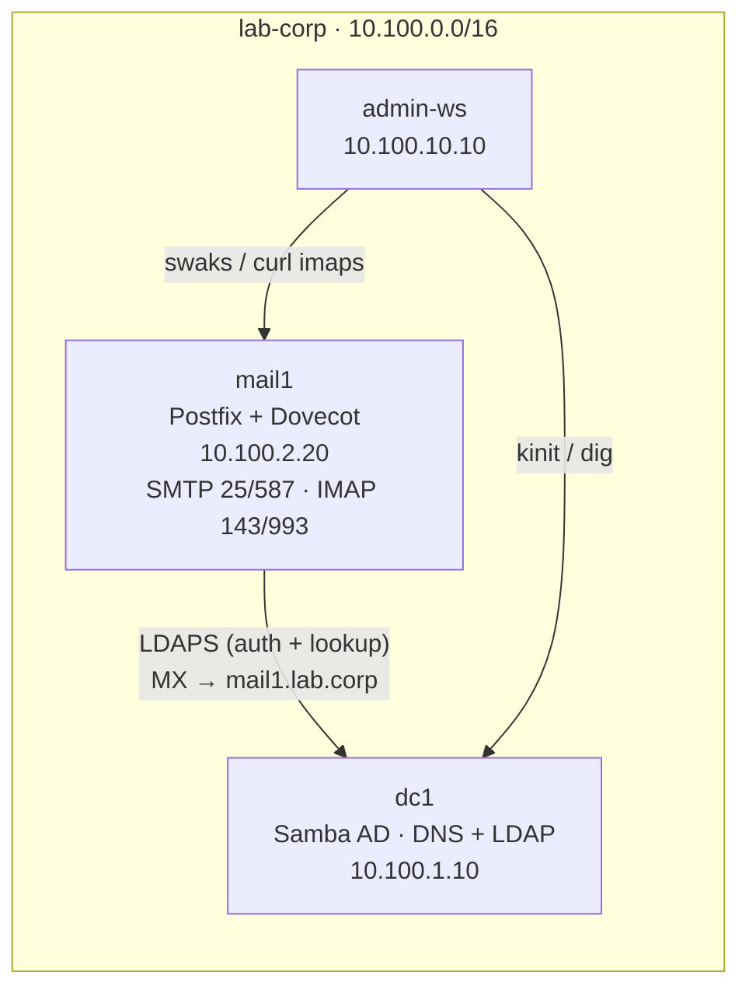

# Lab 09 — Email Gateway

Email is the service every enterprise runs and nobody can live without — and it's
really two protocols in a trenchcoat: **SMTP** to move mail and **IMAP** to read
it. In this lab you stand up a full mail server (`docker-mailserver`: Postfix +
Dovecot) wired to **Active Directory over LDAP**, so your AD users get mailboxes
automatically — no separate accounts. Then you make mail flow (MX records),
prove TLS matters by reading a password off the wire, sign outbound mail with
**DKIM**, catch spam, and diagnose a broken directory bind.

## Topology



| Container | Image | IP | Role |
|-----------|-------|----|------|
| `dc1` | `samba-ad:local` | `10.100.1.10` | AD DC — LDAP directory + DNS (foundation) |
| `mail1` | `docker-mailserver` | `10.100.2.20` | Postfix + Dovecot, LDAP-backed mailboxes |
| `admin-ws` | `workstation:local` | `10.100.10.10` | Client — `swaks` (SMTP), `curl` (IMAP), `ldapmodify`, `dig` |

## How to use this lab

This is a **practice lab**, not a tutorial.

- **Predict before you run.** Commit to an answer first.
- **Reveal the solution only after you've tried.** Reach for `swaks --help`,
  `man dig`, and the
  [docker-mailserver docs](https://docker-mailserver.github.io/) first.
- **Observe, don't just verify.** The `Check your work` blocks explain the
  *mechanism*.

The fiddly LDAP wiring (`configs/mailserver.env`) is **given** — read it to
understand it. Your job is the conceptual work: make users routable, make mail
flow, prove TLS, sign mail, catch spam, and diagnose a break.

## Prerequisites

```bash
cd enterprise-it-101
docker build -t samba-ad:local   images/samba-ad/
docker build -t workstation:local images/workstation/
docker pull ghcr.io/docker-mailserver/docker-mailserver:latest   # ~770 MB
```

## Deploy

```bash
cd enterprise-it-101
docker compose -f base/docker-compose.yml \
               -f labs/09-email-gateway/docker-compose.override.yml up -d
```

`mail1` takes ~30 s to initialise. It comes up **bound to AD** but with no
mailboxes yet — because no AD user has an email address. That's Task 1.

## Destroy

```bash
docker compose -f base/docker-compose.yml \
               -f labs/09-email-gateway/docker-compose.override.yml down -v
```

---

## What is pre-built

- `dc1` — AD DC with alice/bob/charlie (Lab 01 foundation) and DNS for `lab.corp`.
- `mail1` — `docker-mailserver` wired to AD via LDAP (see
  `configs/mailserver.env`): Postfix looks up recipients in AD, Dovecot
  authenticates logins by **binding to AD as the user** (AD never exposes
  password hashes). TLS uses a self-signed cert for `mail1.lab.corp`;
  `user-patches.sh` relaxes LDAPS cert verification (AD's cert is self-signed
  and SAN-less).
- `admin-ws` — `swaks`, `curl`, `ldapmodify`, `dig`, `openssl`, `tcpdump`.

## What you configure

The `mail` attribute on AD users, the MX record, DKIM, spam handling — and you'll
break the LDAP bind and diagnose it.

---

## Task 1 — Give AD users an email address

**Objective:** `mail1` is bound to AD but no one has a mailbox, because Postfix
routes on the `mail` attribute and your AD users don't have one. Add it to alice,
bob, and charlie.

??? question "Predict first"
    The mail server queries AD with the filter `(&(objectClass=user)(mail=%s))`.
    Given alice currently has only a `userPrincipalName` (`alice@lab.corp`) and no
    `mail` attribute, what happens *right now* if someone emails
    `alice@lab.corp` — does Postfix accept it or reject it, and why?

??? note "Hints"
    - AD rejects cleartext writes, so modify over **LDAPS** with verification off:
      `LDAPTLS_REQCERT=never ldapmodify -x -H ldaps://dc1.lab.corp:636 -D
      "cn=Administrator,cn=Users,dc=lab,dc=corp" -w P@ssw0rd1`.
    - The change is `changetype: modify` / `replace: mail` /
      `mail: <user>@lab.corp` for each user's DN (e.g.
      `CN=Alice Smith,OU=Employees,DC=lab,DC=corp`).

??? note "Solution"
    ```bash
    docker exec -it admin-ws bash
    export LDAPTLS_REQCERT=never
    BIND='-x -H ldaps://dc1.lab.corp:636 -D cn=Administrator,cn=Users,dc=lab,dc=corp -w P@ssw0rd1'

    ldapmodify $BIND <<'EOF'
    dn: CN=Alice Smith,OU=Employees,DC=lab,DC=corp
    changetype: modify
    replace: mail
    mail: alice@lab.corp

    dn: CN=Bob Jones,OU=Employees,DC=lab,DC=corp
    changetype: modify
    replace: mail
    mail: bob@lab.corp

    dn: CN=Charlie Brown,OU=Employees,DC=lab,DC=corp
    changetype: modify
    replace: mail
    mail: charlie@lab.corp
    EOF

    # verify
    ldapsearch $BIND -b "dc=lab,dc=corp" "(mail=*)" mail sAMAccountName
    ```

??? success "Check your work"
    The search returns alice/bob/charlie each with `mail: <user>@lab.corp`. The
    prediction's answer: **before** this, mail to `alice@lab.corp` is *rejected* —
    Postfix's LDAP lookup `(mail=alice@lab.corp)` returned nothing, so as far as
    the mail server is concerned alice has no mailbox and the address doesn't
    exist. This is the heart of LDAP-backed mail: there is **no separate mailbox
    creation** — a user becomes mail-capable the instant they have a `mail`
    attribute in the directory. Onboarding is one attribute, not a second system.

---

## Task 2 — Tell the world where to deliver: the MX record

**Objective:** Add an `MX` record for `lab.corp` pointing at `mail1.lab.corp`, so
mail addressed to `@lab.corp` is delivered to your server.

??? question "Predict first"
    A sending server has an envelope recipient `bob@lab.corp`. What DNS query
    does it make to find *where* to deliver, and what does the **number** in an
    MX record (`10 mail1.lab.corp`) control?

??? note "Hints"
    - `samba-tool dns add <dnsserver> <zone> <name> MX "<host> <priority>"`.
    - The name for the zone apex is `@`; the data is `"mail1.lab.corp 10"`.
    - Verify with `dig @10.100.1.10 lab.corp MX`.

??? note "Solution"
    ```bash
    docker exec dc1 samba-tool dns add dc1.lab.corp lab.corp @ MX "mail1.lab.corp 10" \
        -U Administrator --password=P@ssw0rd1
    docker exec admin-ws dig @10.100.1.10 lab.corp MX +short
    ```

??? success "Check your work"
    `dig` returns `10 mail1.lab.corp.`. The prediction: a sender queries the
    **MX** record for the recipient's domain to find the mail host. The number is
    **priority** (lower = preferred); you list multiple MX records at different
    priorities for failover, and senders try the lowest first. Without an MX
    record the internet has no idea where `@lab.corp` mail should go — MX is the
    signpost that makes a domain able to receive mail at all.

---

## Task 3 — Send and receive (and watch AD do the auth)

**Objective:** Send mail from alice to bob with `swaks`, then read bob's inbox
over IMAP authenticating with bob's **AD password** — proving the mailbox and the
login both come from the directory.

??? question "Predict first"
    bob will authenticate to IMAP with the password `P@ssw0rd1`. The mail server
    has **no** copy of bob's password and AD won't reveal its hash. So how can
    Dovecot possibly check the password? (Hint: it's the same trick you can't do
    with a simple bind, but *can* do by binding *as bob*.)

??? note "Hints"
    - Send: `swaks --to bob@lab.corp --from alice@lab.corp --server mail1.lab.corp`.
    - Read over IMAPS (self-signed cert → `-k`):
      `curl -k --url imaps://mail1.lab.corp/INBOX --user 'bob@lab.corp:P@ssw0rd1'
      -X 'STATUS INBOX (MESSAGES)'`.

??? note "Solution"
    ```bash
    docker exec admin-ws swaks --to bob@lab.corp --from alice@lab.corp \
        --server mail1.lab.corp --header "Subject: hello" --body "first mail"

    docker exec admin-ws curl -k --url "imaps://mail1.lab.corp/INBOX" \
        --user "bob@lab.corp:P@ssw0rd1" -X "STATUS INBOX (MESSAGES)"
    ```

??? success "Check your work"
    swaks reports `250 ... Ok: queued`, and the IMAP `STATUS` shows
    `MESSAGES 1` — delivered to bob's AD-backed mailbox. The prediction's answer:
    Dovecot uses **authentication bind** — it finds bob's directory entry, then
    *attempts to bind to AD as bob using the supplied password*. If the bind
    succeeds, the password was right; if not, login fails. The mail server never
    sees or stores the password; AD remains the single source of truth. Try a
    wrong password and the IMAP login fails — the log says `Password mismatch
    (for LDAP bind)`.

---

## Task 4 — Prove why TLS matters: read a password off the wire

**Objective (make the invisible visible):** Capture a plaintext SMTP session and
find the message in cleartext; then send the same thing over STARTTLS and confirm
it's gone. This is the concrete reason every mail protocol has a TLS variant.

??? question "Predict first"
    When `swaks` sends to port 25 without TLS, the SMTP conversation (headers,
    body, and on submission ports the login) crosses the network in the clear.
    Predict: will a `tcpdump` of that session contain your readable message body?
    And with STARTTLS negotiated first?

??? note "Hints"
    - Capture on admin-ws: `tcpdump -n -i eth0 -A "host 10.100.2.20 and port 25"`.
    - Plaintext send: `swaks … --body "SECRETPLAINBODY123"` (no `--tls`).
    - Encrypted send: add `--tls` (forces STARTTLS).
    - Grep the capture for your unique body string.

??? note "Solution"
    ```bash
    # plaintext
    docker exec -d admin-ws bash -c 'timeout 10 tcpdump -n -i eth0 -A "host 10.100.2.20 and port 25" > /tmp/plain.txt'
    docker exec admin-ws swaks --to bob@lab.corp --from alice@lab.corp --server mail1.lab.corp \
        --header "Subject: PLAINTEXT" --body "SECRETPLAINBODY123"
    docker exec admin-ws grep -c "SECRETPLAINBODY123" /tmp/plain.txt      # → 1

    # STARTTLS
    docker exec -d admin-ws bash -c 'timeout 10 tcpdump -n -i eth0 -A "host 10.100.2.20 and port 25" > /tmp/tls.txt'
    docker exec admin-ws swaks --to bob@lab.corp --from alice@lab.corp --server mail1.lab.corp \
        --tls --header "Subject: TLS" --body "SECRETTLSBODY456"
    docker exec admin-ws grep -c "SECRETTLSBODY456" /tmp/tls.txt          # → 0
    ```

??? success "Check your work"
    The plaintext body is found (`1`); the STARTTLS body is **not** (`0`), and
    swaks logs `TLS started with cipher TLSv1.3`. You just read mail off the wire
    — exactly what anyone on the path could do without TLS. STARTTLS upgrades the
    plaintext connection to an encrypted one before any content flows, so the
    same `tcpdump` sees only ciphertext. This is why `submission` (587) and
    `imaps` (993) exist and why a real mail server refuses plaintext logins: on a
    shared network, "plaintext" means "published."

---

## Task 5 — Sign outbound mail with DKIM

**Objective:** Generate a DKIM key, have `mail1` sign outbound mail, and publish
the public key in DNS so receivers can verify your domain really sent it.

??? question "Predict first"
    DKIM adds a cryptographic signature to outbound mail. Which **half** of the
    keypair lives on `mail1` (and signs), and which half goes into a **public DNS
    record** (and verifies)? Why is it safe to publish one of them to the whole
    internet?

??? note "Hints"
    - Generate keys: `docker exec mail1 setup config dkim`.
    - DKIM keys are wired at container start — recreate `mail1` to load them:
      `docker compose -f base/docker-compose.yml -f
      labs/09-email-gateway/docker-compose.override.yml up -d --force-recreate mail1`.
    - The public record to publish is in
      `/tmp/docker-mailserver/opendkim/keys/lab.corp/mail.txt` (selector `mail`).
    - DNS TXT strings max out at 255 chars; a 2048-bit key is longer, so publish
      it as **two** quoted chunks.

??? note "Solution"
    ```bash
    docker exec mail1 setup config dkim
    docker compose -f base/docker-compose.yml \
        -f labs/09-email-gateway/docker-compose.override.yml up -d --force-recreate mail1
    sleep 30

    # send and confirm the signature was added
    docker exec admin-ws swaks --to bob@lab.corp --from alice@lab.corp --server mail1.lab.corp \
        --header "Subject: dkim" --body x
    docker exec mail1 doveadm fetch -u bob@lab.corp "hdr" mailbox INBOX UNSEEN | grep -i "^DKIM-Signature"

    # publish the public key (split into two <255-char chunks)
    TXT=$(docker exec mail1 bash -c "cat /tmp/docker-mailserver/opendkim/keys/lab.corp/mail.txt" \
          | grep -oE '"[^"]*"' | tr -d '"\n')
    docker exec dc1 samba-tool dns add dc1.lab.corp lab.corp mail._domainkey TXT \
        "\"${TXT:0:200}\" \"${TXT:200}\"" -U Administrator --password=P@ssw0rd1
    docker exec admin-ws dig @10.100.1.10 mail._domainkey.lab.corp TXT +short
    ```

??? success "Check your work"
    Outbound mail now carries a `DKIM-Signature: v=1; a=rsa-sha256; d=lab.corp;
    s=mail; …` header, and `dig` returns the published `v=DKIM1; … p=<key>` TXT
    record. The prediction: the **private** key stays on `mail1` and signs; the
    **public** key goes in DNS and verifies. Publishing the public half is safe —
    that's the point of public-key crypto: anyone can verify a signature, no one
    can forge one without the private key. DKIM lets a receiver prove a message
    claiming to be from `lab.corp` really transited your server and wasn't altered
    — a cornerstone of anti-spoofing alongside SPF and DMARC.

    !!! note "Only internal mail gets signed"
        OpenDKIM signs mail from *trusted/internal* hosts only (so it doesn't sign
        spam relayed through it). `user-patches.sh` adds the lab network
        `10.100.0.0/16` to OpenDKIM's `TrustedHosts` for exactly this reason —
        otherwise your clients' mail would be treated as inbound and left
        unsigned.

---

## Task 6 — Catch spam with SpamAssassin

**Objective:** Send the industry-standard **GTUBE** test string and confirm
SpamAssassin flags the message as spam.

??? question "Predict first"
    GTUBE is a fixed string that every spam filter is required to score as
    definite spam (so you can test without real spam). When it arrives, will the
    message be **rejected** outright or **delivered but flagged**? (Look at
    `SPAMASSASSIN_SPAM_TO_INBOX` in `mailserver.env`.)

??? note "Hints"
    - Send with the GTUBE body:
      `XJS*C4JDBQADN1.NSBN3*2IDNEN*GTUBE-STANDARD-ANTI-UBE-TEST-EMAIL*C.34X`.
    - Check the result: `doveadm search -u bob@lab.corp HEADER X-Spam-Flag YES`.

??? note "Solution"
    ```bash
    docker exec admin-ws swaks --to bob@lab.corp --from spammer@external.test \
        --server mail1.lab.corp --header "Subject: gtube" \
        --body "XJS*C4JDBQADN1.NSBN3*2IDNEN*GTUBE-STANDARD-ANTI-UBE-TEST-EMAIL*C.34X"
    docker exec mail1 doveadm search -u bob@lab.corp HEADER X-Spam-Flag YES | wc -l
    ```

??? success "Check your work"
    The GTUBE message is **delivered but flagged** — `doveadm search` finds one
    message with `X-Spam-Flag: YES` (because `SPAMASSASSIN_SPAM_TO_INBOX=1`). The
    prediction hinges on policy: you can *reject* spam at SMTP time (sender gets a
    bounce, but a false positive is lost mail) or *tag and deliver* it (user
    decides, but their inbox sees it). Tagging is the safer default — the filter
    can be wrong, and a tagged message in a Junk folder is recoverable while a
    rejected one is gone. Real deployments tune the score threshold for where to
    flip between the two.

---

## Task 7 — Break it: corrupt the LDAP bind and diagnose

**Objective (required):** Break the mail server's credentials to the directory,
watch *both* sending and receiving fail, and diagnose it from the logs — then
repair. This is the single most common real-world mail-LDAP outage.

??? question "Predict first"
    You'll change `LDAP_BIND_PW` in `mailserver.env` to a wrong value and recreate
    `mail1`. Postfix uses that bind to *look up recipients*; Dovecot uses LDAP to
    *authenticate logins*. Predict what breaks: can mail be **delivered**? Can bob
    **log in**? What single root cause explains both?

**Break it:**
```bash
perl -i -pe 's/^LDAP_BIND_PW=.*/LDAP_BIND_PW=WrongPassword/' labs/09-email-gateway/configs/mailserver.env
docker compose -f base/docker-compose.yml \
    -f labs/09-email-gateway/docker-compose.override.yml up -d --force-recreate mail1
sleep 25
```

**Diagnose** — try to send and to log in, then read the log:
```bash
docker exec admin-ws swaks --to bob@lab.corp --from alice@lab.corp --server mail1.lab.corp --body x
docker exec admin-ws curl -k --url "imaps://mail1.lab.corp/INBOX" --user "bob@lab.corp:P@ssw0rd1" -X "STATUS INBOX (MESSAGES)"
docker exec mail1 grep -iE "ldap.*bind|Invalid cred" /var/log/mail/mail.log | tail -3
```

??? note "Diagnosis hints (try before revealing)"
    - Did sending get a `queued` or did it defer/reject? Did the IMAP login
      succeed?
    - The mail log mentions a specific LDAP result code. What number, and what
      does AD's `data 52e` mean?
    - Both Postfix and Dovecot log the *same* failure — what does that tell you
      about where the problem is (the mail server itself, or its link to AD)?

??? success "What you should observe"
    **Both** paths fail. Postfix logs `dict_ldap_connect: Unable to bind to
    server ldaps://dc1.lab.corp … 49 (Invalid credentials)` and Dovecot logs
    `auth: Error: ldap … binding failed … Invalid credentials … data 52e`. LDAP
    result **49** with AD's `data 52e` is precisely "bind credentials are wrong."
    The single root cause: the mail server can no longer authenticate *itself* to
    the directory, so it can neither look up recipients (no delivery) nor verify
    logins (no IMAP). The lesson: when *all* mail identity functions fail at once,
    suspect the **service account / bind**, not the mailboxes or the network — and
    the mail log names the exact LDAP error.

**Repair it:**
```bash
perl -i -pe 's/^LDAP_BIND_PW=.*/LDAP_BIND_PW=P@ssw0rd1/' labs/09-email-gateway/configs/mailserver.env
docker compose -f base/docker-compose.yml \
    -f labs/09-email-gateway/docker-compose.override.yml up -d --force-recreate mail1
sleep 25
docker exec admin-ws curl -k --url "imaps://mail1.lab.corp/INBOX" --user "bob@lab.corp:P@ssw0rd1" -X "STATUS INBOX (MESSAGES)"
```

---

## Verification Checklist

```bash
# AD users are mail-capable
docker exec admin-ws bash -c 'LDAPTLS_REQCERT=never ldapsearch -x -H ldaps://dc1.lab.corp:636 \
  -D "cn=Administrator,cn=Users,dc=lab,dc=corp" -w P@ssw0rd1 -b "dc=lab,dc=corp" "(mail=*)" mail'

# MX points at mail1
docker exec admin-ws dig @10.100.1.10 lab.corp MX +short

# Send + receive with AD auth
docker exec admin-ws swaks --to bob@lab.corp --from alice@lab.corp --server mail1.lab.corp --body test
docker exec admin-ws curl -k --url "imaps://mail1.lab.corp/INBOX" --user "bob@lab.corp:P@ssw0rd1" -X "STATUS INBOX (MESSAGES)"

# Outbound mail is DKIM-signed
docker exec mail1 doveadm fetch -u bob@lab.corp "hdr" mailbox INBOX | grep -i "^DKIM-Signature" | head -1
```

---

## Challenge Questions

1. **SMTP vs IMAP, who does what.** A user complains "I can receive mail but I
   can't send." Which protocol/port is implicated, and which is fine? Now the
   reverse — "I can send but not receive." Map each symptom to SMTP vs IMAP and to
   a likely cause.

2. **Auth bind vs hash compare.** Dovecot authenticates by *binding to AD as the
   user* rather than reading a password hash. List one security advantage and one
   operational disadvantage of auth-bind versus the mail server storing/checking
   its own password hashes.

3. **The spoofing trio.** DKIM proves a message wasn't altered and really
   transited your server. What do **SPF** and **DMARC** add that DKIM alone
   doesn't, and which DNS records would you create for each? Why do receivers
   want all three?

4. **Reject or tag?** Task 6 tagged spam and delivered it. Give one scenario
   where rejecting at SMTP time is clearly better and one where tagging is clearly
   better. What does the choice depend on?

5. **Design extension.** You add a second mail server `mail2` for redundancy.
   What DNS change makes senders fail over to it, and what must `mail2` share with
   `mail1` so a user's mailbox and DKIM signatures work identically on both?

---

## Key Concepts

**Email is two protocols.** SMTP (25/587) moves mail between servers and from
clients; IMAP (143/993) lets clients read mailboxes. They fail independently —
"can't send" and "can't receive" point at different halves.

**LDAP-backed mail = no separate accounts.** Postfix finds recipients by the
`mail` attribute in AD; Dovecot authenticates by **binding to AD as the user**
(AD never reveals hashes). A user becomes mail-capable the moment they have a
`mail` attribute — onboarding is one directory change, not a second system.

| Piece | Role |
|-------|------|
| `mail` attribute | Makes an AD user a deliverable recipient |
| MX record | Tells senders which host receives a domain's mail (priority = preference) |
| STARTTLS / IMAPS | Encrypts SMTP/IMAP so credentials and content aren't on the wire |
| DKIM | Signs outbound mail (private key on server, public key in DNS) — anti-spoofing |
| SpamAssassin | Scores inbound mail; reject or tag based on policy |
| LDAP bind account | The mail server's own credential to the directory — breaks *everything* if wrong |

**TLS isn't optional.** You read a plaintext message body straight off the wire;
STARTTLS made it ciphertext. On any shared network, plaintext mail is public mail.

**When everything mail-related fails at once, suspect the bind.** Postfix lookups
and Dovecot logins both depend on the LDAP bind account; a wrong `LDAP_BIND_PW`
takes down delivery and login together, and the mail log names the exact LDAP
error (49 / `data 52e`).

---

## Troubleshooting

| Symptom | Likely Cause | Fix |
|---------|-------------|-----|
| Mail to a user is rejected ("user unknown") | User has no `mail` attribute in AD | Add it (Task 1) |
| `mail1` exits right after start | TLS cert path wrong / missing | Check `SSL_*` env + the mounted cert |
| Both send and login fail | Wrong `LDAP_BIND_PW` (Task 7) | Fix the bind password; log shows `49 (Invalid credentials)` |
| IMAP login fails for one user | Wrong password, or no `mail` attribute | `mail` set? log shows `Password mismatch (for LDAP bind)` |
| No DKIM-Signature on outbound mail | Keys not loaded, or sender host not trusted | `setup config dkim` + recreate; lab net in `TrustedHosts` |
| `samba-tool dns add` TXT errors on a long key | DNS TXT strings cap at 255 chars | Split the key into two quoted chunks |
| `curl imaps` certificate error | Self-signed mail cert | `-k` (lab only; a real cert from ca1 would verify) |

---

## What's Next

- **Lab 10 (SSO & Federation)** — Keycloak federates the same AD users for web
  SSO; you'll see the directory underpin yet another service.
- **Lab 13 (Monitoring)** — you'll probe SMTP/IMAP for availability and alert when
  the mail server (or its LDAP bind) breaks the way it did in Task 7.
- **Lab 14 (SIEM)** — mail logs (auth failures, spam, relay attempts) are prime
  SIEM material; the failures you produced here are exactly what you'd alert on.
