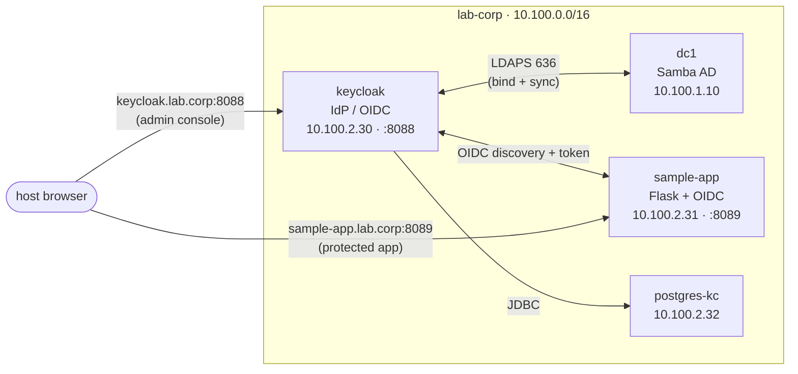

# Lab 10 — SSO & Federation

Stand up **Keycloak** as an identity provider (IdP) and federate it to the Active
Directory you built in Lab 01. By the end, a user logs in *once* at Keycloak and a
separate web app trusts them — without ever seeing their password, and without
Keycloak ever storing one. This is the open-source equivalent of ADFS / Entra ID:
**AD owns the password; Keycloak brokers identity to apps over OIDC.**

You'll federate AD users into Keycloak, map their AD group memberships into the
token, drive the full OIDC Authorization-Code flow through a tiny sample app,
prove the app learns *who you are and what groups you're in* from a signed token,
turn on TOTP multi-factor auth, and finally break the federation to watch SSO fail
with a misleading error.

## Topology



| Container | Image | IP | Role |
|-----------|-------|----|------|
| `dc1` | `samba-ad:local` | `10.100.1.10` | AD DC — the password authority |
| `keycloak` | `quay.io/keycloak/keycloak:26.0` | `10.100.2.30` (`:8088`) | Identity provider / OIDC broker |
| `postgres-kc` | `postgres:15` | `10.100.2.32` | Keycloak's database |
| `sample-app` | `sample-app:local` (custom Flask) | `10.100.2.31` (`:8089`) | OIDC-protected web app |
| `certfetch` | `workstation:local` | `10.100.2.33` | One-shot: captures dc1's LDAPS cert into Keycloak's truststore, then exits |
| `admin-ws` | `workstation:local` | `10.100.10.10` | Admin workstation (CLI checks) |

## How to use this lab

This is a **practice lab**, not a tutorial. Each task gives you an **objective**
and **hints** — your job is to figure out the steps. Then:

- **Predict before you run.** Each task asks you to commit to an answer first.
  Guessing wrong and finding out why is how the knowledge sticks.
- **Reveal the solution only after you've tried.** Click-paths and commands are
  hidden behind `Solution` toggles.
- **Observe, don't just verify.** The `Check your work` toggles tell you what to
  look for *and why it matters* — read them even when it worked.

Keycloak is **GUI-first**: real-world Keycloak administration happens in its web
console, so most of this lab is in the browser. The CLI is used for verification
(decoding tokens, reading the directory) — mirroring how you'd actually operate it.

## Prerequisites

- Labs 01–03 concepts (AD, LDAP, the Samba self-signed LDAPS cert). The foundation
  (`dc1` + seeded `alice`/`bob`/`charlie` and the `engineering`/`finance` groups)
  is auto-provisioned here — you do **not** need to have kept Lab 01 running.
- The custom images build on first deploy. `sample-app:local` is built from
  `configs/sample-app/`.

## Deploy

```bash
cd enterprise-it-101
docker compose -f base/docker-compose.yml \
               -f labs/10-sso-federation/docker-compose.override.yml up -d --build
```

First boot takes a minute: `dc1` provisions AD, `certfetch` waits for LDAPS and
captures dc1's certificate, then `keycloak` starts and runs its DB migration.
Watch it settle:

```bash
docker logs -f keycloak    # wait for "Listening on: http://0.0.0.0:8088", then Ctrl-C
```

## Destroy

```bash
docker compose -f base/docker-compose.yml \
               -f labs/10-sso-federation/docker-compose.override.yml down -v
```

---

## What is pre-built

- `dc1` auto-provisioned with the Lab 01 foundation (alice/bob/charlie in
  `OU=Employees`; the `engineering`, `finance`, `all-staff` groups in `CN=Users`).
- Keycloak running in dev mode on `:8088`, backed by PostgreSQL, with the
  bootstrap admin `admin` / `admin`.
- **The LDAPS trust is wired for you.** AD's LDAPS certificate is self-signed, so
  `certfetch` grabs it at startup and drops it into Keycloak's truststore. You set
  *Use Truststore SPI = Always* and the encrypted bind just works — no cert import.
- The `sample-app` Flask container, pre-wired to do the OIDC Authorization-Code
  flow. It reads three env vars (discovery URL, client id, client secret); you'll
  supply the secret Keycloak generates.

## What you configure

The realm and everything in it: the AD federation, the group mapper, the OIDC
client, the group claim, and MFA. **The realm is yours to build** — that's the lab.

---

## Task 1 — Make the IdP reachable and log in

**Objective:** Map the two service names on your host, confirm the stack is up, and
reach the Keycloak admin console.

Browser-based SSO needs one thing CLI labs don't: your **host browser** must resolve
the same names the containers do. `keycloak.lab.corp` and `sample-app.lab.corp` are
the canonical names used in redirects and tokens; point them at your published ports.

??? question "Predict first"
    The sample-app (a container) and your browser (the host) will both talk to
    Keycloak using the URL `http://keycloak.lab.corp:8088`. Why must the *published*
    host port equal the *container* port (8088 both sides) for one URL to work in
    both places? (Hint: what does `keycloak.lab.corp` resolve to in each context?)

??? note "Hints"
    - Add a single line to your host's `/etc/hosts` pointing both names at
      `127.0.0.1` (needs sudo).
    - The admin console is at `http://keycloak.lab.corp:8088`, credentials
      `admin` / `admin`.

??? note "Solution"
    ```bash
    # On your HOST (not in a container):
    echo "127.0.0.1 keycloak.lab.corp sample-app.lab.corp" | sudo tee -a /etc/hosts

    # Confirm containers are healthy
    docker compose -f base/docker-compose.yml \
                   -f labs/10-sso-federation/docker-compose.override.yml ps
    ```

    Then open `http://keycloak.lab.corp:8088` → **Administration Console** → log in
    `admin` / `admin`.

??? success "Check your work"
    You land in the Keycloak admin console on the **master** realm. The published
    port equals the container port because the *same string* `keycloak.lab.corp:8088`
    is resolved twice: on your host it goes to `127.0.0.1:8088` (the published port,
    forwarded into the container); inside the lab network AD DNS resolves it to
    `10.100.2.30:8088` (the container directly). If the ports differed, the URL that
    works in your browser would point at a closed port inside the container, and the
    app's server-side token call would fail. One canonical issuer URL is the whole
    trick to a working OIDC flow in containers.

---

## Task 2 — Create the lab-corp realm

**Objective:** Create a dedicated realm `lab-corp`. Everything else you build lives
inside it.

A **realm** is an isolated tenant: its own users, clients, keys, and login flows.
The `master` realm is only for administering Keycloak itself — never put application
users there.

??? note "Hints"
    - Top-left realm dropdown → **Create realm**.
    - Realm name: `lab-corp`. Leave the rest default.

??? note "Solution"
    Realm dropdown (top-left, shows "master") → **Create realm** → **Realm name** =
    `lab-corp` → **Create**. The dropdown now shows `lab-corp`; stay in it for the
    rest of the lab.

??? success "Check your work"
    The realm switcher reads **lab-corp** and the left nav shows empty Users/Clients.
    A fresh realm already has a full OIDC stack (signing keys, the
    `.well-known/openid-configuration` document, default login flows) — confirm:

    ```bash
    docker exec admin-ws curl -s \
      http://keycloak.lab.corp:8088/realms/lab-corp/.well-known/openid-configuration \
      | python3 -m json.tool | grep -E 'issuer|authorization_endpoint|token_endpoint'
    ```

    The `issuer` is `http://keycloak.lab.corp:8088/realms/lab-corp` — the name from
    Task 1, which is why the host mapping had to match.

---

## Task 3 — Federate Active Directory

**Objective:** Add an LDAP **User Federation** provider pointing at `dc1` over LDAPS,
test it, and sync the AD users into Keycloak. Keycloak must **not** store passwords —
AD validates them.

This is the heart of the lab. Keycloak becomes a *broker*: it reads users from AD and,
at login, binds to AD as the user to verify the password.

??? question "Predict first"
    When alice logs in through Keycloak, **where is her password checked** — in
    Keycloak's Postgres database, or against AD? After you "sync" users into Keycloak,
    does Keycloak now hold a copy of her password? Commit to an answer.

??? note "Hints"
    - Left nav → **User federation** → **Add LDAP providers**.
    - Vendor = **Active Directory** (this presets most attribute names for you).
    - AD rejects cleartext binds, so the Connection URL must be **ldaps://** on 636.
      Under **Advanced settings**, set **Use Truststore SPI = Always** (the cert is
      already in the truststore — see "What is pre-built").
    - Bind as `Administrator`; the seeded users live in `OU=Employees`.
    - Use the **Test connection** and **Test authentication** buttons before saving.

??? note "Solution"
    **User federation → Add LDAP providers**, then:

    | Field | Value |
    |-------|-------|
    | UI display name | `ad` |
    | Vendor | `Active Directory` |
    | Connection URL | `ldaps://dc1.lab.corp:636` |
    | Bind type | `simple` |
    | Bind DN | `cn=Administrator,cn=Users,dc=lab,dc=corp` |
    | Bind credentials | `P@ssw0rd1` |
    | Edit mode | `READ_ONLY` |
    | Users DN | `OU=Employees,DC=lab,DC=corp` |
    | Username LDAP attribute | `sAMAccountName` |
    | RDN LDAP attribute | `cn` |
    | UUID LDAP attribute | `objectGUID` |
    | User object classes | `person, organizationalPerson, user` |
    | (Advanced) Use Truststore SPI | `Always` |

    Click **Test connection** (✓), **Test authentication** (✓), then **Save**. Then
    use the provider's **Action → Sync all users**.

    Verify from the CLI:

    ```bash
    docker exec admin-ws bash -c '
      AT=$(curl -s -X POST http://keycloak.lab.corp:8088/realms/master/protocol/openid-connect/token \
            -d grant_type=password -d client_id=admin-cli -d username=admin -d password=admin \
            | python3 -c "import sys,json;print(json.load(sys.stdin)[\"access_token\"])")
      curl -s "http://keycloak.lab.corp:8088/admin/realms/lab-corp/users?briefRepresentation=true" \
            -H "Authorization: Bearer $AT" | python3 -c "import sys,json;print([u[\"username\"] for u in json.load(sys.stdin)])"'
    ```

??? success "Check your work"
    **Test authentication** succeeds — proving the encrypted bind to AD works using
    the truststore (no cert import on your part). **Sync all users** reports *3
    imported users*, and the CLI lists `['alice','bob','charlie']` under
    **Users → User federation**.

    Answer to the prediction: alice's password is **always checked against AD**.
    "Sync" copies *attributes* (username, name, email) into Keycloak — never the
    password. With **Edit mode = READ_ONLY**, Keycloak is a read-through cache of the
    directory; at login it does an LDAP bind as alice to verify her password. That's
    why this is *federation*, not *migration*: AD remains the single source of truth.

    !!! note "Why `Users DN = OU=Employees` and not the domain root"
        AD answers a subtree search of the domain root with **referrals** to its
        other partitions (Configuration, DnsZones). Keycloak's LDAP client trips over
        those. Scoping to `OU=Employees` — where the people actually are — sidesteps
        the referral entirely.

---

## Task 4 — Map AD groups into Keycloak

**Objective:** Add a **group-ldap-mapper** so AD security groups become Keycloak
groups and memberships are imported. You'll need these for the token claim in Task 7.

The Active Directory vendor preset created the user attribute mappers automatically,
but **not** a group mapper — groups are opt-in.

??? question "Predict first"
    alice is a member of `engineering` and `all-staff` in AD (the groups live in
    `CN=Users`, membership recorded in each group's `member` attribute as a DN). After
    you add and sync the group mapper, how many groups should alice show in Keycloak,
    and which ones?

??? note "Hints"
    - User federation → your `ad` provider → **Mappers** tab → **Add mapper** →
      Mapper type `group-ldap-mapper`.
    - The groups are in `CN=Users,DC=lab,DC=corp`; membership is by **DN** in the
      `member` attribute; the user is matched by `cn`.
    - After saving, use the mapper's **Sync LDAP groups to Keycloak**.

??? note "Solution"
    Add mapper → type **group-ldap-mapper**:

    | Field | Value |
    |-------|-------|
    | LDAP Groups DN | `CN=Users,DC=lab,DC=corp` |
    | Group Name LDAP Attribute | `cn` |
    | Group Object Classes | `group` |
    | Membership LDAP Attribute | `member` |
    | Membership Attribute Type | `DN` |
    | Membership User LDAP Attribute | `cn` |
    | Mode | `READ_ONLY` |
    | User Groups Retrieve Strategy | `LOAD_GROUPS_BY_MEMBER_ATTRIBUTE` |

    **Save** → **Sync LDAP groups to Keycloak**. Then **Users → alice → Groups**.

??? success "Check your work"
    **Groups** (left nav) now lists `engineering`, `finance`, `all-staff` (alongside
    AD built-ins like `DomainUsers`). **Users → alice → Groups** shows `engineering`
    and `all-staff` — exactly her AD membership, not `finance`. Group membership rode
    in from AD over the same LDAPS connection; you didn't assign anything in Keycloak.

---

## Task 5 — Register the app as an OIDC client

**Objective:** Create a confidential OIDC client for `sample-app`, set its redirect
URI, copy the generated secret, and hand that secret to the running app.

An OIDC **client** is an app that trusts this realm. "Confidential" means it has a
secret and runs server-side (it can keep one) — as opposed to a public SPA.

??? question "Predict first"
    The app will send the browser to Keycloak and later receive a redirect *back*.
    Keycloak refuses to redirect to any URL not on an allow-list. What exact redirect
    URI must you register, given the app is reached at `sample-app.lab.corp:8089` and
    its callback route is `/callback`?

??? note "Hints"
    - **Clients → Create client** → type **OpenID Connect**, Client ID `sample-app`.
    - Turn **Client authentication = On** (makes it confidential) and enable
      **Standard flow** + **Direct access grants**.

    - Valid redirect URIs: the app's callback, wildcard-friendly.
    - The secret is under the client's **Credentials** tab after creation.

??? note "Solution"
    **Clients → Create client**:

    - Client type **OpenID Connect**, **Client ID** = `sample-app` → Next
    - **Client authentication** = On; **Standard flow** ✓, **Direct access grants** ✓
      → Next
    - **Valid redirect URIs** = `http://sample-app.lab.corp:8089/*`
    - **Web origins** = `+` → Save

    Open **Credentials** tab, copy the **Client secret**, then restart the app with it:

    ```bash
    cd enterprise-it-101
    OIDC_CLIENT_SECRET='<paste-secret-here>' docker compose \
      -f base/docker-compose.yml -f labs/10-sso-federation/docker-compose.override.yml \
      up -d sample-app
    ```

??? success "Check your work"
    The required redirect URI is `http://sample-app.lab.corp:8089/callback` (the
    wildcard `/*` covers it). After restarting the app with the secret, it boots
    clean and its `/login` route now bounces you to Keycloak:

    ```bash
    docker exec admin-ws curl -s -o /dev/null -D - http://sample-app.lab.corp:8089/login \
      | grep -i '^location:'
    # → Location: http://keycloak.lab.corp:8088/realms/lab-corp/protocol/openid-connect/auth?...
    ```

    That redirect — with `client_id=sample-app` and your `redirect_uri` — is the first
    leg of the Authorization-Code flow.

---

## Task 6 — Add the groups claim and complete the SSO login

**Objective:** Add a **Group Membership** mapper so the token carries the user's
groups, then perform the full browser login as alice.

By default the token proves *who* you are but not *what groups* you're in. Apps make
authorization decisions on group/role claims, so you must add one.

??? note "Hints"
    - **Clients → sample-app → Client scopes →** the `sample-app-dedicated` scope →
      **Add mapper → By configuration → Group Membership**.

    - Token Claim Name `groups`; turn **Full group path = Off** (you want `engineering`,
      not `/engineering`); include it in ID + access + userinfo.
    - Then browse to `http://sample-app.lab.corp:8089/` and sign in as alice.

??? note "Solution"
    **Clients → sample-app → Client scopes → sample-app-dedicated → Add mapper →
    By configuration → Group Membership**:

    - Name `groups`, **Token Claim Name** `groups`, **Full group path** Off, add to
      ID/access/userinfo token → Save.

    Then in your browser: open `http://sample-app.lab.corp:8089/` → **Sign in with
    Keycloak** → log in `alice` / `P@ssw0rd1`.

??? success "Check your work"
    You're redirected to Keycloak, log in, and land back on the app showing
    **"You are signed in via Keycloak SSO as alice."** The flow you just rode:
    app → (302) Keycloak authorize → login → (302, with a one-time `code`) back to
    `/callback` → the app exchanges the code for tokens *server-to-server* → you're in.
    You authenticated to **Keycloak**, not the app; the app never saw your password.

---

## Task 7 — Read the token (make the invisible visible)

**Objective:** Inspect the decoded token the app received and find alice's AD group
membership inside it. This is the payoff: the app learns identity *and* authorization
from a signed claim, not from a lookup it controls.

??? question "Predict first"
    The app displays the decoded claims. Which claim carries the AD groups, and which
    two values will it hold for alice? Will `finance` be there?

??? note "Hints"
    - The app's page already pretty-prints the claims it got.
    - For a CLI view, request a token directly (the client allows direct grants) and
      decode the middle segment of the JWT — it's base64url JSON.

??? note "Solution"
    On the app page, read the **Decoded ID-token claims** block. For the CLI view:

    ```bash
    docker exec admin-ws bash -c '
      AT=$(curl -s -X POST http://keycloak.lab.corp:8088/realms/lab-corp/protocol/openid-connect/token \
            -d grant_type=password -d client_id=sample-app \
            -d client_secret=<your-secret> -d username=alice -d password=P@ssw0rd1 \
            | python3 -c "import sys,json;print(json.load(sys.stdin)[\"access_token\"])")
      echo "$AT" | cut -d. -f2 | base64 -d 2>/dev/null | python3 -m json.tool | grep -A4 groups'
    ```

??? success "Check your work"
    The `groups` claim is `["all-staff", "engineering"]` — and **no `finance`**. A JWT
    is three base64url parts (`header.payload.signature`); the middle is plain JSON
    anyone can read — *confidentiality comes from TLS, integrity from the signature,
    not from hiding the contents*. The app trusts these groups because Keycloak signed
    the token with a key the app validated via the discovery document. This is how SSO
    carries authorization: alice's AD group is now an application-level permission,
    with no second directory lookup.

---

## Task 8 — Turn on MFA (TOTP)

**Objective:** Require a second factor. Enrol alice in TOTP and log in with a
time-based code.

Keycloak owns the MFA step — the app never changes. That separation is the point:
you raise the assurance level at the IdP and every federated app inherits it.

??? question "Predict first"
    If you make "Configure OTP" a required action for alice, what will her *next*
    login show after she enters her (correct) AD password — straight into the app, or
    a step in between? Does the app need any change?

??? note "Hints"
    - **Authentication → Required actions** → enable **Configure OTP** (optionally
      "Set as default action" for all users). Or force it for one user:
      **Users → alice → Required user actions → Configure OTP**.

    - No authenticator phone app needed — `oathtool` (on `admin-ws`) generates codes
      from the shared secret Keycloak shows you.

??? note "Solution"
    **Users → alice →** set **Required user actions = Configure OTP** → Save. Log out
    of the app (`/logout`) and sign in again as alice. Keycloak shows a QR code and,
    under "Unable to scan?", the **secret key**. Generate a code from it:

    ```bash
    docker exec admin-ws oathtool --totp --base32 "<SECRET-FROM-KEYCLOAK>"
    ```

    Enter that 6-digit code to finish enrolment; subsequent logins prompt for a fresh
    code.

??? success "Check your work"
    After the password step, login no longer goes straight through — Keycloak
    interrupts with **"Mobile Authenticator Setup"** (a TOTP/barcode page). The app
    received zero changes: it still just does the OIDC redirect. You added a factor at
    the broker and the app inherited stronger auth for free — exactly why enterprises
    centralise authentication.

---

## Task 9 — Break it: pull the federation and diagnose

**Objective (required):** Disable the AD federation and watch SSO fail with an error
that blames the *account*, not the directory. Diagnose from the symptom, then repair.

??? question "Predict first"
    Every Keycloak login binds to AD to check the password. If you **disable** the LDAP
    federation provider, what happens when alice tries to log in? Predict the error
    wording — will it correctly say "directory unavailable", or something misleading?

**Break it:** **User federation → ad →** toggle **Enabled = Off** → Save. Then try to
log in as alice (browser, or CLI):

```bash
docker exec admin-ws bash -c 'curl -s -X POST \
  http://keycloak.lab.corp:8088/realms/lab-corp/protocol/openid-connect/token \
  -d grant_type=password -d client_id=sample-app -d client_secret=<your-secret> \
  -d username=alice -d password=P@ssw0rd1'
```

??? success "What you should observe"
    Login fails — over the API you get `{"error":"invalid_grant",
    "error_description":"Account disabled"}`. That message is a **lie of layers**:
    alice's account is *not* disabled; the *federation backing it* is gone, so Keycloak
    can no longer reach AD to validate her password, and it surfaces the nearest generic
    error. The imported user shell still exists in Postgres, which is exactly why the
    error talks about the account rather than the directory. This symptom/cause mismatch
    is the essence of real SSO troubleshooting: "user can't log in" almost never means
    "the user is the problem."

**Repair it:** **User federation → ad → Enabled = On → Save**, then log in again —
HTTP 200, SSO restored.

---

## Verification Checklist

```bash
# 1) Realm + OIDC discovery is live
docker exec admin-ws curl -s \
  http://keycloak.lab.corp:8088/realms/lab-corp/.well-known/openid-configuration \
  | python3 -m json.tool | grep issuer

# 2) AD users federated
docker exec admin-ws bash -c '
  AT=$(curl -s -X POST http://keycloak.lab.corp:8088/realms/master/protocol/openid-connect/token \
        -d grant_type=password -d client_id=admin-cli -d username=admin -d password=admin \
        | python3 -c "import sys,json;print(json.load(sys.stdin)[\"access_token\"])")
  curl -s "http://keycloak.lab.corp:8088/admin/realms/lab-corp/users?briefRepresentation=true" \
        -H "Authorization: Bearer $AT" | python3 -c "import sys,json;print([u[\"username\"] for u in json.load(sys.stdin)])"'

# 3) A login yields a token whose groups claim carries AD membership
docker exec admin-ws bash -c '
  AT=$(curl -s -X POST http://keycloak.lab.corp:8088/realms/lab-corp/protocol/openid-connect/token \
        -d grant_type=password -d client_id=sample-app -d client_secret=<your-secret> \
        -d username=alice -d password=P@ssw0rd1 \
        | python3 -c "import sys,json;print(json.load(sys.stdin)[\"access_token\"])")
  echo "$AT" | cut -d. -f2 | base64 -d 2>/dev/null | python3 -m json.tool | grep -A3 groups'
```

You should see the issuer URL, `['alice','bob','charlie']`, and
`"groups": ["all-staff","engineering"]`.

!!! warning "Cleanup"
    When you're done, remove the host mapping you added in Task 1:
    `sudo sed -i '' '/keycloak.lab.corp sample-app.lab.corp/d' /etc/hosts` (macOS) or
    edit `/etc/hosts` by hand. Then `down -v`.

---

## Challenge Questions

No answers provided — these test whether you can reason about the system.

1. **Broker, not vault.** Explain to a skeptical colleague why storing *zero*
   passwords in Keycloak is a security *feature*, not a gap. What attack does
   READ_ONLY federation make impossible that a password-copying sync would not?

2. **The second app.** You add a *second* OIDC client (a wiki) to this realm. A user
   logs into the sample-app, then opens the wiki and is in *without* re-entering a
   password. Trace the requests that make that happen. What single Keycloak artifact
   makes the second login silent?

3. **Claim vs. lookup.** The app authorised alice purely from the `groups` claim in
   her token. Name one advantage and one risk of trusting a token claim versus having
   the app query AD/LDAP itself on every request. (Hint: think about what happens the
   moment after she's removed from `engineering` in AD.)

4. **MFA boundary.** You enabled TOTP at Keycloak and "every app inherited it." Is
   that actually true for the *direct access grant* (password) flow you used in the
   CLI checks? Why might an API path bypass the browser MFA step, and what would you do
   about it in production?

5. **Design extension.** Lab 12 will authenticate network logins with RADIUS against
   the same AD. Both Keycloak and RADIUS read identity from one directory. Argue for or
   against also putting RADIUS *behind* Keycloak (OIDC) instead of straight LDAP —
   what would you gain or lose?

---

## Key Concepts

**Federation ≠ migration.** Keycloak reads AD as a read-through directory and binds as
the user at login to validate the password. AD stays authoritative; Keycloak holds no
passwords.

| Piece | What it does |
|-------|--------------|
| Realm | Isolated tenant: users, clients, keys, login flows |
| User Federation (LDAP) | Pulls users/groups from AD over LDAPS; validates passwords by bind |
| Client (confidential) | An app that trusts the realm; has a secret, runs server-side |
| OIDC Authorization-Code flow | app → IdP login → one-time `code` → server-side token exchange |
| Protocol mapper | Injects a claim (e.g. `groups`) into the token |
| Required action / OTP | The IdP-owned MFA step every app inherits |

**A JWT hides nothing.** `header.payload.signature`, base64url. The payload is public
JSON; security is the **signature** (integrity) plus **TLS** (confidentiality in
transit). Apps trust claims because the IdP signed them with a key the app validated
via discovery.

**One canonical issuer URL.** The browser and the app must reach the IdP at the *same*
URL that appears as the token `issuer`, or validation breaks — which is why the host
mapping and the matching published port mattered.

---

## Troubleshooting

| Symptom | Likely cause | Fix |
|---------|--------------|-----|
| Browser can't reach `keycloak.lab.corp:8088` | No host mapping | Add the `/etc/hosts` line from Task 1 |
| **Test connection** fails | `ldap://` instead of `ldaps://`, or Truststore SPI off | Use `ldaps://dc1.lab.corp:636`, Use Truststore SPI = Always |
| **Test authentication** fails | Wrong Bind DN/password | `cn=Administrator,cn=Users,dc=lab,dc=corp` / `P@ssw0rd1` |
| Sync imports 0 users / errors | Users DN at domain root (referrals) | Set Users DN to `OU=Employees,DC=lab,DC=corp` |
| Login: `invalid_redirect_uri` | Client redirect URI doesn't match | Register `http://sample-app.lab.corp:8089/*` |
| App errors after callback | Stale/blank client secret | Re-run `sample-app` with `OIDC_CLIENT_SECRET=<secret>` (Task 5) |
| Token has no `groups` | Group mapper not added, or Full Path on | Add the Group Membership mapper, Full group path = Off |
| Login fails `Account disabled` | Federation provider disabled (Task 9) | Re-enable **User federation → ad** |

---

## What's Next

- **Lab 11 (Web Proxy)** — a Squid proxy authenticates users to AD with *Kerberos
  Negotiate* (no password prompt at all), a different SSO mechanism from OIDC.
- **Lab 12 (RADIUS)** — network logins authenticated against the same AD; compare
  RADIUS/EAP to OIDC as identity transports.
- **Lab 16 (Capstone)** — onboard a user once and watch them flow through SSO,
  proxy, RADIUS, mail, and shares — all reading the one directory you federated here.
