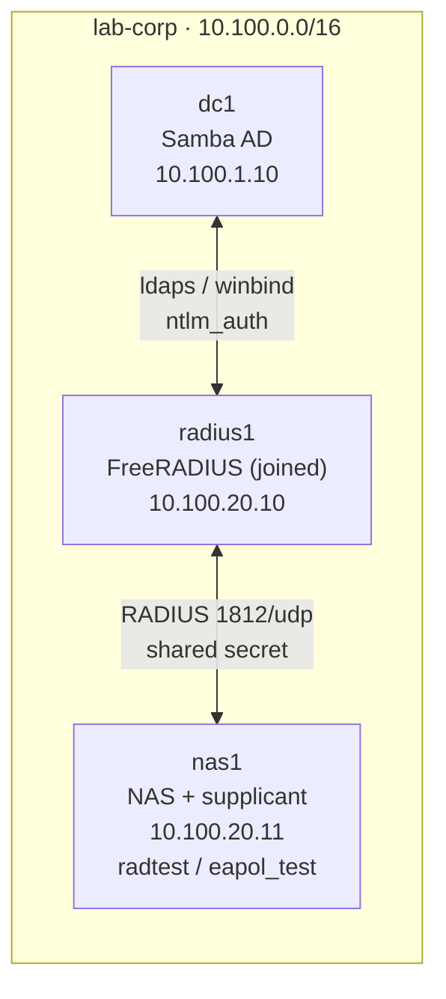

# Lab 12 — RADIUS & AD Integration

Stand up **FreeRADIUS** as the bridge between your network gear and Active
Directory: the server that a switch, Wi-Fi AP, or VPN concentrator asks "is this
user allowed on the network, and onto which VLAN?" You'll authenticate AD users
three different ways — **PAP** (LDAP bind), **PEAP/MSCHAPv2** (password inside a
TLS tunnel, validated against AD via `ntlm_auth`), and **EAP-TLS** (certificates,
no password at all) — then return a **dynamic VLAN** based on AD group membership,
and watch a shared-secret mismatch fail the way it does in production: silently.

This is how 802.1X wired/Wi-Fi authentication, NPS-equivalents, and VPN logins all
work. The NAS (network access server) never sees AD; it only talks RADIUS to
`radius1`, which talks Kerberos/LDAP to `dc1`.

## Topology



*Auth methods:* PAP → LDAP bind · PEAP → MSCHAP → `ntlm_auth` → AD · EAP-TLS → client certificate.

| Container | Image | IP | Role |
|-----------|-------|----|------|
| `dc1` | `samba-ad:local` | `10.100.1.10` | AD DC (Kerberos + LDAP + groups) |
| `radius1` | `freeradius-ad:local` (custom) | `10.100.20.10` | FreeRADIUS, domain-joined for `ntlm_auth` |
| `nas1` | `freeradius-ad:local` | `10.100.20.11` | Stand-in NAS / test client (`radtest`, `eapol_test`) |

## How to use this lab

This is a **practice lab**, not a tutorial. Each task gives you an **objective**
and **hints** — your job is to produce the config. Then:

- **Predict before you run.** Commit to an answer first; being wrong and seeing why
  is the point.
- **Reveal the solution only after you've tried.** The files you edit are
  `configs/clients.conf` and `configs/sites-available/default`; full answers are
  behind `Solution` toggles.
- **Observe, don't just verify.** The `Check your work` toggles explain the
  mechanism, not just the result.

You edit files under `labs/12-radius/configs/` on the host; they're bind-mounted
into `radius1`. FreeRADIUS reads its config only at startup, so after each edit
apply it with `docker compose ... restart radius1` (it re-runs the join + reload).

## Prerequisites

- Lab 01 concepts (Kerberos, LDAP, AD groups) and Lab 03's idea of certificates.
  The foundation (`dc1`, the `engineering`/`finance` groups, alice/bob/charlie) is
  auto-provisioned here; you do not need to have run earlier labs.
- Build the custom images first:

```bash
cd enterprise-it-101
docker compose -f base/docker-compose.yml \
               -f labs/12-radius/docker-compose.override.yml build
```

## Deploy

```bash
cd enterprise-it-101
docker compose -f base/docker-compose.yml \
               -f labs/12-radius/docker-compose.override.yml up -d
```

`radius1` waits for `dc1`, joins the domain, starts `winbindd`, generates the
FreeRADIUS test certificates, and launches FreeRADIUS. Give it ~60–90s on first
boot. Watch progress with `docker logs -f radius1` until `Ready to process
requests`.

## Destroy

```bash
docker compose -f base/docker-compose.yml \
               -f labs/12-radius/docker-compose.override.yml down -v
```

---

## What is pre-built

- `radius1` is **domain-joined** and runs `winbindd` so `ntlm_auth` can validate
  MSCHAPv2 against AD (the fiddly one-time plumbing lives in
  `configs/radius-join.sh`).
- The **LDAP**, **EAP** (PEAP + EAP-TLS), and **MSCHAP→ntlm_auth** modules are
  written for you (`configs/mods-available/{ldap,eap,mschap}`), and the
  `inner-tunnel` virtual server is complete.
- The FreeRADIUS **test CA + server/client certificates** are generated at startup
  and the client cert/CA are copied to `nas1` for EAP-TLS.
- `nas1` has `radtest` and `eapol_test`, plus ready-made supplicant configs in
  `/eapol`.

## What you configure

- **Who may talk to the server** — authorize `nas1` as a RADIUS client
  (`clients.conf`).
- **The VLAN policy** — return `Tunnel-*` reply attributes by AD group in the
  `default` server's `post-auth` (`sites-available/default`).

Everything else you **run and observe** — three authentication methods against the
same directory — and you'll break the shared secret to feel a classic RADIUS
failure.

---

## Task 1 — Survey the starting line

**Objective:** Confirm `radius1` is joined and listening, then send the very first
RADIUS request from `nas1` and explain the result.

??? question "Predict first"
    `nas1` has not yet been added to `clients.conf`. When you fire `radtest` at the
    server from `nas1`, will you get an **Access-Reject**, or **no reply at all**?
    Why would a RADIUS server treat "unknown client" differently from "known client,
    wrong password"?

```bash
# radius1 is joined and FreeRADIUS is up:
docker exec radius1 net ads testjoin
docker logs radius1 2>&1 | grep "Ready to process requests"

# Fire the first request from the NAS (server, port 0 = default 1812, secret):
docker exec nas1 radtest alice P@ssw0rd1 10.100.20.10 0 testing123
```

??? success "Check your work"
    `net ads testjoin` prints `Join is OK`. The `radtest` **hangs and times out with
    no reply** (`No reply from server`). A RADIUS server *silently ignores* packets
    from any source IP not listed in `clients.conf` — it never sends a Reject,
    because replying would confirm to a stranger that a RADIUS server is even there.
    "Unknown client" and "known client / bad password" are deliberately different:
    the first gets silence, the second gets an Access-Reject. Remember this — it's
    exactly the symptom you'll engineer in Task 5.

---

## Task 2 — Authorize the NAS

**Objective:** Add `nas1` to `clients.conf` with the shared secret `testing123`,
restart, and get your first **Access-Accept** — authenticated against AD.

??? question "Predict first"
    The shared secret is symmetric (same string on the NAS and the server). When the
    PAP password reaches FreeRADIUS, where is it actually checked — against a local
    password file on `radius1`, or somewhere else? (Look at which module the
    `authorize` section runs.)

??? note "Hints"
    - A `client` block needs `ipaddr` and `secret`. `nas1` is `10.100.20.11`.
    - Edit `configs/clients.conf` (there's a `TODO` marking the spot).
    - Apply it: `docker compose -f base/docker-compose.yml -f labs/12-radius/docker-compose.override.yml restart radius1`, then re-run the Task 1 `radtest`.

??? note "Solution"
    ```conf
    # configs/clients.conf
    client nas1 {
        ipaddr = 10.100.20.11
        secret = testing123
    }
    ```
    ```bash
    docker compose -f base/docker-compose.yml \
                   -f labs/12-radius/docker-compose.override.yml restart radius1
    # wait for "Ready to process requests", then:
    docker exec nas1 radtest alice P@ssw0rd1 10.100.20.10 0 testing123
    ```

??? success "Check your work"
    Now you get `Received Access-Accept`. The password was **not** stored on
    `radius1` — the `ldap` module in `authorize` set `Auth-Type := ldap`, and
    authentication happened by **binding to AD as alice over LDAPS**. FreeRADIUS is a
    broker: the NAS trusts RADIUS, RADIUS trusts AD. (You'll see no `Tunnel-*`
    attributes yet — VLAN assignment is Task 4.)

---

## Task 3 — Watch the authentication happen (three ways)

**Objective (make a mechanism visible):** Run FreeRADIUS in debug mode and trace how
each method reaches AD, then prove EAP works with `eapol_test`.

??? question "Predict first"
    Three methods authenticate the *same* alice/bob against the *same* AD:
    **PAP** (LDAP bind), **PEAP/MSCHAPv2**, **EAP-TLS**. Rank them by "what crosses
    the link." Which one sends the password (even if encrypted)? Which sends **no
    password at all**? Which never even reaches AD?

??? note "Hints"
    - Restart with debug: set `RADIUS_DEBUG=1` and recreate `radius1`, or run a
      second instance in the foreground:
      `docker exec radius1 freeradius -X` (Ctrl-C to stop) — but stop the running one
      first, or just read `docker logs radius1`.
    - For EAP, use the supplied supplicant configs on `nas1`:
      `/eapol/peap-mschapv2.conf` (PEAP) and `/eapol/eap-tls.conf` (EAP-TLS).
    - **`eapol_test`'s `-a` wants the server *IP*, not a hostname** — a hostname trips
      an assert and aborts. Use `-a 10.100.20.10`.

??? note "Solution"
    ```bash
    # PEAP/MSCHAPv2 (password validated against AD via ntlm_auth/winbind):
    docker exec nas1 eapol_test -c /eapol/peap-mschapv2.conf -a 10.100.20.10 -s testing123

    # EAP-TLS (client certificate; no password):
    docker exec nas1 eapol_test -c /eapol/eap-tls.conf -a 10.100.20.10 -s testing123

    # See the AD-side check directly:
    docker exec radius1 ntlm_auth --request-nt-key --domain=LAB --username=bob --password=P@ssw0rd1
    ```

??? success "Check your work"
    Both `eapol_test` runs end in `SUCCESS`, and `ntlm_auth` prints
    `NT_STATUS_OK: The operation completed successfully.` The mechanism per method:

    | Method | What crosses the link | How AD is consulted |
    |--------|----------------------|---------------------|
    | PAP | the password (protected only by the RADIUS shared secret) | `ldap` binds to AD as the user |
    | PEAP/MSCHAPv2 | a challenge/response **inside a TLS tunnel** | `mschap` → `ntlm_auth` → winbind → AD |
    | EAP-TLS | a **client certificate**, no password ever | AD not contacted for auth at all — trust is the CA |

    EAP-TLS is the strongest (nothing to phish), PEAP is the common enterprise Wi-Fi
    choice (AD passwords, no client certs to manage), PAP is fine only because the
    tunnel here is the lab network — never use bare PAP on a real link.

---

## Task 4 — Assign a VLAN by AD group

**Objective:** Return `Tunnel-*` reply attributes from the `default` server's
`post-auth` so **engineering → VLAN 10** and **finance → VLAN 20**, then prove alice
and bob land on different VLANs.

This is what makes RADIUS *authorization*, not just authentication: the same
"accept" can place a contractor on a guest VLAN and an engineer on the engineering
VLAN, enforced by the switch from attributes the server returns.

??? question "Predict first"
    alice is in `engineering`, bob in `finance`. After you add the policy, what three
    attributes must the Access-Accept carry for a switch to place the port on a VLAN?
    What happens to charlie (in neither group) — Accept with no VLAN, or Reject?

??? note "Hints"
    - The three attributes are `Tunnel-Type = VLAN`, `Tunnel-Medium-Type = IEEE-802`,
      `Tunnel-Private-Group-Id = "<vlan-id>"`.
    - Test group membership with `LDAP-Group == "engineering"` inside an `if`.
    - Edit the `post-auth` block in `configs/sites-available/default` (there's a
      `TODO`). The `inner-tunnel` server already has the equivalent block for the
      PEAP path — yours covers the PAP/EAP-TLS outer path.

??? note "Solution"
    ```conf
    # in server default { ... post-auth { ... } }
    if (&User-Name && (LDAP-Group == "engineering")) {
        update reply {
            Tunnel-Type             := VLAN
            Tunnel-Medium-Type      := IEEE-802
            Tunnel-Private-Group-Id := "10"
        }
    }
    elsif (&User-Name && (LDAP-Group == "finance")) {
        update reply {
            Tunnel-Type             := VLAN
            Tunnel-Medium-Type      := IEEE-802
            Tunnel-Private-Group-Id := "20"
        }
    }
    ```
    ```bash
    docker compose -f base/docker-compose.yml \
                   -f labs/12-radius/docker-compose.override.yml restart radius1
    docker exec nas1 radtest alice P@ssw0rd1 10.100.20.10 0 testing123   # VLAN 10
    docker exec nas1 radtest bob   P@ssw0rd1 10.100.20.10 0 testing123   # VLAN 20
    ```

??? success "Check your work"
    alice's Access-Accept now carries `Tunnel-Private-Group-Id:0 = "10"`, bob's
    `"20"`:
    ```
    Received Access-Accept Id 65 from 10.100.20.10:1812 ...
        Tunnel-Type:0 = VLAN
        Tunnel-Medium-Type:0 = IEEE-802
        Tunnel-Private-Group-Id:0 = "10"
    ```
    charlie (in neither group) gets a plain **Access-Accept with no `Tunnel-*`** — he
    authenticates fine but matches no policy, so the switch drops him onto its default
    (often unassigned/quarantine) VLAN. "Authenticated" and "authorized onto VLAN X"
    are separate decisions: the first is yes/no, the second is which attributes come
    back.

---

## Task 5 — Break it: the shared-secret mismatch

**Objective (required):** Change the shared secret on one side only, observe the
production-classic failure, diagnose it, and repair it.

The RADIUS shared secret authenticates the *NAS to the server* (and signs replies).
It is symmetric: identical on both ends or nothing works — and the failure is
deliberately unhelpful.

??? question "Predict first"
    If `nas1` and `radius1` disagree on the shared secret, what does `radtest` show —
    an `Access-Reject`, a clear "bad secret" error, or a timeout? Will the server log
    say *why*?

**Break it** — send a request with the wrong secret from `nas1` (the server's entry
for `nas1` still says `testing123`):
```bash
docker exec nas1 radtest alice P@ssw0rd1 10.100.20.10 0 WRONGSECRET
```

??? note "Diagnosis hints (try before revealing)"
    - Did you get a reply at all? Compare to the Task 1 "unknown client" symptom.
    - Turn on the server view: `docker logs radius1 2>&1 | tail -20` — does it even
      log the request? What does it say about the authenticator/secret?

??? success "What you should observe"
    `radtest` **times out — no reply.** With debug on, the server logs that it
    received a packet whose Request Authenticator doesn't validate and **drops it**.
    This is the same silence as Task 1's unknown client: a bad secret is
    indistinguishable, on the wire, from an attacker, so the server says nothing.
    In the field this looks like "the switch says auth is failing but the RADIUS
    server shows nothing" — almost always a secret typo or the wrong `client` entry.

**Repair** by using the correct secret again (no config change needed — `nas1`'s
server-side entry was never wrong):
```bash
docker exec nas1 radtest alice P@ssw0rd1 10.100.20.10 0 testing123   # Access-Accept
```

---

## Verification Checklist

```bash
# radius1 joined to AD
docker exec radius1 net ads testjoin                      # Join is OK

# PAP via AD + dynamic VLAN
docker exec nas1 radtest alice P@ssw0rd1 10.100.20.10 0 testing123 | grep -E 'Accept|Tunnel-Private'
docker exec nas1 radtest bob   P@ssw0rd1 10.100.20.10 0 testing123 | grep -E 'Accept|Tunnel-Private'

# wrong password -> Reject (a reply, unlike a bad secret)
docker exec nas1 radtest alice WRONGPASS 10.100.20.10 0 testing123 | grep -E 'Accept|Reject'

# PEAP/MSCHAPv2 and EAP-TLS (note: -a takes the IP)
docker exec nas1 eapol_test -c /eapol/peap-mschapv2.conf -a 10.100.20.10 -s testing123 | tail -1
docker exec nas1 eapol_test -c /eapol/eap-tls.conf       -a 10.100.20.10 -s testing123 | tail -1
```

Expected: `Join is OK`; alice → Accept + VLAN `"10"`, bob → Accept + VLAN `"20"`;
wrong password → `Access-Reject`; both `eapol_test` runs end in `SUCCESS`.

---

## Challenge Questions

No answers provided — these test whether you can reason about the system.

1. **Fail open or fail closed?** Stop `dc1` (`docker stop dc1`) and retry
   `radtest alice ...`. Does RADIUS reject, hang, or accept? Is "fail closed" the
   right behavior for network auth, and when might an operator *want* fail-open?

2. **PEAP vs EAP-TLS trade-off.** Your CISO wants to eliminate passwords from Wi-Fi.
   You propose EAP-TLS. List two operational costs EAP-TLS adds that PEAP/MSCHAPv2
   doesn't, and one attack it defeats that PEAP doesn't.

3. **The silent failure, generalized.** You've now seen *two* things produce "no
   reply": an unknown client (Task 1) and a bad secret (Task 5). Given only "the
   switch reports RADIUS timeouts and the server log is empty," list the checks you'd
   run, in order, and what each rules out.

4. **VLAN by group, at scale.** charlie matched no group and got no VLAN. Design a
   policy so unmatched-but-authenticated users land on a quarantine VLAN (999) rather
   than the switch default. Where would that rule go relative to your engineering/
   finance `if`s, and why does order matter?

5. **Accounting.** This lab only did authentication. RADIUS *accounting* (Acct-Start/
   Stop) is how you answer "who was on the network, from which port, for how long."
   What single piece of data ties an accounting record back to the VLAN decision you
   made in Task 4?

---

## Key Concepts

| Concept | What it means here |
|---------|--------------------|
| NAS / RADIUS / directory | The NAS (switch/AP/VPN) talks **RADIUS** to `radius1`, which talks **LDAP/Kerberos** to AD. The NAS never sees AD. |
| Shared secret | Symmetric per-client string that authenticates the NAS and signs replies. Mismatch ⇒ **silent drop**, not a reject. |
| PAP / PEAP / EAP-TLS | Password-by-LDAP-bind / password-in-TLS-tunnel-via-`ntlm_auth` / certificate-only. Increasing strength, increasing operational cost. |
| `ntlm_auth` + winbind | How FreeRADIUS validates MSCHAPv2 against AD — needs a domain join and membership in `winbindd_priv`. |
| Dynamic VLAN | `Tunnel-Type`, `Tunnel-Medium-Type`, `Tunnel-Private-Group-Id` in the Access-Accept tell the switch which VLAN to assign — authorization, not just authentication. |

---

## Troubleshooting

| Symptom | Likely cause | Fix |
|---------|-------------|-----|
| `radtest` times out, server log empty | Client not in `clients.conf`, or shared-secret mismatch | Add/correct the `client` block; secrets must match both ends |
| `eapol_test` aborts (`wpa_init_conf` assert) | Passed a hostname to `-a` | Use the server **IP**: `-a 10.100.20.10` |
| PEAP fails, `ntlm_auth` "Reading winbind reply failed" | `winbindd` not running / `freerad` not in `winbindd_priv` | `restart radius1` (the join script resets perms + restarts winbindd) |
| MSCHAP works for Administrator but not alice | username/domain normalization | confirm `winbind use default domain = yes` and the `mschap` `ntlm_auth` username expansion |
| Access-Accept but no VLAN | `post-auth` policy missing or group lookup empty | implement Task 4; verify `LDAP-Group == "engineering"` matches a real group |
| `net ads testjoin` fails | DC unreachable at join time / clock skew | check `dig dc1.lab.corp`, time sync; `restart radius1` to re-join |

---

## What's Next

You've now federated identity (Lab 10), filtered the web (Lab 11), and gated the
network itself (this lab) — all against the one AD you built in Lab 01. That
completes the **Integration** phase. Next comes **Operations**:

- **Lab 13 (Monitoring)** — watch every service you've built (including this RADIUS
  server) and alert before users notice.
- **Lab 14 (SIEM)** — collect the auth events (RADIUS accepts/rejects, AD logons)
  and detect brute force and anomalies.
- **Lab 16 (Capstone)** — onboard a new employee end-to-end: AD account → workstation
  join → file shares → mail → SSO → and a RADIUS-assigned VLAN, exactly like Task 4.
