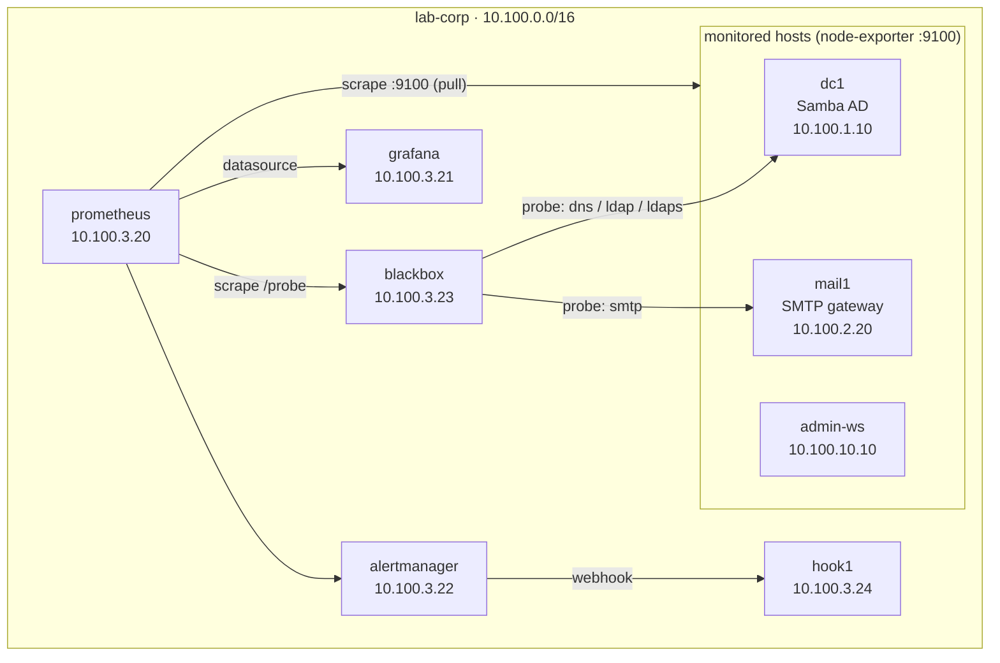

# Lab 13 — Monitoring & Alerting

**Duration: 2.5–3 hours**

Until now, you found out a lab.corp service was broken when a *task told you to
break it*. In production, you find out when users call — unless monitoring
finds out first. In this lab you wire up the standard open-source monitoring
stack — **Prometheus** (metrics collection), **node-exporter** (host agents),
**blackbox-exporter** (service probes), **Grafana** (dashboards), and
**Alertmanager** (alert routing) — against the real services you built in
earlier labs: AD's DNS/LDAP/LDAPS on `dc1` and SMTP on `mail1`. By the end, a
stopped domain controller pages your "on-call webhook" within ninety seconds,
and you'll have learned the harder lesson: what happens when the *monitoring*
breaks and nobody pages at all.

## Topology



| Container | Image | IP | Role |
|-----------|-------|----|------|
| `dc1` | `samba-ad:local` | `10.100.1.10` | AD DC — the DNS/LDAP/LDAPS services you monitor |
| `mail1` | `docker-mailserver` | `10.100.2.20` | SMTP gateway (Lab 09's config) — probe target |
| `admin-ws` | `workstation:local` | `10.100.10.10` | Your seat (`curl`, `jq`, `dig`, `openssl`) |
| `prometheus` | `prom/prometheus` | `10.100.3.20` | Metrics collection + alert rule evaluation |
| `grafana` | `grafana/grafana` | `10.100.3.21` | Dashboards (host browser: `http://localhost:3000`) |
| `alertmanager` | `prom/alertmanager` | `10.100.3.22` | Alert routing/grouping (host: `http://localhost:9093`) |
| `blackbox` | `prom/blackbox-exporter` | `10.100.3.23` | Probes services from the outside |
| `hook1` | `workstation:local` | `10.100.3.24` | Webhook receiver — your stand-in pager |
| `node-dc1` / `node-mail1` / `node-ws` | `prom/node-exporter` | (shares its host's IP) | Host metrics agent on `:9100` |

The node exporters are **sidecars**: each one runs inside its host container's
network namespace, so it answers on that host's IP at `:9100` — exactly like an
agent package installed on a real server. Keep that in mind later when a host
"dies".

## How to use this lab

This is a **practice lab**, not a tutorial. Each task gives you an **objective**
and **hints** — your job is to produce the config or the query. Then:

- **Predict before you run.** Commit to an answer first; being wrong and seeing
  why is the point.
- **Reveal the solution only after you've tried.** The files you edit are under
  `labs/13-monitoring/configs/`; full answers are behind `Solution` toggles.
- **Observe, don't just verify.** The `Check your work` toggles explain the
  mechanism, not just the result.

You edit `configs/prometheus/prometheus.yml`, `configs/prometheus/rules/*.yml`,
and `configs/alertmanager/alertmanager.yml` on the host; they're bind-mounted
into the containers. Prometheus reloads live (`curl -X POST .../-/reload`);
Alertmanager reloads on `docker kill -s HUP alertmanager`.

## Prerequisites

- Concepts from Lab 01 (AD, DNS) and Lab 09 (SMTP). The foundation is
  auto-provisioned — you don't need to have run the earlier labs.
- Build the custom images first (skip if already built):

```bash
cd enterprise-it-101
./eit.sh build samba-ad workstation
```

Only one EIT101 lab can run at a time (they share the `10.100.0.0/16` subnet) —
`./eit.sh down <other-lab>` first if needed. The lab publishes host ports
`3000` (Grafana), `9090` (Prometheus), and `9093` (Alertmanager) for your
browser; free them if something else is squatting there.

## Deploy

```bash
cd enterprise-it-101
./eit.sh up 13          # or the explicit docker compose -f ... form
```

First boot takes 2–3 minutes: `dc1` provisions the domain and `mail1` builds
its mail config. Until then the SMTP probe you create in Task 5 will show
`down` — watch `docker logs -f mail1` for postfix to settle.

## Destroy

```bash
./eit.sh down 13        # add -v to also wipe volumes (fresh domain next time)
```

## What is pre-built / what you configure

Pre-built (scaffolding, not the lesson):

- All eleven containers, the node-exporter sidecars, and the `hook1` webhook
  receiver (`docker logs -f hook1` is your pager display).
- Blackbox-exporter **probe modules** (`configs/blackbox/config.yml`) — *how*
  to probe (TCP, TLS, SMTP banner, DNS query). Worth reading; you'll choose
  which module to use per service.
- Prometheus runs with a near-empty config: it scrapes only itself.
- Grafana runs with **no datasources** and admin/admin.
- Alertmanager routes everything to a black hole.

You configure: every scrape job, every probe target, the Grafana datasource and
dashboard, every alert rule, and the alert route to the webhook. That's the
job.

---

## Task 1 — Deploy and find the moving parts (guided)

**Objective:** Bring the lab up and confirm each component is alive before you
wire anything together.

Run:

```bash
./eit.sh up 13
docker ps --format 'table {{.Names}}\t{{.Status}}'   # expect 11 containers Up
docker logs hook1                                     # "listening on :8080"
docker exec -it admin-ws bash                         # your seat for the lab
```

Then open the three web UIs from your host browser: Prometheus
`http://localhost:9090`, Grafana `http://localhost:3000` (admin/admin),
Alertmanager `http://localhost:9093`.

??? success "Check your work"
    In Prometheus, **Status → Target health** shows exactly **one** target:
    `prometheus (1/1 up)` — it monitors itself and nothing else. Grafana's
    **Connections → Data sources** page is empty. Alertmanager shows no alerts.
    This emptiness is the honest starting state of every monitoring rollout:
    the stack is healthy but *blind*. Everything you do from here is about
    giving it eyes.

## Task 2 — Read what an agent actually says

**Objective:** From `admin-ws`, fetch the raw metrics the dc1 node-exporter
serves, and find dc1's available memory in it.

??? question "Predict first"
    In Prometheus's model, who opens the TCP connection — does the agent on
    dc1 *push* its metrics to the monitoring server, or does the server *pull*
    them from the agent? And in what format do you expect the metrics to
    travel: a binary protocol, JSON, or something else?

??? note "Hints"
    - The sidecar answers on its host's name: `dc1.lab.corp`, port `9100`.
    - It's plain HTTP. `curl` it; the conventional path is `/metrics`.
    - Pipe through `grep` to find a metric about memory — exporter metric
      names follow `<collector>_<subsystem>_<name>_<unit>`, and "available
      memory" is `MemAvailable` in `/proc/meminfo`.

??? note "Solution"
    ```bash
    curl -s http://dc1.lab.corp:9100/metrics | less        # ~1000 lines
    curl -s http://dc1.lab.corp:9100/metrics | grep node_memory_MemAvailable
    ```

??? success "Check your work"
    You get plain text like:

    ```
    # HELP node_memory_MemAvailable_bytes Memory information field MemAvailable_bytes.
    # TYPE node_memory_MemAvailable_bytes gauge
    node_memory_MemAvailable_bytes 2.4e+09
    ```

    This is the **exposition format** — the entire wire protocol of the
    Prometheus ecosystem is "HTTP GET returns `name{labels} value` lines".
    The agent computes nothing, stores nothing, and sends nothing on its own:
    it answers when asked. That's the **pull model** — the server scrapes the
    agents (so the prediction answer is: Prometheus connects out; the agent
    never dials in). Pull means the monitoring server controls the schedule,
    and "the agent stopped answering" is itself a detectable signal — which
    becomes important in Task 9.

## Task 3 — Make Prometheus scrape the node exporters

**Objective:** Add a scrape job named `node` covering all three node exporters
(`dc1`, `mail1`, `admin-ws`), apply it without restarting Prometheus, and
verify all targets are `up` via the HTTP API.

??? question "Predict first"
    After this works, Prometheus's target list had one entry; how many will it
    have? And: the config file is bind-mounted from the host — will editing it
    take effect on its own?

??? note "Hints"
    - Edit `labs/13-monitoring/configs/prometheus/prometheus.yml` on the host.
      Copy the shape of the existing `prometheus` job: `job_name`,
      `static_configs`, `targets`.
    - Targets are `host:port` strings; the exporters answer on `:9100`.
    - Prometheus only re-reads config when told to. The container runs with
      `--web.enable-lifecycle`, which enables `POST /-/reload`.
    - The targets API: `GET /api/v1/targets` — pipe to `jq` and look at
      `.data.activeTargets[].health`.

??? note "Solution"
    Append to `scrape_configs:` in `configs/prometheus/prometheus.yml`:

    ```yaml
      - job_name: node
        static_configs:
          - targets:
              - dc1.lab.corp:9100
              - mail1.lab.corp:9100
              - admin-ws.lab.corp:9100
    ```

    Then from `admin-ws`:

    ```bash
    curl -s -X POST http://prometheus.lab.corp:9090/-/reload
    sleep 20   # one scrape interval
    curl -s http://prometheus.lab.corp:9090/api/v1/targets \
      | jq -r '.data.activeTargets[] | .labels.job + " " + .labels.instance + " " + .health'
    ```

??? success "Check your work"
    Four targets, all `up`:

    ```
    node dc1.lab.corp:9100 up
    node mail1.lab.corp:9100 up
    node admin-ws.lab.corp:9100 up
    prometheus localhost:9090 up
    ```

    No agent restarts, no per-host changes — adding a host to monitoring is
    purely a server-side config change, because the pull model keeps all the
    scheduling on the server. (If the reload returned 200 but nothing changed,
    your YAML was invalid — Prometheus keeps the old config on a bad reload;
    `docker logs prometheus` shows the parse error.)

## Task 4 — Query it: three questions, three PromQL answers

**Objective:** Answer with PromQL, from `admin-ws` or the Prometheus web UI
(**Graph** tab): (a) how many scrape targets are healthy? (b) how much total
RAM does each of the three hosts report? (c) what fraction of each filesystem
is used?

??? question "Predict first"
    Commit to a number for (a). For (b): `dc1` runs a whole domain controller,
    `admin-ws` is an idle shell box — which will report more total memory?

??? note "Hints"
    - Scrape health is the synthetic metric `up` — `count()` it.
    - Total RAM: you saw the metric family naming convention in Task 2
      (`MemTotal`).
    - The API form, if you prefer the terminal over the Graph tab:
      `curl -s 'http://prometheus.lab.corp:9090/api/v1/query?query=up'`.
      For anything beyond a bare metric name, pass the query as
      `--data-urlencode 'query=...'` instead — curl mangles `{}` in URLs
      (it treats them as globs) and raw spaces break the request.
    - Filesystems: `node_filesystem_avail_bytes / node_filesystem_size_bytes`
      — division matches series with identical label sets on both sides.

??? note "Solution"
    ```bash
    curl -s 'http://prometheus.lab.corp:9090/api/v1/query?query=count(up)' | jq -r '.data.result[0].value[1]'

    curl -s --data-urlencode 'query=node_memory_MemTotal_bytes' \
      http://prometheus.lab.corp:9090/api/v1/query \
      | jq -r '.data.result[] | .metric.instance + " " + .value[1]'

    curl -s --data-urlencode 'query=100 * (1 - node_filesystem_avail_bytes / node_filesystem_size_bytes)' \
      http://prometheus.lab.corp:9090/api/v1/query \
      | jq -r '.data.result[] | .metric.instance + " " + .metric.mountpoint + " " + .value[1]'
    ```

??? success "Check your work"
    (a) `4`. (b) — the gotcha — **all three hosts report exactly the same
    number**, byte for byte. node-exporter reads `/proc/meminfo`, and `/proc`
    memory/CPU stats are *not namespaced*: every container sees the whole
    Docker VM's RAM. Containers share a kernel; they are resource-limited
    processes, not machines. (On real servers — or VMs — these numbers would
    differ, and this job would behave exactly the same otherwise.) (c) shows
    only a handful of bind-mounted paths (`/etc/hosts`, `/home`, …) and no `/`
    — same reason: the container root is an overlay filesystem, which
    node-exporter ignores by default. Remember that for the disk alert you
    write in Task 7.

## Task 5 — Probe services from the outside (blackbox)

**Objective:** Node exporters prove the *hosts* are alive; now prove the
*services* are. Wire up four blackbox probes: DNS (a real SOA query against
`dc1:53`), LDAP (`dc1:389`), LDAPS (`dc1:636`), and SMTP (`mail1:25`,
expecting a `220` banner).

The blackbox pattern is indirection: Prometheus scrapes **blackbox**'s
`/probe` endpoint, passing the real target as a URL parameter, and blackbox
does the probing. Getting the labels right needs the standard `relabel_configs`
dance — here is the DNS job in full; you write the other three (the modules
in `configs/blackbox/config.yml` are already built — pick the right one per
service):

```yaml
  - job_name: blackbox-dns
    metrics_path: /probe
    params:
      module: [dns_lab_corp]
    static_configs:
      - targets: ["dc1.lab.corp:53"]        # what to test...
    relabel_configs:
      - source_labels: [__address__]        # ...becomes ?target=
        target_label: __param_target
      - source_labels: [__param_target]
        target_label: instance              # keep the real service as the label
      - target_label: __address__
        replacement: blackbox.lab.corp:9115 # ...but actually scrape blackbox
```

??? question "Predict first"
    When the SMTP probe runs, which TCP connections are opened, by whom, to
    whom? Count them. (Hint: there are two, and neither is from Prometheus to
    mail1.)

??? note "Hints"
    - One job per module: `tcp_connect` for LDAP, `tcp_tls` for LDAPS,
      `smtp_banner` for SMTP. Only `params.module`, `job_name`, and the
      target change between jobs.
    - Verify with the targets API again, then check the probes *succeeded*:
      the metric is `probe_success` (1 = good). `up` only says blackbox
      answered the scrape — that distinction is the whole plot of Task 10.

??? note "Solution"
    Three more jobs in `prometheus.yml`, identical in shape to `blackbox-dns`:

    ```yaml
      - job_name: blackbox-ldap
        metrics_path: /probe
        params:
          module: [tcp_connect]
        static_configs:
          - targets: ["dc1.lab.corp:389"]
        relabel_configs:
          - source_labels: [__address__]
            target_label: __param_target
          - source_labels: [__param_target]
            target_label: instance
          - target_label: __address__
            replacement: blackbox.lab.corp:9115

      - job_name: blackbox-ldaps
        metrics_path: /probe
        params:
          module: [tcp_tls]
        static_configs:
          - targets: ["dc1.lab.corp:636"]
        relabel_configs:
          - source_labels: [__address__]
            target_label: __param_target
          - source_labels: [__param_target]
            target_label: instance
          - target_label: __address__
            replacement: blackbox.lab.corp:9115

      - job_name: blackbox-smtp
        metrics_path: /probe
        params:
          module: [smtp_banner]
        static_configs:
          - targets: ["mail1.lab.corp:25"]
        relabel_configs:
          - source_labels: [__address__]
            target_label: __param_target
          - source_labels: [__param_target]
            target_label: instance
          - target_label: __address__
            replacement: blackbox.lab.corp:9115
    ```

    Reload and verify:

    ```bash
    curl -s -X POST http://prometheus.lab.corp:9090/-/reload
    sleep 20
    curl -s http://prometheus.lab.corp:9090/api/v1/targets \
      | jq -r '.data.activeTargets[] | .labels.job + " " + .health'
    curl -s 'http://prometheus.lab.corp:9090/api/v1/query?query=probe_success' \
      | jq -r '.data.result[] | .metric.job + " " + .value[1]'
    ```

??? success "Check your work"
    Eight targets `up`, and four probes at `1`:

    ```
    blackbox-dns 1
    blackbox-ldap 1
    blackbox-ldaps 1
    blackbox-smtp 1
    ```

    The prediction: connection ① Prometheus → `blackbox:9115` (the scrape,
    carrying `?target=mail1.lab.corp:25&module=smtp_banner`), connection ②
    `blackbox` → `mail1:25` (the probe itself, which also waits for the `220`
    banner — proving postfix *speaks SMTP*, not merely that the port is open).
    Prometheus never touches mail1. This is **black-box monitoring**: testing
    the service the way a client experiences it, no agent required —
    complementary to the node exporters' white-box view from inside the host.

## Task 6 — Read a certificate expiry off the wire

**Objective:** The most common self-inflicted enterprise outage is an expired
TLS certificate. Find out, from metrics alone, how many days dc1's LDAPS
certificate has left — then verify the number against the certificate itself.

??? question "Predict first"
    dc1's cert is the one Samba self-generated when the domain was provisioned
    (you met it in Labs 03/09/10). The domain was provisioned the first time
    you ran `up` on this lab. Days remaining — order of magnitude: ~30, ~300,
    ~700, ~3000?

??? note "Hints"
    - The `tcp_tls` module already recorded it during every LDAPS probe:
      `probe_ssl_earliest_cert_expiry`, in seconds-since-epoch.
    - PromQL has `time()`; 86400 seconds per day.
    - Cross-check from `admin-ws` with
      `openssl s_client -connect ... | openssl x509 -noout -enddate`.

??? note "Solution"
    ```bash
    curl -s --data-urlencode 'query=(probe_ssl_earliest_cert_expiry - time()) / 86400' \
      http://prometheus.lab.corp:9090/api/v1/query \
      | jq -r '.data.result[] | .metric.instance + " " + .value[1]'

    echo | openssl s_client -connect dc1.lab.corp:636 2>/dev/null \
      | openssl x509 -noout -enddate
    ```

??? success "Check your work"
    Both agree: just under **700 days** (Samba self-signs for 700 days at
    provision time — `notAfter` lands ~23 months out). The point isn't this
    cert — it's that expiry is now a *metric*: a number that decreases
    predictably and can be alerted on a week early (Task 7), instead of being
    discovered at 9am on expiry day when every domain join in the building
    fails. The openssl cross-check is your proof that the metric is the truth,
    not an approximation of it.

## Task 7 — Write the alert rules

**Objective:** Create `configs/prometheus/rules/alerts.yml` with five rules:
**HostDown** (a node exporter unreachable for 1m → critical),
**ServiceProbeFailed** (any probe failing for 1m → critical),
**DiskUsageHigh** (any filesystem >80% for 5m → warning), **CertExpirySoon**
(any probed cert <7 days → warning), **DnsLatencyHigh** (DNS probe >500ms for
2m → warning). Load them and confirm all five are present and `inactive`.

??? question "Predict first"
    The instant the rules load — which of the five do you expect to be
    `inactive`, which `pending`, which `firing`? In particular: will
    CertExpirySoon fire, and what would DiskUsageHigh need to measure for
    *your* containers (think back to Task 4c)?

??? note "Hints"
    - File shape: `groups: → - name: → rules: → - alert:` with `expr`, `for`,
      `labels.severity`, `annotations.summary`. The `rule_files` glob in
      `prometheus.yml` already points at `rules/*.yml`.
    - You already have every expression: `up{job="node"} == 0`,
      `probe_success == 0`, the Task 4c filesystem ratio `> 80`, the Task 6
      expiry arithmetic `< 7`, and `probe_duration_seconds{job="blackbox-dns"}
      > 0.5`.
    - Annotations can template labels: `{{ $labels.instance }}`.
    - Rules load on the same `/-/reload`; inspect with `GET /api/v1/rules`.

??? note "Solution"
    `configs/prometheus/rules/alerts.yml`:

    ```yaml
    groups:
      - name: lab-corp
        rules:
          - alert: HostDown
            expr: up{job="node"} == 0
            for: 1m
            labels:
              severity: critical
            annotations:
              summary: "node exporter on {{ $labels.instance }} has been unreachable for 1m"

          - alert: ServiceProbeFailed
            expr: probe_success == 0
            for: 1m
            labels:
              severity: critical
            annotations:
              summary: "probe {{ $labels.job }} against {{ $labels.instance }} is failing"

          - alert: DiskUsageHigh
            expr: 100 * (1 - node_filesystem_avail_bytes / node_filesystem_size_bytes) > 80
            for: 5m
            labels:
              severity: warning
            annotations:
              summary: "filesystem {{ $labels.mountpoint }} on {{ $labels.instance }} is over 80% full"

          - alert: CertExpirySoon
            expr: (probe_ssl_earliest_cert_expiry - time()) / 86400 < 7
            labels:
              severity: warning
            annotations:
              summary: "TLS certificate on {{ $labels.instance }} expires in under 7 days"

          - alert: DnsLatencyHigh
            expr: probe_duration_seconds{job="blackbox-dns"} > 0.5
            for: 2m
            labels:
              severity: warning
            annotations:
              summary: "DNS queries against {{ $labels.instance }} are taking over 500ms"
    ```

    ```bash
    curl -s -X POST http://prometheus.lab.corp:9090/-/reload
    curl -s http://prometheus.lab.corp:9090/api/v1/rules \
      | jq -r '.data.groups[].rules[] | .name + " " + .state'
    ```

??? success "Check your work"
    ```
    HostDown inactive
    ServiceProbeFailed inactive
    DiskUsageHigh inactive
    CertExpirySoon inactive
    DnsLatencyHigh inactive
    ```

    All `inactive` — nothing is wrong, and CertExpirySoon has ~700 days of
    margin. Note the alert lifecycle you'll watch in Task 9:
    **inactive → pending → firing**. `for: 1m` means the condition must hold
    for a full minute before firing — `pending` is that probation period, and
    it's what keeps a single dropped scrape from paging anyone at 3am. Also
    note what `DiskUsageHigh` is *actually* measuring here (bind-mounts on the
    shared Docker VM disk — Task 4c): the rule is production-shaped, but in
    containers the "host disk" is a shared illusion.

## Task 8 — Route alerts to the on-call webhook

**Objective:** Connect the last two pipes: tell Prometheus where Alertmanager
is, and tell Alertmanager to deliver everything to the `hook1` webhook
(`http://hook1.lab.corp:8080/`), including resolved notifications.

??? question "Predict first"
    Two config files are involved. Which one decides *whether* an alert
    exists, and which decides *who hears about it*? If Alertmanager were down,
    would Prometheus's Alerts page still show firing alerts?

??? note "Hints"
    - `prometheus.yml` gains a top-level `alerting:` block —
      `alertmanagers:` with a `static_configs` targets list pointing at
      `alertmanager.lab.corp:9093`. Reload Prometheus after.
    - `configs/alertmanager/alertmanager.yml`: replace the blackhole with a
      `route:` (receiver name, `group_by: [alertname]`, short `group_wait`)
      and a `receivers:` entry with `webhook_configs:` (`url`,
      `send_resolved: true`). Apply with `docker kill -s HUP alertmanager`.
    - Sanity-check delivery end-to-end in the next task — here, just confirm
      Alertmanager loaded the config: `docker logs alertmanager | tail`.

??? note "Solution"
    In `configs/prometheus/prometheus.yml` (top level, next to `rule_files`):

    ```yaml
    alerting:
      alertmanagers:
        - static_configs:
            - targets: ["alertmanager.lab.corp:9093"]
    ```

    Replace `configs/alertmanager/alertmanager.yml` with:

    ```yaml
    route:
      receiver: oncall-webhook
      group_by: [alertname]
      group_wait: 15s
      group_interval: 1m
      repeat_interval: 30m

    receivers:
      - name: oncall-webhook
        webhook_configs:
          - url: http://hook1.lab.corp:8080/
            send_resolved: true
    ```

    ```bash
    curl -s -X POST http://prometheus.lab.corp:9090/-/reload
    docker kill -s HUP alertmanager
    docker logs alertmanager 2>&1 | tail -2   # "Completed loading of configuration file"
    ```

??? success "Check your work"
    The division of labor (your prediction): **Prometheus rules decide whether
    an alert exists** — evaluation happens there, and its Alerts page works
    with Alertmanager down. **Alertmanager decides who hears about it** —
    grouping (`group_by` collapses one outage's N alerts into one
    notification), throttling (`repeat_interval` is why you get re-paged every
    30m, not every 15s), and routing to receivers. In production the receiver
    is PagerDuty or Slack; `hook1` speaks the exact same webhook API with
    `docker logs` as the display.

## Task 9 — Kill the domain controller, watch the page arrive

**Objective:** Stop `dc1` and follow one fault through the entire pipeline:
rule → pending → firing → Alertmanager → webhook. Then repair, and confirm the
all-clear arrives too.

??? question "Predict first"
    Exactly which of your five alerts will end up firing? Count carefully —
    dc1 is not just "a host", it's also the lab's only DNS server, and
    blackbox resolves its probe targets through it. Write your list down.

??? note "Hints"
    - `docker stop dc1`, then watch three places: the Prometheus **Alerts**
      page (or `/api/v1/rules`), `GET alertmanager:9093/api/v2/alerts`, and
      `docker logs -f hook1`. Budget ~90s: scrape interval + `for: 1m` +
      `group_wait`.
    - When you repair: check `docker ps -a` before assuming `docker start dc1`
      is enough. What happened to dc1's sidecar?

??? note "Solution"
    ```bash
    docker stop dc1
    docker logs -f hook1          # wait ~90s, watch the FIRING lines arrive
    # repair:
    docker start dc1 node-dc1     # the sidecar died with its host (see check)
    docker logs -f hook1          # wait for the RESOLVED lines
    ```

??? success "Check your work"
    The webhook receives a storm, not one alert — typically:

    ```
    --- ... received 3 alert(s) [group status: firing] ---
      [FIRING  ] ServiceProbeFailed severity=critical instance=dc1.lab.corp:53 ...
      [FIRING  ] ServiceProbeFailed severity=critical instance=dc1.lab.corp:389 ...
      [FIRING  ] ServiceProbeFailed severity=critical instance=dc1.lab.corp:636 ...
    --- ... received 1 alert(s) [group status: firing] ---
      [FIRING  ] HostDown severity=critical instance=dc1.lab.corp:9100 ...
    ```

    …and often `DnsLatencyHigh` joins in. **One fault, five-plus alerts**:
    dc1's death takes out DNS, LDAP, LDAPS, its node exporter, *and* makes
    every name lookup time out — each watcher reports its own symptom. That's
    an **alert storm**, the everyday reality of monitoring a dependency-heavy
    system, and why Alertmanager's grouping (you got 3 probes in *one*
    webhook delivery, grouped by alertname) and inhibition rules exist.
    The repair gotcha: `docker stop dc1` also killed `node-dc1` (exit 137) —
    the sidecar lives in dc1's network namespace, just like a real agent dies
    with its host. Start both, and `send_resolved: true` delivers the
    `[RESOLVED]` lines a minute later — closing the loop a real on-call
    rotation depends on (nobody re-checks dashboards at 4am to see if it got
    better).

## Task 10 — Break-It: the silent blind spot (open)

**Objective:** Late Friday, a colleague "cleaned up some noisy container
nobody recognized": `docker stop blackbox`. Run that. Monday morning, every
dashboard is green and not one alert has fired all weekend. Question: what is
your monitoring actually telling you right now — and what would have to be
true for you to *find out* about a real mail outage? Diagnose what you've
lost, prove the services themselves are fine, then fix the gap so this
failure mode can never be silent again.

??? note "Hints"
    - Compare what `up` says about the blackbox jobs with what `probe_success`
      says. Which one still exists? What does a metric that *stops existing*
      look like on a dashboard?
    - Prove the real services are fine the analog way: `dig @dc1.lab.corp
      dc1.lab.corp`, `kinit alice` — the outage is in your *visibility*, not
      the services.
    - The fix is a rule. You already know the one metric that reliably reports
      a dead scrape target.

??? note "Solution"
    Diagnosis — after `docker stop blackbox`:

    ```bash
    # the probe scrapes are dead:
    curl -s --data-urlencode 'query=up{job=~"blackbox-.*"}' \
      http://prometheus.lab.corp:9090/api/v1/query \
      | jq -r '.data.result[] | .metric.job + " " + .value[1]'
    # all four reach 0 within one scrape interval (~15s, staggered per job)

    # but probe_success doesn't say "0" — it says nothing at all:
    curl -s 'http://prometheus.lab.corp:9090/api/v1/query?query=probe_success' \
      | jq '.data.result | length'                                  # 0 series

    # and the services are perfectly healthy:
    dig +short @dc1.lab.corp dc1.lab.corp                           # answers
    ```

    No alert fired because `ServiceProbeFailed` triggers on
    `probe_success == 0` — and a metric that is no longer scraped isn't `0`,
    it's **absent**. Stale series just go quiet; dashboards keep their last
    green. The fix — a meta-alert in `rules/alerts.yml`:

    ```yaml
          - alert: MonitoringBlindSpot
            expr: up{job=~"blackbox-.*"} == 0
            for: 1m
            labels:
              severity: critical
            annotations:
              summary: "blackbox probe scrapes failing — service visibility lost, dashboards are lying"
    ```

    Reload while blackbox is still stopped and watch it land:

    ```bash
    curl -s -X POST http://prometheus.lab.corp:9090/-/reload
    docker logs -f hook1        # [FIRING] MonitoringBlindSpot ...
    docker start blackbox       # repair; RESOLVED follows
    ```

??? success "Check your work"
    `hook1` logs `[FIRING ] MonitoringBlindSpot severity=critical ...` within
    ~90s of the reload, and `[RESOLVED]` after you start blackbox again. The
    durable lesson: **"no alert" and "all clear" are not the same statement.**
    `up` is the only metric Prometheus *synthesizes itself* — it exists for
    every configured target whether or not the target answers, which makes it
    the one reliable witness to a dead exporter. Every real monitoring stack
    carries meta-monitoring like this (who watches the watcher?), because the
    failure mode you just built an alert for — green dashboards over a blind
    monitoring system — is precisely how multi-day silent outages happen.

## Task 11 — Build the overview dashboard

**Objective:** In Grafana (`http://localhost:3000`, admin/admin): connect
Prometheus as a datasource, then build a **Lab Corp Overview** dashboard with
at least: a stat panel of service probe status (`probe_success`), a stat panel
of host reachability (`up{job="node"}`), a timeseries of available memory per
host, and a timeseries of DNS probe latency. Save it — then stop `dc1` for two
minutes and watch the dashboard tell the story before starting it (and its
sidecar) again.

??? question "Predict first"
    Grafana never talks to the exporters. When a panel refreshes, what is the
    exact path a data point travels to reach your browser?

??? note "Hints"
    - **Connections → Data sources → Add data source → Prometheus**; the only
      required field is the URL — Grafana reaches Prometheus by its lab name
      and port, same as you've been `curl`ing (use the `.lab.corp` name —
      "Save & test" must go green).
    - **Dashboards → New → Add visualization.** For up/down panels the
      **Stat** type with value mappings (1 → UP/green, 0 → DOWN/red) reads
      best; **Thresholds** work too.
    - Every query box takes the PromQL you already wrote in Tasks 4–6 —
      nothing new to invent. Use `legend` formatting like
      `{{ instance }}` to label series.
    - Prefer the terminal? The datasource can be created via
      `POST /api/datasources` with `-u admin:admin` — the solution shows both.

??? note "Solution"
    GUI path: add the datasource with URL `http://prometheus.lab.corp:9090`,
    Save & test → "Successfully queried the Prometheus API". Then build panels
    with these queries:

    | Panel | Type | Query |
    |-------|------|-------|
    | Service status | Stat | `probe_success` |
    | Host reachability | Stat | `up{job="node"}` |
    | Available memory | Time series | `node_memory_MemAvailable_bytes` |
    | DNS latency | Time series | `probe_duration_seconds{job="blackbox-dns"}` |

    API alternative for the datasource:

    ```bash
    curl -s -u admin:admin -H 'Content-Type: application/json' \
      -d '{"name":"prometheus","type":"prometheus","url":"http://prometheus.lab.corp:9090","access":"proxy","isDefault":true}' \
      http://grafana.lab.corp:3000/api/datasources | jq -r '.message'
    # → "Datasource added"
    ```

    Verify the datasource actually works and the dashboard was saved:

    ```bash
    uid=$(curl -s -u admin:admin http://grafana.lab.corp:3000/api/datasources | jq -r '.[0].uid')
    curl -s -u admin:admin http://grafana.lab.corp:3000/api/datasources/uid/$uid/health | jq -r '.status'
    # → "OK"
    curl -s -u admin:admin 'http://grafana.lab.corp:3000/api/search?query=Lab%20Corp' | jq -r '.[].title'
    # → "Lab Corp Overview"
    ```

??? success "Check your work"
    The data path (your prediction): browser → Grafana → (PromQL over HTTP) →
    Prometheus's TSDB — the same `/api/v1/query` you've been curling all lab.
    Grafana stores **no data**, only queries and layout; the exporters are
    never contacted at render time. During your dc1 outage replay the stat
    panels flip red within a scrape interval, the memory series for dc1 stops
    dead (absent, not zero — Task 10's lesson rendered visually), and recovery
    draws itself a minute after `docker start dc1 node-dc1`. Dashboards are
    for *humans investigating*; alerts are for *machines escalating* — you
    now have both, fed by one pipeline.

---

## Verification checklist

From `admin-ws` (with everything repaired and running):

```bash
# 8 targets, all up
curl -s http://prometheus.lab.corp:9090/api/v1/targets \
  | jq -r '[.data.activeTargets[] | select(.health=="up")] | length'    # → 8

# 4 probes succeeding
curl -s --data-urlencode 'query=count(probe_success == 1)' \
  http://prometheus.lab.corp:9090/api/v1/query \
  | jq -r '.data.result[0].value[1]'                                    # → 4

# 6 rules loaded (5 from Task 7 + the Task 10 meta-alert), none firing
curl -s http://prometheus.lab.corp:9090/api/v1/rules \
  | jq -r '[.data.groups[].rules[]] | length'                           # → 6
curl -s http://prometheus.lab.corp:9090/api/v1/rules \
  | jq -r '[.data.groups[].rules[] | select(.state=="firing")] | length' # → 0

# cert margin still ~700 days
curl -s --data-urlencode 'query=(probe_ssl_earliest_cert_expiry - time()) / 86400' \
  http://prometheus.lab.corp:9090/api/v1/query | jq -r '.data.result[0].value[1]'

# grafana datasource healthy
uid=$(curl -s -u admin:admin http://grafana.lab.corp:3000/api/datasources | jq -r '.[0].uid')
curl -s -u admin:admin http://grafana.lab.corp:3000/api/datasources/uid/$uid/health | jq -r '.status'  # → OK
```

And on the host: `docker logs hook1` contains `FIRING` and `RESOLVED` lines
for `HostDown`, `ServiceProbeFailed`, and `MonitoringBlindSpot`.

## Challenge questions

No answers provided — that's the point.

1. A branch office sits behind NAT; Prometheus at HQ can't open connections
   into it. The pull model just broke. List two architectures that fix this
   and one new failure mode each of them introduces.
2. Your dc1 outage produced five-plus alerts for one root cause. Design the
   paging policy: which *single* alert should page a human, what should happen
   to the rest, and how would you express "if HostDown is firing for dc1,
   suppress its service alerts" in Alertmanager terms?
3. Task 4 showed all three "hosts" reporting identical RAM. In a production
   Kubernetes or Docker estate, node-exporter-per-container is therefore the
   wrong tool. What two distinct things would you monitor instead, and with
   what?
4. The SMTP probe was green the entire time mail1 would have been refusing
   logins with a full mail queue. For each green-but-broken scenario you can
   think of (at least three), say what probe or metric *would* have caught it.
5. Where does the monitoring stack itself live in your design: same host,
   same site, same cloud region as what it watches? Walk through what you can
   and cannot detect in each placement when "the building loses power" — and
   who watches Prometheus?

## Key concepts

| Concept | The durable idea |
|---------|------------------|
| Pull model | The server scrapes agents over plain HTTP; agents are passive. Adding monitoring = server-side config. A target that stops answering is itself a signal (`up`). |
| Exposition format | The whole ecosystem speaks `name{labels} value` text lines over HTTP `/metrics`. Anything that can print text can be monitored. |
| White-box vs black-box | node-exporter reports from *inside* the host (CPU, RAM, disks); blackbox probes from *outside*, the way a client experiences the service. You need both. |
| Alert lifecycle | inactive → pending (`for:` probation) → firing → resolved. `pending` is the flap-damper; `send_resolved` closes the loop. |
| Prometheus vs Alertmanager | Rules in Prometheus decide *whether* an alert exists; Alertmanager decides *who hears about it* (grouping, throttling, routing, silences). |
| Alert storm | One fault in a dependency (DNS, a DC) fires many symptom alerts. Grouping and inhibition turn a storm into a page. |
| Absent ≠ zero | A dead exporter's metrics don't go to 0 — they vanish. Only the synthetic `up` metric reliably reports a dead target. Meta-monitor with it. |
| Dashboards vs alerts | Dashboards are for humans investigating; alerts are for machines escalating. Grafana stores queries, not data. |
| Containers ≠ VMs | `/proc` CPU/RAM is host-wide inside a container; container rootfs is invisible overlay. Per-container monitoring needs cgroup-aware tooling (cAdvisor), not node-exporter. |

## Troubleshooting

| Symptom | Cause | Fix |
|---------|-------|-----|
| `/-/reload` returns 200 but config didn't change | Invalid YAML — Prometheus keeps the previous config on a failed reload | `docker logs prometheus` shows the parse error; fix and reload again |
| All blackbox-* targets `down`, error `connect: no route to host` | blackbox container not running (or its config invalid → crash loop) | `docker ps -a`, `docker logs blackbox`, `docker start blackbox` |
| Targets `down` with `no such host` while dc1 is stopped | dc1 is the lab DNS; names not pinned via `extra_hosts` stop resolving | Expected during the outage drills — recovers with dc1 |
| `node-dc1` exited 137 after the Task 9 drill | Sidecar shares dc1's network namespace; stopping dc1 kills it | `docker start dc1 node-dc1` |
| SMTP probe `down` right after deploy | mail1 takes 1–3 minutes to provision postfix on first boot | `docker logs -f mail1`, wait, probe recovers on its own |
| `probe_success` exists but is `0` for LDAPS only | TLS handshake failing (wrong module — `tcp_connect` connects but `tcp_tls` is what validates the handshake) | Check `params.module` in that job |
| Grafana "Save & test" fails with connection error | URL uses `localhost` (that's Grafana's own container) or a name Grafana can't resolve | Use `http://prometheus.lab.corp:9090` |
| `up` for a blackbox job is `1` but the service is dead | `up` only means blackbox answered the scrape — service state is `probe_success` | Alert on both: `probe_success == 0` *and* the Task 10 meta-alert |
| Host ports 3000/9090/9093 already in use | Another stack on your machine | Stop it, or change the published port in the override file (lab-internal traffic doesn't use host ports) |

## What's next

- **Lab 14 — SIEM & Security Logging** is the sibling discipline: this lab
  answers *"is it up?"*; Lab 14 answers *"who did what?"*. Availability
  monitoring and security event monitoring share plumbing but serve different
  masters.
- **Lab 15 — Backup & Recovery** is what your `HostDown` page leads to when
  `docker start dc1` isn't enough — and your monitoring is how you'll know the
  restore actually worked.
- **Experiments:** add a `recording rule` that pre-computes 24h uptime
  percentage per service; probe something with the unused `icmp` and
  `http_2xx` modules (Grafana itself is an HTTP target…); point a second
  webhook receiver at a different severity using a routing tree with
  `matchers`; import a community node-exporter dashboard (ID 1860) and
  critique what's noise in a container lab.
