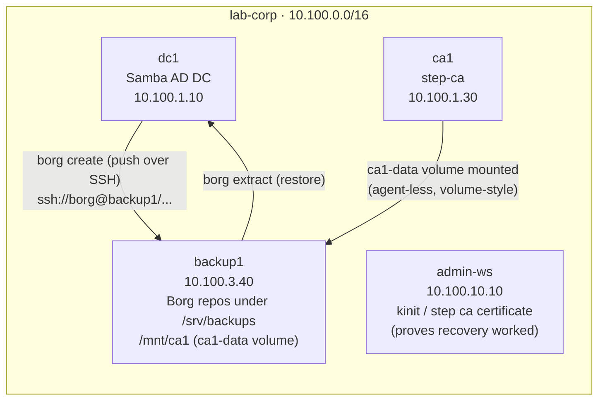

# Lab 15 — Backup & Disaster Recovery

**Duration: 2.5–3 hours**

Every lab so far has been about building services. This one is about the day
you lose them. You stand up a **BorgBackup** repository server, design backups
for the two most unforgivable things to lose — the Active Directory database
and the certificate authority's private key — and then you actually lose them,
on purpose, and bring them back. Along the way you'll meet the ideas the whole
discipline hangs on: encrypted, deduplicated repositories; application-consistent
versus crash-consistent copies; retention policies; and the rule every grizzled
sysadmin repeats — **a backup you have never restored is not a backup, it's a
hope**. The disasters in this lab are scripted; the next ones won't be.

## Topology



| Container | Image | IP | Role |
|-----------|-------|----|------|
| `dc1` | `samba-ad-backup:local` | `10.100.1.10` | AD DC with Borg client tooling (`borg`, `ssh`, `cron`) — pushes its own backups |
| `ca1` | `smallstep/step-ca:latest` | `10.100.1.30` | The Lab 03 internal CA — **no shell tooling**, backed up volume-style from `backup1` |
| `backup1` | `backup-server:local` | `10.100.3.40` | Borg repository host: `sshd` + a `borg` service account, repos under `/srv/backups` |
| `admin-ws` | `workstation:local` | `10.100.10.10` | Your seat — used to *prove* each restore worked (Kerberos logins, cert issuance) |

The DESIGN doc also lists mail and Keycloak backups (a `pg_dump` of Keycloak's
PostgreSQL). They're cut here for the same reason Lab 14 has no dashboard — the
Docker Desktop memory ceiling — but the *lesson* they carry
(application-consistent database dumps vs. raw file copies) is in this lab
anyway: Samba's own `.ldb` databases have exactly the same problem, and Task 4
confronts it head-on.

## How to use this lab

This is a **practice lab**, not a tutorial. Each task gives you an **objective**
and **hints** — your job is to produce the command, config, or script. Then:

- **Predict before you run.** Commit to an answer first; being wrong and seeing
  why is the point.
- **Reveal the solution only after you've tried.** Full answers are behind
  `Solution` toggles.
- **Observe, don't just verify.** The `Check your work` toggles explain the
  mechanism, not just the result.

## Prerequisites

- Concepts from Lab 01 (what lives in the AD database) and Lab 03 (what the CA's
  key is for). The foundation auto-provisions — you don't need to have run them.
- Build the custom images first (skip those already built). `samba-ad-backup`
  derives from `samba-ad`, so build in this order:

```bash
cd enterprise-it-101
./eit.sh build samba-ad workstation samba-ad-backup backup-server
```

Only one EIT101 lab can run at a time (they share the `10.100.0.0/16` subnet) —
`./eit.sh down <other-lab>` first if needed. This lab publishes **no** host
ports; you reach everything via `docker exec`.

## Deploy

```bash
cd enterprise-it-101
./eit.sh up 15          # or the explicit docker compose -f ... form
```

First boot takes 1–2 minutes while `dc1` provisions the domain. It's ready when
`docker exec dc1 samba-tool user list` answers.

## Destroy

```bash
./eit.sh down 15        # add -v to also wipe volumes (domain, CA, AND backups)
```

Your Borg repositories live in the `backup1-data` volume, so a plain
`down`/`up` keeps them. `down -v` deletes the backups along with everything
else — which, you'll come to appreciate, is exactly what makes same-box
backups a bad idea (Challenge Question 4).

## What is pre-built / what you configure

Pre-built (scaffolding, not the lesson):

- The domain (Lab 01 foundation: `alice`, `bob`, `charlie`, OUs, groups) and
  the CA (Lab 03's auto-initialised step-ca, password `P@ssw0rd1`).
- `backup1` running `sshd` with a `borg` service account (password
  `P@ssw0rd1`) and an empty, `borg`-owned `/srv/backups`.
- Borg + an SSH client + cron installed on `dc1`; cron already runs under
  supervisord. ca1's data volume mounted at `/mnt/ca1` on `backup1`.

You configure (the lesson):

- The SSH trust from `dc1` to `backup1`, both encrypted Borg repositories,
  and what, exactly, gets backed up from each service.
- Both disaster recoveries, end to end, including diagnosing a recovery trap.
- The schedule and the retention policy.

Throughout, "on dc1" means `docker exec -it dc1 bash`, and likewise for the
other containers. `backup1` work happens as the `borg` user:
`docker exec -it -u borg backup1 bash`.

---

## Task 1 — Find what you would lose

**Objective:** Before backing anything up, locate the state that matters: where
Samba keeps the domain, where step-ca keeps its keys, and confirm `backup1` can
already see the CA's files.

??? question "Predict first"
    A domain controller and a CA both die in a fire tonight, and you have no
    backups. Which loss is worse, and why? (Think about what each one would
    force you to redo — and who *else* has to redo something.)

??? note "Hints"
    - On `dc1`: the Samba state directory was bind-mounted in every lab since
      01 — look at the compose file, then `ls` inside it. Which subdirectory
      holds `sam.ldb`? Which holds GPOs?
    - `ca1` has no usable shell tooling, but its volume is mounted on
      `backup1` at `/mnt/ca1`. What's in `secrets/`?
    - On `backup1` (as `borg`): check `/srv/backups` and which user owns it.

??? note "Solution"
    ```bash
    # on dc1
    ls /var/lib/samba/                # private/ (sam.ldb, secrets) + sysvol/ (GPOs)
    ls /var/lib/samba/private/ | head
    ls /etc/samba/                    # smb.conf — config, also worth backing up

    # on backup1 (docker exec -it -u borg backup1 bash)
    ls -la /srv/backups               # empty, owned by borg
    ls -la /mnt/ca1                   # certs/ config/ db/ secrets/ templates/
    ls /mnt/ca1/secrets/              # root_ca_key, intermediate_ca_key, password
    ```

??? success "Check your work"
    You should find: `dc1`'s crown jewels in `/var/lib/samba/private/`
    (`sam.ldb` — every user, group, password hash, and the domain SID — plus
    `secrets.ldb` and the Kerberos material) and `/var/lib/samba/sysvol/`
    (Group Policy); the CA's in `/mnt/ca1/secrets/` — two ~300-byte files that
    the entire PKI trust chain hangs on. As for the prediction: AD is the worse
    loss *operationally* (no logins, no DNS, no GPO — every other lab's service
    authenticates against it), but the CA loss has the longer tail: a rebuilt CA
    is a *different* CA, so every certificate it ever issued must be reissued
    and every client that trusts the old root must be re-pointed. Disaster
    recovery planning starts exactly here: an inventory of state and a ranking
    of what hurts most.

## Task 2 — Establish the SSH trust

**Objective:** Backups will be *pushed*: `dc1` runs `borg`, which tunnels over
SSH to `backup1`. Give root on `dc1` passwordless key-based SSH access to the
`borg` account on `backup1`, and prove it with a `whoami` over SSH.

??? question "Predict first"
    `ssh-copy-id` will ask for the `borg` password once, and after that, key
    auth works forever. What did it actually *change*, on which machine, in
    which file?

??? note "Hints"
    - `ssh-keygen -t ed25519` (empty passphrase is fine here — Task 9's cron
      job can't type one).
    - `ssh-copy-id borg@backup1.lab.corp`, password `P@ssw0rd1`.
    - First connection prompts you to accept `backup1`'s host key — that's the
      *other* half of SSH trust (you authenticating the server).

??? note "Solution"
    ```bash
    # on dc1
    ssh-keygen -t ed25519 -N "" -f /root/.ssh/id_ed25519
    ssh-copy-id borg@backup1.lab.corp        # password: P@ssw0rd1
    ssh borg@backup1.lab.corp whoami         # no password prompt → borg
    ```

??? success "Check your work"
    `whoami` over SSH returns `borg` with no password prompt. What changed:
    your *public* key was appended to `/home/borg/.ssh/authorized_keys` **on
    backup1** (go look — `ssh borg@backup1.lab.corp cat .ssh/authorized_keys`).
    The private key never left `dc1`. Meanwhile `backup1`'s host key landed in
    `/root/.ssh/known_hosts` on `dc1`, so both sides can now authenticate each
    other. This key is now standing infrastructure: anyone who roots `dc1` can
    reach the backup server as `borg` — hold that thought for the challenge
    questions.

## Task 3 — Initialise an encrypted repository

**Objective:** Create the Borg repository for `dc1` at
`ssh://borg@backup1.lab.corp/srv/backups/dc1`, encrypted in `repokey` mode with
the passphrase `BackupKey2025`. Then find where the encryption key actually
ended up.

??? question "Predict first"
    In `repokey` mode, where is the encryption key stored — on the client
    (`dc1`), on the server (`backup1`), or somewhere else? If an attacker
    steals the entire `/srv/backups/dc1` directory, can they read your AD
    database?

??? note "Hints"
    - `borg init --help` — you need `--encryption=repokey` and the repo URL.
    - Set `export BORG_PASSPHRASE=BackupKey2025` first, or borg prompts you
      (fine interactively, fatal in a cron job).
    - Afterwards, look inside the repo from `backup1`: it's just a directory.
      Read `/srv/backups/dc1/config`.

??? note "Solution"
    ```bash
    # on dc1
    export BORG_PASSPHRASE=BackupKey2025
    borg init --encryption=repokey ssh://borg@backup1.lab.corp/srv/backups/dc1

    # see where the key lives — on backup1 (or via ssh from dc1):
    ssh borg@backup1.lab.corp grep -A3 '^key' /srv/backups/dc1/config
    ```

??? success "Check your work"
    `borg init` prints a warning that ends *"you will need both KEY AND
    PASSPHRASE to access this repo"* — that's the answer to the prediction:
    **repokey stores the key inside the repository itself** (you just read it,
    base64-blobbed, in the repo's `config` file on `backup1`), but encrypted
    under your passphrase. So a stolen repo alone is unreadable ciphertext —
    the thief needs the passphrase too. The trade-off: the alternative
    `keyfile` mode keeps the key off the server entirely (stronger), but then
    *losing the client* loses the key. `borg key export` exists for exactly
    this — Task 10 returns to it.

## Task 4 — Take the first backup (and make it consistent)

**Objective:** Back up `dc1`'s domain state — `/var/lib/samba`, `/etc/samba`,
and `/etc/krb5.conf` — into an archive named `baseline-<date>`. Before you do,
verify the database is healthy, and convince yourself the live-database problem
is real.

??? question "Predict first"
    Two predictions. (1) `sam.ldb` is a live database that samba is writing to
    *right now*. What could go wrong with copying it mid-write, and what does
    Samba offer to make a backup *application-consistent*? (2) The Samba
    directory holds ~45 MB. Roughly how big will the archive be on `backup1`?

??? note "Hints"
    - Integrity first: `samba-tool dbcheck`. Never back up a database you
      haven't verified — you'll faithfully preserve the corruption.
    - `borg create --stats <repo>::<archive-name> <paths...>` — name archives
      with `$(date +%Y%m%d)` so they sort.
    - For the consistency question: `samba-tool domain backup --help` lists an
      `offline` subcommand. Try it with `--targetdir=/tmp/offline-backup` and
      see what it produces.

??? note "Solution"
    ```bash
    # on dc1
    export BORG_PASSPHRASE=BackupKey2025
    samba-tool dbcheck                  # expect: 0 errors
    borg create --stats \
        ssh://borg@backup1.lab.corp/srv/backups/dc1::baseline-$(date +%Y%m%d) \
        /var/lib/samba /etc/samba /etc/krb5.conf

    # the application-consistent alternative:
    samba-tool domain backup offline --targetdir=/tmp/offline-backup
    ls /tmp/offline-backup/
    ```

??? success "Check your work"
    `dbcheck` reports `Checked ~221 objects (0 errors)`; `--stats` shows the
    archive: ~44 MB original → **~3.2 MB** compressed and deduplicated on the
    wire and on disk. On the consistency question: a raw copy of a live `.ldb`
    can catch the file mid-transaction — a *crash-consistent* copy, which may
    need recovery or may be subtly torn (the same reason you `pg_dump` a
    PostgreSQL database instead of copying its data directory).
    `samba-tool domain backup offline` is Samba's answer: it takes the
    database's own locks while snapshotting to a tarball, guaranteeing a clean
    copy *without stopping the service*. This lab backs up the live files
    directly — defensible on an idle lab DC, and `dbcheck`-before-backup
    catches rot — but production AD backups use the application-aware path
    (here, the `offline` tarball would be what you feed to borg).

## Task 5 — Point-in-time: change something, back up again

**Objective:** Create a new user `derek.cho` (password `P@ssw0rd1`), then take
a second archive named `with-derek-<date>`. Compare the two archives' stats.

??? question "Predict first"
    The second archive covers the same ~44 MB of data plus one new user. How
    much *new* space will it consume in the repository — closer to 44 MB,
    3 MB, or 300 kB?

??? note "Hints"
    - `samba-tool user create` — you've done this since Lab 01.
    - Same `borg create --stats` as Task 4, different archive name.
    - In the stats, the column that answers the prediction is **Deduplicated
      size** — the space *this* archive added.
    - `borg list <repo>` shows both archives; `borg info <repo>::<archive>`
      shows one in detail.

??? note "Solution"
    ```bash
    # on dc1
    samba-tool user create derek.cho 'P@ssw0rd1' --given-name=Derek --surname=Cho
    export BORG_PASSPHRASE=BackupKey2025
    borg create --stats \
        ssh://borg@backup1.lab.corp/srv/backups/dc1::with-derek-$(date +%Y%m%d-%H%M) \
        /var/lib/samba /etc/samba /etc/krb5.conf
    borg list ssh://borg@backup1.lab.corp/srv/backups/dc1
    ```

??? success "Check your work"
    `borg list` shows both archives. The second archive's stats read ~44 MB
    original but a **deduplicated size around 230 kB** — borg chunked the
    data, recognised almost every chunk from the baseline, and stored only the
    few database pages that actually changed. This is why daily full-looking
    backups are affordable: each archive *presents* as a complete snapshot
    (restorable on its own, no incremental chains to replay) but *costs* only
    the delta. You now have two restore points, and `derek.cho` exists in
    exactly one of them — the disaster in Task 7 turns on that fact.

## Task 6 — Back up the agent-less CA

**Objective:** `ca1` runs a minimal image: no borg, no ssh, no shell tooling —
you can't push from it. Back it up the other way: from `backup1`, where its
data volume is mounted at `/mnt/ca1`. Create a repokey-encrypted repo at
`/srv/backups/ca1` (same passphrase) and an archive named `ca-baseline`
containing the volume's contents.

??? question "Predict first"
    Will the `borg` user be able to read `/mnt/ca1/secrets/` at all? Check the
    permissions first (`ls -la /mnt/ca1`) and explain what you see — whose
    files are these?

??? note "Hints"
    - Work as the borg user: `docker exec -it -u borg backup1 bash`.
    - This repo is *local* — the repo path is just `/srv/backups/ca1`, no
      `ssh://`.
    - Archive relative paths so the restore in Task 8 is mechanical:
      `cd /mnt/ca1 && borg create ... ::ca-baseline .`

??? note "Solution"
    ```bash
    # on backup1, as borg (docker exec -it -u borg backup1 bash)
    export BORG_PASSPHRASE=BackupKey2025
    borg init --encryption=repokey /srv/backups/ca1
    cd /mnt/ca1
    borg create --stats /srv/backups/ca1::ca-baseline .
    borg list /srv/backups/ca1
    ```

??? success "Check your work"
    The archive is tiny (a few kB — a CA's state is keys, certs, and config,
    not bulk data). The permissions answer: the files belong to uid 1000 —
    step-ca's `step` user — and the `borg` account on `backup1` *happens* to
    also be uid 1000, so it can read them. Unix permissions are numeric;
    names are per-container decoration. That coincidence is doing real work
    here, and noticing it matters: volume-style backups always run with
    *somebody's* uid, and on a real fleet you'd run the backup reader as root
    or align ids deliberately. Two backup models now coexist on your backup
    server: **push over SSH** (dc1 — a "pet" server that owns its own backup)
    and **volume-level** (ca1 — infrastructure backs up an agent-less
    appliance from outside). Knowing which one a service needs is a design
    skill, not a command.

## Task 7 — Disaster #1: lose the Active Directory database (Break-It)

**Objective:** Destroy `sam.ldb`, watch what actually breaks (and *when* —
it's not when you expect), spot the trap that makes this disaster easy to
misdiagnose, and recover the domain — provably, with `derek.cho` and the
domain SID intact.

This is the heart of the lab. Work it in three acts and **predict at each
step**.

**Act 1 — the quiet disaster.** On `dc1`, record the domain identity, then
delete the database out from under the running samba:

```bash
wbinfo --domain-info LAB        # note the SID — write it down
rm -rf /var/lib/samba/private/sam.ldb /var/lib/samba/private/sam.ldb.d
```

??? question "Predict first (Act 1)"
    The database file is gone. Right now, from `admin-ws`: does
    `kinit alice@LAB.CORP` still work?

??? success "Check Act 1"
    Try it — **it still works.** `samba-tool user list` on dc1 fails
    immediately (it opens `sam.ldb` from disk), but the running samba daemon
    opened the database long ago and holds it via open file descriptors; on
    Linux, an unlinked file isn't freed until the last handle closes, so the
    KDC keeps answering from a file that has no name anymore. This is the
    nastiest property of this failure mode: **the outage is deferred until the
    next restart**, which might be a 3 a.m. patch reboot weeks from now,
    long after whatever deleted the file has left the scene.

**Act 2 — the trap.** Restart the container and assess the damage:

```bash
docker restart dc1        # from your host shell; wait ~60s, then exec back in
```

??? question "Predict first (Act 2)"
    After the restart, will the domain be (a) down hard, (b) up and healthy,
    or (c) something more deceptive? Decide before you look, then check:
    `samba-tool user list`, `samba-tool user show derek.cho`,
    `wbinfo --domain-info LAB`.

??? success "Check Act 2"
    The answer is (c). The DC is up, `alice`, `bob` and `charlie` all exist,
    `kinit alice` works — at a glance, nothing is wrong. But `derek.cho` is
    **gone**, and `wbinfo --domain-info LAB` shows a **different SID** than
    the one you wrote down. What happened: this image's entrypoint
    auto-provisions a fresh domain whenever `sam.ldb` is missing (that's how
    every lab since 02 gives you a ready foundation), and then re-seeds the
    stock users. You got a brand-new domain wearing the old one's name.
    Real-world equivalents are everywhere: a server re-imaged from a golden
    image, a config-management run that "helpfully" reinitialises, a failover
    to an empty standby. **"The service is up" and "the data is back" are
    different claims** — a new SID means every ACL, every machine trust, and
    every group membership in the old domain references identities that no
    longer exist. Verify restores against *data you know was there*, not
    against the login prompt.

**Act 3 — the recovery.** Now restore properly from your `with-derek` archive.

??? question "Predict first (Act 3)"
    Borg extracts into the *current working directory*, restoring archived
    paths relative to it (the archive stored `var/lib/samba/...`). Where must
    you `cd` before extracting? And what should you do with the impostor
    domain's files first?

??? note "Hints"
    - Stop samba while you operate on its database:
      `supervisorctl stop samba` / `start samba`.
    - Wipe the impostor's state first (`rm -rf /var/lib/samba/*`) — extracting
      *over* a different live domain mixes two databases.
    - `borg list <repo>` to get your exact archive name, then
      `cd / && borg extract <repo>::<archive>`.
    - Prove recovery from `admin-ws`: `kinit derek.cho@LAB.CORP`.

??? note "Solution"
    ```bash
    # on dc1
    export BORG_PASSPHRASE=BackupKey2025
    supervisorctl stop samba
    rm -rf /var/lib/samba/*
    cd /
    borg list ssh://borg@backup1.lab.corp/srv/backups/dc1   # find the name
    borg extract ssh://borg@backup1.lab.corp/srv/backups/dc1::with-derek-<date>
    supervisorctl start samba

    # verify identity + integrity
    wbinfo --domain-info LAB          # SID matches the one you wrote down
    samba-tool user show derek.cho
    samba-tool dbcheck

    # from admin-ws — the proof that counts:
    kinit derek.cho@LAB.CORP          # P@ssw0rd1
    ```

??? success "Check your work"
    `derek.cho` resolves, `dbcheck` reports 0 errors, the SID matches your
    note from Act 1, and — the proof that counts — `derek.cho` can get a
    Kerberos TGT from `admin-ws`. You have now done the thing most
    organisations only claim to do: **a full restore, verified against
    known-good data, under (simulated) pressure.** Note what the verification
    needed: a recorded identity (the SID) and a known post-baseline object
    (derek). A restore you can't verify is Act 2 wearing a different hat.

## Task 8 — Disaster #2: lose the CA's private key

**Objective:** Delete the CA's intermediate signing key, observe the same
deferred-outage pattern from a different angle, and restore *just that one
file* from the `ca-baseline` archive.

??? question "Predict first"
    First, set up the "before" picture on `admin-ws` (this is Lab 03 muscle
    memory — the root fingerprint is in `docker logs ca1`):

    ```bash
    step ca bootstrap --ca-url https://ca1.lab.corp:9000 --fingerprint <fp>
    echo 'P@ssw0rd1' > /tmp/pw
    step ca certificate web1.lab.corp /tmp/web1.crt /tmp/web1.key \
        --provisioner admin --provisioner-password-file /tmp/pw
    ```

    Now predict: after `docker exec ca1 rm /home/step/secrets/intermediate_ca_key`,
    (1) does issuing *another* certificate still work? (2) What happens on
    `docker restart ca1`?

??? note "Hints"
    - Test (1) by issuing `web2.lab.corp` the same way. Then restart and watch
      `docker ps -a` / `docker logs ca1`.
    - Restore from `backup1` as the `borg` user. `borg extract` accepts an
      optional path filter — you can restore *only*
      `secrets/intermediate_ca_key` instead of the whole archive.
    - Remember Task 6 archived relative paths from `/mnt/ca1`, so extract from
      there. Then `docker start ca1` and re-issue.

??? note "Solution"
    ```bash
    # the disaster (from your host shell)
    docker exec ca1 rm /home/step/secrets/intermediate_ca_key
    # (1) on admin-ws: issuing web2.lab.corp STILL WORKS — key is in memory
    # (2) docker restart ca1 → container exits; docker logs ca1 ends with:
    #     error reading "/home/step/secrets/intermediate_ca_key": no such file...

    # the recovery — on backup1, as borg
    export BORG_PASSPHRASE=BackupKey2025
    cd /mnt/ca1
    borg extract /srv/backups/ca1::ca-baseline secrets/intermediate_ca_key
    ls -la secrets/                    # key is back, mode 600

    # from your host shell
    docker start ca1

    # on admin-ws — prove it
    step ca certificate web3.lab.corp /tmp/web3.crt /tmp/web3.key \
        --provisioner admin --provisioner-password-file /tmp/pw
    ```

??? success "Check your work"
    Same deferred-outage shape as Task 7 Act 1: step-ca loaded the key at
    startup, so issuance survives the deletion *until the restart*, then the
    container exits with a clean, honest error (`Exited (2)`). The restore
    shows off two things: **selective extract** (one 314-byte file out of the
    archive, not a full restore) and the volume-style model completing its
    loop — disaster and recovery both happened *from outside* the appliance
    container. And appreciate what that 314-byte file is: had you lost it
    with no backup, every cert in the org would eventually need reissuing
    from a new CA, and every trust store re-pointing. Key material is why CA
    backups are encrypted and access-controlled — you just stored the keys to
    the kingdom on `backup1`, which is now itself a tier-0 asset.

## Task 9 — Schedule it, and keep only what you need

**Objective:** A backup that depends on you remembering is a hope with extra
steps. Write `/usr/local/bin/backup-dc1.sh` on `dc1` that creates a
timestamped archive and then prunes the repo to **7 daily, 4 weekly, 6
monthly** archives; schedule it via cron; prove it ran.

??? question "Predict first"
    Your repo currently holds `baseline-...` and `with-derek-...`, both
    created *today*. After the script's first run adds a third archive and
    prune applies `--keep-daily 7 --keep-weekly 4 --keep-monthly 6` — how many
    archives survive, and which?

??? note "Hints"
    - The script needs `BORG_PASSPHRASE` exported inside it (cron's
      environment is nearly empty — the #1 cause of "works in my shell, fails
      in cron").
    - `borg prune --dry-run --list --keep-daily 7 --keep-weekly 4
      --keep-monthly 6 <repo>` shows what would happen *before* you let it
      delete anything. Run that first and check the prediction.
    - cron is already running under supervisord (`supervisorctl status cron`).
      `crontab -e` (or pipe to `crontab -`); for the lab, schedule
      `* * * * *` so you can watch it fire, then relax it to the production
      `0 2 * * *`.
    - Log to a file — a cron job's output otherwise vanishes.

??? note "Solution"
    ```bash
    # on dc1
    cat > /usr/local/bin/backup-dc1.sh <<'EOF'
    #!/bin/bash
    export BORG_PASSPHRASE=BackupKey2025
    REPO=ssh://borg@backup1.lab.corp/srv/backups/dc1
    borg create --stats "$REPO::dc1-$(date +%Y%m%d-%H%M%S)" \
        /var/lib/samba /etc/samba /etc/krb5.conf >> /var/log/backup-dc1.log 2>&1
    borg prune --keep-daily 7 --keep-weekly 4 --keep-monthly 6 "$REPO" \
        >> /var/log/backup-dc1.log 2>&1
    EOF
    chmod +x /usr/local/bin/backup-dc1.sh

    echo '* * * * * /usr/local/bin/backup-dc1.sh' | crontab -
    # wait ~1 minute, then:
    tail /var/log/backup-dc1.log
    borg list ssh://borg@backup1.lab.corp/srv/backups/dc1

    # once verified, set the real schedule (02:00 nightly):
    echo '0 2 * * * /usr/local/bin/backup-dc1.sh' | crontab -
    ```

??? success "Check your work"
    The log shows a new `dc1-<timestamp>` archive — and `borg list` now shows
    only **two** archives: the new one and `baseline`. The `with-derek`
    archive is *gone*. That's prune working exactly as specified, and it's the
    gotcha worth feeling once: `--keep-daily N` keeps the **last archive of
    each day**, so multiple same-day archives collapse to the newest (baseline
    survived only via the keep-the-oldest rule for the period boundary).
    Retention policy is where you encode your **RPO** — *how much history can
    I afford to lose?* — and a prune rule will happily delete the one archive
    you were sentimental about. Production scripts run `--dry-run` in review,
    and some shops gate prune behind a separate, slower schedule than create.

## Task 10 — The passphrase test

**Objective:** Prove the encryption is real, then protect yourself from it:
demonstrate that the repo is unreadable with the wrong passphrase, and export
the repo key the way you'd escrow it for the day the passphrase is lost.

??? question "Predict first"
    You lose the passphrase but still have root on both `dc1` and `backup1`
    (every file, including the repo's embedded key). Can you get your data
    back?

??? note "Hints"
    - `BORG_PASSPHRASE=wrong borg list <repo>` — one command, instructive
      failure.
    - `borg key export --help`; export to a file, look at what it contains
      (`BORG_KEY ...`). Where would you store this so it *doesn't* burn down
      with the backup server?

??? note "Solution"
    ```bash
    # on dc1
    BORG_PASSPHRASE=wrong borg list ssh://borg@backup1.lab.corp/srv/backups/dc1
    #  → "passphrase ... is incorrect."

    export BORG_PASSPHRASE=BackupKey2025
    borg key export ssh://borg@backup1.lab.corp/srv/backups/dc1 /tmp/dc1-borg.key
    head -2 /tmp/dc1-borg.key
    ```

??? success "Check your work"
    Wrong passphrase → hard refusal; there is no `--force`, no recovery
    question, no vendor hotline. The prediction's answer is **no**: the key in
    the repo is encrypted *under the passphrase*, so root-on-everything still
    reads only ciphertext. That's the security property working as designed —
    and it cuts both ways, which is why the exported key (+ the passphrase,
    stored *separately*) goes into escrow: a password manager, a sealed
    envelope in a safe, an offline vault. The grim version of this lesson:
    organisations have lost everything to *their own* encryption after a
    departure or a death. An encrypted backup whose key lives only in one
    person's head has a bus factor of one.

---

## Verification Checklist

Run these at the end — all should pass:

```bash
# Two repos, each with at least one archive
docker exec -u borg backup1 ls /srv/backups            # dc1  ca1
docker exec dc1 bash -c 'BORG_PASSPHRASE=BackupKey2025 borg list ssh://borg@backup1.lab.corp/srv/backups/dc1'
docker exec -u borg backup1 bash -c 'BORG_PASSPHRASE=BackupKey2025 borg list /srv/backups/ca1'

# A restore is provable, not hypothetical
docker exec dc1 samba-tool user show derek.cho          # restored object exists
docker exec dc1 samba-tool dbcheck                      # 0 errors
docker exec admin-ws bash -c 'echo "P@ssw0rd1" | kinit derek.cho@LAB.CORP && klist'

# The CA is back and signing
docker logs ca1 2>&1 | tail -1                          # Serving HTTPS on :9000

# The schedule exists and has run
docker exec dc1 crontab -l
docker exec dc1 tail -2 /var/log/backup-dc1.log

# Dry-run restore works (the cheap, do-it-monthly confidence check)
docker exec dc1 bash -c 'BORG_PASSPHRASE=BackupKey2025 borg extract --dry-run ssh://borg@backup1.lab.corp/srv/backups/dc1::baseline-<date>'
```

## Challenge Questions

No answers provided — reason them through.

1. **Rank the restore order.** The whole lab-corp estate is lost: AD, CA, DNS,
   DHCP, mail, the proxy, the SIEM. You have verified backups of everything.
   In what order do you restore, and what does each service's position in your
   list depend on?

2. **The 02:00 problem.** Your cron backup runs nightly at 02:00. Ransomware
   detonates at 13:00. State precisely what is lost, in terms of RPO. Now
   design the backup schedule for a service where losing 11 hours of writes is
   unacceptable — what changes, and what does it cost?

3. **The trap, generalised.** Task 7's re-provisioned domain *looked* healthy.
   Describe two production scenarios (not involving this lab's entrypoint)
   where a "successful recovery" passes a service health check but has
   silently lost data — and the verification step that would catch each.

4. **Audit this lab's design.** Judge the backup architecture you just built
   against the 3-2-1 rule (3 copies, 2 media, 1 offsite). List every way it
   falls short, including at least one failure that takes out the originals
   *and* the backups together — then consider `dc1` itself: its SSH key can
   write to the repo. What could ransomware on `dc1` do to your backups, and
   what Borg/SSH features would you investigate to stop it?

5. **Application-consistent, by service.** For each of: PostgreSQL (Keycloak),
   Samba AD, a mail spool (`/var/mail`), and step-ca's `secrets/` — say
   whether a raw file copy of the running service is safe, and if not, name
   the application-aware mechanism you'd use instead.

## Key Concepts

| Concept | The durable idea |
|---------|------------------|
| **Backup vs. restore** | Nobody needs backups; everybody needs *restores*. An untested backup is a hope. Test restores routinely (`--dry-run` monthly, full recovery drills less often). |
| **RPO / RTO** | Recovery *Point* Objective: how much data you may lose (set by backup frequency + retention). Recovery *Time* Objective: how long until you're back (set by restore speed + practice). Every schedule decision is one of these in disguise. |
| **3-2-1 rule** | 3 copies, 2 media types, 1 offsite. This lab scores 2-1-0 — fine for learning, negligent in production. |
| **Crash-consistent vs. application-consistent** | Copying live database files captures a moment mid-write; application-aware mechanisms (`pg_dump`, `samba-tool domain backup offline`) take a coherent snapshot. Know which each service needs. |
| **Deduplication** | Borg stores content-defined chunks once; every archive looks like a full snapshot but costs only its delta (~230 kB for one new AD user against a 44 MB tree). |
| **repokey vs. keyfile** | repokey: key travels inside the repo, locked by the passphrase — survives client loss. keyfile: key stays off the server — stronger against server theft, dies with the client. Either way: **export and escrow the key**. |
| **Push vs. volume-style backup** | A full host can push its own backups (borg over SSH); an agent-less appliance gets backed up from outside via its storage. Backup *design* is choosing per service. |
| **Deferred outages** | Services run on in-memory state and open file handles after their on-disk state is destroyed (the deleted `sam.ldb` KDC, the keyless signing CA). "It still works" tells you nothing about the disk; the bill arrives at the next restart. |
| **Retention = policy, prune = enforcement** | `--keep-daily/weekly/monthly` encodes RPO over time; prune deletes without sentiment (same-day archives collapse to the newest). Dry-run before trusting it. |
| **Restore verification** | Verify against known data (the recorded SID, the post-baseline user), not service liveness — Task 7's impostor domain passed every health check. |

## Troubleshooting

| Symptom | Cause | Fix |
|---------|-------|-----|
| `borg` hangs asking *"Enter passphrase"* (esp. in cron) | `BORG_PASSPHRASE` not set in that environment — cron has an empty env | `export BORG_PASSPHRASE=...` in the script itself, not your shell |
| `Connection closed by remote host` / password prompt during `borg create` | SSH trust not in place for the user running borg (root's key ≠ another user's key) | Re-check Task 2 as the same user that runs the backup |
| `Failed to create/acquire the lock` | A previous borg died holding the repo lock | `borg break-lock <repo>` — only when you're sure no other borg is running |
| `samba-tool user list` → `Unable to open tdb ... sam.ldb` while logins still work | Database deleted/moved under a running samba (Task 7 Act 1) | Stop samba, restore from backup, start — do **not** just restart and trust it |
| After `docker restart dc1` the domain is "fine" but new users/SID are wrong | The entrypoint auto-provisioned a **fresh** domain over the missing DB | That's the Task 7 trap — wipe `/var/lib/samba/*` and `borg extract` the real one |
| `ca1` exits immediately; logs end `error reading ".../intermediate_ca_key"` | The CA's signing key is missing (Task 8 disaster state) | Restore `secrets/intermediate_ca_key` from the `ca-baseline` archive, `docker start ca1` |
| `borg extract` restores into a weird subtree | Extract writes archived (relative) paths under your **cwd** | `cd /` for dc1's absolute-path archives; `cd /mnt/ca1` for the CA archive |
| Cron job never fires | cron not running, or crontab syntax | `supervisorctl status cron`; `crontab -l`; check `/var/log/backup-dc1.log` |
| An archive you made earlier has vanished | Your prune rules collapsed same-day archives to the newest | Working as designed — re-read Task 9's check; dry-run prune before scheduling it |
| `lookup ca1.lab.corp ... no such host` from admin-ws | The ca1/backup1 DNS records were earlier-lab student work; this lab pins them | Use the names in `extra_hosts` (already in the compose file) or add Samba DNS records |

## What's Next

- **Lab 16 — Capstone** assembles everything: when the mini-enterprise breaks,
  your recovery order answer from Challenge Question 1 becomes a live
  exercise.
- The SIEM you built in **Lab 14** should be watching your backup
  infrastructure — `backup1` now holds the AD database and the CA keys, making
  it exactly the "tier-0, rarely watched" asset attackers love. Consider what
  Wazuh rules you'd point at it.
- In the ContainerLab track, `labs/enterprise-campus` is where network-device
  config backup (the other half of enterprise backup discipline) shows up.
