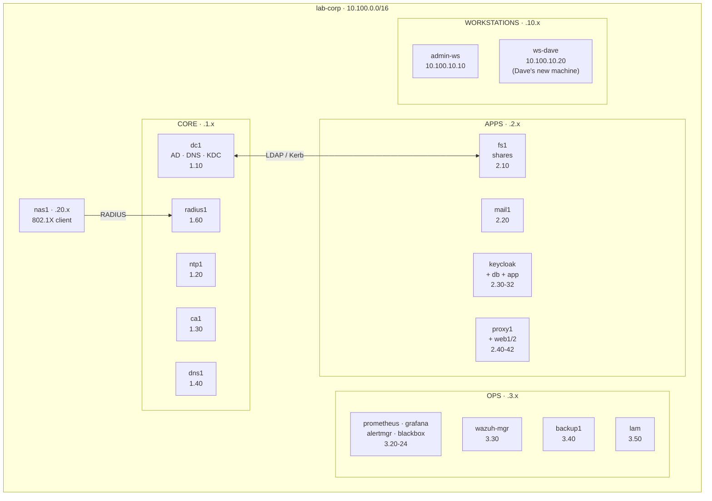

# Lab 16 — Capstone: The Mini Enterprise

**Duration: 3–4 hours**

Fifteen labs ago you provisioned an empty Active Directory domain. Since then
you have added time, certificates, DNS, DHCP, file shares, group policy, mail,
single sign-on, a web proxy, RADIUS, monitoring, a SIEM, and backups — each in
isolation. This capstone runs **all of it at once**, as one living `lab.corp`
enterprise, and asks you to operate it the way a real administrator does. You
will **onboard a new employee** end to end across every system (Part A), then
**diagnose three outages** that have been planted into the running infrastructure
(Part B), and finally **draw the whole thing** from memory (Part C). Nothing here
teaches a new technology. The new skill is *seeing the system* — understanding
that DNS, Kerberos, LDAP, and time are not separate services but a single chain
of dependencies, and that a break in one link surfaces as a symptom three links
away.

## Topology

This lab brings up **every** service from Labs 01–15 simultaneously. The map
below groups them by role; the table lists them all.



| Container | Image | IP | Role |
|-----------|-------|----|------|
| `dc1` | `samba-ad-wazuh:local` | `10.100.1.10` | AD DC: Kerberos KDC, LDAP, DNS, Samba audit log + Wazuh agent |
| `ntp1` | `workstation:local` | `10.100.1.20` | Authoritative NTP server (stratum-10) |
| `ca1` | `smallstep/step-ca` | `10.100.1.30` | Internal certificate authority |
| `dns1` | `bind9:local` | `10.100.1.40` | Enterprise resolver (recursion + conditional forward of `lab.corp`) |
| `radius1` | `freeradius-ad:local` | `10.100.1.60` | RADIUS / 802.1X, AD-backed, dynamic VLAN by group |
| `nas1` | `freeradius-ad:local` | `10.100.20.11` | Switch/AP simulator (`eapol_test`) |
| `fs1` | `samba-ad:local` | `10.100.2.10` | Domain member file server (engineering / finance / public shares) |
| `mail1` | `docker-mailserver` | `10.100.2.20` | Mail gateway, AD-backed mailboxes over LDAPS |
| `keycloak` / `postgres-kc` / `sample-app` | — | `10.100.2.30–32` | SSO (OIDC) federating AD + a protected app |
| `proxy1` / `webserver1` / `webserver2` | `squid-ad` / `nginx` | `10.100.2.40–42` | Kerberos-authenticated web proxy + two sites |
| `prometheus` / `grafana` / `alertmanager` / `blackbox` / `hook1` | — | `10.100.3.20–24` | Monitoring + alerting |
| `wazuh-manager` | `wazuh/wazuh-manager` | `10.100.3.30` | SIEM manager (agents on dc1, admin-ws, ws-dave) |
| `backup1` | `backup-server:local` | `10.100.3.40` | BorgBackup repository host |
| `lam` | `ldapaccountmanager/lam` | `10.100.3.50` | AD web UI (browser) |
| `admin-ws` | `workstation-wazuh:local` | `10.100.10.10` | **Your seat** — domain-joined admin workstation |
| `ws-dave` | `workstation-wazuh:local` | `10.100.10.20` | **Dave's new machine** — bare; you onboard it in Part A |

> **Memory.** The full stack needs roughly **7 GB of RAM** — this is the one lab
> in the series that does. 16 GB is recommended. If your machine is smaller, see
> *Deploy* for bringing the stack up in tiers with Compose profiles.

## How to use this lab

This is a **practice lab**, not a tutorial — and the capstone leans hardest on
that. By now you have built every piece; here you must *recall* how, with far
less scaffolding than the labs that taught each topic.

- **Predict before you run.** Commit to an answer first; being wrong and seeing
  why is the point.
- **Reveal the solution only after you've tried.** Full answers are behind
  `Solution` toggles. In Part B especially, diagnose from the *symptom* before
  you peek.
- **Observe, don't just verify.** The `Check your work` toggles explain the
  mechanism, not just the result.

## Prerequisites

- **Labs 01–15.** This lab assumes every concept the series taught — it does not
  re-explain Kerberos, LDAP, OIDC, or RADIUS. Keep the earlier READMEs handy.
- Build the custom images first (skip any already built). Some derive from
  others, so build in this order:

```bash
cd enterprise-it-101
./eit.sh build samba-ad workstation bind9 freeradius-ad squid-ad \
                samba-ad-wazuh workstation-wazuh backup-server
```

- First deploy needs **internet** (to pull `keycloak`, `wazuh-manager`,
  `postgres`, `nginx`, `node-exporter`, `grafana`, `lam`, and to install
  `libfaketime` on dc1 for Part B).
- Only one EIT101 lab runs at a time (shared `10.100.0.0/16` subnet) —
  `./eit.sh down <other-lab>` first if needed.

## Deploy / Destroy

This lab is a **single standalone compose file** (it defines its own network),
so `eit.sh` drives it directly:

```bash
# Full enterprise (everything — needs ~7 GB):
docker compose -f labs/16-capstone/docker-compose.yml --profile apps --profile ops up -d

# Give it a few minutes: dc1 provisions, fs1/proxy1/radius1 join the domain,
# Keycloak imports its realm, mail1 connects to LDAP, agents enroll.

# Tear down (add -v to wipe all state):
docker compose -f labs/16-capstone/docker-compose.yml --profile apps --profile ops down -v
```

**On a constrained machine,** bring it up in tiers — the **core** (AD, DNS, NTP,
CA, workstations) has no profile and always starts:

```bash
docker compose -f labs/16-capstone/docker-compose.yml up -d                       # core only
docker compose -f labs/16-capstone/docker-compose.yml --profile apps up -d        # + fs1/mail/sso/proxy/radius
docker compose -f labs/16-capstone/docker-compose.yml --profile ops  up -d        # + monitoring/siem/backup
```

Browser UIs (host ports): Keycloak `:8088`, sample-app `:8089`, Grafana `:3000`,
Prometheus `:9090`, LAM `:8080`.

## What is pre-built / What you configure

**Pre-built — the enterprise is already live.** Unlike every earlier lab, nothing
here is half-finished: the domain is provisioned and seeded (alice/bob/charlie,
the `engineering`/`finance`/`all-staff` groups), fs1 serves its shares, mail1
authenticates against AD, Keycloak federates AD with the `sample-app` OIDC
client, proxy1 enforces group policy, radius1 returns VLANs by group, Prometheus
scrapes the fleet, and Wazuh has dc1 + admin-ws enrolled. The default password
everywhere is `P@ssw0rd1`.

**You configure:** the onboarding of one new employee across every system
(Part A), the diagnosis and repair of three planted outages (Part B), and an
architecture diagram (Part C).

---

# Part A — Onboard a new employee

Dave Okafor is joining the **engineering** team. Provision him end to end. Each
task is something you did in an earlier lab — this time with only an objective.
Run admin commands from `dc1` or `admin-ws` via `docker exec`.

## Task A1 — Create Dave's AD account

**Objective:** Create user `dave` in the `Employees` OU, add him to the
`engineering` group, and mail-enable him as `dave@lab.corp`. (Labs 01, 09.)

??? question "Predict first"
    Dave is in `engineering` but not `finance`. After you create him, which file
    shares should he be able to reach, and which VLAN should RADIUS hand him —
    before you have touched fs1 or radius1 at all?

??? note "Hints"
    - `samba-tool user create` / `samba-tool group addmembers`.
    - Mail-enabling needs the `mail` attribute. dc1 ships a helper editor for
      `samba-tool user edit` at `/usr/local/bin/mail-enable-editor` (the same one
      that mail-enabled alice/bob/charlie at boot).

??? note "Solution"
    ```bash
    docker exec dc1 samba-tool user create dave 'P@ssw0rd1' \
        --given-name=Dave --surname=Okafor --userou='OU=Employees'
    docker exec dc1 samba-tool group addmembers engineering dave
    docker exec dc1 bash -c 'EDITOR=/usr/local/bin/mail-enable-editor samba-tool user edit dave'
    docker exec dc1 samba-tool user show dave | grep -iE 'mail|memberOf'
    ```

??? success "Check your work"
    `dave` appears in `samba-tool user list`, `samba-tool group listmembers
    engineering` includes him, and `user show dave` carries `mail: dave@lab.corp`.
    The prediction: you have *only* created a user and set a group — yet fs1 will
    already let him into `engineering`, radius1 will already place him on VLAN 10,
    and Keycloak will already put `engineering` in his token. **One authoritative
    identity, consumed by every service.** That is the entire point of a directory.

## Task A2 — Bring Dave's workstation onto the network (time + join)

**Objective:** `ws-dave` is a bare machine. Verify its clock is synced to `ntp1`,
then join it to the domain so Dave can log in with his AD credentials. (Labs 02, 04.)

??? question "Predict first"
    Why must NTP come *before* the domain join — what one-word dependency of
    Kerberos makes a wrong clock fatal to a join?

??? note "Hints"
    - Time: `docker exec ws-dave chronyc tracking` (it already points at ntp1).
    - Join: `adcli join`, then wire up sssd/NSS/PAM. ws-dave ships the exact
      script Lab 04 used at `/lab/workstation-setup.sh` — running it with
      `MODE=full` does the join + sssd in one shot, or do the steps by hand.

??? note "Solution"
    ```bash
    docker exec ws-dave chronyc tracking | grep -E 'Reference ID|Stratum'
    # Join + sssd (one shot):
    docker exec -e MODE=full ws-dave bash /lab/workstation-setup.sh   # runs in foreground; Ctrl-C after "ready", or:
    docker exec ws-dave bash -c 'echo P@ssw0rd1 | adcli join lab.corp -U Administrator --stdin-password'
    docker exec dc1 samba-tool computer list | grep -i ws-dave
    ```

??? success "Check your work"
    `chronyc tracking` shows `Stratum : 11` (one below ntp1's 10) — Dave's clock
    is disciplined by the lab time source. `samba-tool computer list` now shows
    `WS-DAVE$`: the join created a *machine account* with its own Kerberos key.
    The prediction: Kerberos depends on **time** — tickets carry timestamps and
    are rejected outside a 5-minute window, so a skewed clock makes a join (and
    every later login) fail. You will feel this from the other side in Part B.

## Task A3 — Prove Dave's login and file-share access

**Objective:** Confirm Dave can authenticate (get a TGT) and that he can write to
the **engineering** share but is refused at **finance**. (Labs 01, 07.)

??? note "Hints"
    - `kinit dave@LAB.CORP`, then `klist`.
    - `smbclient //fs1.lab.corp/<share> -N --use-kerberos=required -c 'ls'`.

??? note "Solution"
    ```bash
    docker exec admin-ws bash -c 'echo P@ssw0rd1 | kinit dave@LAB.CORP && klist'
    docker exec admin-ws bash -c 'echo hi > /tmp/d.txt; smbclient //fs1.lab.corp/engineering -N --use-kerberos=required -c "put /tmp/d.txt dave.txt; ls"'
    docker exec admin-ws bash -c 'smbclient //fs1.lab.corp/finance -N --use-kerberos=required -c "ls"'   # denied
    ```

??? success "Check your work"
    Dave writes `dave.txt` into `engineering`; the `finance` connection fails at
    `tree connect` with `NT_STATUS_ACCESS_DENIED`. You never touched fs1 — its
    `valid users = @engineering` ACL read Dave's group membership straight from
    AD. The directory is the single source of truth; the file server is just a
    consumer of it.

## Task A4 — Prove Dave's mail and SSO

**Objective:** Send Dave a message and confirm he can read it over IMAP, then
confirm he can sign into `sample-app` via Keycloak SSO and that his token carries
the `engineering` group. (Labs 09, 10.)

??? question "Predict first"
    Dave's password lives only in AD. When he logs into the sample-app, how many
    times does he type it, and which component actually checks it?

??? note "Hints"
    - Mail: `swaks --server mail1.lab.corp --to dave@lab.corp ...`, then an IMAPS
      login with `curl -k --url imaps://mail1.lab.corp/INBOX --user dave@lab.corp:...`.
    - SSO (no browser): request a token directly and decode the `groups` claim —
      `curl -d grant_type=password -d client_id=sample-app -d client_secret=... `.
      The client secret is `capstone-sample-app-secret`. Or browse
      `http://sample-app.lab.corp:8089`.

??? note "Solution"
    ```bash
    docker exec admin-ws swaks --server mail1.lab.corp --from alice@lab.corp \
        --to dave@lab.corp --header 'Subject: welcome' --body 'welcome aboard'
    docker exec admin-ws bash -c 'curl -s -k --url imaps://mail1.lab.corp/INBOX \
        --user "dave@lab.corp:P@ssw0rd1" --request "EXAMINE INBOX" | grep EXISTS'
    # SSO token + groups claim:
    docker exec admin-ws bash -c 'curl -s -X POST \
      http://keycloak.lab.corp:8088/realms/lab-corp/protocol/openid-connect/token \
      -d grant_type=password -d client_id=sample-app \
      -d client_secret=capstone-sample-app-secret \
      -d username=dave -d password=P@ssw0rd1 -d scope=openid \
      | python3 -c "import sys,json,base64; t=json.load(sys.stdin)[\"access_token\"]; \
        p=t.split(\".\")[1]; p+=chr(61)*(-len(p)%4); \
        import json as j; print(j.loads(base64.urlsafe_b64decode(p)).get(\"groups\"))"'
    ```

??? success "Check your work"
    IMAP shows `* 1 EXISTS` (the welcome mail) — Dovecot authenticated Dave by
    *binding to AD as him*. The token's `groups` claim is `['all-staff',
    'engineering']`. The prediction: Dave types his password **once**, to
    *Keycloak* (brokering AD) — the sample-app never sees it; it receives a signed
    token vouching for Dave. Same identity, three different protocols (SMTP/IMAP,
    LDAP, OIDC), one password.

## Task A5 — Prove Dave's network access (RADIUS) and web proxy

**Objective:** Confirm that when Dave authenticates to the network, RADIUS places
him on **VLAN 10**, and that the web proxy lets him browse and logs it. (Labs 11, 12.)

??? note "Hints"
    - RADIUS: copy `/eapol/peap-mschapv2.conf` on `nas1`, set `identity="dave"`,
      and run `eapol_test -c <conf> -a 10.100.20.10 -s testing123`. The reply's
      `Tunnel-Private-Group-Id` is the VLAN (ASCII).
    - Proxy: `kinit dave`, then `curl --proxy http://proxy1.lab.corp:3128
      --proxy-negotiate -U : http://webserver1.lab.corp/`.

??? note "Solution"
    ```bash
    docker exec nas1 bash -c 'sed "s/identity=\"bob\"/identity=\"dave\"/" \
        /eapol/peap-mschapv2.conf > /tmp/dave.conf; \
        eapol_test -c /tmp/dave.conf -a 10.100.20.10 -s testing123 \
        | grep -A1 "Attribute 81"'
    docker exec admin-ws bash -c 'echo P@ssw0rd1 | kinit dave@LAB.CORP; \
        curl -s -o /dev/null -w "proxy: HTTP %{http_code}\n" \
        --proxy http://proxy1.lab.corp:3128 --proxy-negotiate -U : \
        http://webserver1.lab.corp/'
    docker exec proxy1 tail -2 /var/log/squid/access.log
    ```

??? success "Check your work"
    `eapol_test` ends in `SUCCESS` and `Tunnel-Private-Group-Id` decodes to
    `3130` = ASCII **"10"** — RADIUS read Dave's `engineering` membership and
    returned the engineering VLAN. The proxy returns **HTTP 200** and the request
    appears in `access.log` tagged with Dave's identity. Note `--proxy-negotiate`
    (not `--negotiate`): the Kerberos ticket here is for the *proxy* service, not
    the web server.

## Task A6 — Put Dave's workstation under observation

**Objective:** Make `ws-dave` appear in **monitoring** (Prometheus) and in the
**SIEM** (Wazuh). (Labs 13, 14.)

??? question "Predict first"
    ws-dave already has a node-exporter sidecar running on its IP. Why doesn't it
    show up in Prometheus yet — what is Prometheus missing?

??? note "Hints"
    - Monitoring: add `ws-dave.lab.corp:9100` to the `node` job in
      `configs/monitoring/prometheus/prometheus.yml`, give Prometheus a host
      mapping for the name, then reload (`curl -X POST .../-/reload`).
    - SIEM: enroll ws-dave's agent against the manager —
      `/var/ossec/bin/agent-auth -m 10.100.3.30` then `wazuh-control restart`
      (exactly Lab 14).

??? note "Solution"
    ```bash
    # Monitoring — add the target + a name mapping, then reload:
    #   edit configs/monitoring/prometheus/prometheus.yml: add
    #     - ws-dave.lab.corp:9100   under the `node` job's targets
    #   add to the prometheus service `extra_hosts`: ws-dave.lab.corp:10.100.10.20
    #   (or use the IP directly as the target), then:
    docker exec prometheus wget -qO- --post-data='' http://localhost:9090/-/reload
    curl -s 'http://localhost:9090/api/v1/targets?state=active' | grep ws-dave
    # SIEM — enroll the agent:
    docker exec ws-dave bash -c 'sed -i s/MANAGER_IP/10.100.3.30/ /var/ossec/etc/ossec.conf; \
        /var/ossec/bin/agent-auth -m 10.100.3.30 && /var/ossec/bin/wazuh-control restart'
    docker exec wazuh-manager /var/ossec/bin/agent_control -l | grep -i ws-dave
    ```

??? success "Check your work"
    Prometheus lists `ws-dave.lab.corp:9100` as **up**, and `agent_control -l`
    shows `ws-dave` as **Active**. The prediction: the exporter was already
    running, but Prometheus is *pull*-based — it only scrapes targets it has been
    *told about*. Onboarding a machine into observability is a config change on
    the collector, not the host. Dave is now fully onboarded: identity, time,
    files, mail, SSO, network, proxy, metrics, and security logging.

---

# Part B — Three outages

Three faults have been planted into the running enterprise. For each: **read the
symptom, form a hypothesis, confirm it, then repair and re-verify.** The break
and fix scripts live in `configs/break/` (mounted at `/break` inside the relevant
container) — but inflict the break, then *diagnose from the symptom* before you
read the script.

## Task B1 — "Nobody can log in"

**Inflict it, then diagnose:**

```bash
docker exec dns1 bash /break/break-dns.sh
```

Now a user on a freshly-resolving client cannot reach the domain — a new
`getent hosts dc1.lab.corp` returns nothing, and operations that must locate the
DC start failing.

**Objective:** Find why, fix it, and confirm name resolution returns.

??? question "Predict first"
    The error a user sees mentions *the domain controller* or *Kerberos*. But you
    just ran a script named `break-dns`. Which layer is actually broken, and why
    does it surface as an authentication problem?

??? note "Hints"
    - Diagnose from the bottom up: can a client *resolve* `dc1.lab.corp`?
      `docker exec admin-ws getent hosts dc1.lab.corp`; `dig @10.100.1.40 dc1.lab.corp`.
    - dns1 *conditionally forwards* `lab.corp` to the AD DNS. Inspect that zone in
      `/etc/bind/named.conf` on dns1.

??? note "Solution"
    ```bash
    docker exec dns1 grep -A3 'zone "lab.corp"' /etc/bind/named.conf   # forwarder points at 10.100.1.99
    docker exec dns1 bash /break/fix-dns.sh                            # restores 10.100.1.10
    docker exec admin-ws getent hosts dc1.lab.corp                     # resolves again
    ```

??? success "Check your work"
    The `lab.corp` zone forwarded queries to `10.100.1.99` — a black hole — so
    `dns1` could no longer ask the AD DNS for `dc1`. With no address for the DC,
    clients can't find the KDC, and Kerberos logins fail with errors that *name
    Kerberos*, not DNS. **The symptom pointed three layers above the cause.** This
    is the single most important troubleshooting lesson in the series: when auth
    breaks, check name resolution first. (Note: a client with a *cached* DC from
    sssd may keep working offline for a while — caches mask the break, which is
    its own trap.)

## Task B2 — "Everyone's password expired at once"

**Inflict it, then diagnose:**

```bash
docker exec dc1 bash /break/break-kerberos.sh
```

Now every `kinit` — for any user — fails with *"Password expired. You must change
it now,"* even with the correct password.

**Objective:** Explain why every account expired simultaneously, fix it, and
confirm logins recover.

??? question "Predict first"
    Passwords don't all expire on the same second by coincidence. What single
    setting, if wrong, would make *every* account look long past its password age
    at the same instant?

??? note "Hints"
    - Compare clocks: `docker exec dc1 date -u` versus `docker exec admin-ws date -u`.
    - AD computes "password age" as *now − pwdLastSet*. What if the DC's *now* is
      wrong?

??? note "Solution"
    ```bash
    docker exec dc1 date -u                 # far in the future
    docker exec dc1 bash /break/fix-kerberos.sh
    sleep 10
    docker exec admin-ws bash -c 'echo P@ssw0rd1 | kinit alice@LAB.CORP && echo OK'
    ```

??? success "Check your work"
    The DC's clock had been pushed ~400 days into the future. Against that clock,
    every password (set "today") is far past the 42-day maximum age, so the KDC
    reports them all expired. Fixing the clock restores every login at once — no
    passwords were ever actually changed. The lesson: **Active Directory is built
    on accurate time.** In the real world this is a *Clock-skew-too-great* ticket
    rejection; here it surfaces as mass password expiry (containers share the host
    kernel clock, so the DC's clock is faked with `libfaketime` for the KDC
    process), but the root cause and the fix — *the DC's wall clock* — are
    identical.

## Task B3 — "The mail clients can't log in"

**Inflict it, then diagnose:**

```bash
docker exec mail1 bash /break/break-mail.sh
```

Now IMAP logins fail for everyone, though AD itself is healthy (users can still
`kinit`).

**Objective:** Find why mail authentication specifically is failing, fix it, and
confirm an IMAP login succeeds.

??? question "Predict first"
    Kerberos works, file shares work, SSO works — but mail logins fail. What does
    the mail server use to talk to AD that none of those other services use the
    same way, and where would its error show up?

??? note "Hints"
    - The user-facing IMAP error is generic ("auth failed"). The real cause is in
      `mail1`'s log: `docker exec mail1 grep -i ldap /var/log/mail/mail.log`.
    - docker-mailserver binds to AD with a service account to look users up.

??? note "Solution"
    ```bash
    docker exec mail1 bash -c 'grep -i "binding failed" /var/log/mail/mail.log | tail -1'
    docker exec mail1 bash /break/fix-mail.sh
    docker exec admin-ws bash -c 'curl -s -k --url imaps://mail1.lab.corp/INBOX \
        --user "alice@lab.corp:P@ssw0rd1" --request "EXAMINE INBOX" | grep -E "OK|EXISTS"'
    ```

??? success "Check your work"
    The log shows `binding failed (dn cn=Administrator,...): Invalid credentials`.
    The mail server's **LDAP bind password** had been changed to a wrong value, so
    Postfix and Dovecot could no longer query AD to resolve or authenticate
    mailboxes — even though AD and Kerberos were perfectly healthy. The break was
    confined to *one service's* credential, which is why only mail was affected.
    Restoring the password and reloading fixes it.

---

# Part C — Document the enterprise

**Objective:** Without looking at the topology diagram above, draw `lab.corp`
from memory. This is a paper (or whiteboard) exercise — the goal is to prove you
can *see the system*, not configure it.

Your diagram must show:

1. **Every service and its IP**, grouped by subnet role (core `.1`, apps `.2`,
   ops `.3`, workstations `.10`, network devices `.20`).
2. **Authentication flows** — draw an arrow from each service that authenticates
   users *to AD*, labelled with *how* it does so (Kerberos? LDAP bind? LDAPS?
   OIDC token? `ntlm_auth`?). fs1, mail1, keycloak, proxy1, radius1 all reach AD —
   but not the same way.
3. **The DNS resolution chain** — who do clients ask, and what does that resolver
   forward where?
4. **The certificate trust chain** — what does `ca1` sign, and who trusts it?
5. **The monitoring/SIEM data flows** — which direction does data move for
   Prometheus (pull) versus Wazuh (push)?

??? note "What a complete answer captures"
    - Clients → **dns1** → (conditional forward `lab.corp`) → **dc1** DNS; dns1
      recurses to the internet for everything else.
    - **dc1** is the hub: Kerberos KDC + LDAP + DNS. fs1 (Kerberos/SMB), proxy1
      (Kerberos Negotiate), radius1 (`ntlm_auth` via winbind) authenticate *users*
      against it; mail1 and keycloak **bind** to it over LDAP(S) with a service
      account; keycloak then issues **OIDC tokens** the sample-app trusts.
    - **ca1** signs TLS certs; clients/services trust its root (e.g. Keycloak's
      truststore holds dc1's LDAPS cert so the federation bind is encrypted).
    - **Time** flows from ntp1 to everyone — and underpins all of Kerberos.
    - **Prometheus pulls** metrics from node-exporters (:9100) and blackbox;
      **Wazuh agents push** events to the manager. Alertmanager pushes to hook1.

    If you can draw this, you understand enterprise IT as a *system of
    dependencies* — which is the whole point of the last sixteen labs.

---

## Verification Checklist

Dave is fully onboarded and the enterprise is healthy when:

```
[ ] dave exists in OU=Employees, is in engineering, mail=dave@lab.corp
[ ] ws-dave is time-synced (chronyc) and domain-joined (computer list)
[ ] dave: kinit works; engineering share writable; finance denied
[ ] dave: receives mail (IMAP EXISTS); SSO token carries groups=[...,engineering]
[ ] dave: RADIUS returns VLAN 10; proxy returns 200 and logs the request
[ ] ws-dave: Prometheus target up; Wazuh agent Active
[ ] Part B: all three breaks diagnosed from symptom, repaired, and re-verified
[ ] Part C: architecture diagram drawn from memory
```

## Challenge Questions

No answers are provided — these test whether you can *transfer* what the lab built.

1. **The cascade.** You skew `dc1`'s clock (Part B2). Walk the dependency chain
   and name *five distinct services* that fail as a result, and the order a user
   would notice them failing. Which would keep working briefly, and why?
2. **Two ways to the same directory.** fs1 and mail1 both rely on AD, but a single
   change could break one and not the other. Give an example of such a change for
   each direction (breaks fs1 only / breaks mail1 only) and explain why it's
   isolated.
3. **Design: the second DC.** You add `dc2` for redundancy. List four things that
   must change or replicate for it to actually provide failover — and one client
   behaviour that makes failover work without reconfiguring every workstation.
4. **The caching trap.** In Part B1 you broke DNS, yet an already-logged-in user
   on `admin-ws` could keep working for a while. Name three caches in this stack
   that can hide a backend outage, and explain why caches make outages *harder*
   to diagnose, not easier.
5. **Blast radius.** Rank these single-container losses by how much of the
   enterprise they take down, worst first, and justify the top two: `dc1`,
   `dns1`, `ca1`, `keycloak`, `mail1`. What does the ranking tell you about where
   to spend a redundancy budget?

## Key Concepts

| Concept | Why it matters |
|---|---|
| **One identity, many protocols** | A single AD account is consumed over Kerberos (files, proxy), LDAP/LDAPS (mail, Keycloak), `ntlm_auth` (RADIUS), and OIDC (apps). Change the user once; every service follows. |
| **The dependency chain** | DNS → time → Kerberos → everything. A break low in the chain surfaces as a symptom high in the chain. Diagnose bottom-up. |
| **Symptom ≠ cause** | "Kerberos is broken" was really DNS; "passwords expired" was really the clock; "mail auth fails" was really one LDAP credential. The error names the *layer that noticed*, not the layer that broke. |
| **Pull vs. push observability** | Prometheus *pulls* (you register targets); Wazuh agents *push* (you enroll them). Onboarding a host into each is a different action in a different place. |
| **Caches hide outages** | sssd, DNS, and ticket caches let work continue after a backend fails — convenient in the moment, treacherous when diagnosing. |

## Troubleshooting

| Symptom | Likely cause | Fix |
|---|---|---|
| `up -d` OOM-kills containers | Full stack needs ~7 GB | Raise Docker memory, or deploy in tiers (core → apps → ops) |
| Keycloak login fails right after boot | Realm import races dc1's LDAPS coming up | Wait ~60 s; confirm `dc1` is listening on 636 |
| `ws-dave` join fails | dc1 not ready, or clock skew | Wait for dc1; check `chronyc tracking` on ws-dave |
| Part B2 `kinit` still fails after fix | samba needs a moment to restart on real time | Wait ~10 s after `fix-kerberos.sh`, retry |
| Part B clock break errors "libfaketime not installed" | First deploy had no internet | Redeploy `dc1` with internet once so the hook can install it |
| A service can't resolve `*.lab.corp` | dns1 forwarder or a `down -v` mid-session | Confirm dns1 forwards `lab.corp` → `10.100.1.10` |

## What's Next

This is the last lab in **Enterprise IT 101** — you have built, operated, broken,
and documented a complete small-business IT environment. From here:

- The cross-track **`labs/enterprise-grand-capstone`** (when built) wires these
  same services beneath a *routed campus network* (ContainerLab), so 802.1X,
  DHCP relay, and DMZ policy span real network devices — the networking track and
  this track converging.
- For production depth, each service here has a hardening story this series only
  gestured at: AD sites/replication and a second DC, Keycloak clustering, mail
  anti-spam/DKIM tuning, Prometheus federation, and Wazuh with a full
  indexer/dashboard. You now have the mental model to read those docs and know
  *where each piece plugs in*.
