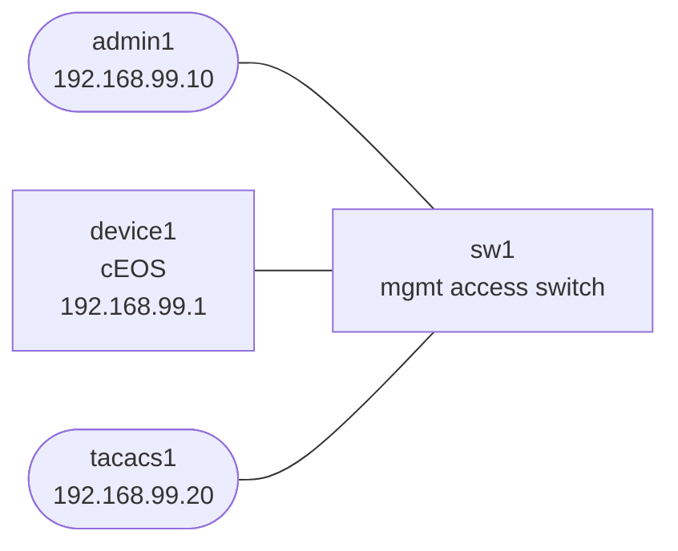

# aaa-ops-troubleshooting

This lab strips AAA down to the operational failure modes that lock people out:

- TACACS reachability
- bad shared secret
- local fallback
- break-glass admin access

## How to use this lab

This is a **practice troubleshooting lab**. Something is broken (or about to
be); your job is to find and fix it from the symptom, not a script. **Form
a hypothesis before each command**, predict what a healthy vs. broken output
looks like, and only then run it. The challenge questions test transfer.

## Topology



## Build and Deploy

```bash
docker build -t ops-lab:local images/ops-lab/
docker build -f labs/enterprise-services-infra/Dockerfile.tacacs -t enterprise-tacacs:local labs/enterprise-services-infra/
docker import cEOS-lab-4.35.2F.tar ceos:4.35.2F
./scripts/lab.sh deploy aaa-ops-troubleshooting
```

## What Is Prebuilt

- management subnet reachability
- `device1` has local user `admin` / `admin`
- `tacacs1` has user `neteng` / `labpass` and shared key `labkey`
- AAA is not configured on `device1` yet

## Tasks

On `device1`:

- configure TACACS server `192.168.99.20` with key `labkey`
- set `aaa authentication login default group tacacs+ local`
- keep the local `admin` account as break-glass access

Suggested config:

```text
configure
tacacs-server host 192.168.99.20 key 0 labkey
aaa authentication login default group tacacs+ local
```

Then test these scenarios from `admin1`:

1. TACACS reachable: `ssh neteng@192.168.99.1`
2. TACACS broken: stop the server or change the key, then verify `ssh admin@192.168.99.1` still works

Useful commands:

```bash
./scripts/lab.sh cmd aaa-ops-troubleshooting tacacs1 -- pkill tac_plus
./scripts/lab.sh cmd aaa-ops-troubleshooting tacacs1 -- tac_plus -G -d 16 -l /dev/stdout -C /etc/tacacs+/tac_plus.conf >/tmp/tac_plus.log 2>&1 &
```

## What This Lab Teaches

- AAA design is incomplete without fallback behavior
- bad TACACS reachability and bad TACACS secrets look similar to the operator
- break-glass local access should be intentional, not accidental

## Challenge questions

No answers provided — reason them through.

1. An admin can't log in via TACACS+. Distinguish the three failure modes —
   server unreachable, server reachable but rejecting, and shared-key
   mismatch — and the one command/log that pins each.
2. Local fallback exists for a reason. Walk through what *should* happen when
   the AAA server is down, and the misconfiguration that locks everyone out
   instead.
3. Authentication, authorization, and accounting are separate. Give a case
   where a user authenticates fine but is denied a command, and where
   everything works but no audit trail is produced.
4. Why is clock sync a hidden dependency of AAA accounting and token-based
   auth? What breaks when device clocks drift?
