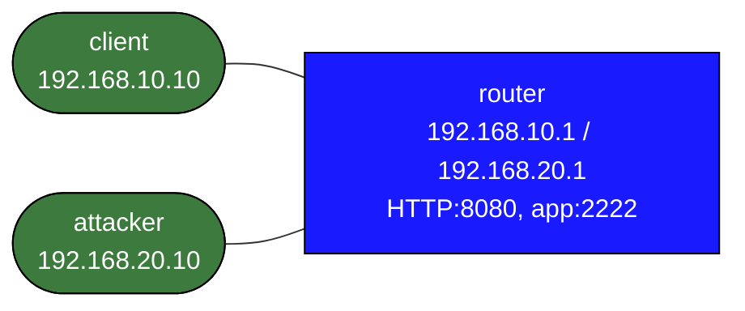

# acl-basics

This lab teaches high-value filtering mechanics on router-local services.
You will build an interface-aware ACL with `iptables-legacy`, apply it in the INPUT path, and verify hit counters.

## Topology



## Build and Deploy

```bash
docker build -t frr-lab:local images/frr/
sudo containerlab deploy -t labs/acl-basics/topology.clab.yml
```

## What Is Prebuilt

- IP addressing and default gateways
- HTTP service on `router:8080`
- a second test service on `router:2222`
- no filtering yet

## Baseline

Before you add policy, both source networks can reach the router services:

```bash
docker exec clab-acl-basics-client ping -c 2 192.168.10.1
docker exec clab-acl-basics-client nc -zvw 2 192.168.10.1 8080
docker exec clab-acl-basics-client nc -zvw 2 192.168.10.1 2222

docker exec clab-acl-basics-attacker ping -c 2 192.168.20.1
docker exec clab-acl-basics-attacker nc -zvw 2 192.168.20.1 8080
```

## Policy Goals

Implement an interface ACL on `router` so that:

- `client` may ping `router`
- `client` may reach TCP port `8080` on `router`
- `client` may not reach TCP port `2222` on `router`
- `attacker` may not reach router services from `eth2`
- counters prove which rule matched

## Suggested ACL

Build the rules on `router` with `iptables-legacy` so you are looking at the real INPUT path:

```bash
docker exec clab-acl-basics-router bash -lc '
iptables-legacy -F INPUT
iptables-legacy -F MGMT-ACL 2>/dev/null || true
iptables-legacy -X MGMT-ACL 2>/dev/null || true
iptables-legacy -N MGMT-ACL
iptables-legacy -A INPUT -i eth1 -j MGMT-ACL
iptables-legacy -A INPUT -i eth2 -j MGMT-ACL
iptables-legacy -A MGMT-ACL -m conntrack --ctstate ESTABLISHED,RELATED -j ACCEPT
iptables-legacy -A MGMT-ACL -i eth1 -p icmp -s 192.168.10.0/24 -j ACCEPT
iptables-legacy -A MGMT-ACL -i eth1 -p tcp -s 192.168.10.0/24 --dport 8080 -j ACCEPT
iptables-legacy -A MGMT-ACL -i eth1 -p tcp -s 192.168.10.0/24 --dport 2222 -j REJECT --reject-with tcp-reset
iptables-legacy -A MGMT-ACL -i eth2 -s 192.168.20.0/24 -j DROP
iptables-legacy -A MGMT-ACL -j DROP
'
```

## Verification

Allowed client traffic:

```bash
docker exec clab-acl-basics-client ping -c 2 192.168.10.1
docker exec clab-acl-basics-client nc -zvw 2 192.168.10.1 8080
```

Denied client traffic:

```bash
docker exec clab-acl-basics-client nc -zvw 2 192.168.10.1 2222
```

Denied attacker traffic:

```bash
docker exec clab-acl-basics-attacker nc -zvw 2 192.168.20.1 8080
```

Check counters and rule order:

```bash
docker exec clab-acl-basics-router iptables-legacy -L INPUT -n -v --line-numbers
docker exec clab-acl-basics-router iptables-legacy -L MGMT-ACL -n -v --line-numbers
```

## What This Lab Teaches

- rule order matters more than intent statements
- source, protocol, port, and interface filtering solve different problems
- counters are part of the ACL workflow, not an afterthought
- interface placement is part of the ACL design, not a syntax detail
