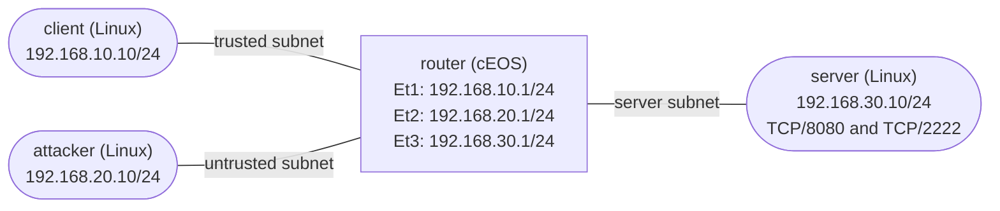

# Extended ACL Transit Filtering — Practice Lab

Build a data-plane extended ACL that classifies traffic crossing a cEOS
router by source, destination, protocol, and destination port. You will prove
first-match decisions with per-entry counters, diagnose a deliberate
wrong-interface attachment, and add a narrow service exception without
weakening the rest of the policy. This is transit filtering; unlike the
`management-access-control` lab, it does not protect services hosted by the
router itself.

## Topology



| Node | Platform | Role | Pre-configured addressing |
|------|----------|------|---------------------------|
| `router` | Arista cEOS 4.35.2F | Learned transit router | Ethernet1 `192.168.10.1/24`; Ethernet2 `192.168.20.1/24`; Ethernet3 `192.168.30.1/24` |
| `client` | `ops-lab:local` Linux | Trusted traffic generator | eth1 `192.168.10.10/24`; default route via `192.168.10.1` |
| `attacker` | `ops-lab:local` Linux | Untrusted traffic generator | eth1 `192.168.20.10/24`; default route via `192.168.20.1` |
| `server` | `ops-lab:local` Linux | Downstream service endpoint | eth1 `192.168.30.10/24`; default route via `192.168.30.1`; TCP/8080 and TCP/2222 listeners |

| Link | Subnet | Purpose |
|------|--------|---------|
| `client:eth1` ↔ `router:Ethernet1` | `192.168.10.0/24` | Trusted source path |
| `attacker:eth1` ↔ `router:Ethernet2` | `192.168.20.0/24` | Untrusted source path |
| `server:eth1` ↔ `router:Ethernet3` | `192.168.30.0/24` | Downstream protected-service path |

## How to use this lab

This is a **practice lab**, not a tutorial. Each task gives you an
**objective** and **hints** — your job is to produce the configuration.

- **Predict before you configure.** When a task asks for a prediction,
  commit to an answer before touching the CLI. Being wrong and finding out
  why is the point.
- **Open the hints before the solution.** The solution toggle is the answer
  key — use it to check your work or when genuinely stuck, not as step one.
- **Verify like an operator.** After each task, prove the state is what you
  think it is with `show` commands before moving on.

## Deploy

This mixed-platform lab requires the licensed cEOS image and the local Linux
tooling image. Complete these one-time prerequisites from the repository root:

```bash
# After downloading the cEOS-lab tarball for your host architecture.
scripts/build-images.sh ceos

# Build the incidental Linux endpoint image.
docker build -t ops-lab:local images/ops-lab/
```

Deploy and confirm all four nodes are running:

```bash
./scripts/lab.sh deploy acl-basics
./scripts/lab.sh status acl-basics
```

The sampled probe footprint was 1.115 GiB for `router`, 604 KiB for
`client`, 620 KiB for `attacker`, and 23.65 MiB for `server`—about 1.14 GiB
in total.

## Pre-configured state

- `router` has hostname `router`, disposable local `admin` / `admin`
  credentials, IP routing, and the three routed interfaces in the tables.
- `client`, `attacker`, and `server` have their listed addressing and default
  routes.
- `server` listens on TCP/8080 and TCP/2222.
- No IPv4 ACL is defined or attached. You will test the baseline paths rather
  than assume that routing and both server processes are healthy.
- No Linux node forwards or filters transit traffic; the learned behavior is
  entirely on cEOS.

Open the cEOS CLI when a task calls for configuration or inspection:

```bash
./scripts/lab.sh cli acl-basics router
```

## Task 1 — Establish every unfiltered path

**Objective:** Verify the server's two listeners, exercise every later policy
flow from both sources, and prove unrelated client-to-attacker transit before
you create an ACL. Record the seven network outcomes.

**Predict first:** With routing enabled and no ACL defined or attached, which
of the six source-to-server probes should fail? Should client-to-attacker
transit behave differently?

This is guided setup. Run these commands from the repository root:

```bash
# Server-local positive controls
./scripts/lab.sh cmd acl-basics server -- nc -zvw 2 127.0.0.1 8080
./scripts/lab.sh cmd acl-basics server -- nc -zvw 2 127.0.0.1 2222

# Trusted source to downstream server
./scripts/lab.sh cmd acl-basics client -- ping -c 2 -W 2 192.168.30.10
./scripts/lab.sh cmd acl-basics client -- nc -zvw 2 192.168.30.10 8080
./scripts/lab.sh cmd acl-basics client -- nc -zvw 2 192.168.30.10 2222

# Untrusted source to downstream server
./scripts/lab.sh cmd acl-basics attacker -- ping -c 2 -W 2 192.168.30.10
./scripts/lab.sh cmd acl-basics attacker -- nc -zvw 2 192.168.30.10 8080
./scripts/lab.sh cmd acl-basics attacker -- nc -zvw 2 192.168.30.10 2222

# Unrelated routed traffic
./scripts/lab.sh cmd acl-basics client -- ping -c 2 -W 2 192.168.20.10
```

<details markdown="1">
<summary>Check your work</summary>

Both local listener controls and all seven network probes succeed. That
resolves the prediction: routing alone does not distinguish the trusted and
untrusted source subnets, protocols, or ports. The local controls also give
you a way to separate a future network-policy failure from a dead service.

</details>

## Task 2 — Design the policy and its direction

**Objective:** Design an ordered extended ACL named `TRANSIT-IN` that gives
the trusted subnet ICMP and TCP/8080 access to the server but denies its
TCP/2222 access; gives the untrusted subnet ICMP access but denies its TCP
access to that server; and preserves every unrelated IP flow. Enforce the
policy at the two source trust boundaries so denied packets are discarded
before they cross the router toward the server-facing link.

**Predict first:** If this source-based ACL is attached inbound only on the
server-facing Ethernet3, will a new client TCP/2222 SYN be evaluated before
the router forwards it to the server?

<details markdown="1">
<summary>Hints</summary>

- EOS evaluates an IPv4 ACL in ascending sequence order and stops at the
  first match. Include an explicit final outcome for traffic outside the
  protected server policy.
- Follow a request packet from each Linux source and identify the interface
  where it enters the router. Direction is relative to the router interface,
  not to the application.
- Use separate source subnet, destination host, protocol, and destination-port
  fields. Plan entries 10 through 60 in increments of ten.

</details>

<details markdown="1">
<summary>Solution</summary>

Use this initial ordered policy:

| Sequence | Match | Action |
|----------|-------|--------|
| 10 | ICMP from `192.168.10.0/24` to host `192.168.30.10` | Permit |
| 20 | TCP from `192.168.10.0/24` to host `192.168.30.10`, destination port 8080 | Permit |
| 30 | TCP from `192.168.10.0/24` to host `192.168.30.10`, destination port 2222 | Deny |
| 40 | ICMP from `192.168.20.0/24` to host `192.168.30.10` | Permit |
| 50 | TCP from `192.168.20.0/24` to host `192.168.30.10` | Deny |
| 60 | All remaining IP traffic | Permit |

Attach the same ACL inbound on Ethernet1 and Ethernet2. Those are the two
interfaces where requests enter with their original client or attacker
source addresses. Do not attach it to Ethernet3.

An outbound ACL on Ethernet3 could reproduce these outcomes for this single
server link, but it would allow denied packets to consume transit capacity
before filtering and would not satisfy this lab's source-boundary containment
criterion.

</details>

<details markdown="1">
<summary>Check your work</summary>

Trace all six source-to-server probes plus the unrelated client-to-attacker
ping through your design. Each server-bound probe reaches exactly one of
sequences 10–50, and unrelated transit reaches sequence 60. A client SYN
enters Ethernet1 and is routed out Ethernet3, so an ACL inbound only on
Ethernet3 never evaluates that request; it sees return packets arriving from
the server instead. That resolves the prediction. Source-facing ingress is
required here by the additional early-drop success criterion; an outbound
Ethernet3 design is functionally possible but outside that declared boundary.

</details>

## Task 3 — Implement and verify the initial ACL

**Objective:** Create the six-entry `TRANSIT-IN` policy with per-entry
counters and attach it in the direction chosen in Task 2. Prove all six
source-to-server outcomes, the active attachment state, and that denied
requests are filtered at the source-facing trust boundary.

**Predict first:** After the ACL becomes active, will an attacker ping and an
attacker TCP/8080 SYN receive the same decision merely because they enter the
same interface?

<details markdown="1">
<summary>Hints</summary>

- Create the named policy under `ip access-list TRANSIT-IN` and enable
  `counters per-entry` in that ACL context.
- Use explicit sequence numbers. EOS extended entries accept source and
  destination forms such as a prefix or `host`, followed by `eq` for the TCP
  destination port.
- Apply the named ACL with `ip access-group` in each source-facing interface
  context. Use `?` completion to confirm direction.

</details>

<details markdown="1">
<summary>Solution</summary>

```text
configure
ip access-list TRANSIT-IN
   counters per-entry
   10 permit icmp 192.168.10.0/24 host 192.168.30.10
   20 permit tcp 192.168.10.0/24 host 192.168.30.10 eq 8080
   30 deny tcp 192.168.10.0/24 host 192.168.30.10 eq 2222
   40 permit icmp 192.168.20.0/24 host 192.168.30.10
   50 deny tcp 192.168.20.0/24 host 192.168.30.10
   60 permit ip any any
interface Ethernet1
   ip access-group TRANSIT-IN in
interface Ethernet2
   ip access-group TRANSIT-IN in
end
```

</details>

Generate the policy traffic and inspect the ACL:

```bash
./scripts/lab.sh cmd acl-basics client -- ping -c 2 -W 2 192.168.30.10
./scripts/lab.sh cmd acl-basics client -- nc -zvw 2 192.168.30.10 8080
./scripts/lab.sh cmd acl-basics client -- nc -zvw 2 192.168.30.10 2222
./scripts/lab.sh cmd acl-basics attacker -- ping -c 2 -W 2 192.168.30.10
./scripts/lab.sh cmd acl-basics attacker -- nc -zvw 2 192.168.30.10 8080
./scripts/lab.sh cmd acl-basics attacker -- nc -zvw 2 192.168.30.10 2222
./scripts/lab.sh cmd acl-basics router -- \
  Cli -p 15 -c "show ip access-lists TRANSIT-IN"
```

The three denied `nc` commands are expected to time out and return non-zero.

<details markdown="1">
<summary>Check your work</summary>

The client ping and TCP/8080 succeed, while client TCP/2222 times out. The
attacker ping succeeds, while both attacker TCP ports time out. Thus packets
on one ingress interface can receive different actions because an extended
ACL also examines protocol and destination port; that resolves the
prediction.

Per-entry evidence renders in this form:

```text
[match N packets, ...]
```

The attachment summary must render exactly:

```text
Configured on Ingress: Et1-2
Active on     Ingress: Et1-2
```

These two lines distinguish a configured reference from an attachment that
EOS has activated in the data plane.

</details>

## Task 4 — Use counters to diagnose wrong placement

**Objective:** First prove every initial first-match decision with before and
after counter snapshots. Then move the working ACL with the supplied fault
helper, diagnose the newly open services from traffic, attachment state, and
counters, and make the smallest complete repair.

**Predict first:** With `TRANSIT-IN` inbound only on Ethernet3, which ACL
sequence will see packets from a successful client TCP/2222 or attacker
TCP/8080 connection: their earlier deny sequences or the unrelated-IP permit?

Capture a before snapshot, regenerate one flow for every initial rule, then
capture the after snapshot:

```bash
./scripts/lab.sh cmd acl-basics router -- \
  Cli -p 15 -c "show ip access-lists TRANSIT-IN"

./scripts/lab.sh cmd acl-basics client -- ping -c 2 -W 2 192.168.30.10
./scripts/lab.sh cmd acl-basics client -- nc -zvw 2 192.168.30.10 8080
./scripts/lab.sh cmd acl-basics client -- nc -zvw 2 192.168.30.10 2222
./scripts/lab.sh cmd acl-basics attacker -- ping -c 2 -W 2 192.168.30.10
./scripts/lab.sh cmd acl-basics attacker -- nc -zvw 2 192.168.30.10 8080
./scripts/lab.sh cmd acl-basics client -- ping -c 2 -W 2 192.168.20.10

./scripts/lab.sh cmd acl-basics router -- \
  Cli -p 15 -c "show ip access-lists TRANSIT-IN"
```

Now inject the placement fault without reading the helper, then reproduce and
inspect the incident:

```bash
./labs/acl-basics/break.sh

./scripts/lab.sh cmd acl-basics client -- nc -zvw 2 192.168.30.10 2222
./scripts/lab.sh cmd acl-basics attacker -- nc -zvw 2 192.168.30.10 8080
./scripts/lab.sh cmd acl-basics router -- \
  Cli -p 15 -c "show ip access-lists TRANSIT-IN"
```

Do not change configuration until you can explain both unexpectedly open
ports and the counter pattern.

<details markdown="1">
<summary>Hints</summary>

- In the healthy snapshots, sequences 10, 20, 30, 40, 50, and 60 should each
  increase for their mapped flow.
- After the fault, compare `Configured on Ingress` with the topology. Follow
  the request and reply as two separate packets and identify which one enters
  the attached interface.

</details>

<details markdown="1">
<summary>Solution</summary>

The helper removed the ACL from inbound Ethernet1 and Ethernet2 and attached
it inbound to Ethernet3. Restore the two source-facing attachments and remove
the server-facing one:

```text
configure
interface Ethernet3
   no ip access-group TRANSIT-IN in
interface Ethernet1
   ip access-group TRANSIT-IN in
interface Ethernet2
   ip access-group TRANSIT-IN in
end
```

</details>

<details markdown="1">
<summary>Check your work</summary>

Before the fault, the six generated flows increase sequences 10, 20, 30, 40,
50, and 60 respectively. After the helper runs, client TCP/2222 and attacker
TCP/8080 both open, the earlier decision counters do not increase for their
requests, and the attachment summary identifies `Et3`. The requests enter
Ethernet1 or Ethernet2 where no ACL is now attached. Only server return
traffic enters Ethernet3; its reversed addresses do not match sequences
10–50, so sequence 60 permits and counts it. That resolves the prediction.

After repair, the client TCP/2222 and attacker TCP/8080 probes time out again,
and the attachment lines once more name only `Et1-2`. The repair moves the
existing policy back to the interfaces where the original source decisions
can be made; no rule change is necessary.

</details>

## Task 5 — Add one narrow service exception

**Objective:** Change the repaired policy so only host `192.168.20.10` gains
TCP/2222 access to server `192.168.30.10`, while attacker TCP/8080 remains
denied. Preserve all other outcomes, exactly seven rules, per-entry counters,
and the two source-facing attachments.

**Predict first:** If the new host-specific TCP/2222 permit is placed after
the existing untrusted-subnet TCP deny, will the exception take effect?

<details markdown="1">
<summary>Hints</summary>

- Add one entry; do not broaden or remove the subnet-wide TCP deny. Choose an
  unused sequence that causes first-match evaluation to reach the exception
  before the broader deny.

</details>

<details markdown="1">
<summary>Solution</summary>

Insert the host exception between the ICMP permit and subnet-wide TCP deny:

```text
configure
ip access-list TRANSIT-IN
   45 permit tcp host 192.168.20.10 host 192.168.30.10 eq 2222
end
```

</details>

Exercise the changed and preserved outcomes, inspect the policy, and run the
complete checker:

```bash
./scripts/lab.sh cmd acl-basics attacker -- nc -zvw 2 192.168.30.10 2222
./scripts/lab.sh cmd acl-basics attacker -- nc -zvw 2 192.168.30.10 8080
./scripts/lab.sh cmd acl-basics router -- \
  Cli -p 15 -c "show ip access-lists TRANSIT-IN"
./scripts/lab.sh check acl-basics
```

<details markdown="1">
<summary>Check your work</summary>

Attacker TCP/2222 now succeeds and increments sequence 45; attacker TCP/8080
still times out and increments sequence 50. A permit placed after sequence 50
would never take effect because the broader source-subnet TCP rule would deny
the packet first; that resolves the prediction.

The checker verifies both listeners locally, every final permit and deny,
unrelated transit, exact counter mode, all seven exact entries, attachment
only on inbound Ethernet1 and Ethernet2, and fresh increases on sequences 10,
20, 30, 40, 45, 50, and 60.

</details>

## Verification

The solved end state must satisfy all of these conditions:

- [ ] `server` locally accepts TCP/8080 and TCP/2222.
- [ ] `client` reaches server ICMP and TCP/8080 but not TCP/2222.
- [ ] `attacker` reaches server ICMP and TCP/2222 but not TCP/8080.
- [ ] Unrelated client-to-attacker routed ICMP remains reachable.
- [ ] `TRANSIT-IN` has `counters per-entry` and exactly sequences 10, 20, 30,
  40, 45, 50, and 60 with the intended first-match order.
- [ ] The ACL is configured and active inbound only on Ethernet1 and
  Ethernet2, never Ethernet3.
- [ ] Denied requests are discarded at source-facing ingress rather than
  traversing the router to an outbound server-link filter.
- [ ] Fresh matching traffic increases every one of the seven entry counters.

Run the end-state checker:

```bash
./scripts/lab.sh check acl-basics
```

## Challenge questions

No answers are provided; reason from the behavior you observed.

1. A second server is added at `192.168.30.20` with the same two ports. Design
   the smallest policy expansion that keeps each server's exceptions
   independently auditable.
2. The untrusted subnet grows from one host to fifty. Decide whether you would
   keep host exceptions in one ACL or split policy boundaries, and identify
   the operational evidence that drives your choice.
3. Return-path routing changes so replies leave through another router.
   Predict which checks in this lab still prove the forward ACL decision and
   which no longer prove end-to-end service availability.
4. The application moves from TCP/2222 to UDP/2222. Redesign both the policy
   and verification evidence so a superficially successful TCP test cannot
   hide a UDP mistake.

## Troubleshooting

| Symptom | Likely cause | Fix |
|---------|--------------|-----|
| Both server TCP ports fail from both sources, including local server probes | The server listeners did not start; this is not an ACL decision | Inspect the server processes and `/tmp/http8080.log` or `/tmp/http2222.log`, then restore the listeners before debugging transit policy |
| Client TCP/2222 and attacker TCP/8080 unexpectedly open; attachment reports `Et3` | The ACL is inbound on the server-facing interface, so requests bypass it and return packets fall through to sequence 60 | Remove the Ethernet3 attachment and restore inbound attachment on Ethernet1 and Ethernet2 |
| An intended deny times out but its counter never increases | Traffic matched an earlier rule, the ACL is on the wrong interface, or the displayed hit is stale | Compare before/after counters, inspect first-match order and active attachment, then regenerate only that flow |
| Attacker TCP/2222 remains denied after adding the host exception | The exception is below the broader sequence-50 TCP deny or its host/destination/port match is wrong | Place the exact host TCP/2222 exception before the subnet-wide TCP deny and inspect its fresh counter |
| Unrelated client-to-attacker traffic fails | The explicit final permit is missing or unreachable, exposing the implicit deny | Restore the final unrelated-IP permit after the specific server decisions and verify sequence 60 with fresh transit traffic |
