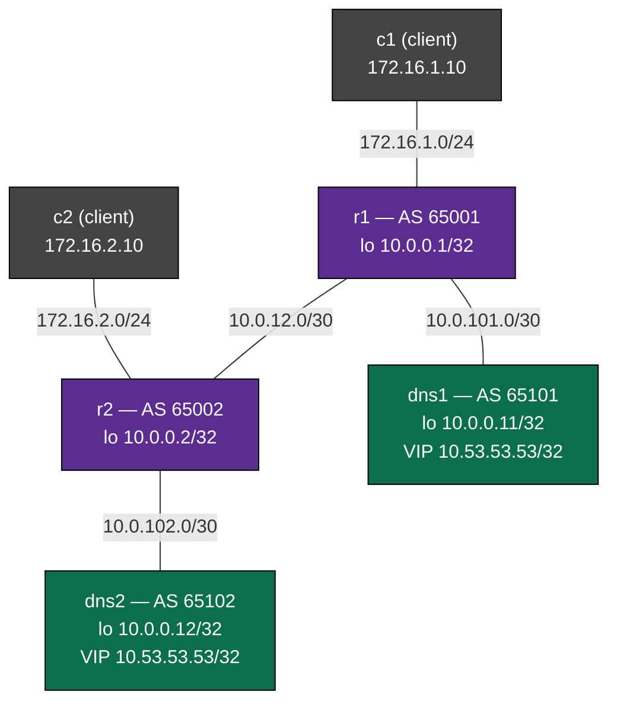

# Anycast DNS — Practice Lab

Run the same service address on two machines at once. Both resolvers hold
**10.53.53.53/32** on their loopback and advertise it into the network with
**FRR running on the server itself** — "routing on the host", the pattern
behind every large resolver farm, root DNS letter, and CDN edge. BGP
best-path delivers each client to its closest instance; a health-check
watchdog deletes the VIP from `lo` the moment the DNS daemon stops
answering, so the route is withdrawn *with* the service and clients fail
over to the surviving instance in about two seconds. You build the eBGP
fabric, the filtered redistribution, and then break the health check to
see why it — not the daemon — is what makes anycast safe.

## Topology



### Link addressing

| Link       | Subnet         | Left side   | Right side   |
|------------|----------------|-------------|--------------|
| r1 — r2    | 10.0.12.0/30   | .1 (r1)     | .2 (r2)      |
| r1 — dns1  | 10.0.101.0/30  | .1 (r1)     | .2 (dns1)    |
| r2 — dns2  | 10.0.102.0/30  | .1 (r2)     | .2 (dns2)    |
| r1 — c1    | 172.16.1.0/24  | .1 (r1)     | .10 (c1)     |
| r2 — c2    | 172.16.2.0/24  | .1 (r2)     | .10 (c2)     |

### Node reference

| Node | Role                              | AS    | Unique address | Anycast VIP       |
|------|-----------------------------------|-------|----------------|-------------------|
| r1   | site-1 router                     | 65001 | 10.0.0.1/32    | —                 |
| r2   | site-2 router                     | 65002 | 10.0.0.2/32    | —                 |
| dns1 | resolver #1 (FRR + dnsmasq)       | 65101 | 10.0.0.11/32   | 10.53.53.53/32    |
| dns2 | resolver #2 (FRR + dnsmasq)       | 65102 | 10.0.0.12/32   | 10.53.53.53/32    |
| c1   | client behind r1                  | —     | 172.16.1.10    | —                 |
| c2   | client behind r2                  | —     | 172.16.2.10    | —                 |

IP addressing is pre-configured everywhere. So are the parts this lab is
*not* about: dnsmasq serves identical records on both resolvers (plus
`whoami.lab.test`, a TXT record naming the instance that answered — your
anycast litmus test), and a watchdog (`configs/dns/healthcheck.sh`) keeps
the VIP on `lo` only while the local dnsmasq answers. The BGP that turns
those two boxes into one service is absent — that's your job.

## How to use this lab

This is a **practice lab**, not a tutorial. Each task gives you an
**objective** and **hints** — your job is to produce the configuration.

- **Predict before you configure.** When a task asks for a prediction,
  commit to an answer before touching the CLI. Being wrong and finding out
  why is the point.
- **Open the hints before the solution.** The solution toggle is the answer
  key — use it to check your work or when genuinely stuck, not as step one.
- **Verify like an operator.** After each task, prove the state is what you
  think it is with `show` commands before moving on.

## Deploy

Build the images once if you haven't:

```bash
docker build -t frr-lab:local images/frr/
docker build -t ops-lab:local images/ops-lab/
docker build -t anycast-dns:local labs/anycast-dns/
```

then:

```bash
sudo containerlab deploy -t labs/anycast-dns/topology.clab.yml
# or: ./scripts/lab.sh deploy anycast-dns
```

Access a node:

```bash
./scripts/lab.sh vtysh anycast-dns dns1    # FRR CLI (works on servers too!)
./scripts/lab.sh bash  anycast-dns dns1    # Linux shell (dig, ip, tcpdump)
```

Destroy when done:

```bash
sudo containerlab destroy -t labs/anycast-dns/topology.clab.yml --cleanup
```

---

## Task 1 — Survey the two-headed service (guided)

**Objective:** confirm the starting state: both resolvers already *are*
the service locally — same VIP on `lo`, dnsmasq answering, watchdog
running — but no client can reach any of it.

On dns1 and dns2 (shell, not vtysh):

```bash
ip -4 addr show dev lo
dig +short @127.0.0.1 TXT whoami.lab.test
cat /var/log/healthcheck.log
```

From c1:

```bash
dig @10.53.53.53 TXT whoami.lab.test
ip route
```

<details>
<summary>Check your work</summary>

Both servers hold **two** extra addresses on `lo`: their unique /32
(10.0.0.11 or .12) from `frr.conf`, and the *same* 10.53.53.53/32 —
installed by the watchdog, whose log shows one `healthy — VIP ...
installed` line. Locally each instance answers with its own name
(`"dns1"` / `"dns2"`). From c1 the same query prints `;; no servers
could be reached` almost immediately: c1's only route is a default to
r1, and r1 has no route to 10.53.53.53 (check `show ip route` on r1 —
nothing but connecteds, plus the containerlab management network:
a `K>` default and `172.20.20.0/24` on eth0 — ignore those throughout),
so r1 answers with an ICMP unreachable. Two machines each believe they
are 10.53.53.53, and the network has no idea either exists. Everything
from here on is routing.

</details>

## Task 2 — Build the eBGP core

**Objective:** an eBGP session between r1 and r2, each originating its
client subnet and its loopback, so that c1 can ping c2
(`ping 172.16.2.10`).

**Predict first:** when the session comes up, how many prefixes will r1
receive from r2? Count before you look.

<details>
<summary>Hints</summary>

- `router bgp 65001` → `neighbor 10.0.12.2 remote-as 65002`, then under
  `address-family ipv4 unicast` originate with `network <prefix>`.
- FRR default: **eBGP without policy accepts and sends nothing.** The
  session establishes but stays at 0 prefixes. `no bgp
  ebgp-requires-policy` is the lab-grade escape hatch — every BGP
  instance in this lab needs it (a route-map on every peer is the
  production answer; here it would drown the lesson).
- `show bgp summary` — a number in State/PfxRcd means Established.

</details>

<details>
<summary>Solution</summary>

On r1:

```text
configure terminal
router bgp 65001
 no bgp ebgp-requires-policy
 neighbor 10.0.12.2 remote-as 65002
 address-family ipv4 unicast
  network 172.16.1.0/24
  network 10.0.0.1/32
 exit-address-family
```

On r2, mirrored:

```text
configure terminal
router bgp 65002
 no bgp ebgp-requires-policy
 neighbor 10.0.12.1 remote-as 65001
 address-family ipv4 unicast
  network 172.16.2.0/24
  network 10.0.0.2/32
 exit-address-family
```

</details>

<details>
<summary>Check your work</summary>

`show bgp summary` on r1 shows `2` under State/PfxRcd for 10.0.12.2 —
that's the prediction: r2 originates exactly its two `network`
statements (172.16.2.0/24 and 10.0.0.2/32). `ping 172.16.2.10` from c1
now works: request routed r1→r2 by BGP, reply back the same way. The
service address is still dark — `network` only advertises what you
name, and nobody has named the VIP yet.

</details>

## Task 3 — Routing on the host: advertise the service from the servers

**Objective:** each resolver eBGP-peers with its router and advertises
**exactly two prefixes**: the VIP and its unique loopback. Nothing else.
Success: r1 receives 10.53.53.53/32 from dns1, r2 receives it from dns2,
and each router also learns the other instance's path over the core.

**Predict first:** the obvious lazy config is `redistribute connected`
with no filter. List what dns1 would advertise then — check
`show ip route connected` on dns1 before answering. Which of those
prefixes would be genuinely dangerous to leak, and why?

<details>
<summary>Hints</summary>

- Same shape as Task 2 on the servers (AS numbers and peer addresses are
  in the node table and in each server's `frr.conf` banner), plus
  `no bgp ebgp-requires-policy` again.
- The VIP is added and removed *by the watchdog at runtime*, so a
  `network` statement pointing at a sometimes-absent route is the wrong
  tool. `redistribute connected` follows whatever is on the interfaces —
  that's the coupling you want. Constrain it:
  `redistribute connected route-map <NAME>`.
- Filter shape: `ip prefix-list <PL> seq 5 permit <prefix>` (one per
  allowed /32) → `route-map <NAME> permit 10` → `match ip address
  prefix-list <PL>`.
- Verify from the router: `show bgp ipv4 unicast neighbors 10.0.101.2
  routes` shows what r1 actually accepted from dns1.

</details>

<details>
<summary>Solution</summary>

On dns1:

```text
configure terminal
ip prefix-list ANYCAST seq 5 permit 10.53.53.53/32
ip prefix-list ANYCAST seq 10 permit 10.0.0.11/32
route-map ADVERTISE permit 10
 match ip address prefix-list ANYCAST
exit
router bgp 65101
 no bgp ebgp-requires-policy
 neighbor 10.0.101.1 remote-as 65001
 address-family ipv4 unicast
  redistribute connected route-map ADVERTISE
 exit-address-family
```

On dns2, mirrored (AS 65102, peer 10.0.102.1 in AS 65002, permit
10.0.0.12/32 instead of .11).

On the routers, add the server as a second neighbor. r1:

```text
configure terminal
router bgp 65001
 neighbor 10.0.101.2 remote-as 65101
```

and r2 the same with `neighbor 10.0.102.2 remote-as 65102`.

</details>

<details>
<summary>Check your work</summary>

`show bgp ipv4 unicast 10.53.53.53/32` on r1 shows **two paths**: one
learned directly from dns1 (`65101`), one via the core (`65002 65102`),
with the direct one marked `best (AS Path)` — shortest AS-path wins, and
that tie-breaker *is* the "closest instance" logic of this whole lab.
`show ip route 10.53.53.53/32` installs `B>*` via 10.0.101.2.

Now resolve the prediction — try the lazy version on dns1 and watch what
r1 receives (`show bgp ipv4 unicast neighbors 10.0.101.2 routes`):

```text
router bgp 65101
 address-family ipv4 unicast
  no redistribute connected
  redistribute connected
```

Four prefixes, including the transit /30 and — the dangerous one —
**172.20.20.0/24, the containerlab management network** (in production:
your Docker/OOB/management segment) now advertised into the routing
domain by a *DNS server*. This is how host-based routing incidents
happen: whatever is connected to the box becomes reachable through it.
Put the filtered version back (again `no redistribute connected` first —
FRR quirk: re-issuing `redistribute connected route-map ...` *modifies*
an existing redistribute line, but the bare form does **not** drop an
existing route-map binding, so remove-then-add is the honest way) and
confirm 172.20.20.0/24 answers `% Network not in table` on r1.

One more thing worth noticing: `show bgp summary` on a server reports
its router-id as **10.53.53.53 — on both servers**. FRR picked the
highest loopback address, which is the VIP, which is shared. Harmless
here (router-ids must only be unique between direct peers), but in a
design where both instances peer to the *same* router it becomes a
tie-breaker oddity — production configs pin `bgp router-id <unique-lo>`.

</details>

## Task 4 — Prove it's anycast

**Objective:** demonstrate, three independent ways, that c1 and c2 are
served by *different machines* on the *same address*: by answer content,
by path, and by the server's own logs.

**Predict first:** `traceroute` from c1 to 10.53.53.53 — how many hops,
and what will the last hop claim to be?

<details>
<summary>Hints</summary>

- Answer content: the `whoami.lab.test` TXT record differs per instance;
  `www.lab.test` doesn't. Query both, from both clients
  (`dig +short @10.53.53.53 ...`).
- Path: `traceroute -n 10.53.53.53` from each client.
- Server's view: dnsmasq logs every query to `/var/log/dnsmasq.log`
  (`log-queries` is on). Query from c1, then check *both* servers' logs.
- Also try `dig +short @10.0.0.11 TXT whoami.lab.test` from **c2** — the
  far client asking instance #1 directly, by its unique address.

</details>

<details>
<summary>Check your work</summary>

From c1 `whoami` returns `"dns1"`, from c2 `"dns2"` — same question,
same server address, different machine. `www.lab.test` returns
192.0.2.80 from both, which is the operational point: identical data,
so nobody cares which instance answers. Traceroute from c1 is **2
hops** — 172.16.1.1 (r1), then 10.53.53.53 — and from c2 also 2 hops
but through 172.16.2.1: "the same host" is two hops from everywhere,
which no unicast address can be. The logs make it concrete: c1's query
appears in dns1's `/var/log/dnsmasq.log` (`query[A] ... from
172.16.1.10`) and dns2's log has no trace of it. And the unique
addresses still work from anywhere — c2 querying 10.0.0.11 crosses the
core and gets `"dns1"`. That's why they exist: the VIP tells you the
*service* is fine somewhere; only the unique address can tell you
whether a *specific instance* is fine. Monitoring targets the unique
addresses, clients target the VIP.

</details>

## Task 5 — Kill an instance, watch the network heal

**Objective:** stop dnsmasq on dns1 and verify, from the routing to the
client, that the service converged onto dns2 — then bring dns1 back.

**Predict first:** how many seconds of DNS outage will c1 see? Reason it
out from the two moving parts: the watchdog polls every 2 s, and an eBGP
withdraw propagates in milliseconds on a directly-connected session.

Inject (on dns1's shell — or `docker exec clab-anycast-dns-dns1 pkill
dnsmasq` from the host):

```bash
pkill dnsmasq
```

<details>
<summary>Hints</summary>

- Watch the mechanism fire, in order: `tail /var/log/healthcheck.log` on
  dns1 → `ip -4 addr show dev lo` (VIP gone) → on r1,
  `show bgp ipv4 unicast 10.53.53.53/32` (one path left) → from c1,
  `dig` and `traceroute` again.
- Recover with `dnsmasq` (it daemonizes itself; config is already at
  /etc/dnsmasq.conf) and watch the same chain run forward.

</details>

<details>
<summary>Check your work</summary>

The healthcheck log gains `UNHEALTHY — VIP 10.53.53.53/32 withdrawn from
lo` within 2 s of the kill; the connected route vanishes, so dns1's
`redistribute connected` un-advertises it — that's route health
injection, the entire trick of this lab, firing in reverse. r1's BGP
entry drops to **one path** (`65002 65102`, now best), c1's `whoami`
answers `"dns2"`, and the same traceroute is now **3 hops**: r1 → r2
(10.0.12.2) → 10.53.53.53. c1 never touched its DNS config; the
*network* moved the service. Measured outage in this lab: **under 2
seconds**, dominated by the watchdog's poll interval — the BGP
withdrawal itself is milliseconds. (Prediction check: 0–2 s of poll
delay + ~0 propagation. If you said "the BGP hold timer, 180 s" — that
timer is for dead *routers*; here the router is fine and the *route*
was withdrawn explicitly. Compare the mpls-ldp break-it, which lives
and dies by exactly that timer.)

After restarting dnsmasq: `healthy — VIP ... installed` in the log
within 2 s, two paths on r1, and c1 is back on `"dns1"`.

</details>

## Task 6 — Break it: the resolver that died with its route still up

**Objective:** diagnose an anycast pathology from its symptom. Inject
the fault on dns1 (from the host, without reading the commands' intent
too closely):

```bash
docker exec clab-anycast-dns-dns1 pkill -f healthcheck.sh
docker exec clab-anycast-dns-dns1 pkill dnsmasq
```

Symptoms: c1's DNS is **dead** — `dig @10.53.53.53` reports
`communications error ... connection refused` — while c2 resolves
happily, and every BGP session in the network is Established. From c2's
side (and dns2's, and r2's) the service is completely healthy. Work out
what's wrong and *where the ICMP refusal is coming from* before opening
the hints; then repair it and re-verify.

<details>
<summary>Hints</summary>

- `connection refused` is a different failure than Task 1's `no servers
  could be reached`. A refusal is ICMP from a machine the packet
  *reached*: something routed c1's query all the way to a host with no
  listener on port 53. Which host still claims the VIP, and what
  should have removed that claim?
- Compare `show bgp ipv4 unicast 10.53.53.53/32` on r1 with what you
  saw in Task 5.

</details>

<details>
<summary>Check your work</summary>

r1 still holds **two** paths and still prefers dns1: the VIP never left
dns1's `lo` (`ip -4 addr show dev lo` still lists it), because the
watchdog — the only thing coupling the route to the service — was dead
before dnsmasq was. So r1 faithfully delivers every site-1 query to a
server whose daemon is gone, and that server's kernel answers with
port-unreachable: a **local blackhole**. Site 2 never notices; anycast
failures are invisible from wherever the surviving instances are, which
is exactly what makes them nasty on-call tickets.

The lesson is the inversion of Task 5: BGP tracks *route* liveness
(is the router up? is the session up?), and every bit of it was green
while the service was down. Anycast is only as safe as whatever couples
service health to route presence. In this lab that's a 20-line shell
loop; in production it's the same idea with more nines (bird +
health-checker, ExaBGP scripts, BFD to the host, or the LB tier of
`load-balancer-basics` doing it at L7).

Repair — restart the service *and* the coupling, on dns1:

```bash
dnsmasq
nohup sh /usr/local/bin/healthcheck.sh >>/var/log/healthcheck.log 2>&1 &
```

then re-verify like an operator: log says `healthy`, r1 has two paths
with the direct one best, c1's `whoami` is `"dns1"` again. Run the full
end-state check from the host: `./labs/anycast-dns/check.sh`.

</details>

---

## Verification

End state, all of which `./labs/anycast-dns/check.sh` asserts (the
failover checks kill and restart dnsmasq on dns1 — the lab self-heals):

- [ ] All six containers running
- [ ] r1 and r2 each hold two Established eBGP sessions
      (`show bgp summary`)
- [ ] 172.20.20.0/24 is **not** in anyone's BGP table (the route-map did
      its job)
- [ ] r1 has two paths to 10.53.53.53/32, direct `65101` best
- [ ] c1's `whoami` is `"dns1"`, c2's is `"dns2"`; `www.lab.test` is
      192.0.2.80 from both
- [ ] c2 can query dns1 directly on 10.0.0.11
- [ ] c1's traceroute to the VIP is 2 hops
- [ ] Killing dnsmasq on dns1 moves c1 to `"dns2"` within seconds;
      restarting it moves c1 back

## Challenge questions

No answers provided — argue them from what you built.

1. This lab's DNS is UDP: every query is a single packet, so a route
   flap mid-"connection" costs nothing. Now make it DNS-over-TCP (or
   HTTPS on the VIP): walk through what happens to an established TCP
   session when BGP shifts the VIP's best path from dns1 to dns2
   mid-stream, and why anycast still works fine for short TCP exchanges
   in practice.
2. Re-home dns2 to r1, so both instances peer with the same router with
   equal-length AS paths. What does r1 do with two equal candidates —
   and what *could* it do if you enabled multipath? For per-flow ECMP,
   which header fields decide the instance a given client hits, and what
   operational property of DNS makes that acceptable?
3. Your monitoring pings 10.53.53.53 every 10 s and it has never once
   failed — yet site-1 users just filed "DNS is down" tickets (Task 6).
   Design the monitoring for this lab properly: what do you probe, on
   which addresses, from where, and what does each combination tell you?
4. The watchdog polls every 2 s with a 1 s timeout. List the failure
   modes it still misses (think: wedged-but-listening daemon, watchdog
   death, a resolver that answers but with garbage) and sketch what
   production route-health-injection adds for each.
5. dns1 needs a 30-minute maintenance window. Using only what's in this
   lab (BGP attributes on the server's advertisement, the watchdog, the
   unique addresses), design a *graceful drain*: no lost queries, proof
   of drain before you touch the box, and a clean return to service.
   Compare that with how `vrrp`-style HA would drain — what does the
   routing-based version give you that a first-hop protocol can't?

## Troubleshooting

| Symptom | Cause | Fix |
|---------|-------|-----|
| BGP session stuck in `Active`/`Connect` | Wrong `remote-as` or neighbor address (each server peers with its *router's* AS, not its own) | Check the AS/peer table; fix `neighbor ... remote-as`; sessions poisoned by an earlier wrong AS recover faster with `clear bgp <peer>` |
| Sessions Established, PfxRcd stays 0 | FRR's eBGP policy default — no policy, no routes | `no bgp ebgp-requires-policy` in every BGP instance (all four nodes) |
| Router receives the VIP but also 172.20.20.0/24 and the /30 | `redistribute connected` unfiltered, or the route-map didn't bind | Verify with `show bgp ipv4 unicast neighbors <server> routes`; remove-then-re-add: `no redistribute connected`, then `redistribute connected route-map ADVERTISE` |
| `dig @10.53.53.53` → `no servers could be reached` (fast) | No route: the VIP isn't in BGP at all (server BGP not up, or route-map denies it) | `show ip route 10.53.53.53/32` on the client's router; work back: route-map → prefix-list → is the VIP on the server's `lo`? |
| `dig @10.53.53.53` → `connection refused` | Route exists but the daemon is dead on the instance the route points at — the Task 6 blackhole (watchdog not running) | On that server: restart `dnsmasq` **and** the watchdog; confirm the log toggles UNHEALTHY/healthy with the daemon |
| VIP never appears on `lo` after deploy | dnsmasq failed to start, so the watchdog correctly refuses to install the VIP | `/var/log/dnsmasq.log` and `dnsmasq --test` on the server |
| c1 works, c2 dead (or vice versa) | Nothing shared is broken — it's the site-local leg: r2↔dns2 session, r2's client subnet advertisement, or c2's default route | `show bgp summary` on the local router, then trace c2→r2→dns2 hop by hop |

## Extensions

- Enable `bgp bestpath as-path multipath-relax` + `maximum-paths` and
  re-home dns2 to r1 (challenge question 2 made real): watch per-flow
  ECMP spread clients across instances, then break one and see who
  notices.
- Add a third resolver at a "remote site" behind both r1 and r2 with a
  longer AS path — a backup-of-last-resort instance that only receives
  queries when both primaries are down.
- Replace the watchdog's kill test with a *quality* test (dig for a
  record and compare the answer), and make it drain the unique /32 too
  when unhealthy — then argue why draining the unique address is
  actually a bad idea (question 3 is a hint).
- Do it in production style: replace the shell watchdog with
  `staticd`-based conditional routes or run the resolver under a
  process supervisor that manages the VIP, and compare failure coverage.
