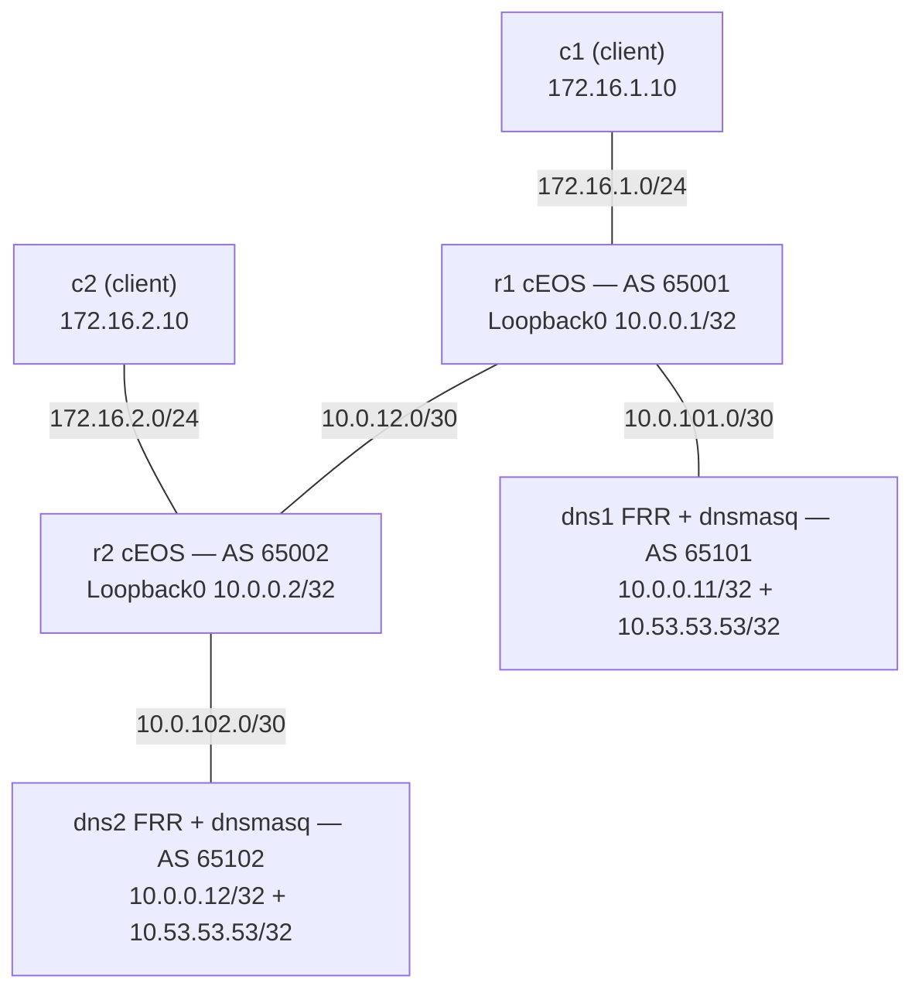

# Anycast DNS — Practice Lab

Build a two-site anycast resolver whose shared service address follows service
health. FRR on each DNS host turns a healthy connected `/32` into a tightly
filtered BGP advertisement; native cEOS routers choose the closest instance
and program the forwarding path. You will then prove why green BGP sessions
are not enough when the service-to-route coupling fails.

## Topology



### Link addressing

| Link | Subnet | Left side | Right side |
|------|--------|-----------|------------|
| r1 — r2 | 10.0.12.0/30 | 10.0.12.1 | 10.0.12.2 |
| r1 — dns1 | 10.0.101.0/30 | 10.0.101.1 | 10.0.101.2 |
| r2 — dns2 | 10.0.102.0/30 | 10.0.102.1 | 10.0.102.2 |
| r1 — c1 | 172.16.1.0/24 | 172.16.1.1 | 172.16.1.10 |
| r2 — c2 | 172.16.2.0/24 | 172.16.2.1 | 172.16.2.10 |

### Node reference

| Node | Platform and role | AS | Unique address | Anycast VIP |
|------|-------------------|----|----------------|-------------|
| r1 | cEOS site-1 router | 65001 | 10.0.0.1/32 | — |
| r2 | cEOS site-2 router | 65002 | 10.0.0.2/32 | — |
| dns1 | FRR routing-on-host resolver | 65101 | 10.0.0.11/32 | 10.53.53.53/32 |
| dns2 | FRR routing-on-host resolver | 65102 | 10.0.0.12/32 | 10.53.53.53/32 |
| c1 | incidental site-1 client | — | 172.16.1.10 | — |
| c2 | incidental site-2 client | — | 172.16.2.10 | — |

Addressing, the r1–r2 eBGP core, client-subnet origination, resolver data, and
an exact resolver return route for `172.16.0.0/16` are scaffolding. The
service-host BGP boundary is intentionally absent. A watchdog holds the VIP
on `lo` only while local DNS answers; the BGP policy that exports that
connected route is yours to build.

## How to use this lab

This is a **practice lab**, not a tutorial. Each task gives you an
**objective** and **hints** — your job is to produce the configuration.

- **Predict before you configure.** When a task asks for a prediction,
  commit to an answer before touching the CLI. Being wrong and finding out
  why is the point.
- **Open the hints before the solution.** The solution toggle is the answer
  key — use it to check your work or when genuinely stuck, not as step one.
- **Verify like an operator.** After each task, prove the state is what you
  think it is with `show` commands before moving on.

## Deploy

Prepare cEOS for your architecture and build the three local images once:

```bash
scripts/build-images.sh ceos
docker build -t frr-lab:local images/frr/
docker build -t ops-lab:local images/ops-lab/
docker build -t anycast-dns:local labs/anycast-dns/
```

Deploy the lab:

```bash
./scripts/lab.sh deploy anycast-dns
```

Use native EOS on the routers and FRR or a shell on the service hosts:

```bash
./scripts/lab.sh cli anycast-dns r1
./scripts/lab.sh vtysh anycast-dns dns1
./scripts/lab.sh bash anycast-dns dns1
```

Clean up safely when finished:

```bash
./scripts/lab.sh destroy anycast-dns
```

## Task 1 — Survey the healthy service and silent host boundary

**Objective:** prove the preconfigured core is healthy and each resolver owns
a working local service, while neither router has a service-host peer or a
route to the VIP.

**Predict first:** will c1 reach c2, the VIP, both, or neither? Explain which
control-plane boundary makes the two results different.

Run these observations before configuring anything:

```bash
docker exec clab-anycast-dns-r1 Cli -p 15 -c enable -c 'show ip bgp summary'
docker exec clab-anycast-dns-r2 Cli -p 15 -c enable -c 'show ip bgp summary'
docker exec clab-anycast-dns-c1 ping -c 3 172.16.2.10
docker exec clab-anycast-dns-dns1 dig +short @127.0.0.1 TXT whoami.lab.test
docker exec clab-anycast-dns-dns2 dig +short @127.0.0.1 TXT whoami.lab.test
docker exec clab-anycast-dns-r1 Cli -p 15 -c enable -c 'show ip route 10.53.53.53/32'
```

<details markdown="1">
<summary>Hints</summary>

- Count peers, not prefixes, in each EOS summary.
- Compare a routed client subnet with the host-facing connected subnet.
- On each DNS host, inspect `ip -4 address show dev lo` and
  `/var/log/healthcheck.log` if the local query is not healthy.

</details>

<details markdown="1">
<summary>Solution</summary>

No configuration is required. Restore a changed baseline with a destroy and
fresh deploy before continuing.

</details>

<details markdown="1">
<summary>Check your work</summary>

Each cEOS router has exactly one Established peer: the other core router.
c1 reaches c2 because the core already originates both client `/24`s. Local
queries answer `"dns1"` and `"dns2"`, and both hosts hold the VIP, but c1
cannot reach it because the resolver hosts advertise nothing yet. A healthy
service and a healthy core are separate facts until the host-routing boundary
couples them.

</details>

## Task 2 — Build the filtered service-host BGP boundary

**Objective:** add one host peer to each cEOS router and one BGP process to
each resolver. Each host must advertise exactly its unique `/32` and the
shared VIP `/32`, with independent filtering at connected redistribution,
host egress, and router ingress.

**Predict first:** unfiltered connected redistribution on dns1 would expose
more than the two intended `/32`s. Inventory its connected routes and decide
which management or transit prefixes must never cross this trust boundary.

<details markdown="1">
<summary>Hints</summary>

- On cEOS, construct an exact-prefix list, match it from a one-sequence
  route-map, attach that route-map inbound to the local DNS neighbor, and
  verify the neighbor AS.
- On each FRR host, pin a unique BGP router ID. Filter `redistribute
  connected`, then apply a second outbound neighbor policy over the same two
  permitted `/32`s. FRR's eBGP policy requirement is satisfied by the
  explicit outbound policy; the host already has a scaffolded client-subnet
  return route.
- Prove the sender, receiver, and installed route separately with `advertised-routes`,
  `received-routes`, and route-table commands.

</details>

<details markdown="1">
<summary>Solution</summary>

On r1:

```text
enable
configure terminal
ip prefix-list DNS1-ONLY seq 10 permit 10.0.0.11/32
ip prefix-list DNS1-ONLY seq 20 permit 10.53.53.53/32
route-map DNS1-IN permit 10
   match ip address prefix-list DNS1-ONLY
router bgp 65001
   neighbor 10.0.101.2 remote-as 65101
   neighbor 10.0.101.2 route-map DNS1-IN in
end
```

On r2:

```text
enable
configure terminal
ip prefix-list DNS2-ONLY seq 10 permit 10.0.0.12/32
ip prefix-list DNS2-ONLY seq 20 permit 10.53.53.53/32
route-map DNS2-IN permit 10
   match ip address prefix-list DNS2-ONLY
router bgp 65002
   neighbor 10.0.102.2 remote-as 65102
   neighbor 10.0.102.2 route-map DNS2-IN in
end
```

On dns1:

```text
configure terminal
ip prefix-list DNS1-EXPORT seq 10 permit 10.0.0.11/32
ip prefix-list DNS1-EXPORT seq 20 permit 10.53.53.53/32
route-map CONNECTED-TO-BGP permit 10
 match ip address prefix-list DNS1-EXPORT
route-map DNS1-OUT permit 10
 match ip address prefix-list DNS1-EXPORT
router bgp 65101
 bgp router-id 10.0.0.11
 neighbor 10.0.101.1 remote-as 65001
 address-family ipv4 unicast
  neighbor 10.0.101.1 route-map DNS1-OUT out
  redistribute connected route-map CONNECTED-TO-BGP
 exit-address-family
end
```

On dns2:

```text
configure terminal
ip prefix-list DNS2-EXPORT seq 10 permit 10.0.0.12/32
ip prefix-list DNS2-EXPORT seq 20 permit 10.53.53.53/32
route-map CONNECTED-TO-BGP permit 10
 match ip address prefix-list DNS2-EXPORT
route-map DNS2-OUT permit 10
 match ip address prefix-list DNS2-EXPORT
router bgp 65102
 bgp router-id 10.0.0.12
 neighbor 10.0.102.1 remote-as 65002
 address-family ipv4 unicast
  neighbor 10.0.102.1 route-map DNS2-OUT out
  redistribute connected route-map CONNECTED-TO-BGP
 exit-address-family
end
```

</details>

<details markdown="1">
<summary>Check your work</summary>

Each cEOS summary now has exactly two Established peers. Each host's
`show bgp ipv4 unicast neighbors <router> advertised-routes` lists exactly
its unique `/32` and `10.53.53.53/32`; neither the management subnet nor the
host transit `/30` appears. The redistribution policy couples route presence
to the watchdog-owned address, while the separate outbound and inbound
policies contain a mistake at either side of the trust boundary.

</details>

## Task 3 — Prove closest-instance forwarding

**Objective:** prove from BGP RIB, FIB, client answers, path, and server logs
that each site selects its local resolver while both unique instance
addresses remain reachable across the core.

**Predict first:** how many BGP paths to the VIP will r1 retain, which path
will be best, and how many hops will c1's traceroute show?

<details markdown="1">
<summary>Hints</summary>

- On both cEOS routers, inspect `show ip bgp 10.53.53.53/32` and
  `show ip route 10.53.53.53/32`.
- Query `whoami.lab.test` and `www.lab.test` through the VIP from both clients.
- Trace from both clients, then query dns1's unique address from c2 and dns2's
  unique address from c1.
- Generate one fresh query, then bound the corresponding dnsmasq log window
  with `tail` rather than treating old entries as current evidence.

</details>

<details markdown="1">
<summary>Solution</summary>

```bash
docker exec clab-anycast-dns-r1 Cli -p 15 -c enable -c 'show ip bgp 10.53.53.53/32'
docker exec clab-anycast-dns-r1 Cli -p 15 -c enable -c 'show ip route 10.53.53.53/32'
docker exec clab-anycast-dns-r2 Cli -p 15 -c enable -c 'show ip bgp 10.53.53.53/32'
docker exec clab-anycast-dns-r2 Cli -p 15 -c enable -c 'show ip route 10.53.53.53/32'
docker exec clab-anycast-dns-c1 dig +short @10.53.53.53 TXT whoami.lab.test
docker exec clab-anycast-dns-c2 dig +short @10.53.53.53 TXT whoami.lab.test
docker exec clab-anycast-dns-c1 dig +short @10.53.53.53 www.lab.test
docker exec clab-anycast-dns-c1 traceroute -n -q 1 -w 1 -m 4 10.53.53.53
docker exec clab-anycast-dns-c2 traceroute -n -q 1 -w 1 -m 4 10.53.53.53
docker exec clab-anycast-dns-c2 dig +short @10.0.0.11 TXT whoami.lab.test
docker exec clab-anycast-dns-c1 dig +short @10.0.0.12 TXT whoami.lab.test
```

</details>

<details markdown="1">
<summary>Check your work</summary>

Both routers retain two VIP paths. The local host path has one AS hop and is
best; the remote path crosses the other site's AS and has two. The FIB points
only to the local host (`10.0.101.2` on r1, `10.0.102.2` on r2). c1 answers
`"dns1"`, c2 answers `"dns2"`, both receive `192.0.2.80` for
`www.lab.test`, and each local trace is two hops. Fresh logs place each query
on the selected local instance. Cross-site unique-address queries prove that
the individual servers remain observable independently of the anycast VIP.

</details>

## Task 4 — Trace normal withdrawal and recovery

**Objective:** stop dnsmasq visibly on dns1, trace the bounded chain from
health log to connected VIP to BGP route to remote client selection, then
restore exactly one daemon and verify local-best recovery.

**Predict first:** which control-plane sessions will fall, if any? Which BGP
path survives, and how will c1's traceroute change?

Stop only the service:

```bash
docker exec clab-anycast-dns-dns1 pkill -x dnsmasq
```

<details markdown="1">
<summary>Hints</summary>

- Bound each observation rather than waiting forever: inspect the health log,
  then `lo`, then r1's VIP RIB, then c1's answer and trace.
- The watchdog polls every two seconds; allow a few seconds for detection and
  withdrawal. The previous implementation was observed at 3.950 seconds for
  failover and 2.007 seconds for recovery, so do not promise a sub-two-second
  result.
- Restore the daemon with the lifecycle helper already present on the host.

</details>

<details markdown="1">
<summary>Solution</summary>

```bash
timeout 10 docker exec clab-anycast-dns-dns1 sh -c \
  'until tail -n 1 /var/log/healthcheck.log | grep -q UNHEALTHY; do sleep 1; done'
docker exec clab-anycast-dns-dns1 ip -4 address show dev lo
docker exec clab-anycast-dns-r1 Cli -p 15 -c enable -c 'show ip bgp 10.53.53.53/32'
docker exec clab-anycast-dns-c1 dig +time=2 +tries=1 +short @10.53.53.53 TXT whoami.lab.test
docker exec clab-anycast-dns-c1 traceroute -n -q 1 -w 1 -m 4 10.53.53.53
docker exec clab-anycast-dns-dns1 sh -c \
  '. /usr/local/bin/service-control.sh; start_dns'
timeout 10 docker exec clab-anycast-dns-dns1 sh -c \
  'until ip -4 address show dev lo | grep -q "10.53.53.53/32"; do sleep 1; done'
```

</details>

<details markdown="1">
<summary>Check your work</summary>

No BGP session drops. The watchdog removes the unhealthy connected VIP, so
filtered redistribution withdraws only that prefix. r1 retains the remote
path through AS65002 and c1 answers from `dns2` over a three-hop path. After
exactly one dnsmasq returns, the watchdog reinstalls the VIP, the direct
one-AS path becomes best again, and c1 returns to `dns1` within a bounded few
seconds. The hold timer is irrelevant: the peer stayed alive and explicitly
withdrew one route.

</details>

## Task 5 — Diagnose a green-control-plane blackhole

**Objective:** diagnose an opaque site-local DNS outage in which every BGP
session and both VIP paths remain green. Identify the failed coupling, repair
it completely, and explain why remote monitoring can miss the incident.

Inject the supported fault twice to prove the injector is idempotent:

```bash
./labs/anycast-dns/break.sh
./labs/anycast-dns/break.sh
```

**Predict first:** if c1 fails while c2 succeeds and r1 still prefers its
local VIP path, which layer is lying about health? What evidence distinguishes
a missing route from delivery to a host with no listener?

<details markdown="1">
<summary>Hints</summary>

- Compare c1 and c2 queries before touching the control plane.
- On r1, inspect peer state, both VIP paths, and the installed next hop.
- On dns1, compare the service listener, local query, VIP presence, and
  route-health process. A refusal means the packet reached a kernel with no
  listener; a timeout or unreachable points elsewhere.
- Do not remove the VIP manually as the final repair. Restore the service and
  the mechanism that owns the route, then prove process uniqueness.

</details>

<details markdown="1">
<summary>Solution</summary>

The service and its route-health owner must both be restored. Run the full
repair twice; it converges to exactly one of each process:

```bash
./labs/anycast-dns/solution.sh
./labs/anycast-dns/solution.sh
./scripts/lab.sh check anycast-dns
```

</details>

<details markdown="1">
<summary>Check your work</summary>

During the fault, dns1 keeps the VIP and its advertisement while local DNS is
dead. r1 therefore retains two BGP paths and correctly prefers the shorter
local one, delivering site-1 queries into a local blackhole. Site 2 remains
healthy, so a remote probe can conceal the outage. After repair, dns1 has
exactly one dnsmasq and one watchdog, local DNS is healthy, r1 still uses its
local next hop, and the checker returns **52 passed, 0 failed**. The supported
fault kept routing green and live validation confirmed exactly **47 passed,
5 failed**, limited to the five narrow service/coupling/client assertions.

</details>

## Verification

Run the deterministic, read-only end-state checker:

```bash
./scripts/lab.sh check anycast-dns
```

The solved target is **52 passed, 0 failed**:

- [ ] Six expected containers run the exact topology image references.
- [ ] Native cEOS and Linux package/runtime identities match the lab pins.
- [ ] Core and service-host peers, ASNs, exact prefix policies, router IDs,
      connected redistribution, and host outbound filters are exact.
- [ ] Each host advertises exactly two intended `/32`s and no management or
      transit prefix.
- [ ] Each cEOS router retains two VIP paths but installs only its local host
      next hop.
- [ ] Both anycast and both unique-address queries return the intended data,
      and bounded traceroutes match the closest-instance path.
- [ ] Each resolver has one DNS daemon, one watchdog, a healthy VIP, and the
      correct local records.

## Challenge questions

No answers are provided. Argue each from the behavior you built.

1. If both resolver instances moved behind one router, which BGP knobs could
   deliberately install both equal paths, and what would per-flow hashing mean
   for UDP and TCP DNS clients?
2. Design probes that distinguish service-wide health, site-local health, and
   one specific resolver's health. Which source locations and destination
   addresses are required?
3. The watchdog gets a syntactically valid but incorrect DNS answer. How would
   you change the health contract without making a transient upstream failure
   flap the route?
4. Design a graceful 30-minute drain of dns1 using routing policy and the
   unique address. What proves traffic has moved before maintenance begins?
5. A third site has a much longer AS path and should be emergency-only. Which
   attributes would express that intent, and where would you enforce them?

## Troubleshooting

| Symptom | Likely cause | Recovery path |
|---------|--------------|---------------|
| Core peer is not Established | Wrong core AS/address or modified startup scaffolding | Compare r1/r2 core neighbors and restore the documented baseline |
| Host peer is Established but advertises zero prefixes | Missing connected redistribution, denied prefix-list, or absent VIP | Inspect host `advertised-routes`, the two route-maps, and `lo` |
| Host advertises a `/30` or management subnet | Redistribution or outbound policy is missing/broader than exact `/32`s | Restore both host-side filters; confirm exactly two advertisements |
| cEOS receives an unexpected prefix | Router inbound allowlist is missing or attached to the wrong neighbor/direction | Restore the exact native prefix-list, route-map, and inbound attachment |
| VIP route is absent everywhere | Local DNS is unhealthy, watchdog is absent, or host BGP cannot export | Trace local query → watchdog log → VIP → host advertised routes |
| c1 fails while c2 works and both VIP paths remain | Site-local service-to-route coupling is stale | Diagnose Task 5, then run `solution.sh` and prove process uniqueness |
| Unique-address query fails but VIP works | Instance route missing or return path broken | Inspect the unique `/32` advertisement, exact `172.16.0.0/16` host return route, and core route |

The final destroy command is always:

```bash
./scripts/lab.sh destroy anycast-dns
```
