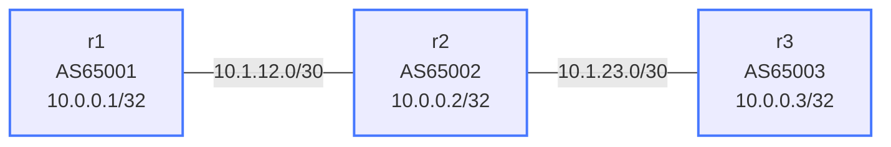

# Lab: bfd-bgp

## Purpose

Learn BFD (Bidirectional Forwarding Detection) integrated with BGP. Understand how BFD
enables near-instant BGP session teardown on link failure, replacing the slow 90-second
hold timer mechanism.

## How to use this lab

This is a **practice lab**, not a tutorial. Steps give you an objective and
hide config behind solution toggles. The heart of this lab is a *measured*
before/after: time BGP convergence without BFD, then with it, and feel the
difference rather than trusting the numbers.

- **Predict before you measure**, **open the solution to check or when
  stuck.**

## Topology



| Link              | Subnet        | Addresses       | BGP Session          |
|-------------------|---------------|-----------------|----------------------|
| r1:eth1 - r2:eth1 | 10.1.12.0/30  | r1:.1  r2:.2    | eBGP 65001 <-> 65002 |
| r2:eth2 - r3:eth1 | 10.1.23.0/30  | r2:.1  r3:.2    | eBGP 65002 <-> 65003 |

| Node | Loopback    | AS    |
|------|-------------|-------|
| r1   | 10.0.0.1/32 | 65001 |
| r2   | 10.0.0.2/32 | 65002 |
| r3   | 10.0.0.3/32 | 65003 |

## Deploy / Destroy

```bash
./scripts/lab.sh deploy bfd-bgp
./scripts/lab.sh destroy bfd-bgp
```

## What You Configure

### Step 1: Configure BGP on all nodes (without BFD first)

<details markdown="1">
<summary>Show configuration</summary>

Example for r1:

```
Cli
configure terminal

router bgp 65001
 bgp router-id 10.0.0.1
 no bgp ebgp-requires-policy
 neighbor 10.1.12.2 remote-as 65002
 neighbor 10.1.12.2 description r2
 address-family ipv4 unicast
  network 10.0.0.1/32
 exit-address-family

end
write memory
```

For r2 (two neighbors):

```
router bgp 65002
 bgp router-id 10.0.0.2
 no bgp ebgp-requires-policy
 neighbor 10.1.12.1 remote-as 65001
 neighbor 10.1.12.1 description r1
 neighbor 10.1.23.2 remote-as 65003
 neighbor 10.1.23.2 description r3
 address-family ipv4 unicast
  network 10.0.0.2/32
 exit-address-family
```

For r3:

```
router bgp 65003
 bgp router-id 10.0.0.3
 no bgp ebgp-requires-policy
 neighbor 10.1.23.1 remote-as 65002
 neighbor 10.1.23.1 description r2
 address-family ipv4 unicast
  network 10.0.0.3/32
 exit-address-family
```

Verify BGP sessions are Established:

```
show bgp ipv4 unicast summary
```

</details>

### Step 2: Time BGP convergence WITHOUT BFD

**Predict first:** the link drops but the TCP session to the peer isn't
actively probed. What keeps the BGP session "Established" long after the
link is dead, and roughly how many seconds of black-holed traffic does
that default timer cost you? Commit to a number before you measure.

<details markdown="1">
<summary>Show configuration</summary>

Open a watch window on r1:

```bash
watch -n0.5 './scripts/lab.sh cmd bfd-bgp r1 -- Cli -c "show bgp ipv4 unicast summary"'
```

Kill the link between r1 and r2:

```bash
./scripts/lab.sh cmd bfd-bgp r2 -- ip link set eth1 down
```

Observe: BGP session stays in Established state until the hold timer expires (90 seconds).
Record how long it takes.

Restore the link:

```bash
./scripts/lab.sh cmd bfd-bgp r2 -- ip link set eth1 up
```

</details>

### Step 3: Enable BFD per BGP neighbor

<details markdown="1">
<summary>Show configuration</summary>

```
Cli
configure terminal

router bgp 65001
 neighbor 10.1.12.2 bfd

end
write memory
```

Do this on all routers for all neighbors. On r2:

```
router bgp 65002
 neighbor 10.1.12.1 bfd
 neighbor 10.1.23.2 bfd
```

</details>

### Step 4: Verify BFD sessions

```
show bfd peers
show bfd peers detail
show bgp ipv4 unicast summary
```

Each BGP neighbor should have a corresponding BFD session in UP state.

### Step 5: Time BGP convergence WITH BFD

<details markdown="1">
<summary>Show configuration</summary>

Repeat the link-down test. BGP session should tear down in under 1 second.

```bash
# Watch BGP summary
watch -n0.5 './scripts/lab.sh cmd bfd-bgp r1 -- Cli -c "show bgp ipv4 unicast summary"'

# Kill the link
./scripts/lab.sh cmd bfd-bgp r2 -- ip link set eth1 down
```

</details>

## Verification Commands

```
# BFD
show bfd peers                        # all sessions, state, interface
show bfd peers detail                 # full timer and counter detail
show bfd peer 10.1.12.2               # specific peer

# BGP
show bgp ipv4 unicast summary         # session state, prefixes
show bgp ipv4 unicast neighbors 10.1.12.2   # neighbor detail including BFD
show ip route bgp                     # BGP-installed routes
```

## Concepts

### BGP Hold Timer vs BFD

**Without BFD:**

```
BGP keepalive: every 30 seconds (default: holdtime/3)
BGP hold timer: 90 seconds (default)

Failure detection: up to 90 seconds after last keepalive
  (three missed keepalives, but hold timer starts from last received)
```

**With BFD:**

```
BFD default timers: 300ms tx/rx, multiplier 3
Failure detection: 3 × 300ms = 900ms

Traffic blackhole window: <1 second vs up to 90 seconds
```

### BFD in BGP — How It Works

1. BGP session comes up between two neighbors
2. BGP informs BFD: "please monitor 10.1.12.2 for me"
3. BFD establishes a separate control-plane session with 10.1.12.2
4. BFD sends/receives lightweight packets at the negotiated interval
5. If BFD detects failure (N consecutive packets lost):

   - BFD notifies BGP immediately
   - BGP tears down the session without waiting for hold timer
   - BGP withdraws routes from the failed session
   - Routing reconverges

### BFD Per-Neighbor Configuration

BFD in BGP is configured per-neighbor (not per-interface):

<details markdown="1">
<summary>Show configuration</summary>

```
router bgp 65001
 neighbor 10.1.12.2 bfd                           # enable BFD
 neighbor 10.1.12.2 bfd check-control-plane-failure  # optional: also check CP
```

</details>

You can also set custom timers per-neighbor:

<details markdown="1">
<summary>Show configuration</summary>

```
router bgp 65001
 neighbor 10.1.12.2 bfd profile FAST_BFD

bfd
 profile FAST_BFD
  transmit-interval 100
  receive-interval 100
  detect-multiplier 3
```

</details>

### BFD vs BGP Hold Timer — When Each Applies

| Scenario | BFD Detects? | Hold Timer Applies? |
|----------|--------------|---------------------|
| Physical link failure | Yes — immediately | No (BFD wins) |
| Software crash on remote router | Maybe — if BFD process dies too | Yes |
| Remote BFD daemon crash | No — BFD session drops, hold timer takes over | Yes |
| BGP process crash (keepalives stop) | No — BFD still UP | Yes |

BFD detects **forwarding plane** failures. Hold timer detects **control plane** failures.
They are complementary, not mutually exclusive.

### cEOS Note: no bgp ebgp-requires-policy

cEOS 8.x requires explicit policy (route-maps) on eBGP sessions by default.
Adding `no bgp ebgp-requires-policy` disables this requirement for the lab,
allowing routes to be accepted and advertised without explicit route-maps.

## Challenge questions

No answers provided — reason them through. (1, 3, and 5 are the required
hands-on measurement / break-it; the rest are reasoning.)

1. Time convergence precisely (use `date` either side of the link drop)
   with BFD on. Compare to the Step 2 number and explain the ratio.
2. BFD on a *directly connected* eBGP link is straightforward; over a
   *multihop* eBGP session (loopback-peered, several hops away) it's
   trickier. Explain what multihop BFD has to verify that single-hop
   doesn't, and why it's more failure-prone.
3. Configure BFD on r1 but **not** r2 for the same session. Does BFD come
   up? Check `show bfd peers` on both and explain what BFD negotiation
   requires of *both* ends.
4. BFD tears the session down fast — but fast teardown means fast *churn*
   if the link flaps. Contrast aggressive BFD with BGP graceful restart
   (see the graceful-restart lab): when do you want the session to drop
   instantly vs. survive a brief control-plane blip?
5. `docker pause clab-bfd-bgp-r2` freezes the router (busy/wedged but link
   up). Predict whether BFD or the hold timer fires first, then test —
   and explain what this says about what BFD actually detects.
