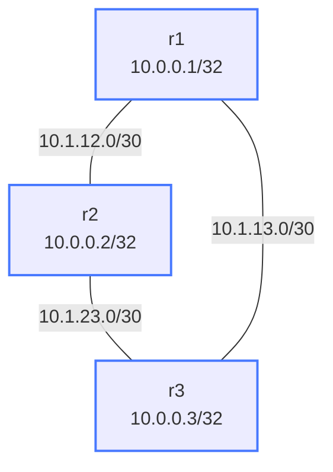
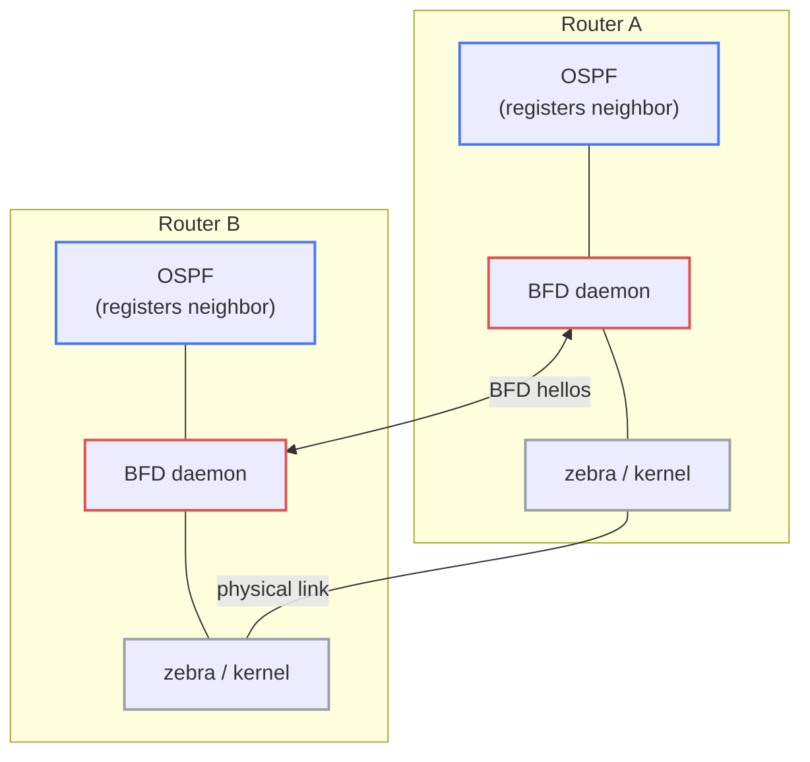

# Lab: bfd-ospf

## Purpose
Learn BFD (Bidirectional Forwarding Detection) integrated with OSPF. See how BFD enables
sub-second failure detection — dramatically faster than OSPF's default 40-second dead timer.

## How to use this lab

This is a **practice lab**, not a tutorial. Steps give you an objective and
hide config behind solution toggles.

- **Predict before you configure**, **open the solution to check or when
  stuck**, and — most importantly here — **measure**: this lab is about
  *timing* the difference BFD makes, so do the before/after convergence
  test yourself rather than taking the numbers on faith.

## Topology



| Link              | Subnet        | Addresses       |
|-------------------|---------------|-----------------|
| r1:Ethernet1 - r2:Ethernet1 | 10.1.12.0/30  | r1:.1  r2:.2    |
| r2:Ethernet2 - r3:Ethernet1 | 10.1.23.0/30  | r2:.1  r3:.2    |
| r1:Ethernet2 - r3:Ethernet2 | 10.1.13.0/30  | r1:.1  r3:.2    |

| Node | Loopback    |
|------|-------------|
| r1   | 10.0.0.1/32 |
| r2   | 10.0.0.2/32 |
| r3   | 10.0.0.3/32 |

All routers in OSPF area 0.

## Deploy / Destroy

```bash
./scripts/lab.sh deploy bfd-ospf
./scripts/lab.sh destroy bfd-ospf
```

## What You Configure

### Step 1: Configure OSPF on all nodes

<details markdown="1">
<summary>Show configuration</summary>

Example for r1:

```
Cli
configure terminal

interface Loopback0
 ip ospf area 0

interface Ethernet1
 ip ospf area 0

interface Ethernet2
 ip ospf area 0

router ospf
 router-id 10.0.0.1

end
write memory
```

Repeat for r2 (router-id 10.0.0.2) and r3 (router-id 10.0.0.3).

Verify OSPF neighbors are up before enabling BFD:

```
show ip ospf neighbor
```

</details>

### Step 2: Enable BFD on OSPF interfaces

<details markdown="1">
<summary>Show configuration</summary>

Add BFD to each interface on each router:

```
Cli
configure terminal

interface Ethernet1
 ip ospf bfd

interface Ethernet2
 ip ospf bfd

end
write memory
```

</details>

### Step 3 (Optional): Tune BFD timers

<details markdown="1">
<summary>Show configuration</summary>

Default BFD timers are 300ms tx/rx with multiplier 3 (failure = 900ms).
You can tune them:

```
interface Ethernet1
 ip ospf bfd detect-multiplier 3
 ip ospf bfd min-rx 300
 ip ospf bfd min-tx 300
```

Faster (more aggressive, more CPU):

```
interface Ethernet1
 ip ospf bfd detect-multiplier 3
 ip ospf bfd min-rx 100
 ip ospf bfd min-tx 100
```

</details>

### Step 4: Verify BFD sessions

```
show bfd peers
show bfd peers detail
show ip ospf neighbor
```

You should see BFD sessions in UP state for each OSPF neighbor.

### Step 5: Break it — measure convergence with and without BFD

**Predict first:** with BFD enabled (default 300ms × 3), how long after a
link failure will OSPF declare the neighbor down? And *without* BFD, what
timer governs it — and roughly how many seconds of black-holed traffic
does that mean? Commit to both numbers, then measure.

<details markdown="1">
<summary>Show configuration</summary>

Open two terminal windows. In one, watch OSPF:

```bash
./scripts/lab.sh cmd bfd-ospf r1 -- Cli -c "show ip ospf neighbor"
# Run repeatedly with watch:
watch -n0.5 './scripts/lab.sh cmd bfd-ospf r1 -- Cli -c "show ip ospf neighbor"'
```

In the other, bring down a link:

```bash
./scripts/lab.sh cmd bfd-ospf r2 -- ip link set eth1 down
```

With BFD enabled, OSPF should reconverge in under 1 second.
Without BFD, OSPF would wait 40 seconds (dead interval) before declaring the neighbor down.

Bring the link back up:

```bash
./scripts/lab.sh cmd bfd-ospf r2 -- ip link set eth1 up
```

</details>

## Verification Commands

```
# BFD
show bfd peers                    # all BFD sessions and state
show bfd peers detail             # timers, counters, interface
show bfd peer 10.1.12.1           # specific peer

# OSPF
show ip ospf neighbor             # OSPF neighbors + BFD state
show ip ospf neighbor detail      # full neighbor state
show ip route ospf                # OSPF-learned routes
show ip ospf interface Ethernet1  # interface-level OSPF state
```

## Concepts

### Why BFD?

OSPF's failure detection relies on Hello/Dead timers:
- Hello interval: 10 seconds (default)
- Dead interval: 40 seconds (default, = 4 × hello)

That means a link failure won't be detected for up to **40 seconds**, during which
traffic is blackholed.

BFD solves this:
- BFD sends lightweight hello packets at very short intervals (as low as 50ms)
- BFD failure detection: `detect-multiplier × min-rx` = 3 × 300ms = **900ms** by default
- With aggressive timers (3 × 100ms): failure detection in **300ms**

### BFD Architecture



BFD is independent of OSPF — it operates at the forwarding plane level. When BFD
declares a peer down, it notifies all registered protocols (OSPF, BGP, IS-IS) immediately.

### BFD Modes

**Asynchronous mode** (default): Both sides send BFD control packets periodically.
Failure detected when N consecutive packets are missed.

**Demand mode**: Packets only sent when explicitly requested. Less common.

**Echo mode**: Packets are looped back by the remote side without processing.
Useful for testing the forwarding path specifically.

### BFD Parameters

| Parameter | Description | Default |
|-----------|-------------|---------|
| min-tx | Minimum transmit interval (ms) | 300ms |
| min-rx | Minimum receive interval (ms) | 300ms |
| detect-multiplier | Failure threshold (multiples of min-rx) | 3 |

Failure detection time = `detect-multiplier × max(local min-rx, remote min-tx)`

### show bfd peers Output Explained

```
BFD Peers:
    peer 10.1.12.2 local-address 10.1.12.1 vrf default interface Ethernet1
        ID: 1234567890
        Remote ID: 987654321
        Active mode
        Status: up                  <-- session is healthy
        Uptime: 5 minute(s), 3 second(s)
        Diagnostics: ok
        Remote diagnostics: ok
        Peer Type: dynamic
        RTT min/avg/max: 0/0/0 usec
        Local timers:
                Detect-multiplier: 3
                Receive interval: 300ms    <-- our negotiated rx interval
                Transmission interval: 300ms
                Echo receive interval: 50ms
                Echo transmission interval: disabled
        Remote timers:
                Detect-multiplier: 3
                Receive interval: 300ms
                Transmission interval: 300ms
                Echo receive interval: 50ms
```

## Challenge questions

No answers provided — reason them through. (1 and 2 are the required
hands-on measurement; the rest are reasoning + observation.)

1. Time OSPF's *native* failure detection: remove BFD, `watch` the neighbor
   table, drop a link, record the seconds. Then re-enable BFD and repeat.
   Quantify the black-hole window you eliminated.
2. Set aggressive timers (50ms × 3) and watch session stability while the
   host is busy. Explain *why* over-aggressive BFD causes false positives
   in a virtualized/loaded environment, and the production rule of thumb
   that prevents flapping.
3. BFD detects failure and notifies OSPF — but BFD is protocol-independent.
   If this router also ran BGP and IS-IS over the same link, what happens
   to all three when BFD declares the peer down, and why is that single
   shared detector better than three separate dead timers?
4. A link's *physical* layer stays up (transceiver lit) but the path beyond
   a media converter is dead. Does OSPF's dead timer catch it? Does BFD?
   Explain what BFD actually tests that hello timers don't.
5. Would BFD form a session on a loopback? Reason from what BFD verifies
   (a forwarding path between two endpoints) to the answer.
