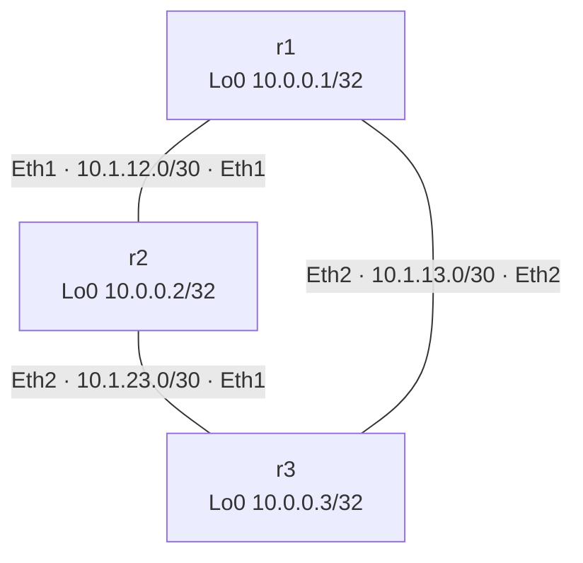

# BFD with OSPF — Practice Lab

Build a three-router OSPF triangle, bind asynchronous single-hop BFD to every
adjacency, inspect both protocols on the wire, and measure how quickly routing
reacts to silent packet loss while carrier remains up. The final diagnosis
shows why an Up session is not enough: negotiated timers are part of the
service contract.

**Lab type:** Build

**Platform:** three native Arista cEOS 4.35.2F routers

**Estimated time:** 60–90 minutes

## Topology


```mermaid
flowchart TB
    r1["r1<br/>Lo0 10.0.0.1/32"]
    r2["r2<br/>Lo0 10.0.0.2/32"]
    r3["r3<br/>Lo0 10.0.0.3/32"]

    r1 ---|"Eth1 · 10.1.12.0/30 · Eth1"| r2
    r2 ---|"Eth2 · 10.1.23.0/30 · Eth1"| r3
    r1 ---|"Eth2 · 10.1.13.0/30 · Eth2"| r3
```

| Node | Loopback0 | Ethernet1 | Ethernet2 |
|------|-----------|-----------|-----------|
| r1 | 10.0.0.1/32 | 10.1.12.1/30 to r2 | 10.1.13.1/30 to r3 |
| r2 | 10.0.0.2/32 | 10.1.12.2/30 to r1 | 10.1.23.1/30 to r3 |
| r3 | 10.0.0.3/32 | 10.1.23.2/30 to r2 | 10.1.13.2/30 to r1 |

The startup files provide hostnames, IP routing, addresses, and operational
interfaces. You build all OSPF and BFD state.

## How to use this lab

This is a **practice lab**, not a tutorial. Each task gives you an
**objective** and **hints** — your job is to produce the configuration.

- **Predict before you configure.** When a task asks for a prediction,
  commit to an answer before touching the CLI. Being wrong and finding out
  why is the point.
- **Open the hints before the solution.** The solution toggle is the answer
  key — use it to check your work or when genuinely stuck, not as step one.
- **Verify like an operator.** After each task, prove the state is what you
  think it is with `show` commands before moving on.

## Deploy

Import the native image once if it is not already present:

```bash
docker import cEOS-lab-4.35.2F.tar ceos:4.35.2F
```

Then deploy the answer-free topology:

```bash
./scripts/lab.sh deploy bfd-ospf
./scripts/lab.sh status bfd-ospf
```

Open a router CLI with, for example:

```bash
./scripts/lab.sh cmd bfd-ospf r1 -- Cli
```

## Task 1 — Build the routed OSPF triangle

**Objective:** Form process 1 adjacencies on all three data links in area
0.0.0.0. Set each loopback as the router ID, advertise it, and make each
Ethernet adjacency explicitly point-to-point. Every router must have exactly
two Full neighbors.

**Predict first:** Once all three links are equal-cost point-to-point links,
how many next hops should r1 install for the remote 10.1.23.0/30 link?

<details markdown="1">
<summary>Hints</summary>

- OSPF attachment is an interface-level `ip ospf ...` command on EOS.
- The network type is also selected under each Ethernet interface.
- Create the numbered process under `router ospf`, then give it the matching
  loopback address as its router ID.
- Inspect `show ip ospf neighbor` and `show ip route ospf` on all three nodes.

</details>

<details markdown="1">
<summary>Solution</summary>

```text
! r1
enable
configure
interface Loopback0
   ip ospf area 0.0.0.0
interface Ethernet1
   ip ospf area 0.0.0.0
   ip ospf network point-to-point
interface Ethernet2
   ip ospf area 0.0.0.0
   ip ospf network point-to-point
router ospf 1
   router-id 10.0.0.1
end
copy running-config startup-config

! r2
enable
configure
interface Loopback0
   ip ospf area 0.0.0.0
interface Ethernet1
   ip ospf area 0.0.0.0
   ip ospf network point-to-point
interface Ethernet2
   ip ospf area 0.0.0.0
   ip ospf network point-to-point
router ospf 1
   router-id 10.0.0.2
end
copy running-config startup-config

! r3
enable
configure
interface Loopback0
   ip ospf area 0.0.0.0
interface Ethernet1
   ip ospf area 0.0.0.0
   ip ospf network point-to-point
interface Ethernet2
   ip ospf area 0.0.0.0
   ip ospf network point-to-point
router ospf 1
   router-id 10.0.0.3
end
copy running-config startup-config
```

</details>

<details markdown="1">
<summary>Check your work</summary>

`show ip ospf neighbor` lists exactly two Full neighbors per router, both on
point-to-point interfaces. `show ip route ospf` on r1 has direct OSPF paths to
the r2 and r3 loopbacks and two equal-cost next hops for 10.1.23.0/30. The
equivalent opposite-side link is ECMP on r2 and r3.

</details>

## Task 2 — Integrate BFD and verify negotiated timers

**Objective:** Configure 300 ms transmit and receive intervals with multiplier
3 on both Ethernet links of every router, then register OSPF process 1 with
BFD. Prove six directed peer views are Up and registered to OSPF.

**Predict first:** Does configuring a local 300 ms receive interval prove that
the operational detection time is 900 ms, or must you inspect the negotiated
peer detail?

<details markdown="1">
<summary>Hints</summary>

- On this EOS release, timer configuration is an interface-level `bfd`
  command. OSPF registration is a process-level `bfd` command.
- Treat configuration and operational negotiation as separate evidence.
- Compare `show bfd peers` with `show bfd peers detail` on every router.

</details>

<details markdown="1">
<summary>Solution</summary>

```text
! Apply on r1, r2, and r3
enable
configure
interface Ethernet1
   bfd interval 300 min-rx 300 multiplier 3
interface Ethernet2
   bfd interval 300 min-rx 300 multiplier 3
router ospf 1
   bfd default
end
copy running-config startup-config
```

Or apply the complete transactional answer key from the repository root:

```bash
labs/bfd-ospf/solution.sh
```

</details>

<details markdown="1">
<summary>Check your work</summary>

Each `show bfd peers` table contains exactly the two directly connected peers
in Up state. Every corresponding detail reports 300 ms TxInt, 300 ms RxInt,
multiplier 3, detection time 900 ms, and `ospf` as a registered protocol.
All OSPF neighbors remain Full and all six directed loopback pings succeed.

</details>

## Task 3 — Make both control protocols visible

**Objective:** Capture a finite sample on the r1–r2 link and distinguish BFD
control packets from OSPF hellos. Prove traffic from both link addresses is
present for each protocol.

**Predict first:** Which IP protocol or UDP destination identifies each
control plane, and why should packet counts not be interpreted as an exact
long-term cadence?

<details markdown="1">
<summary>Hints</summary>

- Capture on r1's Linux-facing `eth1`, not an EOS interface name.
- BFD single-hop control uses UDP destination 3784; OSPFv2 is IP protocol 89.
- Bound both packet count and wall-clock duration, and clean up the capture
  process if interrupted.

</details>

<details markdown="1">
<summary>Solution</summary>

```bash
labs/bfd-ospf/capture.sh
```

For a manual comparison, use two finite `tcpdump` processes with filters
`udp port 3784` and `ip proto 89` on `clab-bfd-ospf-r1` interface `eth1`.

</details>

<details markdown="1">
<summary>Check your work</summary>

The helper requires eight decoded BFD controls with both 10.1.12.1 and
10.1.12.2 as sources, plus two OSPFv2 hellos with both sources. The configured
and negotiated BFD interval is 300 ms; OSPF reports the default Hello10 value.
Small finite captures prove protocol presence and direction, not a perfectly
fixed emission schedule.

</details>

## Task 4 — Measure silent-loss convergence with and without BFD

**Objective:** Compare two otherwise identical packet-loss trials. Keep
r2 Ethernet1 carrier up/up, silently drop packets arriving on that interface,
and measure when r1 reroutes 10.0.0.2/32 through r3—first with ordinary OSPF
detection and then with BFD registration.

**Predict first:** Which trial should finish first, and why would administratively
shutting the link fail to isolate BFD's contribution?

<details markdown="1">
<summary>Hints</summary>

- A link shutdown gives OSPF an immediate carrier event and bypasses the
  packet-liveness question.
- The safe helper owns one precisely tagged INPUT rule, protects all running
  and startup configurations, and restores exact healthy state on failure or
  interruption.
- This comparison takes roughly a minute because the OSPF-only trial waits on
  the default Hello10/Dead40 behavior.

</details>

<details markdown="1">
<summary>Solution</summary>

```bash
labs/bfd-ospf/measure.sh
```

The helper temporarily removes `bfd default` from OSPF process 1 on all three
routers for the first trial, inserts only this tagged Linux rule on r2, waits
for r1 to select r3, removes the rule, restores BFD registration, and repeats:

```text
iptables -I INPUT 1 -i eth1 -m comment \
  --comment bfd-ospf-silent-loss -j DROP
```

</details>

<details markdown="1">
<summary>Check your work</summary>

The helper accepts 30–55 seconds for the OSPF-only trial and less than five
seconds for BFD, broad enough for virtual scheduling rather than a benchmark
promise. It also asserts r2 Ethernet1 remains up/up, r1 selects the alternate
next hop through r3, the owned rule disappears, and the exact saved and
running healthy state returns.

</details>

## Task 5 — Diagnose an Up-but-slow BFD session

**Objective:** Diagnose a prebuilt fault where every OSPF neighbor and BFD peer
is Up and all loopback pings succeed, yet silent-loss detection on r1–r2 is
much slower than the service target. Repair only the faulty declaration.

Arm the scenario:

```bash
labs/bfd-ospf/break.sh
```

**Predict first:** If session state and reachability are green, which BFD
detail fields can still explain a missed convergence objective?

<details markdown="1">
<summary>Hints</summary>

- Compare running and startup configuration on all six data interfaces.
- Compare both directed detail views of the r1–r2 session with a known-good
  r2–r3 or r1–r3 session.
- Focus on negotiated intervals, multiplier, and detection time before changing
  protocol membership or OSPF timers.

</details>

<details markdown="1">
<summary>Solution</summary>

The only fault is r2 Ethernet1's slow local BFD interval. Restore the canonical
interface timer and save it:

```text
enable
configure
interface Ethernet1
   bfd interval 300 min-rx 300 multiplier 3
end
copy running-config startup-config
```

The repository's focused transactional repair performs the same change:

```bash
labs/bfd-ospf/repair.sh
```

</details>

<details markdown="1">
<summary>Check your work</summary>

Before repair, only r2 Ethernet1 is configured 3000/3000/3; both directed
r1–r2 details negotiate 3000 ms TxInt and RxInt with a 9000 ms detection time.
After repair, those details return to 300/300/3 and 900 ms while neighbor,
route, and reachability state remains healthy.

</details>

## Verification

Run the exact, read-only grader:

```bash
labs/bfd-ospf/check.sh
```

It checks the exact three-node/image/release contract, both configuration
planes, interfaces, neighbor and peer tuples, negotiated BFD detail, OSPF
routes and ECMP next hops, and all six directed sourced-loopback pings. A
canonical lab passes every assertion with no failures.

Useful operator views are:

```text
show ip ospf neighbor
show ip ospf interface Ethernet1
show ip route ospf
show bfd peers
show bfd peers detail
```

## Scope and limitations

This lab validates asynchronous, directly connected, single-hop BFD registered
to OSPF. It does not validate BFD echo mode, demand mode, multihop BFD, hardware
offload, or production control-plane scale. A virtual-lab timing result proves
the mechanism and relative behavior, not a platform forwarding SLA.

## Challenge questions

1. How would you choose timers when the path crosses a congestible transport
   whose delay occasionally exceeds the nominal round-trip time?
2. Which monitoring fields would distinguish a down BFD session from an Up
   session whose negotiated detection time violates policy?
3. If one physical interface carries many routing adjacencies, how would you
   evaluate the control-plane cost and blast radius of aggressive timers?
4. What additional evidence would you require before translating this
   virtual single-hop result into a production convergence objective?

## Troubleshooting

| Symptom | Likely cause | Focused response |
|---------|--------------|------------------|
| No OSPF neighbor | Missing area attachment, mismatched network type, or interface not up | Compare interface state and `show ip ospf interface` on both ends |
| OSPF Full but no BFD peer | OSPF is not registered with BFD | Inspect process configuration and `Registered protocols` |
| BFD Up but detection is slow | One side advertises a larger interval | Compare both peer details and the two interface timer declarations |
| One loopback route is absent | Loopback is not attached to area 0.0.0.0 or router ID/config drift exists | Compare exact running and startup scope on that router |
| Measurement refuses to start | State is not canonical or the owned rule already exists | Run the checker, inspect the tagged rule, then redeploy if ownership is uncertain |

## Security and reproducibility

- The measurement helper never drops management traffic or forwards through a
  new namespace; its exact rule is limited to r2 INPUT on data interface eth1.
- Capture and measurement helpers use hard time bounds, process/rule ownership,
  mode-700 temporary state, and signal cleanup.
- Configuration-changing helpers snapshot running and startup planes before
  mutation, verify rollback before deletion, and retain snapshots when restore
  verification fails.
- The solution accepts only answer-free, canonical, or intended fault states;
  fault and repair helpers reject unrelated drift.

## Cleanup

Destroy and recreate the topology to return to the answer-free baseline:

```bash
./scripts/lab.sh destroy bfd-ospf
./scripts/lab.sh deploy bfd-ospf
```

Use the supported lifecycle rather than restarting individual cEOS containers;
Containerlab owns their injected data links and startup lifecycle.
