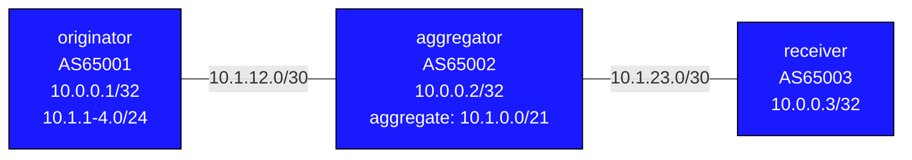

# BGP Aggregation — Practice Lab

The global BGP table is past 900,000 prefixes; aggregation is the only
reason it isn't far worse. In this lab an originator announces four
customer /24s, an aggregator collapses them into one /21, and a receiver
shows you exactly what the rest of the world would see — as you work
through plain aggregation, `summary-only` suppression, the `as-set`
question, automatic withdrawal, and selective suppression.

## Topology



Originator uses separate Loopback interfaces: Loopback0 (10.0.0.1/32) for
management, Loopback1–4 for the four customer /24 prefixes.

### Link Addresses

| Link                          | Left side      | Right side     |
|-------------------------------|----------------|----------------|
| originator:eth1–aggregator:eth1 | 10.1.12.1/30 | 10.1.12.2/30   |
| aggregator:eth2–receiver:eth1 | 10.1.23.1/30   | 10.1.23.2/30   |

## How to use this lab

This is a **practice lab**, not a tutorial. Each task gives you an
**objective** and **hints** — your job is to produce the configuration.

- **Predict before you configure.** Most tasks ask what the receiver
  will see — answer prefix-by-prefix before checking.
- **Open the hints before the solution.** The solution toggle is the
  answer key — use it to check your work, not as step one.
- **Verify like an operator.** The receiver's table is your ground truth
  after every change.

## Deploy and Destroy

```bash
sudo containerlab deploy -t topology.clab.yml
sudo containerlab destroy -t topology.clab.yml
```

```bash
docker exec -it clab-bgp-aggregation-originator Cli   # aggregator, receiver
```

---

## Background

`aggregate-address` rules worth knowing before you start:

1. The aggregate activates only while **at least one** component
   more-specific is in the BGP table — and withdraws automatically when
   the last one goes.
2. By default the aggregate and the specifics are **both** advertised;
   `summary-only` suppresses the components.
3. The aggregate is **locally originated** by the aggregating AS — path
   detail of the contributors is lost unless `as-set` is used.

| Option          | Effect                                                               |
|-----------------|----------------------------------------------------------------------|
| (none)          | Advertise aggregate AND all component specifics                      |
| `summary-only`  | Suppress component specifics; advertise only the summary             |
| `as-set`        | Include contributor AS-paths as an AS_SET segment                    |
| `summary-only match-map` | Suppress only routes matching the map (EOS's suppress-map)  |
| `route-map`     | Set attributes on the aggregate itself                               |

---

## Task 1 — Base BGP with four customer prefixes

**Objective:** eBGP along the chain; each router advertises its
management loopback, and originator additionally advertises
10.1.1.0/24 … 10.1.4.0/24. Success: receiver sees seven prefixes.

<details>
<summary>Hints</summary>

- The /24s exist as Loopback1–4 on originator — they just need
  `network` statements under `address-family ipv4`.

</details>

<details>
<summary>Check your work</summary>

```text
receiver# show bgp ipv4 unicast
 * 10.0.0.1/32    AS-path: 65002 65001
 * 10.0.0.2/32    AS-path: 65002
 * 10.0.0.3/32    local
 * 10.1.1.0/24    AS-path: 65002 65001
 * 10.1.2.0/24    AS-path: 65002 65001
 * 10.1.3.0/24    AS-path: 65002 65001
 * 10.1.4.0/24    AS-path: 65002 65001
```

Four separate customer routes crossing every AS boundary — the state of
the world before aggregation, and your "before" snapshot.

</details>

---

## Task 2 — Plain aggregate

**Objective:** On aggregator, generate 10.1.0.0/21 covering the four
/24s, with no other options.

**Predict first:** after this, how many 10.1.x prefixes does the
receiver have — 1, 4, or 5? And what AS-path will the /21 carry?

<details>
<summary>Hints</summary>

- `aggregate-address 10.1.0.0/21` under `address-family ipv4` on the
  aggregator.
- Inspect the aggregate's detail on receiver:
  `show bgp ipv4 unicast 10.1.0.0/21`.

</details>

<details>
<summary>Solution</summary>

On **aggregator**:
```text
router bgp 65002
   address-family ipv4
      aggregate-address 10.1.0.0/21
```

</details>

<details>
<summary>Check your work</summary>

Receiver has **5**: the new /21 *plus* all four /24s — default
aggregation adds, it doesn't replace. The /21's AS-path is just `65002`:
the aggregator *originated* it, and the contributors' `65001` history is
gone from that route. Two consequences to sit with: (a) no table savings
yet, and (b) path information was destroyed — which is what `as-set`
(Task 4) and the `atomic-aggregate` attribute are about.

</details>

---

## Task 3 — `summary-only`

**Objective:** Suppress the components so the receiver gets *only* the
/21.

**Predict first:** after `summary-only`, do the four /24s still exist in
the **aggregator's** own BGP table? If yes, in what state?

<details>
<summary>Solution</summary>

On **aggregator**:
```text
router bgp 65002
   address-family ipv4
      aggregate-address 10.1.0.0/21 summary-only
```

`clear bgp * soft-outbound` if needed.

</details>

<details>
<summary>Check your work</summary>

Receiver: only 10.1.0.0/21 remains of the customer space. On the
aggregator itself the /24s are still present, flagged `s` (suppressed):

```text
 s> 10.1.1.0/24    (suppressed)
 s> 10.1.2.0/24    (suppressed)
```

Suppression is an *advertisement* filter, not a table operation — the
aggregator still routes on exact /24 information internally while
showing the world one prefix. That asymmetry (detail inside, summary
outside) is the entire design pattern of ISP aggregation.

</details>

---

## Task 4 — `as-set` and what cEOS does with it

**Objective:** Add `as-set` to the aggregate, then compare what RFC 4271
says *should* happen with what this platform actually does.

**Predict first (from the RFC, before looking):** with `as-set`, what
should appear in the aggregate's AS-path on receiver, and which
attribute should *disappear* compared to Task 2's plain aggregate?

<details>
<summary>Solution</summary>

On **aggregator**:
```text
router bgp 65002
   address-family ipv4
      aggregate-address 10.1.0.0/21 summary-only as-set
```

</details>

<details>
<summary>Check your work</summary>

RFC answer: an AS_SET segment — `{65001}` in braces — in the path, and
no `atomic-aggregate` attribute (path info is no longer "lost").
**cEOS 4.35.2F reality:** the option is accepted silently and changes
nothing on the wire — both variants emit `AS_SEQUENCE 65002 65001` and
no atomic-aggregate. A known limitation.

Two durable lessons: (1) the *purpose* of as-set is loop prevention —
a summary whose AS_SET contains your own ASN gets rejected by normal
loop detection; (2) "the CLI accepted my command" is not "the feature
works" — verify on the wire/receiver, especially in containerized
images, which often implement a subset of the real platform.

</details>

---

## Task 5 — Withdrawal semantics

**Objective:** With `summary-only` active, establish exactly when the
aggregate lives and dies, by withdrawing components on the originator.

**Predict first:** remove only 10.1.4.0/24 — does the receiver's /21
survive? Then remove all four — what happens, and roughly how fast?

<details>
<summary>Hints</summary>

- `no network 10.1.4.0/24` under originator's address-family; then
  repeat for the rest.
- Watch the aggregator's table between steps.
- Restore all four `network` statements when done.

</details>

<details>
<summary>Check your work</summary>

One component gone: the /21 **stays** — any single surviving component
keeps it alive, and the receiver notices nothing. All components gone:
the aggregator withdraws the /21 automatically within seconds.

Both edges of this behavior matter operationally. The good edge:
stability — one flapping customer /24 never disturbs the world's view
of the /21. The bad edge: black-holing — while 10.1.4.0/24 was down,
the receiver *still* routed 10.1.4.x traffic toward the aggregator
(covered by the /21), where it died. Summaries always trade visibility
of partial failure for stability — same trade you may have seen with
OSPF `area range` and its Null0 route.

</details>

---

## Task 6 — Selective suppression

**Objective:** Advertise the aggregate, suppress 10.1.4.0/24 only, and
let the other three /24s through — the "precision routing for some,
summary for the rest" pattern.

<details>
<summary>Hints</summary>

- EOS has no standalone `suppress-map`; it's
  `aggregate-address ... summary-only match-map <route-map>` — routes
  **matching** the map are suppressed, the rest pass.
- One prefix-list (just 10.1.4.0/24), one route-map stanza.

</details>

<details>
<summary>Solution</summary>

On **aggregator**:
```text
ip prefix-list SUPPRESS-4 seq 5 permit 10.1.4.0/24
route-map SUPPRESS-MAP permit 10
   match ip address prefix-list SUPPRESS-4
!
router bgp 65002
   address-family ipv4
      aggregate-address 10.1.0.0/21 summary-only match-map SUPPRESS-MAP
```

</details>

<details>
<summary>Check your work</summary>

Receiver: 10.1.0.0/21 + 10.1.1.0/24 + 10.1.2.0/24 + 10.1.3.0/24;
10.1.4.0/24 absent. Why would anyone want this shape? Longest-prefix
match: traffic to the three advertised /24s follows their specific
routes (which could later be steered independently), while everything
else in the /21 — including suppressed 10.1.4.x — follows the
aggregate. Specifics are scalpel, aggregate is safety net.

</details>

---

## Useful Show Commands

```text
show bgp ipv4 unicast                             # Full BGP table
show bgp ipv4 unicast 10.1.0.0/21                 # Aggregate detail
show bgp ipv4 unicast 10.1.1.0/24                 # Component detail ('s' flag)
show bgp neighbors 10.1.23.2 advertised-routes    # What aggregator sends downstream
show bgp ipv4 unicast summary                     # Session status
```

---

## Challenge questions

No answers provided — reason them through.

1. An attacker (or fat-fingered peer) announces 10.1.1.0/25 and
   10.1.1.128/25 from elsewhere on the internet. Your aggregator dutifully
   announces 10.1.0.0/21 `summary-only`. Who gets the traffic for
   10.1.1.50, and why is this the mechanism behind most BGP hijacks?
   What does this imply about "we're safe, we aggregate"?
2. In Task 5 the receiver black-holed 10.1.4.x traffic at the aggregator
   while that component was down. Propose two different mechanisms that
   would surface or mitigate this (think: monitoring the components vs.
   conditional advertisement), and the cost of each.
3. The aggregate originates with AS-path `65002`, hiding 65001. Construct
   a concrete loop scenario this could cause if 65001 also had a second
   path to the receiver — and explain how a true RFC-compliant `as-set`
   implementation would have prevented it.
4. Your /21 covers four customers. One demands their /24 be reachable via
   a different upstream than the rest. Using only what this lab taught
   (suppression options + longest-prefix match), design the
   advertisements — and state what you've now given up versus pure
   `summary-only`.

---

## Troubleshooting

**Aggregate does not appear**
- It requires at least one more-specific in the BGP table — check the
  /24s are present on the aggregator

**Specifics still showing after summary-only**
- Verify with `show running-config | grep aggregate`
- `clear bgp * soft-outbound` to force re-advertisement

**as-set not showing in AS-path**
- On cEOS 4.35.2F it never will — the option is a silent no-op (see
  Task 4). On RFC-compliant platforms it appears as `{65001}` in braces.

**Aggregate not withdrawn after removing all components**
- Propagation can take a few seconds; force with
  `clear bgp * soft-outbound` on the aggregator
