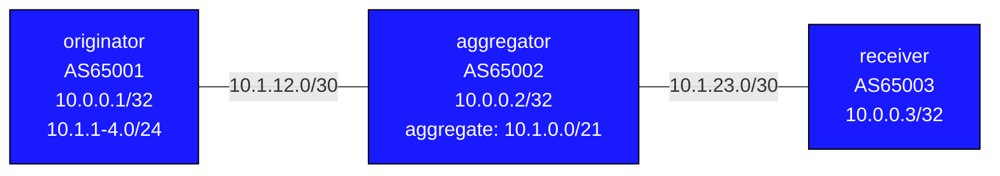

# Lab: BGP Aggregation

## Overview

BGP aggregation creates summary routes from a group of more-specific prefixes.
In a large network, a single ISP might have thousands of /24 customer routes.
Rather than advertising all of them to peers, they aggregate to a /20 or /16 —
reducing global routing table size and hiding internal topology.

This lab has three nodes: an originator with four /24 customer prefixes, an
aggregator that summarizes them, and a receiver that observes the result.

## Topology



Originator uses separate Loopback interfaces: Loopback0 (10.0.0.1/32) for
management, Loopback1–4 for the four customer /24 prefixes.

### Link Addresses

| Link                          | Left side      | Right side     |
|-------------------------------|----------------|----------------|
| originator:eth1–aggregator:eth1 | 10.1.12.1/30 | 10.1.12.2/30   |
| aggregator:eth2–receiver:eth1 | 10.1.23.1/30   | 10.1.23.2/30   |

## Deploy and Destroy

```bash
sudo containerlab deploy -t topology.clab.yml
sudo containerlab destroy -t topology.clab.yml
```

## Access Nodes

```bash
docker exec -it clab-bgp-aggregation-originator Cli
docker exec -it clab-bgp-aggregation-aggregator Cli
docker exec -it clab-bgp-aggregation-receiver Cli
```

---

## Background: BGP Aggregation

### Why Aggregate?

The global BGP routing table has over 900,000 prefixes. Every router that
participates in global BGP must store and process all of them. Aggregation:

- Reduces the number of prefixes sent to downstream peers
- Hides internal topology (peers don't need to know your individual customer /24s)
- Speeds up convergence (fewer routes to process on withdrawals)
- Helps with route stability (one customer's flapping /24 doesn't affect the /22)

### How aggregate-address Works

`aggregate-address` in EOS BGP creates a summary prefix. Key rules:

1. **At least one more-specific must be in the BGP table** for the aggregate to
   be active. Remove all components and the aggregate withdraws automatically.
2. **The aggregate and the specifics are independent advertisements** (by default).
   Without `summary-only`, both travel to neighbors.
3. **The aggregate originates in the aggregating AS** — its AS-path starts fresh
   unless you use `as-set`.

### aggregate-address Options

| Option          | Effect                                                               |
|-----------------|----------------------------------------------------------------------|
| (none)          | Advertise aggregate AND all component specifics                      |
| `summary-only`  | Suppress component specifics; advertise only the summary             |
| `as-set`        | Include AS-paths of all contributors in the aggregate AS-path (as set notation) |
| `summary-only match-map` | Only suppress routes matching the route-map; let others through (EOS syntax) |
| `route-map`     | Apply a route-map to the aggregate itself (set attributes)           |
| `origin`        | Set the origin attribute on the aggregate (igp/egp/incomplete)       |

### atomic-aggregate vs as-set

**RFC 4271 behavior** (standards-compliant implementations):
- Without `as-set`: the aggregate has an **empty AS-path** and carries the
  `atomic-aggregate` attribute — signalling "some path info was lost here."
- With `as-set`: contributor AS-paths are included as an **AS_SET segment**
  (`{65001}` notation). The `atomic-aggregate` attribute is NOT set.

**cEOS 4.35.2F behavior**: `as-set` is accepted but has no effect. Both
variants produce identical output — `AS_SEQUENCE 65002 65001` with no
`atomic-aggregate` attribute. This is a known limitation of cEOS.

Production practice:
- Most operators use `summary-only` without `as-set`
- Loop prevention still works because the receiving AS will reject a summary
  whose as-set contains its own ASN (standard BGP loop detection)

### suppress-map

When you want fine-grained control: aggregate some components but still
advertise others specifically:

<details>
<summary>Show configuration</summary>

```
! Suppress only 10.1.4.0/24, let the other three through
ip prefix-list SUPPRESS-ONE seq 5 permit 10.1.4.0/24
route-map SELECTIVE permit 10
   match ip address prefix-list SUPPRESS-ONE
aggregate-address 10.1.0.0/21 summary-only match-map SELECTIVE
```
</details>

EOS does not have a standalone `suppress-map` option. Instead, combine
`summary-only` with `match-map`: routes that MATCH the map are suppressed;
routes that do NOT match pass through normally.

Result: receiver sees the aggregate AND 10.1.1.0/24, 10.1.2.0/24, 10.1.3.0/24,
but NOT 10.1.4.0/24.

---

## Tasks

### Task 1 — Base BGP

Configure BGP on all three nodes.

Originator must advertise four component prefixes:
<details>
<summary>Show configuration</summary>

```
network 10.1.1.0/24
network 10.1.2.0/24
network 10.1.3.0/24
network 10.1.4.0/24
```
</details>

Verify on receiver — seven prefixes visible (three loopbacks + four /24s):
```
receiver# show bgp ipv4 unicast
 * 10.0.0.1/32    AS-path: 65002 65001
 * 10.0.0.2/32    AS-path: 65002
 * 10.0.0.3/32    local
 * 10.1.1.0/24    AS-path: 65002 65001
 * 10.1.2.0/24    AS-path: 65002 65001
 * 10.1.3.0/24    AS-path: 65002 65001
 * 10.1.4.0/24    AS-path: 65002 65001
```

### Task 2 — Basic aggregate (no summary-only)

<details>
<summary>Show configuration</summary>

On aggregator, add the aggregate-address:
```
aggregator(config)# router bgp 65002
aggregator(config-router-bgp)# address-family ipv4
aggregator(config-router-bgp-af)# aggregate-address 10.1.0.0/21
```
</details>

Verify on receiver:
- `10.1.0.0/21` is NOW present (the aggregate)
- The four `/24s` are still present (specifics not suppressed)
- Detail: `show bgp ipv4 unicast 10.1.0.0/21` — look for `Atomic Aggregate`

The AS-path for 10.1.0.0/21 is empty (AS65002 claims it as locally originated).

### Task 3 — summary-only: suppress component routes

Change the aggregate on aggregator:
```
aggregate-address 10.1.0.0/21 summary-only
```

On aggregator, check the BGP table:
```
aggregator# show bgp ipv4 unicast
```
The four /24s are still in aggregator's table but marked with `s` (suppressed):
```
 s> 10.1.1.0/24    (suppressed)
 s> 10.1.2.0/24    (suppressed)
```

On receiver:
- `10.1.0.0/21` is present
- The four `/24s` are ABSENT (suppressed, never sent)

### Task 4 — as-set: preserve contributor AS-paths

Change to:
```
aggregate-address 10.1.0.0/21 summary-only as-set
```

On receiver, detail view:
```
receiver# show bgp ipv4 unicast 10.1.0.0/21
```

**EOS 4.35.2F limitation:** cEOS does not implement `as-set` per RFC 4271. In
standard BGP, `as-set` should produce an `AS_SET` segment type (`{65001}` in
curly braces) and suppress the `atomic-aggregate` attribute; without `as-set`,
the aggregate should have an empty AS-path and carry `atomic-aggregate`. In
cEOS, both variants produce the same result: `AS_SEQUENCE 65002 65001` with
no `atomic-aggregate`. The option is accepted silently but has no effect on
the wire format.

The concept: in a real implementation, `as-set` preserves path information in
the aggregate so downstream routers can still detect routing loops through
any of the originating ASes.

### Task 5 — Test aggregate behavior when a component is withdrawn

With `aggregate-address 10.1.0.0/21 summary-only` active:

<details>
<summary>Show configuration</summary>

On originator, remove one component:
```
originator(config)# router bgp 65001
originator(config-router-bgp)# address-family ipv4
originator(config-router-bgp-af)# no network 10.1.4.0/24
```
</details>

Question: Does 10.1.0.0/21 stay on receiver?
Answer: YES. The aggregate remains as long as ANY one component is in the table.

Now remove all four on originator. After a moment:
- Aggregator's BGP table loses all /24s
- The aggregate 10.1.0.0/21 is withdrawn automatically
- Receiver loses 10.1.0.0/21

Restore the network statements on originator to bring it back.

### Task 6 — suppress-map: selectively suppress

Instead of suppressing everything, suppress only 10.1.4.0/24:
<details>
<summary>Show configuration</summary>

```
aggregator(config)# ip prefix-list SUPPRESS-4 seq 5 permit 10.1.4.0/24
aggregator(config)# route-map SUPPRESS-MAP permit 10
aggregator(config-route-map-SUPPRESS-MAP)# match ip address prefix-list SUPPRESS-4
aggregator(config)# router bgp 65002
aggregator(config-router-bgp)# address-family ipv4
aggregator(config-router-bgp-af)# aggregate-address 10.1.0.0/21 summary-only match-map SUPPRESS-MAP
```
</details>

On receiver:
- `10.1.0.0/21` is present (aggregate)
- `10.1.1.0/24`, `10.1.2.0/24`, `10.1.3.0/24` are still advertised
- `10.1.4.0/24` is suppressed

This gives you fine-grained control: advertise some specifics for precision
routing while using the aggregate for the rest.

---

## Useful Show Commands

```
show bgp ipv4 unicast                         # Full BGP table
show bgp ipv4 unicast 10.1.0.0/21            # Aggregate detail
show bgp ipv4 unicast 10.1.1.0/24            # Component detail (look for 's' flag)
show bgp neighbors 10.1.12.1 advertised-routes   # What aggregator sends to originator
show bgp neighbors 10.1.23.2 advertised-routes   # What aggregator sends to receiver
show bgp ipv4 unicast summary                 # Session status
```

## Troubleshooting

**Aggregate does not appear**
- The aggregate requires at least one more-specific to be in the BGP table
- Verify: `show bgp ipv4 unicast` on aggregator — are the /24s present?
- The aggregate is only generated IF a matching more-specific exists

**Specifics still showing after summary-only**
- Verify `summary-only` is in the config: `show running-config | grep aggregate`
- Run `clear bgp * soft-outbound` to force re-advertisement with new policy

**as-set not showing in AS-path**
- Verify `as-set` is in the config
- Check: `show bgp ipv4 unicast 10.1.0.0/21` on receiver
- The AS-set appears as `{65001}` — curly braces, not angle brackets

**Aggregate not withdrawn after removing all components**
- BGP withdrawal can take a few seconds to propagate
- Force it: `clear bgp * soft-outbound` on aggregator
