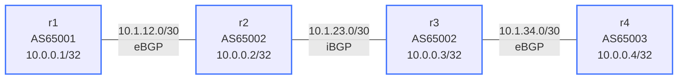

# BGP Basics — Practice Lab

Build a four-router BGP network spanning three autonomous systems. IP
addressing is pre-configured. You implement all BGP sessions, advertise
prefixes, and run head-first into the classic iBGP next-hop problem —
then fix it like an operator would.

---

## Topology



### Link addressing

| Link    | Subnet       | Left       | Right      | Type |
|---------|--------------|------------|------------|------|
| r1 — r2 | 10.1.12.0/30 | 10.1.12.1  | 10.1.12.2  | eBGP |
| r2 — r3 | 10.1.23.0/30 | 10.1.23.1  | 10.1.23.2  | iBGP |
| r3 — r4 | 10.1.34.0/30 | 10.1.34.1  | 10.1.34.2  | eBGP |

### Node reference

| Node | Loopback    | ASN   | Role                     |
|------|-------------|-------|--------------------------|
| r1   | 10.0.0.1/32 | 65001 | eBGP speaker             |
| r2   | 10.0.0.2/32 | 65002 | eBGP to r1, iBGP to r3   |
| r3   | 10.0.0.3/32 | 65002 | iBGP to r2, eBGP to r4   |
| r4   | 10.0.0.4/32 | 65003 | eBGP speaker             |

**Goal:** `ping 10.0.0.4 source 10.0.0.1` from r1, and the reverse.

---

## How to use this lab

This is a **practice lab**, not a tutorial. Each task gives you an
**objective** and **hints** — your job is to produce the configuration.

- **Predict before you configure.** When a task asks for a prediction,
  commit to an answer before touching the CLI. Being wrong and finding out
  why is the point.
- **Open the hints before the solution.** The solution toggle is the answer
  key — use it to check your work or when genuinely stuck, not as step one.
- **Verify like an operator.** After each task, prove the state is what you
  think it is with `show` commands before moving on.

## Deploy and access

```bash
./scripts/lab.sh deploy bgp-basics

# EOS CLI
./scripts/lab.sh cli bgp-basics r1
./scripts/lab.sh cli bgp-basics r2
```

> Note: EOS does not require any explicit policy configuration for eBGP
> sessions to exchange routes (unlike FRR). Sessions come up and exchange
> prefixes as soon as they are configured.

---

## Task 1 — eBGP between r1 and r2

**Objective:** Establish the eBGP session between r1 (AS 65001) and r2
(AS 65002) over the link addresses, and have each side advertise its own
loopback. Success: session `Established`, and each router sees the other's
/32 in `show bgp ipv4 unicast`.

**Predict first:** when r1 receives 10.0.0.2/32 from r2, what next-hop
will the route carry — and will r1 be able to use it immediately?

<details markdown="1">
<summary>Hints</summary>

- `router bgp <ASN>`, `bgp router-id <loopback>`, `neighbor <ip>
  remote-as <asn>`.
- On EOS, neighbors must be `activate`d under `address-family ipv4`, and
  prefixes enter BGP via `network <prefix>` there too.
- Watch the session come up: `show bgp ipv4 unicast summary` — states
  walk Idle → Connect/Active → OpenSent → OpenConfirm → Established.

</details>

<details markdown="1">
<summary>Solution</summary>

On **r1**:

```text
router bgp 65001
   bgp router-id 10.0.0.1
   neighbor 10.1.12.2 remote-as 65002
   !
   address-family ipv4
      neighbor 10.1.12.2 activate
      network 10.0.0.1/32
   !
```

On **r2**:

```text
router bgp 65002
   bgp router-id 10.0.0.2
   neighbor 10.1.12.1 remote-as 65001
   !
   address-family ipv4
      neighbor 10.1.12.1 activate
      network 10.0.0.2/32
   !
```

</details>

<details markdown="1">
<summary>Check your work</summary>

`show bgp ipv4 unicast summary` on r1 shows the neighbor `Established`
with 1 prefix received. In `show bgp ipv4 unicast`, 10.0.0.2/32 carries
next-hop **10.1.12.2** — the eBGP peer's address, directly connected, so
the route is immediately usable (`>` best-path marker). eBGP rewrites the
next-hop to the peering address at every hop; remember that, because the
next task shows you iBGP does *not*.

</details>

---

## Task 2 — iBGP between r2 and r3, and the next-hop problem

**Objective:** Bring up the iBGP session r2 ↔ r3 (both AS 65002) and have
r3 advertise its loopback. Then examine what r3 learned about r1's
loopback — and fix what you find.

**Predict first:** after the session establishes, r3 will have
10.0.0.1/32 in its BGP table. Commit to two answers: what next-hop will
it carry, and will r3 install it in the routing table?

<details markdown="1">
<summary>Hints</summary>

- Same configuration shape as Task 1 — only the `remote-as` makes it
  iBGP.
- After it's up, look closely: `show bgp ipv4 unicast` on r3 — find
  10.0.0.1/32 and check for the `>` marker; `show bgp ipv4 unicast
  10.0.0.1/32` shows why.
- The fix is a single per-neighbor, per-AF command on **r2** — think
  about *whose* job it is to make the next-hop reachable.

</details>

<details markdown="1">
<summary>Solution</summary>

On **r2** (add):

```text
router bgp 65002
   neighbor 10.1.23.2 remote-as 65002
   !
   address-family ipv4
      neighbor 10.1.23.2 activate
   !
```

On **r3**:

```text
router bgp 65002
   bgp router-id 10.0.0.3
   neighbor 10.1.23.1 remote-as 65002
   !
   address-family ipv4
      neighbor 10.1.23.1 activate
      network 10.0.0.3/32
   !
```

The fix, on **r2**:

```text
router bgp 65002
   !
   address-family ipv4
      neighbor 10.1.23.2 next-hop-self
   !
```

</details>

<details markdown="1">
<summary>Check your work</summary>

Before the fix: r3's table lists 10.0.0.1/32 with next-hop **10.1.12.1**
(r1's address on a subnet r3 knows nothing about) and no `>` marker —
the path is *inaccessible*, so nothing is installed in the routing table.
iBGP forwards routes with the next-hop untouched; without an IGP carrying
the edge subnets, interior routers can't resolve it.

After `next-hop-self` on r2: the next-hop becomes 10.1.23.1, directly
reachable, the `>` appears and the route installs. The alternative
production fix is running an IGP that covers the eBGP link subnets —
`next-hop-self` at the border is simply the more common, more contained
choice.

</details>

---

## Task 3 — eBGP between r3 and r4, full reachability

**Objective:** Complete the chain: eBGP r3 ↔ r4, r4 advertises its
loopback, and both Goal pings succeed end to end.

**Predict first:** r3 will pass r4's loopback to r2 over iBGP. Does r3
also need `next-hop-self` toward r2, or did Task 2's fix on r2 cover it?
Decide before configuring.

<details markdown="1">
<summary>Hints</summary>

- Mirror Task 1's shape for the new eBGP session.
- Then check on r2: `show bgp ipv4 unicast 10.0.0.4/32` — is it usable?
- Trace the full data path in your head before pinging: which routers
  know about 10.0.0.1 *and* 10.0.0.4?

</details>

<details markdown="1">
<summary>Solution</summary>

On **r3** (add):

```text
router bgp 65002
   neighbor 10.1.34.2 remote-as 65003
   !
   address-family ipv4
      neighbor 10.1.34.2 activate
      neighbor 10.1.23.1 next-hop-self
   !
```

On **r4**:

```text
router bgp 65003
   bgp router-id 10.0.0.4
   neighbor 10.1.34.1 remote-as 65002
   !
   address-family ipv4
      neighbor 10.1.34.1 activate
      network 10.0.0.4/32
   !
```

</details>

<details markdown="1">
<summary>Check your work</summary>

Prediction answer: yes, r3 needs its own `next-hop-self` toward r2 —
next-hop rewriting is per-advertising-router, not per-AS. Without it, r2
would see 10.0.0.4/32 with next-hop 10.1.34.2 (unreachable from r2) —
the same disease as Task 2, on the other border.

With everything in: `show bgp ipv4 unicast` on any router shows all four
loopbacks with `>`, and both pings in the Goal succeed. Each ping
traverses two eBGP boundaries and one iBGP hop — and the TTL story
differs at each (eBGP defaults to TTL 1, iBGP to 255).

</details>

---

## Task 4 — Break it: the silent session killer

**Objective:** On r4, change the neighbor statement to a wrong remote AS
(`neighbor 10.1.34.1 remote-as 65001`), and diagnose from **r3** without
looking at r4's config. Then repair.

**Predict first:** will r3's session show `Idle`, `Active`, or flap
continuously? Will r3 log anything that names the actual cause?

<details markdown="1">
<summary>Diagnosis hints (try before revealing)</summary>

- `show bgp ipv4 unicast summary` on r3 — watch the state column for a
  minute.
- `show logging | grep -i bgp` on r3 — look for a NOTIFICATION message.
- The TCP connection succeeds here — so which BGP message exchange is
  failing, and what does that narrow it to?

</details>

<details markdown="1">
<summary>What you should observe</summary>

The session flaps: TCP connects fine, OPEN messages are exchanged, then
r3 receives (or sends) a **NOTIFICATION: OPEN Message Error / Bad Peer
AS** and the session resets — over and over. The log on r3 names the AS
mismatch explicitly; the summary line alone just looks like an unstable
session cycling through Active/OpenSent.

Contrast with the other classic: if TCP itself can't connect (wrong IP,
ACL), the session sits in `Active` *silently* with no notification at
all. "Flapping with notifications = config disagreement; parked in
Active = can't even reach the peer" is a triage rule worth keeping.

Repair: restore `remote-as 65002` on r4 and confirm `Established`.

</details>

---

## Verification

```text
! Check all BGP sessions — should show 'Established' and non-zero prefixes
show bgp ipv4 unicast summary

! Full BGP table — look for 4 loopback prefixes, all with '>'
show bgp ipv4 unicast

! Routing table — BGP routes marked with 'B'
show ip route bgp

! End-to-end ping (run from EOS CLI)
ping 10.0.0.4 source 10.0.0.1    ! on r1
ping 10.0.0.1 source 10.0.0.4    ! on r4
```

---

## Challenge questions

No answers provided — reason them through.

1. AS 65002 grows to five routers. iBGP split-horizon means r3 will not
   re-advertise iBGP-learned routes to another iBGP peer — so what
   peering topology does that force, how many sessions is that, and
   which two technologies exist to escape it?
2. In production, the r2–r3 iBGP session would be built between
   *loopbacks* with `update-source Loopback0`, not link addresses. What
   two extra things must be true for that session to establish, and what
   failure mode does loopback peering protect against?
3. r1's loopback is advertised with `network 10.0.0.1/32`. If the
   loopback interface goes down, does the advertisement stop? Compare
   with what happens to r2's *session-learned* routes when the r1–r2
   link drops — which failure propagates faster, and why?
4. Trace the actual packet path of `ping 10.0.0.4 source 10.0.0.1`. r2
   forwards traffic for 10.0.0.4 — but r2 only knows that prefix via
   iBGP from r3. What would go wrong if r2 and r3 were connected through
   a non-BGP router in the middle, and what's that problem called?

---

## Troubleshooting

**Session stuck in Active**

- Confirm IP addresses and `remote-as` values are correct on both ends
- `ping 10.1.12.2` from r1 — if this fails, check interface IPs

**Session flapping with notifications in the log**

- The peers disagree about something in OPEN — usually remote-as vs. the
  peer's actual AS

**Prefix visible in BGP table but not in routing table**

- The next-hop is unreachable — add `next-hop-self` on the advertising
  iBGP peer
- `show bgp ipv4 unicast 10.0.0.1/32` — look at the Nexthop field and the
  'inaccessible' note

**BGP routes not showing up on r1 from r4**

- Walk the path: does r4 have the prefix? Does r3? Does r2?
- `show bgp ipv4 unicast` on each hop and look for the missing handoff

---

## Extensions

These are optional follow-on ideas to deepen the lab. They are not part of
the validated base workflow.

- Rebuild the iBGP session between loopbacks with `update-source
  Loopback0` (you'll need static routes for the loopbacks first).
- Add a fifth router and prove the iBGP split-horizon limitation before
  introducing a route reflector.
- Capture TCP/179 traffic during session establishment and map each BGP
  FSM step to the packets you see.
