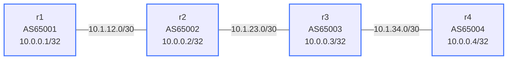

# BGP Communities — Practice Lab

Communities are sticky notes on routes: small transitive tags that let one
AS signal intent to another — "prefer this", "don't export this", "this
came from a customer". In this lab you build a four-AS chain, tag routes,
act on tags, exercise the well-known communities (`no-export`,
`no-advertise`), and strip tags at a trust boundary — predicting at every
step exactly how far a prefix will propagate.

## Topology



### Link Addresses

| Link           | Left side      | Right side     |
|----------------|----------------|----------------|
| r1:eth1-r2:eth1 | 10.1.12.1/30  | 10.1.12.2/30   |
| r2:eth2-r3:eth1 | 10.1.23.1/30  | 10.1.23.2/30   |
| r3:eth2-r4:eth1 | 10.1.34.1/30  | 10.1.34.2/30   |

## How to use this lab

This is a **practice lab**, not a tutorial. Each task gives you an
**objective** and **hints** — your job is to produce the configuration.

- **Predict before you configure.** Most tasks ask "how far does the
  route get?" — answer per-router before checking.
- **Open the hints before the solution.** The solution toggle is the
  answer key — use it to check your work, not as step one.
- **Verify like an operator.** `show bgp ipv4 unicast <prefix>` on every
  router in the chain after each change.

## Deploy and Destroy

```bash
./scripts/lab.sh deploy bgp-communities
./scripts/lab.sh destroy bgp-communities
```

```bash
./scripts/lab.sh cli bgp-communities r1   # ... r2, r3, r4
```

---

## Background

A community is a 32-bit tag written `AA:NN`; a prefix can carry many.
They are **optional transitive** (cross eBGP boundaries by default — if
the neighbor is configured to send them), **human-defined** (meaning is
operator agreement, except the well-known ones), and **actionable**
(policy matches them).

| Type      | Format         | Size    | Use case                              |
|-----------|---------------|---------|---------------------------------------|
| Standard  | `AA:NN`       | 32-bit  | General tagging (this lab)            |
| Extended  | `type:AA:NN`  | 64-bit  | MPLS VPN route targets                |
| Large     | `AA:NN1:NN2`  | 96-bit  | 4-byte ASNs, more granular values     |

Well-known communities (RFC 1997):

| Community      | Meaning                                                |
|----------------|--------------------------------------------------------|
| `no-export`    | Do not advertise beyond the local AS                   |
| `no-advertise` | Do not advertise to any BGP peer at all                |
| `local-AS`     | Do not send outside the local confederation sub-AS     |
| `internet`     | Advertise to all (default)                             |

**EOS gotcha you'll hit in Task 2:** communities are *not* sent to eBGP
peers unless the neighbor has `send-community` configured.

---

## Task 1 — Base BGP

**Objective:** eBGP along the chain, each router advertising its
loopback. Success on r4:

```text
 * >  10.0.0.1/32  ...  65003 65002 65001 i
 * >  10.0.0.2/32  ...  65003 65002 i
 * >  10.0.0.3/32  ...  65003 i
 * >  10.0.0.4/32  (local)
```

<details markdown="1">
<summary>Hints</summary>

- Same pattern as the bgp-basics lab: `router bgp <ASN>`, neighbor
  `remote-as`, `activate` + `network <loopback>/32` under
  `address-family ipv4`.

</details>

<details markdown="1">
<summary>Check your work</summary>

All sessions `Established`, four loopbacks on every router. From here on
the lab only touches *policy* — if a later task breaks reachability,
you broke propagation, not the sessions.

</details>

---

## Task 2 — Tag a route, and discover what doesn't propagate

**Objective:** On r1, tag its outbound advertisement to r2 with community
`65001:100`, and make the tag visible on **all** of r2, r3, r4.

**Predict first:** you apply a `set community` route-map outbound on r1
and check r2. The textbook says communities are transitive. Will the tag
actually show up on r2 on your first try?

<details markdown="1">
<summary>Hints</summary>

- Route-map with `set community 65001:100`, applied `out` to 10.1.12.2,
  then `clear bgp * soft-outbound`.
- If the community doesn't appear: check
  `show bgp neighbors 10.1.12.2 | grep -i communit` on r1 — is the
  router even *sending* the attribute?
- The propagation to r3/r4 needs the same fix on r2 and r3's outbound
  sessions.

</details>

<details markdown="1">
<summary>Solution</summary>

On **r1**:

```text
route-map SET-COMM permit 10
   set community 65001:100
!
router bgp 65001
   neighbor 10.1.12.2 send-community
   address-family ipv4
      neighbor 10.1.12.2 route-map SET-COMM out
```

And on **r2** / **r3**, enable sending toward their downstream peer:

```text
router bgp 65002
   neighbor 10.1.23.2 send-community
router bgp 65003          ! on r3
   neighbor 10.1.34.2 send-community
```

`clear bgp * soft-outbound` on each changed router.

</details>

<details markdown="1">
<summary>Check your work</summary>

`show bgp ipv4 unicast 10.0.0.1/32` on r2, r3, and r4 each show
`Community: 65001:100`.

Prediction answer: on a stock EOS config, **no** — the attribute is
attached but not transmitted until `send-community` is on the neighbor.
"Transitive" describes what routers *may* propagate, not what they're
configured to. A missing `send-community` on one intermediate session
silently severs every community-based agreement downstream — worth
remembering when a peer says "we set the community, why didn't you act
on it?"

</details>

---

## Task 3 — Act on the tag: community-driven local-pref

**Objective:** On r2, accept routes tagged `65001:100` with
local-preference 200, leaving untagged routes at 100.

<details markdown="1">
<summary>Hints</summary>

- `ip community-list standard <NAME> permit 65001:100`, then a route-map
  stanza with `match community <NAME>` + `set local-preference 200`,
  then a bare `permit 20` catch-all, applied `in`.
- Don't forget the catch-all — route-maps end in an implicit deny.

</details>

<details markdown="1">
<summary>Solution</summary>

On **r2**:

```text
ip community-list standard PREF-TAG permit 65001:100
!
route-map HONOR-TAG permit 10
   match community PREF-TAG
   set local-preference 200
route-map HONOR-TAG permit 20
!
router bgp 65002
   address-family ipv4
      neighbor 10.1.12.1 route-map HONOR-TAG in
```

`clear bgp neighbors 10.1.12.1 soft-inbound`

</details>

<details markdown="1">
<summary>Check your work</summary>

`show bgp ipv4 unicast 10.0.0.1/32` on r2 shows `Local Pref: 200`. This
sender-tags / receiver-acts pattern is the real-world shape of every ISP
"community menu" (e.g. "send us `65002:80` and we'll set localpref 80 on
your route"): the *customer* steers policy inside the *provider's*
network without anyone touching the provider's config per-request.

</details>

---

## Task 4 — `no-export`: stop at the AS boundary

**Objective:** Change r1's outbound route-map to set `no-export` instead,
and verify the propagation cut.

**Predict first:** write down for r2, r3, r4 individually: does each one
have 10.0.0.1/32 after this change? Where exactly does the route stop,
and *which router* makes the suppression decision?

<details markdown="1">
<summary>Hints</summary>

- `set community no-export` in r1's existing SET-COMM route-map, then
  `clear bgp * soft-outbound` on r1.
- Check the route *and* its communities on r2, then look at
  `show bgp neighbors 10.1.23.2 advertised-routes` on r2.

</details>

<details markdown="1">
<summary>Solution</summary>

On **r1**:

```text
route-map SET-COMM permit 10
   set community no-export
```

`clear bgp * soft-outbound`

</details>

<details markdown="1">
<summary>Check your work</summary>

r2 **has** the route (tagged `no-export`); r3 and r4 **don't**. The
decision is made by **r2** — the receiving router honors the tag by
excluding the prefix from its eBGP advertisements. r1 asked; r2
complied. Classic use: announcing a more-specific to your direct peer
for traffic engineering while ensuring it never leaks to the wider
internet.

</details>

---

## Task 5 — `no-advertise`: stop at the router

**Objective:** Switch the tag to `no-advertise` and find the difference
from `no-export`.

**Predict first:** same drill — r2, r3, r4: who has the route now? In
*this* linear topology, does the result differ from Task 4 at all? Where
would it differ?

<details markdown="1">
<summary>Solution</summary>

On **r1**:

```text
route-map SET-COMM permit 10
   set community no-advertise
```

`clear bgp * soft-outbound`

</details>

<details markdown="1">
<summary>Check your work</summary>

Same observable result here: only r2 has the route. The difference is
invisible in a chain of single-router ASes — `no-export` stops at the
**AS edge** (iBGP peers inside AS 65002 would still learn it), while
`no-advertise` stops at the **router** (not advertised to *any* peer,
iBGP included). If AS 65002 had two routers, Task 4's route would reach
both and Task 5's only one. Knowing which boundary each tag respects is
the whole distinction.

Reset r1's route-map to `set community 65001:100` before Task 6.

</details>

---

## Task 6 — Strip communities at a boundary

**Objective:** r2 forwards r1's prefix to r3, but with **all communities
removed** — the "don't leak internal signaling" pattern.

**Predict first:** after r2 strips, can r3 or r4 still apply
community-based policy to this route? What does that imply about *where*
in a chain of ASes community agreements must be made?

<details markdown="1">
<summary>Hints</summary>

- `set community none` in a route-map applied **out** toward r3 on r2.
- Verify on r3: the Community line should be gone entirely.

</details>

<details markdown="1">
<summary>Solution</summary>

On **r2**:

```text
route-map STRIP-COMM permit 10
   set community none
!
router bgp 65002
   address-family ipv4
      neighbor 10.1.23.2 route-map STRIP-COMM out
```

`clear bgp * soft-outbound`

</details>

<details markdown="1">
<summary>Check your work</summary>

`show bgp ipv4 unicast 10.0.0.1/32` on r3 has no Community line; r2
still shows `65001:100`. Downstream policy hooks are gone — communities
are only as durable as every AS in the path allows. Real operators strip
or rewrite inbound communities at trust boundaries precisely so
outsiders can't trigger their internal "menu" actions; the flip side is
that legitimate signals must be re-agreed hop by hop.

</details>

---

## Task 7 — Multiple tags and `additive`

**Objective:** Tag r1's prefix with **both** `65001:100` and `65001:200`
simultaneously, without losing either.

**Predict first:** if a route already carries `65001:100` and your
route-map says `set community 65001:200`, what's on the route afterward?

<details markdown="1">
<summary>Solution</summary>

On **r1**:

```text
route-map SET-COMM permit 10
   set community 65001:100 65001:200 additive
```

`clear bgp * soft-outbound`

</details>

<details markdown="1">
<summary>Check your work</summary>

r2 shows both communities. Prediction answer: without `additive`,
`set community` **replaces** the entire set — your `65001:100` would
have been erased. Plain `set community` is a common way to accidentally
destroy a peer's traffic-engineering tags mid-path; `additive` appends.

</details>

---

## Useful Show Commands

```text
show bgp ipv4 unicast                        ! BGP table
show bgp ipv4 unicast 10.0.0.1/32            ! Detail incl. Community line
show bgp community 65001:100                 ! All prefixes with this community
show bgp community no-export                 ! All prefixes with no-export
show route-map                               ! All configured route-maps
show ip community-list                       ! All community-lists
show bgp ipv4 unicast summary                ! Neighbor session status
```

---

## Challenge questions

No answers provided — reason them through.

1. Design a three-community scheme for an ISP (AS 65002) that classifies
   every inbound route as customer, peer, or upstream at ingress — then
   write the *one* outbound rule that implements "never give transit
   between peers/upstreams" using your tags. Why is this tagging scheme
   the backbone of route-leak prevention?
2. A customer of AS 65002 discovers the provider honors `65002:666` as
   "blackhole this prefix." What safeguards must the provider attach to
   that community before honoring it, and what's the worst case if they
   don't?
3. In Task 4, r2 honored `no-export` automatically. Communities like
   `65001:100` did nothing until you wrote policy. Which well-known
   communities does a router act on with zero configuration, and why did
   the IETF make exactly those (and not, say, "prefer me") well-known?
4. Your tag vanishes somewhere along a 5-AS path. Using only your own
   router plus looking glasses in each AS, how do you bisect where it
   was stripped — and why does `send-community` being off look identical
   to an explicit `set community none` from the outside?

---

## Troubleshooting

**Community not appearing on neighbor**

- EOS requires `neighbor X send-community` per eBGP neighbor — check
  `show bgp neighbors X.X.X.X | grep -i communit`
- Extended communities need `send-community extended`
- Did you `clear bgp * soft-outbound` after changing the route-map?

**Route not being suppressed by no-export**

- Confirm the community is actually attached on the *receiving* router:
  `show bgp ipv4 unicast <prefix>`
- Make sure the route-map is applied outbound on the sender

**Route-map not matching**

- Community-list name must match exactly between `ip community-list` and
  `match community`; inspect with `show ip community-list` and
  `show route-map`

## Extensions

These are optional follow-on ideas to deepen the lab. They are not part of
the validated base workflow.

- Compare `local-as` propagation with `no-export` (needs a confederation
  or second router in an AS to be observable).
- Build an inbound policy on r3 that sets local-pref from *multiple*
  different communities (a mini provider menu).
- Capture updates with `debug bgp updates` or a packet capture and watch
  the community attribute attach and strip on the wire.
