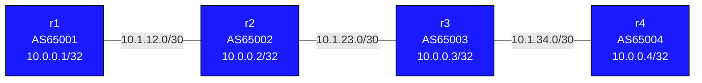

# BGP Filtering — Practice Lab

Without filtering, a BGP router accepts everything its neighbor sends and
re-advertises everything it knows — fine in a lab, route-leak material in
production. In this lab you build a four-AS chain, then control routes
with all three mechanisms: **prefix-lists**, **AS-path regex filters**,
and **route-maps** that combine matching with attribute changes. You
verify every filter from both sides of the line — what was sent vs. what
was accepted.

## Topology



r1 originates three prefixes:
- `10.0.0.1/32` — loopback
- `172.16.1.0/24` — extra prefix (sometimes permitted)
- `172.16.2.0/24` — extra prefix (you'll filter this one)

### Link Addresses

| Link             | Left side      | Right side     |
|------------------|----------------|----------------|
| r1:eth1–r2:eth1  | 10.1.12.1/30   | 10.1.12.2/30   |
| r2:eth2–r3:eth1  | 10.1.23.1/30   | 10.1.23.2/30   |
| r3:eth2–r4:eth1  | 10.1.34.1/30   | 10.1.34.2/30   |

## How to use this lab

This is a **practice lab**, not a tutorial. Each task gives you an
**objective** and **hints** — your job is to produce the configuration.

- **Predict before you configure.** Filtering tasks ask you to call which
  prefixes survive *before* you apply the filter. Commit, then check.
- **Open the hints before the solution.** The solution toggle is the
  answer key — use it to check your work, not as step one.
- **Verify from both sides.** EOS stores received routes natively:
  `show bgp neighbors <ip> received-routes` (pre-filter) vs.
  `show bgp neighbors <ip> routes` (post-filter). Use both after every
  change.

## Deploy and Destroy

```bash
./scripts/lab.sh deploy bgp-filtering
./scripts/lab.sh destroy bgp-filtering
```

```bash
./scripts/lab.sh cli bgp-filtering r1   # ... r2, r3, r4
```

---

## Background reference

### Prefix-list matching

Entries evaluate in sequence order, first match wins, implicit deny-all at
the end.

| Keyword      | Meaning                                                  |
|--------------|----------------------------------------------------------|
| (none)       | Exact match on prefix AND length                         |
| `le N`       | Match if prefix matches AND length <= N                  |
| `ge N`       | Match if prefix matches AND length >= N                  |
| `ge M le N`  | Match if prefix matches AND M <= length <= N             |

`permit 0.0.0.0/0 le 32` is the standard "permit everything" catch-all.

### AS-path regex tokens

| Pattern       | Meaning                                                            |
|---------------|--------------------------------------------------------------------|
| `^$`          | Empty AS-path → route originated by the direct peer               |
| `^65001$`     | Exactly "65001" → originated in 65001, no transit                 |
| `_65001$`     | Ends with 65001 → 65001 is the origin (any number of transits)    |
| `_65001_`     | 65001 appears anywhere (as transit)                               |
| `^65001_`     | 65001 is the first AS (the peer's AS)                             |
| `.*`          | Anything (final permit-all)                                       |

`_` matches a separator (start, space, end) — it prevents `65001` from
matching inside `650012`.

### Tool selection

| Tool              | Matches on     | Applied via                              |
|-------------------|----------------|------------------------------------------|
| `prefix-list`     | IP prefix      | `neighbor X prefix-list NAME in/out`    |
| AS-path filter    | AS-path regex  | `route-map` + `match as-path` (EOS has no `filter-list`) |
| `route-map`       | Multiple attrs | `neighbor X route-map NAME in/out`      |

---

## Task 1 — Base BGP with three prefixes from r1

**Objective:** Configure eBGP along the chain (65001–65002–65003–65004),
each router advertising its loopback, and r1 additionally advertising
172.16.1.0/24 and 172.16.2.0/24. Success: r4 sees all six prefixes.

<details markdown="1">
<summary>Hints</summary>

- Same session pattern as bgp-basics; EOS needs no eBGP policy to pass
  routes.
- r1's extra prefixes go in as additional `network` statements under
  `address-family ipv4` (the addresses exist on r1 already — check
  `show ip interface brief`).

</details>

<details markdown="1">
<summary>Solution</summary>

Example on r1 (r2–r4 follow the same shape with their own ASN/neighbors):

```text
router bgp 65001
   bgp router-id 10.0.0.1
   neighbor 10.1.12.2 remote-as 65002
   !
   address-family ipv4
      neighbor 10.1.12.2 activate
      network 10.0.0.1/32
      network 172.16.1.0/24
      network 172.16.2.0/24
   !
```

</details>

<details markdown="1">
<summary>Check your work</summary>

On r4, `show bgp ipv4 unicast` shows six prefixes with AS-paths that
lengthen with distance:

```text
 * 10.0.0.1/32    (AS-path: 65003 65002 65001)
 * 10.0.0.2/32    (AS-path: 65003 65002)
 * 10.0.0.3/32    (AS-path: 65003)
 * 10.0.0.4/32    (local)
 * 172.16.1.0/24  (AS-path: 65003 65002 65001)
 * 172.16.2.0/24  (AS-path: 65003 65002 65001)
```

Read the AS-paths right-to-left: rightmost AS originated the prefix.
You'll use that fact for the regex filters in Task 3.

</details>

---

## Task 2 — Inbound prefix-list: r2 blocks 172.16.2.0/24

**Objective:** On r2, reject 172.16.2.0/24 from r1 while accepting
everything else. Prove the block with the pre-/post-filter views.

**Predict first:** after the filter is applied on r2, what does **r4**
see — and what does r2's `received-routes` view for the r1 session show?
(Two different answers.)

<details markdown="1">
<summary>Hints</summary>

- Two prefix-list entries: a `deny` for the /24 and a
  `permit 0.0.0.0/0 le 32` catch-all (remember the implicit deny-all).
- Apply with `neighbor 10.1.12.1 prefix-list <NAME> in` under the
  address-family.
- Filters don't re-evaluate existing routes on their own:
  `clear bgp neighbors 10.1.12.1 soft-inbound`.

</details>

<details markdown="1">
<summary>Solution</summary>

On **r2**:
```text
ip prefix-list BLOCK-172-16-2 seq 5 deny 172.16.2.0/24
ip prefix-list BLOCK-172-16-2 seq 10 permit 0.0.0.0/0 le 32
!
router bgp 65002
   address-family ipv4
      neighbor 10.1.12.1 prefix-list BLOCK-172-16-2 in
```

Then: `clear bgp neighbors 10.1.12.1 soft-inbound`

</details>

<details markdown="1">
<summary>Check your work</summary>

```text
r2# show bgp neighbors 10.1.12.1 received-routes   ! both /24s still here
r2# show bgp neighbors 10.1.12.1 routes            ! 172.16.2.0/24 gone
```

r1 still *sends* the prefix — inbound filtering discards it after
receipt, so the pre-filter view keeps showing it. And r4 never sees
172.16.2.0/24 at all: a route r2 didn't accept is a route r2 can't
re-advertise. One inbound filter at a transit point shadows everything
downstream — which is both the power and the danger of filtering at
transit.

</details>

---

## Task 3 — AS-path filter: r3 accepts only AS65001-originated routes

**Objective:** On r3's session to r2, accept only routes *originated* by
AS 65001, using an AS-path access-list applied through a route-map.

**Predict first:** list the prefixes r3 currently learns from r2, and
mark which survive a "must originate in 65001" filter. What happens to
r2's own loopback 10.0.0.2/32 on r3 and on r4?

<details markdown="1">
<summary>Hints</summary>

- The regex for "originated by 65001, any transits": `_65001$`.
- EOS has no `neighbor filter-list` — define
  `ip as-path access-list <NAME> permit <regex>`, then a route-map with
  `match as-path <NAME>`, applied `in`.
- A route-map ends with an implicit deny — no catch-all means everything
  unmatched dies.
- Test a regex against the live table:
  `show bgp ipv4 unicast regexp _65001$`.

</details>

<details markdown="1">
<summary>Solution</summary>

On **r3**:
```text
ip as-path access-list ONLY-AS65001 permit _65001$
!
route-map ASPATH-IN permit 10
   match as-path ONLY-AS65001
!
router bgp 65003
   address-family ipv4
      neighbor 10.1.23.1 route-map ASPATH-IN in
```

Then: `clear bgp neighbors 10.1.23.1 soft-inbound`

</details>

<details markdown="1">
<summary>Check your work</summary>

Survivors on r3 from this session: 10.0.0.1/32 and 172.16.1.0/24 (paths
ending in 65001; 172.16.2.0/24 was already gone in Task 2). Casualty:
**10.0.0.2/32** — its path is just `65002`, not 65001-originated, so r3
drops it and r4 loses it too.

This origin-based filtering is exactly how a provider enforces "my
customer may only send me routes their own AS originated" — the
real-world defense against a customer accidentally becoming transit for
the whole internet.

</details>

---

## Task 4 — Outbound filtering at the source

**Objective:** Filter in the other direction: r1 advertises *only* its
loopback to r2, suppressing both /24s outbound.

**Predict first:** Task 2's inbound filter on r2 already blocks
172.16.2.0/24. Once r1 stops sending both /24s, which views change on
r2 — `received-routes`, `routes`, both, or neither?

<details markdown="1">
<summary>Hints</summary>

- A permit-the-loopback / deny-everything-else prefix-list, applied
  `out` on r1's neighbor.
- Push it: `clear bgp * soft-outbound` on r1.

</details>

<details markdown="1">
<summary>Solution</summary>

On **r1**:
```text
ip prefix-list LOOPBACK-ONLY seq 5 permit 10.0.0.1/32
ip prefix-list LOOPBACK-ONLY seq 10 deny 0.0.0.0/0 le 32
!
router bgp 65001
   address-family ipv4
      neighbor 10.1.12.2 prefix-list LOOPBACK-ONLY out
```

Then: `clear bgp * soft-outbound`

</details>

<details markdown="1">
<summary>Check your work</summary>

Now **both** of r2's views change: `received-routes` shrinks to just
10.0.0.1/32 — the prefixes were never sent, unlike Task 2 where they
arrived and were discarded. Outbound filtering at the source is cleaner
(less wasted advertisement, the origin controls its own exposure);
inbound filtering at the receiver is self-defense that doesn't depend on
the neighbor behaving. Production uses both — never trust the other side
to filter for you.

Remove this outbound filter (`no neighbor 10.1.12.2 prefix-list
LOOPBACK-ONLY out`, then soft-outbound) before Task 5, which needs the
/24s flowing again.

</details>

---

## Task 5 — Route-map: filter and modify in one policy

**Objective:** Replace r2's Task-2 prefix-list with a single inbound
route-map that: accepts 172.16.1.0/24 **with local-preference 150**,
denies 172.16.2.0/24, and accepts everything else unchanged.

**Predict first:** a route-map is sequences of permit/deny stanzas with
first-match-wins and an implicit deny at the end. Write down on paper the
three stanzas you need and what happens to a route matching none of your
match clauses if you forget the final stanza.

<details markdown="1">
<summary>Hints</summary>

- Two single-purpose prefix-lists (one per /24) used as `match`
  conditions in different stanzas.
- Stanza 10: permit + match 172.16.1.0/24 + `set local-preference 150`.
- Stanza 20: deny + match 172.16.2.0/24.
- Stanza 30: bare permit — the catch-all that defuses the implicit deny.
- Remember to remove the Task 2 prefix-list from the neighbor first
  (one inbound prefix-list *and* route-map both apply otherwise).

</details>

<details markdown="1">
<summary>Solution</summary>

On **r2**:
```text
no router bgp 65002 ... ! remove prior: no neighbor 10.1.12.1 prefix-list BLOCK-172-16-2 in
ip prefix-list WANT-172-16-1 seq 5 permit 172.16.1.0/24
ip prefix-list UNWANTED seq 5 permit 172.16.2.0/24
!
route-map FROM-R1 permit 10
   match ip address prefix-list WANT-172-16-1
   set local-preference 150
route-map FROM-R1 deny 20
   match ip address prefix-list UNWANTED
route-map FROM-R1 permit 30
!
router bgp 65002
   address-family ipv4
      neighbor 10.1.12.1 route-map FROM-R1 in
```

Then: `clear bgp neighbors 10.1.12.1 soft-inbound`

</details>

<details markdown="1">
<summary>Check your work</summary>

`show bgp ipv4 unicast 172.16.1.0/24` on r2 shows localpref **150**;
172.16.2.0/24 is absent; r1's loopback is present with default localpref
100 (it fell through to stanza 30). Without stanza 30, *everything* not
explicitly matched — including the loopback — would have been dropped by
the implicit deny: the single most common route-map authoring bug. Note
the layering, too: the deny stanza filters, the permit stanzas shape —
one tool doing both jobs is why route-maps are the default policy
instrument in production.

</details>

---

## Useful Show Commands

```text
show bgp ipv4 unicast                                     ! BGP table
show bgp ipv4 unicast 172.16.2.0/24                       ! Detail for one prefix
show bgp neighbors 10.1.12.1 received-routes              ! Pre-filter (what neighbor sent)
show bgp neighbors 10.1.12.1 routes                       ! Post-filter accepted routes
show bgp neighbors 10.1.12.1 advertised-routes            ! What we send to neighbor
show bgp ipv4 unicast regexp _65001$                      ! Test an AS-path regex live
show ip prefix-list                                       ! All prefix-lists
show ip as-path                                           ! All AS-path access-lists
show route-map                                            ! All route-maps
show bgp ipv4 unicast summary                             ! Session status
```

---

## Challenge questions

No answers provided — reason them through.

1. Write (on paper) the AS-path regex for each of: "routes my peer
   itself originated", "routes that transited 65002 but didn't originate
   there", "routes that touched 65002 or 65003 anywhere". Then explain
   why `^$` applied inbound on every customer session is one of the
   strongest anti-route-leak tools an ISP has.
2. A new transit customer will announce 10.20.0.0/16 and may legitimately
   deaggregate down to /24s, but you must never accept /25 or longer, nor
   anything outside their block. Write the complete inbound prefix-list
   — and explain what `ge`/`le` mistake would silently accept the whole
   internet.
3. In Task 2, r2 discarded a route r1 kept sending forever. At internet
   scale, what does that cost, and how do outbound filtering, ORF
   (outbound route filtering), and RFC 8212 default-deny each attack the
   problem differently?
4. An operator applies both a prefix-list *and* a route-map inbound on
   the same neighbor. A route passes the prefix-list but the route-map
   has no matching permit stanza. Does it survive? Generalize the rule,
   and argue for/against splitting policy across two mechanisms on one
   session.

---

## Troubleshooting

**Filter not taking effect**
- Run `clear bgp * soft-inbound` / `soft-outbound` (or per-neighbor) —
  without a soft reset, existing routes keep their old filter decisions

**Prefix-list matching too much or too little**
- `show ip prefix-list NAME` to see the entries
- Remember the implicit deny-all at the end of every prefix-list

**AS-path regex not matching**
- Test live: `show bgp ipv4 unicast regexp _65001$`
- Use `_` as the separator token, not `.` (which matches any character)
- `^65001$` matches only a one-hop path; `_65001$` matches any path
  originated by 65001

**Combining AS-path and prefix filters**
- Combine in one route-map with multiple match conditions (AND within a
  stanza), or accept that prefix-list + route-map on a session must BOTH
  permit
