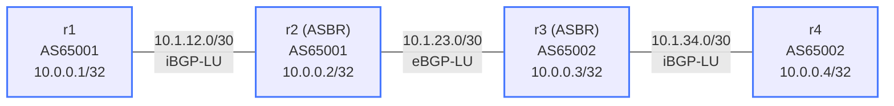

# BGP Labeled Unicast (BGP-LU) — Practice Lab

Inside one AS, LDP or SR distributes MPLS labels — but across an AS
boundary, LDP stops. BGP-LU (RFC 3107) fills the gap: it attaches an MPLS
label to each BGP-advertised prefix, so BGP itself signals an end-to-end
label-switched path. You build the four-router, two-AS Inter-AS Option C
design and watch the LSP stitch together label-by-label at the ASBRs.

## Topology



| Link | Subnet | Session type |
|------|--------|--------------|
| r1 -- r2 | 10.1.12.0/30 | iBGP-LU (AS65001) |
| r2 -- r3 | 10.1.23.0/30 | eBGP-LU (inter-AS) |
| r3 -- r4 | 10.1.34.0/30 | iBGP-LU (AS65002) |

| Node | Loopback    | AS    | Role |
|------|-------------|-------|------|
| r1   | 10.0.0.1/32 | 65001 | Edge PE |
| r2   | 10.0.0.2/32 | 65001 | ASBR |
| r3   | 10.0.0.3/32 | 65002 | ASBR |
| r4   | 10.0.0.4/32 | 65002 | Edge PE |

OSPF runs within each AS for loopback reachability; MPLS is pre-enabled on
all transit interfaces. IP addressing, OSPF, and `mpls ip` are pre-built —
**you configure the BGP-LU sessions.**

## How to use this lab

This is a **practice lab**, not a tutorial. Each task gives you an
**objective** and **hints** — your job is to produce the configuration.

- **Predict before you configure**, **open hints before the solution**,
  and **verify** the label stack with `show mpls lfib route` after each
  step.

## Deploy / Destroy

```bash
./scripts/lab.sh deploy bgp-labeled-unicast
./scripts/lab.sh destroy bgp-labeled-unicast
./scripts/lab.sh cli bgp-labeled-unicast r1
```

## Background — what BGP-LU does

A BGP-LU update binds a label to each prefix: "to reach X, use label Y."
Each router independently allocates its *own* local label and swaps on
transit. When r4 advertises 10.0.0.4/32 with label 17, r3 receives 17,
allocates (say) 18, and advertises 18 to r2; r2 then programs "incoming
18 → swap to 17 → next-hop r3." The ASBRs (r2, r3) re-originate labeled
routes across the AS boundary — that stitching *is* Inter-AS Option C
(RFC 4364). The address family is `ipv4 labeled-unicast`, distinct from
`ipv4 unicast`; neighbors must be activated in it explicitly.

---

## Task 1 — iBGP-LU inside AS65001

**Objective:** Bring up a loopback-based iBGP-LU session between r1 and r2,
each advertising its loopback in the labeled-unicast AF.

**Predict first:** the session peers on loopbacks (`update-source
Loopback0`). What has to already be true for that TCP session to even
establish — and which pre-built protocol provides it here?

<details markdown="1">
<summary>Hints</summary>

- `neighbor 10.0.0.2 remote-as 65001` + `update-source Loopback0`.
- The labeled-unicast AF: `address-family ipv4 labeled-unicast`, then
  `neighbor ... activate` and `network 10.0.0.X/32`.
- r2 also pre-needs its eBGP neighbor toward r3 (Task 2), so configure
  r2's full neighbor set now.

</details>

<details markdown="1">
<summary>Solution</summary>

On **r1**:

```text
router bgp 65001
   bgp router-id 10.0.0.1
   neighbor 10.0.0.2 remote-as 65001
   neighbor 10.0.0.2 update-source Loopback0
   address-family ipv4 labeled-unicast
      neighbor 10.0.0.2 activate
      network 10.0.0.1/32
```

On **r2**:

```text
router bgp 65001
   bgp router-id 10.0.0.2
   neighbor 10.0.0.1 remote-as 65001
   neighbor 10.0.0.1 update-source Loopback0
   neighbor 10.1.23.2 remote-as 65002
   address-family ipv4 labeled-unicast
      neighbor 10.0.0.1 activate
      neighbor 10.1.23.2 activate
      network 10.0.0.2/32
```

</details>

<details markdown="1">
<summary>Check your work</summary>

`show bgp ipv4 labeled-unicast summary` shows the r1↔r2 session up.
Prediction answer: the loopbacks must be mutually reachable *before* BGP
can connect to them — that's why **OSPF** runs inside each AS as the
underlay. A loopback-peered BGP session is only as alive as the IGP
beneath it; pull OSPF and BGP-LU never even gets to TCP. (eBGP-LU between
ASBRs, by contrast, peers on the directly connected link — no IGP needed
across the boundary.)

</details>

---

## Task 2 — eBGP-LU across the AS boundary, and iBGP-LU in AS65002

**Objective:** Complete r3 (eBGP-LU to r2 on the link, iBGP-LU to r4 on
loopbacks) and r4 (iBGP-LU to r3), so the full chain is labeled end to
end.

**Predict first:** the eBGP-LU session r2↔r3 uses *link* addresses, not
loopbacks — why is `update-source Loopback0` wrong here, and what would
break if you used it?

<details markdown="1">
<summary>Solution</summary>

On **r3**:

```text
router bgp 65002
   bgp router-id 10.0.0.3
   neighbor 10.1.23.1 remote-as 65001
   neighbor 10.0.0.4 remote-as 65002
   neighbor 10.0.0.4 update-source Loopback0
   address-family ipv4 labeled-unicast
      neighbor 10.1.23.1 activate
      neighbor 10.0.0.4 activate
      network 10.0.0.3/32
```

On **r4**:

```text
router bgp 65002
   bgp router-id 10.0.0.4
   neighbor 10.0.0.3 remote-as 65002
   neighbor 10.0.0.3 update-source Loopback0
   address-family ipv4 labeled-unicast
      neighbor 10.0.0.3 activate
      network 10.0.0.4/32
```

</details>

<details markdown="1">
<summary>Check your work</summary>

All sessions up; `show bgp ipv4 labeled-unicast` on r1 shows
10.0.0.4/32 with a label; `ping 10.0.0.4 source 10.0.0.1` works.

Prediction answer: eBGP-LU peers across a single hop on the link
addresses — there's no IGP between the two ASes to make loopbacks
reachable, so `update-source Loopback0` would point the session at an
unreachable address and it would never establish. iBGP uses loopbacks
for resilience *within* an AS where the IGP guarantees reachability;
eBGP uses the link because that's the only thing both sides can resolve.

</details>

---

## Task 3 — Read the label stack end to end

**Objective:** Trace the label binding for 10.0.0.4/32 hop by hop and
confirm the swap operations in the LFIB.

<details markdown="1">
<summary>Hints</summary>

- `show bgp ipv4 labeled-unicast 10.0.0.4/32` on r4, r3, r2, r1 — read
  the label each advertised.
- `show mpls lfib route` on r2 and r3 — find the incoming-label →
  out-label → next-hop entries.

</details>

<details markdown="1">
<summary>Check your work</summary>

You should be able to narrate: r4 originates a label for its loopback →
r3 receives it, allocates its own, advertises that to r2 across the
eBGP-LU boundary → r2 allocates again, advertises to r1. Each ASBR's
LFIB shows a *swap* (incoming label → different out-label → next-hop).
The labels are locally significant — each router picks its own — which is
exactly why a label must be re-signaled at every hop, and why pulling any
one advertisement (next task) snaps the chain.

</details>

---

## Task 4 — Break it: drop a stitch at the ASBR

**Objective:** On r2, remove `network 10.0.0.2/32` from the BGP-LU config
and determine whether end-to-end r1↔r4 connectivity survives — and why.

**Predict first:** r2's loopback is the *transit* ASBR's own prefix, not
r1's or r4's. Will removing it break the r1→r4 LSP, or only reachability
*to r2 itself*?

<details markdown="1">
<summary>What you should observe</summary>

Think carefully and test: removing r2's own loopback advertisement
removes the path *to 10.0.0.2*, but the r1↔r4 LSP rides labels for
r1's and r4's prefixes, which r2 still swaps in transit. The lesson is
about what an ASBR contributes — it must keep *re-advertising and
label-swapping the prefixes that transit it*, even ones it doesn't
originate. Try instead removing r2's activation of the r1 neighbor in the
labeled-unicast AF and watch the end-to-end LSP genuinely collapse:
that's the stitch that matters.

Restore the config and re-verify `ping 10.0.0.4 source 10.0.0.1`.

</details>

---

## Verification Commands

```text
show bgp ipv4 labeled-unicast summary       # session state
show bgp ipv4 labeled-unicast               # labeled routes
show bgp ipv4 labeled-unicast 10.0.0.4/32   # one prefix's label
show mpls lfib route                        # in-label → out-label → next-hop
show mpls lfib route detail
show mpls interface
show ip ospf neighbor                        # underlay, per AS
```

---

## Challenge questions

No answers provided — reason them through.

1. Run `traceroute 10.0.0.4 source 10.0.0.1` from r1. Predict whether
   you'll see MPLS labels in the output, then explain what you actually
   see in terms of penultimate-hop popping and how each router builds the
   ICMP TTL-exceeded reply.
2. BGP-LU is one of three classic Inter-AS MPLS options (A, B, C).
   Describe what Option C pushes onto the ASBRs vs. Option A, and why
   Option C scales better but demands more trust between the two ASes.
3. Add a second prefix 192.168.99.1/32 on r1 and advertise it via BGP-LU.
   Before checking, predict every router whose LFIB must change and what
   entry appears — then verify on r4.
4. Compare BGP-LU against running LDP end-to-end within a single AS:
   what does BGP-LU buy you, what does it cost in label/BGP table size,
   and when would you reach for SR-MPLS instead of either?
