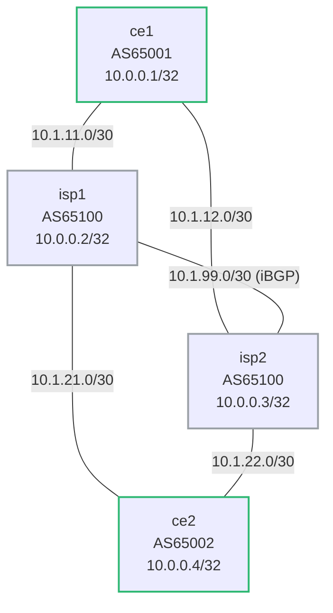

# BGP Path Selection — Practice Lab

A dual-homed topology with two ISP routers gives every prefix two paths —
which means *something* has to choose. You build the base network, then
steer traffic with each major selection attribute in turn (weight,
local-preference, AS-path prepending, MED), predicting the winner before
every change and proving it in the BGP table.

---

## Topology



Two paths between ce1 and ce2: via isp1 or via isp2. Both ISPs are in the
same AS (AS65100), peered with iBGP.

### Link addressing

| Link        | Subnet       | Left      | Right     |
|-------------|--------------|-----------|-----------|
| ce1 — isp1  | 10.1.11.0/30 | 10.1.11.1 | 10.1.11.2 |
| ce1 — isp2  | 10.1.12.0/30 | 10.1.12.1 | 10.1.12.2 |
| isp1 — isp2 | 10.1.99.0/30 | 10.1.99.1 | 10.1.99.2 |
| isp1 — ce2  | 10.1.21.0/30 | 10.1.21.1 | 10.1.21.2 |
| isp2 — ce2  | 10.1.22.0/30 | 10.1.22.1 | 10.1.22.2 |

### Node reference

| Node | Loopback    | ASN   | Role                       |
|------|-------------|-------|----------------------------|
| ce1  | 10.0.0.1/32 | 65001 | Dual-homed customer A      |
| isp1 | 10.0.0.2/32 | 65100 | ISP router (upper path)    |
| isp2 | 10.0.0.3/32 | 65100 | ISP router (lower path)    |
| ce2  | 10.0.0.4/32 | 65002 | Dual-homed customer B      |

---

## How to use this lab

This is a **practice lab**, not a tutorial. Each task gives you an
**objective** and **hints** — your job is to produce the configuration.

- **Predict before you configure.** Every steering task asks you to call
  the winning path *before* you check. Commit, then verify.
- **Open the hints before the solution.** The solution toggle is the
  answer key — use it to check your work, not as step one.
- **Verify like an operator.** `show bgp ipv4 unicast <prefix>` after
  every change; know *which rule* made the decision, not just which path
  won.

## The selection order you're about to exercise

BGP walks this list top-to-bottom and stops at the first difference:

1. **Weight** — highest wins (proprietary, local to the router)
2. **Local-Preference** — highest wins (AS-wide via iBGP, default 100)
3. **Locally originated** — prefer own routes
4. **AS-path length** — shortest wins
5. **Origin** — IGP (i) < EGP (e) < incomplete (?)
6. **MED** — lowest wins (compared only between paths from the same AS)
7. **eBGP over iBGP**
8. **IGP metric to next-hop** — lowest wins
9. **Oldest eBGP path**
10. **Router-ID** — lowest wins (final tiebreaker)

## Deploy and access

```bash
./scripts/lab.sh deploy bgp-path-selection
./scripts/lab.sh cli bgp-path-selection ce1
```

---

## Task 1 — Base configuration

**Objective:** Build all sessions per the topology: ce1 and ce2 each
dual-homed to both ISPs via eBGP, isp1 ↔ isp2 via iBGP with the next-hop
handled. Every router advertises its loopback. Success: ce1 sees **two
paths** for 10.0.0.4/32, one marked `>`.

**Predict first:** with no policy anywhere — identical weight,
local-pref, AS-path length, origin — which of the ten rules will end up
breaking the tie on ce1, and which path will it pick?

<details markdown="1">
<summary>Hints</summary>

- Same pattern as the bgp-basics lab: `router bgp`, neighbors, `activate`
  + `network` under `address-family ipv4`.
- The ISPs need `next-hop-self` toward each other on the iBGP session.
- ce1: two eBGP neighbors. isp1/isp2: three neighbors each (one eBGP per
  CE + one iBGP). ce2 mirrors ce1.

</details>

<details markdown="1">
<summary>Solution</summary>

ce1 (AS 65001):
```text
router bgp 65001
   bgp router-id 10.0.0.1
   neighbor 10.1.11.2 remote-as 65100
   neighbor 10.1.12.2 remote-as 65100
   !
   address-family ipv4
      neighbor 10.1.11.2 activate
      neighbor 10.1.12.2 activate
      network 10.0.0.1/32
   !
```

isp1 (AS 65100):
```text
router bgp 65100
   bgp router-id 10.0.0.2
   neighbor 10.1.11.1 remote-as 65001
   neighbor 10.1.99.2 remote-as 65100
   neighbor 10.1.21.2 remote-as 65002
   !
   address-family ipv4
      neighbor 10.1.11.1 activate
      neighbor 10.1.99.2 activate
      neighbor 10.1.99.2 next-hop-self
      neighbor 10.1.21.2 activate
      network 10.0.0.2/32
   !
```

isp2 (AS 65100):
```text
router bgp 65100
   bgp router-id 10.0.0.3
   neighbor 10.1.12.1 remote-as 65001
   neighbor 10.1.99.1 remote-as 65100
   neighbor 10.1.22.2 remote-as 65002
   !
   address-family ipv4
      neighbor 10.1.12.1 activate
      neighbor 10.1.99.1 activate
      neighbor 10.1.99.1 next-hop-self
      neighbor 10.1.22.2 activate
      network 10.0.0.3/32
   !
```

ce2 (AS 65002):
```text
router bgp 65002
   bgp router-id 10.0.0.4
   neighbor 10.1.21.1 remote-as 65100
   neighbor 10.1.22.1 remote-as 65100
   !
   address-family ipv4
      neighbor 10.1.21.1 activate
      neighbor 10.1.22.1 activate
      network 10.0.0.4/32
   !
```

</details>

<details markdown="1">
<summary>Check your work</summary>

`show bgp ipv4 unicast 10.0.0.4/32` on ce1 shows two paths, both
`65100 65002`, identical in rules 1–8. The decision falls all the way
down to the tiebreakers — typically **oldest eBGP path** (whichever
session established first), and if even that ties, lowest **router-id**
(isp1, 10.0.0.2). The takeaway: an unpolicied dual-homed setup picks its
path *arbitrarily and unstably* — a session flap can silently move all
your traffic. That's why the rest of this lab exists.

</details>

---

## Task 2 — Weight: this router's private opinion

**Objective:** On ce1 only, force all outbound traffic toward ce2 through
isp1 using weight.

**Predict first:** weight is rule #1 — but it is not advertised to
anyone. After you set it on ce1, will isp2's choice of path toward ce2
change? Will *inbound* traffic to ce1 change?

<details markdown="1">
<summary>Hints</summary>

- In EOS, `neighbor <ip> weight <n>` lives directly under `router bgp`,
  **not** in the address-family.
- Highest weight wins.
- Re-evaluate without bouncing sessions: `clear bgp * soft`.

</details>

<details markdown="1">
<summary>Solution</summary>

On **ce1**:
```text
router bgp 65001
   neighbor 10.1.11.2 weight 200
   neighbor 10.1.12.2 weight 100
```

Then `clear bgp * soft`.

</details>

<details markdown="1">
<summary>Check your work</summary>

`show bgp ipv4 unicast 10.0.0.4/32` on ce1: the path via 10.1.11.2 shows
`weight 200` and carries the `>`. Nothing changed anywhere else — weight
never leaves the box, so isp2's routing and ce1's *inbound* traffic are
untouched. Weight is a sledgehammer for one router's outbound choice;
it doesn't coordinate anything. (That's also its operational danger:
invisible to every other router, it must be documented or it *will*
surprise the next engineer.)

Remove the weights before the next task so they don't mask
local-preference (weight outranks it).

</details>

---

## Task 3 — Local-preference: the AS speaks with one voice

**Objective:** Inside AS 65100, make **both** ISP routers prefer isp1 as
the exit toward ce1's prefix, by setting local-preference 200 on routes
isp1 learns from ce1.

**Predict first:** you configure this on isp1 only. By what mechanism
does isp2 find out, and what will isp2's best path to 10.0.0.1/32 be
afterwards — its own direct eBGP path, or the iBGP path through isp1?

<details markdown="1">
<summary>Hints</summary>

- A `route-map` with `set local-preference 200`, applied **inbound** on
  isp1's neighbor toward ce1.
- Local-pref is carried in iBGP UPDATEs — watch it arrive on isp2.
- `show bgp ipv4 unicast 10.0.0.1/32` on isp2, before and after.

</details>

<details markdown="1">
<summary>Solution</summary>

On **isp1**:
```text
route-map LP-CE1-HIGH permit 10
   set local-preference 200
!
router bgp 65100
   !
   address-family ipv4
      neighbor 10.1.11.1 route-map LP-CE1-HIGH in
   !
```

Then `clear bgp * soft`.

</details>

<details markdown="1">
<summary>Check your work</summary>

On isp2, 10.0.0.1/32 now has two paths: its own eBGP path (localpref 100)
and the iBGP path via isp1 (localpref 200). The **iBGP path wins** —
rule 2 beats rule 7 (eBGP-over-iBGP), which only applies when local-prefs
tie. isp2 now deliberately sends ce1-bound traffic across the 10.1.99.0
link to exit via isp1: the AS made a coordinated exit decision, which is
exactly what local-pref is for (and what weight can't do).

Remove the route-map afterwards
(`no neighbor 10.1.11.1 route-map LP-CE1-HIGH in`) and `clear bgp * soft`.

</details>

---

## Task 4 — AS-path prepending: asking strangers nicely

**Objective:** ce1 wants inbound traffic to arrive via isp1. Make the
path ce1 advertises to **isp2** look three AS-hops long.

**Predict first:** weight and local-pref controlled *outbound* decisions.
Prepending is the first tool here that influences what *other* ASes do.
Why must ce1 apply it **outbound toward isp2** rather than anything
inbound — and can ce1 *guarantee* the result?

<details markdown="1">
<summary>Hints</summary>

- `set as-path prepend 65001 65001` in a route-map, applied **out**
  toward 10.1.12.2.
- Verify on isp2: the AS-path column for 10.0.0.1/32.

</details>

<details markdown="1">
<summary>Solution</summary>

On **ce1**:
```text
route-map PREPEND-ISP2 permit 10
   set as-path prepend 65001 65001
!
router bgp 65001
   !
   address-family ipv4
      neighbor 10.1.12.2 route-map PREPEND-ISP2 out
   !
```

Then `clear bgp * soft`.

</details>

<details markdown="1">
<summary>Check your work</summary>

isp2 now sees 10.0.0.1/32 with AS-path `65001 65001 65001` directly from
ce1, versus `65001` via iBGP from isp1 — so isp2 routes ce1-bound traffic
toward isp1 (shorter path, rule 4).

Prediction answer: you can only edit attributes on routes *you send*;
inbound preference at the remote AS is their decision, influenced by your
advertisement. And no — no guarantee: the remote AS's local-pref (rule 2)
is evaluated *before* AS-path length, so any explicit policy on their
side silently overrides your prepending. Prepending is a request, not a
command — the fundamental asymmetry of inter-domain traffic engineering.

</details>

---

## Task 5 — MED: the polite suggestion

**Objective:** Remove the prepend, then express the same "enter via
isp1" preference with MED: advertise metric 10 to isp1 and metric 200 to
isp2 from ce1.

**Predict first:** both ISP routers receive ce1's prefix directly from
AS 65001. For isp2 comparing its direct path (MED 200) against the iBGP
path via isp1 (MED 10) — does the MED comparison even apply here? Why is
MED weaker than everything you've used so far?

<details markdown="1">
<summary>Hints</summary>

- Two route-maps with `set metric`, applied `out` per neighbor on ce1.
- MED is only compared between paths from the **same neighboring AS** —
  check whether that condition holds in this topology.

</details>

<details markdown="1">
<summary>Solution</summary>

On **ce1**:
```text
route-map MED-LOW permit 10
   set metric 10
!
route-map MED-HIGH permit 10
   set metric 200
!
router bgp 65001
   !
   address-family ipv4
      neighbor 10.1.11.2 route-map MED-LOW out
      neighbor 10.1.12.2 route-map MED-HIGH out
   !
```

Then `clear bgp * soft`.

</details>

<details markdown="1">
<summary>Check your work</summary>

Both paths on isp2 originate from AS 65001, so the MED comparison *does*
apply: the MED-10 path via isp1 beats the direct MED-200 path, and
AS 65100 enters via isp1 — same outcome as prepending, but achieved as a
metric hint rather than path-length distortion.

Why it's the weakest tool: five rules run before MED (weight, local-pref,
origination, AS-path, origin), it's only valid between paths from the
same AS, and the receiving AS is free to ignore or reset it. In practice
MED is honored between organizations with an explicit agreement, and
overridden by local-pref everywhere else.

</details>

---

## Verification commands

```text
! All paths for a prefix with full attribute detail
show bgp ipv4 unicast 10.0.0.1/32

! Summary — sessions and prefix counts
show bgp ipv4 unicast summary

! Routing table (only best path installed)
show ip route bgp

! Force re-evaluation after config change
clear bgp * soft
```

---

## Challenge questions

No answers provided — reason them through.

1. Your company dual-homes to two *different* ISPs (separate ASes) and
   prepending toward ISP-B isn't moving inbound traffic. List, in order
   of likelihood, three reasons the prepend is being ignored, and what
   evidence you could gather for each *without* access to the ISPs'
   routers.
2. Design the full policy set for "isp1 is primary in both directions,
   isp2 is pure backup" — name the attribute, direction, and router for
   each piece, and identify which half of the design you cannot
   guarantee.
3. After Task 3, traffic from ce2 to ce1 enters at isp2 but exits the AS
   at isp1, crossing the 10.1.99.0 link. Generalize: why does local-pref
   tend to create asymmetric paths through a transit AS, and when does an
   operator care?
4. Rule 9 prefers the *oldest* eBGP path. What operational problem is
   that rule solving (hint: think about what happens after a flap), and
   what surprising behavior does it cause when you're trying to verify a
   policy change?

---

## Troubleshooting

**Two paths visible but neither wins decisively**
- Check Weight first (must be set locally under router bgp, not in address-family)
- Then Local-Pref (check it's being set on the inbound route-map, not outbound)

**Route-map not taking effect**
- `clear bgp * soft` to re-process routes without dropping sessions
- `show route-map <name>` to verify match/set clauses

**MED not being compared**
- MED is only compared between paths from the same neighbouring AS
- If the two paths come from different ASes, MED is skipped (`bgp
  always-compare-med` overrides — rarely used in production)

**iBGP session between isp1 and isp2 not working**
- Check `next-hop-self` is configured — without it, iBGP-advertised routes
  have external next-hops that may be unreachable
