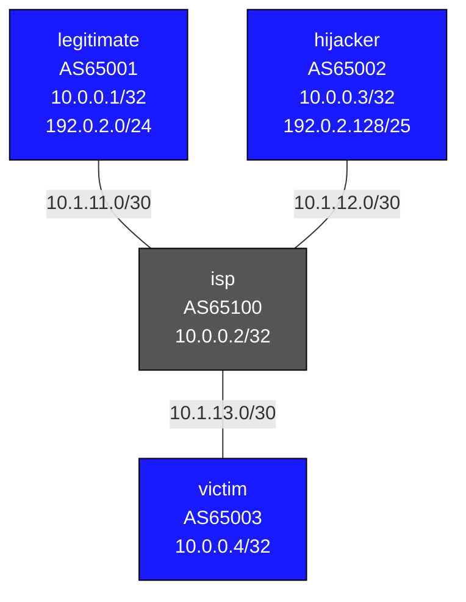

# BGP Prefix Security (Hijacking & Defenses) — Practice Lab

BGP has no built-in proof of who owns a prefix — any router can announce
any block, and the best-path rules will happily prefer a more-specific
from a stranger. In this lab you *play the attacker*: hijack a victim's
prefix two different ways, watch traffic divert, then deploy the defenses
(prefix-lists, max-prefix, and RPKI in concept) that a real ISP uses to
shut it down.

## Topology



## Address Plan

| Node | Interface | Address |
|------|-----------|---------|
| legitimate | Loopback0 / Loopback1 / Eth1 | 10.0.0.1/32 / 192.0.2.1/24 / 10.1.11.1/30 |
| isp | Loopback0 / Eth1 / Eth2 / Eth3 | 10.0.0.2/32 / 10.1.11.2/30 / 10.1.12.1/30 / 10.1.13.1/30 |
| hijacker | Loopback0 / Loopback1 / Eth1 | 10.0.0.3/32 / 192.0.2.128/25 / 10.1.12.2/30 |
| victim | Loopback0 / Eth1 | 10.0.0.4/32 / 10.1.13.2/30 |

## How to use this lab

This is a **practice lab**, not a tutorial. Each task gives you an
**objective** and **hints** — your job is to produce the configuration.

- **Predict before you configure.** The attack tasks ask you to call the
  winning path *before* checking the victim's table. Commit, then verify.
- **Open the hints before the solution.** Use the solution toggle to check
  your work, not as step one.
- **Verify like an operator.** The *victim's* BGP and routing tables are
  ground truth — that's whose traffic is at stake.

## Deploy / Access

```bash
sudo containerlab deploy -t topology.clab.yml
docker exec -it clab-bgp-prefix-security-victim Cli   # legitimate, isp, hijacker
```

---

## Task 1 — Establish the legitimate world

**Objective:** eBGP from each edge AS to the isp. legitimate advertises
10.0.0.1/32 and its real prefix 192.0.2.0/24; isp/hijacker/victim
advertise their loopbacks. Success: victim receives 192.0.2.0/24 with
AS-path `65100 65001`.

<details>
<summary>Hints</summary>

- Each edge node peers only with isp. Standard `router bgp`, neighbor,
  `activate` + `network` under `address-family ipv4`.
- legitimate's 192.0.2.0/24 lives on Loopback1.

</details>

<details>
<summary>Solution</summary>

legitimate (others mirror the shape):
```text
configure
router bgp 65001
   bgp router-id 10.0.0.1
   neighbor 10.1.11.2 remote-as 65100
   address-family ipv4
      neighbor 10.1.11.2 activate
      network 10.0.0.1/32
      network 192.0.2.0/24
```

</details>

<details>
<summary>Check your work</summary>

`show bgp ipv4 unicast 192.0.2.0/24` on victim → one path, AS-path
`65100 65001`. This is the baseline the hijacks will subvert. Note isp
accepts legitimate's announcement with zero verification — that
unconditional trust is the vulnerability the rest of the lab exploits and
then fixes.

</details>

---

## Task 2 — Equal-prefix hijack

**Objective:** From hijacker, announce the *same* prefix 192.0.2.0/24 and
see what the victim does.

**Predict first:** both paths are AS-path length 2 (`65100 65001` vs
`65100 65002`). With everything else equal, which one wins on victim, and
what single attribute decides it?

<details>
<summary>Solution</summary>

On **hijacker**:
```text
router bgp 65002
   address-family ipv4
      network 192.0.2.0/24
```

</details>

<details>
<summary>Check your work</summary>

victim now has two paths. With AS-path length tied, the decision falls to
the tiebreakers — typically **lowest router-id** (or oldest path). So the
winner is essentially arbitrary: roughly half the internet might believe
the hijacker, half the real owner, depending on router-ids and timing
across the path. Equal-length hijacks produce *partial, unstable*
diversion — which is exactly why attackers prefer the next technique.

</details>

---

## Task 3 — More-specific hijack

**Objective:** From hijacker, additionally announce 192.0.2.128/25 — a
more-specific covering half the victim's space.

**Predict first:** the /25 is a *longer* prefix than the legitimate /24,
but the hijacker's AS-path is no shorter. Will the /25 win for traffic to
192.0.2.130 anyway? Why does this beat the Task 2 approach decisively?

<details>
<summary>Solution</summary>

On **hijacker**:
```text
router bgp 65002
   address-family ipv4
      network 192.0.2.128/25
```

</details>

<details>
<summary>Check your work</summary>

`show ip route 192.0.2.128/25` on victim points at the hijacker —
**unconditionally**. Longest-prefix match happens *before* any BGP
attribute comparison: a /25 always beats a covering /24 regardless of
AS-path, MED, or origin. That's why real hijacks (and the famous
YouTube/Pakistan incident) use more-specifics — they don't compete on
BGP policy, they bypass it. Half the victim's address space is now
silently rerouted.

</details>

---

## Task 4 — Defense 1: max-prefix circuit breaker

**Objective:** On isp, limit how many routes it will accept from hijacker
before tearing the session down.

**Predict first:** does a max-prefix limit *prevent* the Task 3 hijack,
or only contain a different threat? What class of attack is it actually
for?

<details>
<summary>Hints</summary>

- EOS calls it `maximum-routes` (not `maximum-prefix`), per-neighbor under
  `router bgp`.
- Set it low (e.g. 5) and watch the session when hijacker exceeds it.

</details>

<details>
<summary>Solution</summary>

On **isp**:
```text
router bgp 65100
   neighbor 10.1.12.2 maximum-routes 5
```

</details>

<details>
<summary>Check your work</summary>

Prediction answer: it does **not** stop a one- or two-prefix targeted
hijack — those are well under any sane limit. max-prefix is a circuit
breaker for *volume* accidents/attacks (a peer leaking the full table, a
misconfig announcing thousands of routes), where it saves your control
plane by dropping the session. Necessary, but orthogonal to targeted
hijacking. The real fix is next.

</details>

---

## Task 5 — Defense 2: per-peer prefix whitelist

**Objective:** On isp, accept from hijacker *only* the prefixes it's
legitimately allowed to originate — and explicitly reject 192.0.2.0/24
and all its more-specifics.

**Predict first:** after applying and soft-resetting, what happens on
victim to both the /24 hijack *and* the /25 hijack? Both gone, one gone?

<details>
<summary>Hints</summary>

- Inbound prefix-list on isp's hijacker neighbor.
- `deny 192.0.2.0/24 le 32` catches the /24 **and** every more-specific
  (that's what `le 32` does); follow with a `permit 0.0.0.0/0 le 32`
  catch-all.
- `clear bgp neighbors 10.1.12.2 soft-inbound`.

</details>

<details>
<summary>Solution</summary>

On **isp**:
```text
ip prefix-list HIJACKER-IN seq 5 deny 192.0.2.0/24 le 32
ip prefix-list HIJACKER-IN seq 10 permit 0.0.0.0/0 le 32
!
router bgp 65100
   address-family ipv4
      neighbor 10.1.12.2 prefix-list HIJACKER-IN in
```

`clear bgp neighbors 10.1.12.2 soft-inbound`

</details>

<details>
<summary>Check your work</summary>

Both hijacked routes disappear from victim — the `le 32` deny swept up
the /24 and the /25 in one entry. This is the correct, surgical defense:
the ISP filters at ingress based on what each peer is authorized to
announce. Its weakness is operational, not technical — *someone* must
build and maintain an accurate per-peer list (often automated from IRR
data), and a stale entry is how leaks still happen. That maintenance
burden is exactly what RPKI (next) tries to remove.

</details>

---

## Task 6 — Defense 3 (concept): RPKI

RPKI cryptographically attests prefix ownership. A **ROA** (Route Origin
Authorization) is a signed statement like "AS65001 may originate
192.0.2.0/24, up to /24." With a validator (Routinator, OctoRPKI) feeding
the router, routes are marked `valid`, `not found`, or `invalid`, and
most ISPs drop `invalid`.

**Reason it through (no config):** Given the ROA above, classify each of
this lab's announcements: legitimate's 192.0.2.0/24, hijacker's
192.0.2.0/24, hijacker's 192.0.2.128/25. Which become `invalid` and why —
and note that the /25 is invalid for *two* independent reasons.

> The `bgp-rpki` lab builds this for real with a live validator. Here the
> point is conceptual: RPKI would have rejected the hijacks automatically,
> without isp maintaining a hand-built prefix-list per peer.

---

## Key Concepts

**Route selection relevant to hijacking** (longest-prefix match runs
*before* all of this):
1. Shortest AS-path → 2. Lowest MED → 3. eBGP over iBGP → 4. Lowest
router-id.

| Defense | What it does | Limitation |
|---------|-------------|------------|
| Prefix-list | Whitelist valid prefixes per peer | Manual per-peer maintenance |
| max-prefix | Drop session on too many routes | Volume only, not targeted hijacks |
| IRR filtering | Build prefix-lists from registry data | Data often stale/incomplete |
| RPKI | Cryptographic origin validation | Needs validator; partial adoption |
| BGPsec | Signs the AS-path too | Barely deployed |

---

## Challenge questions

No answers provided — reason them through.

1. The /25 hijack won regardless of AS-path. Aggregation labs taught that
   ISPs *summarize* aggressively. Explain the tension: how does heavy
   aggregation by the legitimate owner make more-specific hijacks *easier*,
   and what's the defensive counter-move (and its downside)?
2. RPKI validates origin but not path. Construct a hijack that is
   RPKI-`valid` yet still steals traffic (hint: forge the AS-path so the
   real origin appears at the end). What does this prove about why BGPsec
   exists?
3. isp's prefix-list defends *victim*. But the hijack originates at
   hijacker, who peers with isp. Argue where in the internet this filter
   is most effective (at the hijacker's direct provider vs. far away) and
   why "filter your customers" is the load-bearing principle of MANRS.
4. You're victim's operator and you suspect a live hijack but isp won't
   talk. Using only `show bgp` data and public looking glasses, lay out
   how you'd *prove* a more-specific hijack is happening and estimate its
   blast radius.

## Destroy

```bash
sudo containerlab destroy -t topology.clab.yml --cleanup
```
