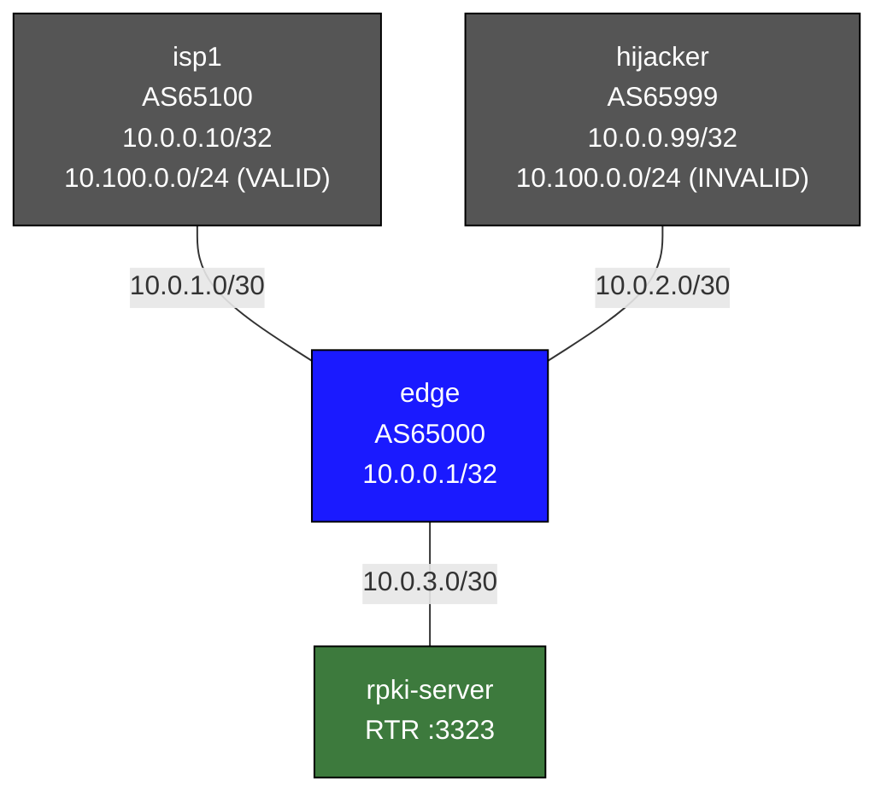

# BGP RPKI / Route Origin Validation — Practice Lab

RPKI is how the internet finally got a way to ask "is this AS *allowed* to
announce this prefix?" In this lab a validator feeds signed ROA data to an
edge router over the RTR protocol, and you watch route-origin validation
sort a legitimate announcement from an identical-looking hijack — then you
tune the policy and discover why "just drop everything not VALID" isn't
yet realistic.

## How to use this lab

This is a **practice lab**, not a tutorial. The RPKI infrastructure
(validator, ROAs, the `RPKI-POLICY` route-map) is pre-built — your job is
to *observe, predict, and tune* the policy.

- **Predict before you check.** Each task asks you to call the RPKI state
  or the surviving route before you run the show command.
- **Open the solution toggle only to confirm or when stuck.**
- **Verify on edge.** Its BGP table and the `rpki` state flags are ground
  truth.

## Topology



## ROA Database

The RTR server (`rpki-server`) serves these Route Origin Authorizations:

| Prefix          | Max Length | Authorized Origin AS | Purpose                     |
|-----------------|------------|----------------------|-----------------------------|
| 10.100.0.0/24   | 24         | AS65100              | isp1's legitimate prefix    |
| 10.200.0.0/24   | 24         | AS65200              | not announced → NOT-FOUND   |

**What this means in the lab:**
- `isp1` announces `10.100.0.0/24` with origin AS65100 → **VALID** (matches ROA)
- `hijacker` announces `10.100.0.0/24` with origin AS65999 → **INVALID** (wrong origin)
- `10.200.0.0/24` appears in the ROA table but nobody announces it → **NOT-FOUND** as a received route

## Key Concepts

### Route Origin Authorization (ROA)
A ROA is a cryptographically signed object created by an address space holder that
states: *"Prefix X, up to max-length Y, may be originated by AS Z."*  ROAs are
stored in the global RPKI repository and fetched by RPKI validator software.

### RTR Protocol (RFC 8210)
Routers do not speak RPKI directly. Instead, an RPKI validator (Routinator, FORT,
etc.) fetches and validates ROAs, then serves the validated prefix-origin pairs to
routers using the lightweight RTR (RPKI-to-Router) protocol over TCP port 3323.

FRR's `rpkid` daemon connects to the RTR server, downloads the ROA table, and
makes it available to `bgpd` for validation decisions.

### Route States
| State     | Meaning                                                        |
|-----------|----------------------------------------------------------------|
| valid     | A matching ROA exists; origin AS and prefix length both match  |
| invalid   | A ROA covers this prefix but the origin AS does not match, OR  |
|           | the announced prefix is longer than the ROA's maxLength        |
| notfound  | No ROA covers this prefix at all                               |

### Route Origin Validation (ROV) Policy
ROV is enforced through BGP route-maps using `match rpki valid|invalid|notfound`.
A common policy:
- **VALID** → accept, raise local-preference (prefer validated routes)
- **NOT-FOUND** → accept at normal preference (most internet prefixes today)
- **INVALID** → drop (hijack protection)

## Deploy

```bash
# Build the custom FRR image first (if not already built)
docker build -t frr-lab:local images/frr/

# Deploy the lab
./scripts/lab.sh deploy bgp-rpki
```

Edge uses `sleep 5 && vtysh -b` to give the RTR server time to start before
FRR's rpkid tries to connect.

## Verification Commands

### Check the RPKI session

```
# On edge:
./scripts/lab.sh cli bgp-rpki edge

edge# show rpki cache-connection
edge# show rpki prefix-table
edge# show rpki as-number 65100
edge# show rpki as-number 65999
```

Expected output for `show rpki cache-connection`:
```
Connected to group 1
  Cache 10.0.3.2:3323 (connected)
    Preference: 1
```

Expected output for `show rpki prefix-table` (partial):
```
Prefix                                   Prefix Length  Origin-AS
10.100.0.0                               24 - 24        65100
10.200.0.0                               24 - 24        65200
```

### Check BGP table with RPKI states

```
edge# show bgp ipv4 unicast
```

Look for the `rpki` column in the output flags. The flags characters include:
- `V` = VALID
- `I` = INVALID
- `N` = NOTFOUND

```
edge# show bgp ipv4 unicast 10.100.0.0/24
```

This will show both paths (from isp1 and hijacker) if the INVALID path is not
being dropped. Notice the RPKI state on each.

### Verify ROV policy is working

```
edge# show bgp ipv4 unicast
```

With the default `RPKI-POLICY` route-map applied:
- Route from isp1 (10.0.1.1) for `10.100.0.0/24` should be **accepted** (VALID, LP=200)
- Route from hijacker (10.0.2.2) for `10.100.0.0/24` should be **absent** (INVALID, denied by seq 30)

```
edge# show bgp neighbors 10.0.1.1 received-routes
edge# show bgp neighbors 10.0.2.2 received-routes
```

Both neighbors will show the route as *received*, but only isp1's survives the
inbound route-map.

## Tasks

### Task 1 — Verify the RPKI session

**Predict first:** the ROA table (see above) has two entries but only one
of those prefixes is announced by anyone in this lab. Before you look —
how many entries will `show rpki prefix-table` contain, and does an
unannounced ROA still load into the table?

Open a vtysh session on `edge` and confirm the RTR connection is up:

```
edge# show rpki cache-connection
edge# show rpki prefix-table
```

<details markdown="1">
<summary>Check your work</summary>

Both ROAs load (10.100.0.0/24→AS65100 and 10.200.0.0/24→AS65200) — the
prefix table reflects what the *validator* knows, entirely independent of
what any BGP peer announces. That separation is the whole RTR design: the
router caches the full validated dataset, then matches received routes
against it locally. `show rpki as-number 65100` filters that table to one
origin AS.

</details>

---

### Task 2 — Observe RPKI states on received routes

**Predict first:** isp1 and hijacker announce the *identical* prefix
10.100.0.0/24. Which RPKI state will each get, and given the pre-built
policy, which one survives into edge's BGP table?

Check the BGP table:

```
edge# show bgp ipv4 unicast
edge# show bgp ipv4 unicast 10.100.0.0/24
```

<details markdown="1">
<summary>Check your work</summary>

isp1's route is **VALID** (origin AS65100 matches the ROA); hijacker's is
**INVALID** (origin AS65999 doesn't). The policy drops INVALID, so only
isp1's path is in the table — even though `show bgp neighbors 10.0.2.2
received-routes` proves the hijack *arrived*. This is the payoff: two
byte-identical announcements, sorted by cryptographic origin authority
rather than by best-path luck (contrast the bgp-prefix-security lab, where
the same hijack won on a router-id tiebreaker).

</details>

---

### Task 3 — Temporarily disable INVALID drop to see both routes

Edit the route-map on edge to comment out the deny clause for INVALID routes.
Change sequence 30 from `deny` to `permit`:

<details markdown="1">
<summary>Show configuration</summary>

```
edge# conf t
edge(config)# route-map RPKI-POLICY permit 30
edge(config-route-map)# match rpki invalid
edge(config-route-map)# end
```
</details>

Then soft-clear BGP to re-evaluate:

```
edge# clear bgp * soft in
edge# show bgp ipv4 unicast 10.100.0.0/24
```

You should now see **two paths** for `10.100.0.0/24`. Observe:
- The `rpki` state column on each path
- The local-preference values (200 for VALID from isp1, 100 for INVALID from hijacker)
- Which path is selected as best (BGP uses LP in best-path selection)

Even without the explicit deny, the VALID route wins on local-preference.

Restore the deny:

<details markdown="1">
<summary>Show configuration</summary>

```
edge# conf t
edge(config)# route-map RPKI-POLICY deny 30
edge(config-route-map)# match rpki invalid
edge(config-route-map)# end
edge# clear bgp * soft in
```
</details>

---

### Task 4 — Simulate equal local-preference (VALID still wins)

This task shows that when LP is equal, BGP treats VALID > NOTFOUND > INVALID
in the best-path selection (FRR respects `bgp bestpath prefix-validate allow-invalid`
to change this behavior).

First, temporarily remove the LP manipulation:

<details markdown="1">
<summary>Show configuration</summary>

```
edge# conf t
edge(config)# route-map RPKI-POLICY permit 10
edge(config-route-map)# match rpki valid
edge(config-route-map)# no set local-preference 200
edge(config-route-map)# exit
edge(config)# route-map RPKI-POLICY permit 30
edge(config-route-map)# match rpki invalid
edge(config-route-map)# end
edge# clear bgp * soft in
edge# show bgp ipv4 unicast 10.100.0.0/24
```
</details>

**Observation:** Without the explicit LP difference, which path does FRR select?
Does RPKI state influence the tie-break?

Restore after exploring:

<details markdown="1">
<summary>Show configuration</summary>

```
edge# conf t
edge(config)# route-map RPKI-POLICY permit 10
edge(config-route-map)# match rpki valid
edge(config-route-map)# set local-preference 200
edge(config-route-map)# exit
edge(config)# route-map RPKI-POLICY deny 30
edge(config-route-map)# match rpki invalid
edge(config-route-map)# end
edge# clear bgp * soft in
```
</details>

---

### Task 5 — NOT-FOUND behavior

Add a new announcement from isp1 for a prefix that has *no* ROA:

<details markdown="1">
<summary>Show configuration</summary>

On `isp1`:

```
./scripts/lab.sh cli bgp-rpki isp1

isp1# conf t
isp1(config)# ip route 10.50.0.0/24 Null0
isp1(config)# router bgp 65100
isp1(config-router)# address-family ipv4 unicast
isp1(config-router-af)# network 10.50.0.0/24
isp1(config-router-af)# end
```
</details>

On `edge`:

```
edge# show bgp ipv4 unicast 10.50.0.0/24
```

**Questions:**
- What is the RPKI state of `10.50.0.0/24`?
- Is it accepted or rejected by the route-map?
- Why does the current policy accept NOT-FOUND routes?
- In a strict ROV deployment, should NOT-FOUND routes be accepted?

---

### Task 6 — Strict ROV (drop NOT-FOUND)

Modify the policy to only accept VALID routes (strict mode):

<details markdown="1">
<summary>Show configuration</summary>

```
edge# conf t
edge(config)# route-map RPKI-POLICY deny 20
edge(config-route-map)# match rpki notfound
edge(config-route-map)# end
edge# clear bgp * soft in
edge# show bgp ipv4 unicast
```
</details>

**Questions:**
- What prefixes remain in the BGP table?
- What is the practical drawback of strict ROV today (2024)?
  (Hint: what fraction of internet prefixes have ROAs?)

Restore permissive NOT-FOUND policy when done:

<details markdown="1">
<summary>Show configuration</summary>

```
edge# conf t
edge(config)# route-map RPKI-POLICY permit 20
edge(config-route-map)# match rpki notfound
edge(config-route-map)# set local-preference 100
edge(config-route-map)# end
edge# clear bgp * soft in
```
</details>

---

## Challenge questions

No answers provided — reason them through.

1. RPKI validates the route's *origin* AS, not the AS-path. Sketch a
   hijack that announces 10.100.0.0/24 such that edge marks it **VALID**
   yet the traffic still goes to the attacker. What does this prove RPKI
   cannot do, and what protocol was designed to close that gap?
2. Task 3 showed that even without the explicit INVALID drop, the VALID
   route won on local-preference. Compare the two enforcement styles —
   "drop INVALID outright" vs. "merely de-prefer it via local-pref" — and
   give a scenario where the softer policy lets a hijack succeed.
3. A ROA says `10.100.0.0/24, maxLength 24, AS65100`. An attacker (or even
   AS65100 itself) announces 10.100.0.128/25. What state results, and why
   does maxLength make this both a powerful protection *and* an easy
   self-inflicted outage?
4. Strict ROV (Task 6) drops NOT-FOUND and would isolate you from most of
   the internet today. Design a realistic migration path to stricter
   policy for a transit AS — what do you drop first, what do you only
   de-prefer, and what telemetry would you watch before tightening
   further?

## Reference: FRR RPKI Commands

| Command                                    | What it shows                               |
|--------------------------------------------|---------------------------------------------|
| `show rpki cache-connection`               | RTR server connection status                |
| `show rpki prefix-table`                   | All ROA entries downloaded from RTR server  |
| `show rpki as-number <ASN>`                | ROAs for a specific origin AS               |
| `show bgp ipv4 unicast`                    | BGP table with RPKI state flags             |
| `show bgp ipv4 unicast <prefix>`           | Detailed path info including rpki state     |
| `show bgp neighbors <ip> received-routes`  | Routes received before policy               |
| `clear bgp * soft in`                      | Re-evaluate inbound policies (soft reset)   |
| `rpki reset`                               | Reconnect to RTR server                     |
| `debug rpki`                               | Enable RPKI debug logging                   |

## Cleanup

```bash
./scripts/lab.sh destroy bgp-rpki
```
