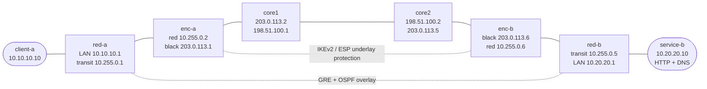

# Black Core Routing — Security Capstone

Build a conceptual black-core design with explicit red/plaintext networks, inline encryptor stand-ins, and a black/ciphertext transport core.

This lab is designed as a guided capstone with hints. You build the control plane and encryption yourself, then prove with routing state and packet capture that:

- red services live only on the plaintext side
- the black core carries only transport reachability
- after IPsec is enabled, the black core sees ciphertext while the red overlay still carries plaintext routing and service traffic

## How to use this lab

This is a **practice lab**, not a tutorial. The foundation is pre-built;
you produce the configuration from the objectives. **Predict each result
before you verify**, use the success criteria to grade yourself, and treat
the break-it steps and challenge questions as the real test.

## Topology



## Addressing

| Segment | Network | Endpoints |
|---------|---------|-----------|
| Site A red LAN | `10.10.10.0/24` | `client-a=10.10.10.10`, `red-a=10.10.10.1` |
| Site A red transit | `10.255.0.0/30` | `red-a=10.255.0.1`, `enc-a=10.255.0.2` |
| Black A edge | `203.0.113.0/30` | `enc-a=203.0.113.1`, `core1=203.0.113.2` |
| Black core middle | `198.51.100.0/30` | `core1=198.51.100.1`, `core2=198.51.100.2` |
| Black B edge | `203.0.113.4/30` | `core2=203.0.113.5`, `enc-b=203.0.113.6` |
| Site B red transit | `10.255.0.4/30` | `red-b=10.255.0.5`, `enc-b=10.255.0.6` |
| Site B red LAN | `10.20.20.0/24` | `red-b=10.20.20.1`, `service-b=10.20.20.10` |
| GRE overlay | `172.16.0.0/30` | `red-a tun0=172.16.0.1`, `red-b tun0=172.16.0.2` |

## Build And Deploy

```bash
docker build -t vyos:local -f Dockerfile.vyos .
docker build -t black-core-tools:local labs/black-core-routing/

./scripts/lab.sh deploy black-core-routing
```

Access examples:

```bash
./scripts/lab.sh cli black-core-routing red-a
./scripts/lab.sh cli black-core-routing enc-a
./scripts/lab.sh bash black-core-routing client-a
```

## What Is Preconfigured

- All node interfaces have IP addresses.
- `client-a` and `service-b` have IP addressing, default routes, and basic services.
- `red-a` and `red-b` already have static routes to the opposite transport subnet through their local encryptor.
- `service-b` runs:
  - HTTP on `10.20.20.10:80`
  - DNS on `10.20.20.10:53`, serving `red-service.lab -> 10.20.20.10`

Not preconfigured:

- black-core OSPF
- GRE between `red-a` and `red-b`
- red overlay OSPF
- IPsec on `enc-a` and `enc-b`

## Design Goal

By the end of the lab, you should be able to prove all of the following:

- the black core routes only transport prefixes, not red service prefixes
- `red-a` and `red-b` form a routed plaintext overlay over GRE
- `client-a` reaches `service-b` over the red overlay
- before IPsec, the black core can see raw GRE
- after IPsec, the black core sees IKE and ESP only
- the red side still sees plaintext routing and application traffic

## Task 1: Build The Black Core Underlay

Configure OSPF area 0 on:

- `enc-a`
- `core1`
- `core2`
- `enc-b`

Requirements:

- the black-facing links must form adjacencies
- the encryptors must advertise their local red transit subnet into the black core
- the red-facing encryptor interfaces should be passive

Use these router IDs:

| Node | Router ID |
|------|-----------|
| enc-a | `203.0.113.1` |
| core1 | `203.0.113.2` |
| core2 | `198.51.100.2` |
| enc-b | `203.0.113.6` |

Verify:

```vyos
show ip ospf neighbor
show ip route ospf
```

What you should notice:

- `enc-a` and `enc-b` now know how to reach the opposite red transport subnet
- the black core should learn `10.255.0.0/30` and `10.255.0.4/30`
- the black core should not know `10.10.10.0/24` or `10.20.20.0/24`

<details markdown="1">
<summary>Configuration — reveal if stuck</summary>

```vyos
# enc-a
configure
set protocols ospf parameters router-id '203.0.113.1'
set protocols ospf area 0 network '10.255.0.0/30'
set protocols ospf area 0 network '203.0.113.0/30'
set protocols ospf interface eth1 passive
commit
save
exit
```

```vyos
# core1
configure
set protocols ospf parameters router-id '203.0.113.2'
set protocols ospf area 0 network '203.0.113.0/30'
set protocols ospf area 0 network '198.51.100.0/30'
commit
save
exit
```

```vyos
# core2
configure
set protocols ospf parameters router-id '198.51.100.2'
set protocols ospf area 0 network '198.51.100.0/30'
set protocols ospf area 0 network '203.0.113.4/30'
commit
save
exit
```

```vyos
# enc-b
configure
set protocols ospf parameters router-id '203.0.113.6'
set protocols ospf area 0 network '203.0.113.4/30'
set protocols ospf area 0 network '10.255.0.4/30'
set protocols ospf interface eth2 passive
commit
save
exit
```

</details>

## Task 2: Prove Black-Side Transport Reachability

**Predict first:** the black core must route the *encrypted* transport but must never learn red-side (plaintext) routes. Before testing, predict what the black core's routing table will and will not contain, and what a black-core capture of red traffic shows.

Before building the overlay, confirm the red-router transport endpoints are reachable across the black core.

Examples:

```vyos
# on red-a
ping 10.255.0.5 count 3

# on red-b
ping 10.255.0.1 count 3
```

The black core is now carrying only transport reachability, not end-user service routes.

## Task 3: Build The Red Overlay

Configure a GRE tunnel between `red-a` and `red-b`:

- `red-a`
  - source `10.255.0.1`
  - remote `10.255.0.5`
  - `tun0` address `172.16.0.1/30`
- `red-b`
  - source `10.255.0.5`
  - remote `10.255.0.1`
  - `tun0` address `172.16.0.2/30`

Verify:

```vyos
show interfaces tunnel tun0
ping 172.16.0.2 count 3
```

Capture before IPsec:

```bash
./scripts/lab.sh capture black-core-routing core1 eth2 'gre'
```

At this point, the black core should be able to see raw GRE.

<details markdown="1">
<summary>Configuration — reveal if stuck</summary>

```vyos
# red-a
configure
set interfaces tunnel tun0 address '172.16.0.1/30'
set interfaces tunnel tun0 encapsulation 'gre'
set interfaces tunnel tun0 source-address '10.255.0.1'
set interfaces tunnel tun0 remote '10.255.0.5'
commit
save
exit
```

```vyos
# red-b
configure
set interfaces tunnel tun0 address '172.16.0.2/30'
set interfaces tunnel tun0 encapsulation 'gre'
set interfaces tunnel tun0 source-address '10.255.0.5'
set interfaces tunnel tun0 remote '10.255.0.1'
commit
save
exit
```

</details>

## Task 4: Run OSPF Across The Red Overlay

Run OSPF only on the red routers.

Requirements:

- advertise `10.10.10.0/24` from `red-a`
- advertise `10.20.20.0/24` from `red-b`
- form the adjacency over `tun0`
- keep the physical interfaces passive

Suggested router IDs:

- `red-a`: `10.10.10.1`
- `red-b`: `10.20.20.1`

Verify:

```vyos
show ip ospf neighbor
show ip route ospf
```

Then test the red-side service traffic:

```bash
./scripts/lab.sh exec black-core-routing client-a -- ping -c 3 10.20.20.10
./scripts/lab.sh exec black-core-routing client-a -- curl -s http://10.20.20.10
./scripts/lab.sh exec black-core-routing client-a -- dig @10.20.20.10 red-service.lab +short
```

Expected:

- red OSPF routes appear only on `red-a` and `red-b`
- `client-a` reaches the remote red service over the overlay
- the black core still does not have routes to the red LAN subnets

<details markdown="1">
<summary>Configuration — reveal if stuck</summary>

```vyos
# red-a
configure
set protocols ospf parameters router-id '10.10.10.1'
set protocols ospf area 0 network '10.10.10.0/24'
set protocols ospf area 0 network '172.16.0.0/30'
set protocols ospf interface eth1 passive
set protocols ospf interface eth2 passive
set protocols ospf interface tun0 network 'point-to-point'
commit
save
exit
```

```vyos
# red-b
configure
set protocols ospf parameters router-id '10.20.20.1'
set protocols ospf area 0 network '10.20.20.0/24'
set protocols ospf area 0 network '172.16.0.0/30'
set protocols ospf interface eth1 passive
set protocols ospf interface eth2 passive
set protocols ospf interface tun0 network 'point-to-point'
commit
save
exit
```

</details>

## Task 5: Protect The Red Transport Across The Black Core

Configure site-to-site IPsec on `enc-a` and `enc-b`.

Design:

- IKE peer addresses:
  - `enc-a` black IP `203.0.113.1`
  - `enc-b` black IP `203.0.113.6`
- protected prefixes:
  - Site A red transit `10.255.0.0/30`
  - Site B red transit `10.255.0.4/30`
- authentication:
  - IKEv2
  - PSK `BlackCoreLab123`

Verify:

```vyos
show vpn ike sa
show vpn ipsec sa
```

Re-test client traffic:

```bash
./scripts/lab.sh exec black-core-routing client-a -- ping -c 3 10.20.20.10
./scripts/lab.sh exec black-core-routing client-a -- curl -s http://10.20.20.10
```

Now capture on the black core again:

```bash
./scripts/lab.sh capture black-core-routing core1 eth2 'esp || isakmp || udp port 4500 || gre'
```

What should change:

- raw `gre` should disappear from the black core
- the black core should now see `ESP` and possibly IKE/NAT-T
- the red overlay and red services should still work normally

<details markdown="1">
<summary>Configuration — reveal if stuck</summary>

```vyos
# enc-a
configure
set vpn ipsec ike-group BLACK-CORE key-exchange 'ikev2'
set vpn ipsec ike-group BLACK-CORE proposal 10 encryption 'aes256'
set vpn ipsec ike-group BLACK-CORE proposal 10 hash 'sha256'
set vpn ipsec ike-group BLACK-CORE proposal 10 dh-group '14'

set vpn ipsec esp-group BLACK-CORE mode 'tunnel'
set vpn ipsec esp-group BLACK-CORE proposal 10 encryption 'aes256'
set vpn ipsec esp-group BLACK-CORE proposal 10 hash 'sha256'

set vpn ipsec authentication psk BLACK-CORE-PSK id '203.0.113.1'
set vpn ipsec authentication psk BLACK-CORE-PSK id '203.0.113.6'
set vpn ipsec authentication psk BLACK-CORE-PSK secret 'BlackCoreLab123'

set vpn ipsec site-to-site peer ENC-B remote-address '203.0.113.6'
set vpn ipsec site-to-site peer ENC-B authentication mode 'pre-shared-secret'
set vpn ipsec site-to-site peer ENC-B authentication local-id '203.0.113.1'
set vpn ipsec site-to-site peer ENC-B authentication remote-id '203.0.113.6'
set vpn ipsec site-to-site peer ENC-B connection-type 'initiate'
set vpn ipsec site-to-site peer ENC-B local-address '203.0.113.1'
set vpn ipsec site-to-site peer ENC-B ike-group 'BLACK-CORE'
set vpn ipsec site-to-site peer ENC-B default-esp-group 'BLACK-CORE'
set vpn ipsec site-to-site peer ENC-B tunnel 1 local prefix '10.255.0.0/30'
set vpn ipsec site-to-site peer ENC-B tunnel 1 remote prefix '10.255.0.4/30'

commit
save
exit
```

```vyos
# enc-b
configure
set vpn ipsec ike-group BLACK-CORE key-exchange 'ikev2'
set vpn ipsec ike-group BLACK-CORE proposal 10 encryption 'aes256'
set vpn ipsec ike-group BLACK-CORE proposal 10 hash 'sha256'
set vpn ipsec ike-group BLACK-CORE proposal 10 dh-group '14'

set vpn ipsec esp-group BLACK-CORE mode 'tunnel'
set vpn ipsec esp-group BLACK-CORE proposal 10 encryption 'aes256'
set vpn ipsec esp-group BLACK-CORE proposal 10 hash 'sha256'

set vpn ipsec authentication psk BLACK-CORE-PSK id '203.0.113.1'
set vpn ipsec authentication psk BLACK-CORE-PSK id '203.0.113.6'
set vpn ipsec authentication psk BLACK-CORE-PSK secret 'BlackCoreLab123'

set vpn ipsec site-to-site peer ENC-A remote-address '203.0.113.1'
set vpn ipsec site-to-site peer ENC-A authentication mode 'pre-shared-secret'
set vpn ipsec site-to-site peer ENC-A authentication local-id '203.0.113.6'
set vpn ipsec site-to-site peer ENC-A authentication remote-id '203.0.113.1'
set vpn ipsec site-to-site peer ENC-A connection-type 'initiate'
set vpn ipsec site-to-site peer ENC-A local-address '203.0.113.6'
set vpn ipsec site-to-site peer ENC-A ike-group 'BLACK-CORE'
set vpn ipsec site-to-site peer ENC-A default-esp-group 'BLACK-CORE'
set vpn ipsec site-to-site peer ENC-A tunnel 1 local prefix '10.255.0.4/30'
set vpn ipsec site-to-site peer ENC-A tunnel 1 remote prefix '10.255.0.0/30'

commit
save
exit
```

</details>

## Final Verification

Red side:

```bash
./scripts/lab.sh exec black-core-routing client-a -- ping -c 3 10.20.20.10
./scripts/lab.sh exec black-core-routing client-a -- curl -s http://10.20.20.10
./scripts/lab.sh exec black-core-routing client-a -- dig @10.20.20.10 red-service.lab +short
```

Overlay routing:

```vyos
# on red-a or red-b
show ip ospf neighbor
show ip route ospf
```

Black core:

```vyos
# on core1
show ip ospf neighbor
show ip route ospf
show ip route
```

You should be able to state:

- the black core knows only transport prefixes such as `10.255.0.0/30` and `10.255.0.4/30`
- the black core does not learn the red service prefixes `10.10.10.0/24` or `10.20.20.0/24`
- the red overlay carries plaintext routing and application traffic
- the black core carries ciphertext after IPsec is enabled

## Cleanup

```bash
./scripts/lab.sh destroy black-core-routing
```

## Challenge questions

No answers provided — reason them through.

1. A "black core" carries only encrypted transport and never sees plaintext
   or red-side routes. Explain what the core *must not* learn and how the
   design enforces that separation.
2. If the encryptors fail open vs. fail closed, what's the security and
   availability consequence of each? Which does this design choose and why?
3. Trace a red-side packet end to end: where is it encrypted, what does the
   black core route on, and where is the red-side reachability information
   actually exchanged?
4. Key compromise on one encryptor — what's the blast radius, and how does
   per-pair vs. group keying change it?

## Extensions

These are optional follow-on ideas to deepen the lab. They are not part of the validated base workflow.

- Add a packet capture on `enc-a` red-facing and black-facing interfaces simultaneously to compare the same flow before and after encryption.
- Summarize or filter transport routes in the black core and observe what breaks first when the GRE endpoints are no longer reachable.
- Replace PSK authentication with certificate-based IPsec and compare the operational state to the PSK version.
- Add a second red-side service and prove that the black core still has no knowledge of the service prefix while the red overlay carries it normally.
