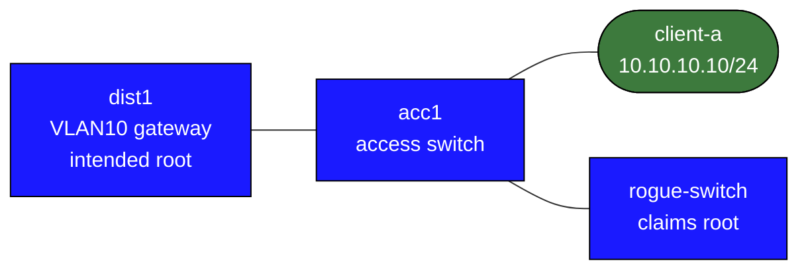

# campus-l2-hardening

This lab is a smaller companion to `stp-operations`. It isolates the edge-hardening controls that matter on real campus switches:

- PortFast
- BPDU Guard
- Root Guard
- storm control

## Topology



## Build and Deploy

```bash
docker build -t frr-lab:local images/frr/
docker import cEOS-lab-4.35.2F.tar ceos:4.35.2F
sudo containerlab deploy -t labs/campus-l2-hardening/topology.clab.yml
```

## What Is Prebuilt

- VLAN 10 user segment
- working trunk between `dist1` and `acc1`
- `client-a` access connectivity to the default gateway `10.10.10.1`
- `rogue-switch` available as the untrusted downstream switch for guard testing

## Tasks

### 1. Confirm the baseline

```bash
docker exec clab-campus-l2-hardening-client-a ping -c 3 10.10.10.1
```

If the first ping fails immediately after deploy, wait a few seconds for plain RSTP convergence on the unprotected edge port and retry.

On the switches:

```text
show spanning-tree vlan 10
show spanning-tree blockedports
```

### 2. Harden the true user edge

On `acc1 Ethernet2`, add:

- `spanning-tree portfast`
- BPDU Guard
- storm control

The goal is to treat a real host edge as a host edge, not as “just another switchport.”

### 3. Protect the untrusted downstream switch port

On `acc1 Ethernet3`, apply Root Guard so the rogue switch cannot take over the tree.

If you want to force an obvious superior-root event, temporarily lower the rogue switch priority:

```text
spanning-tree vlan-id 10 priority 0
```

Verify:

```text
show spanning-tree inconsistentports
show spanning-tree vlan 10
show logging last 20
```

## Verification Commands

```text
show spanning-tree vlan 10
show spanning-tree inconsistentports
show running-config interfaces Ethernet2
show running-config interfaces Ethernet3
show interfaces counters rates
show logging last 20
```

## What This Lab Teaches

- host-facing ports and switch-facing ports should not share the same trust model
- Root Guard and BPDU Guard solve different problems
- small edge protections stop campus-wide surprises
