# Carrier Ethernet Handoff — Practice Lab

Turn up two synthetic E-Line services across a provider NID/core, prove QinQ tag behavior and MTU acceptance, then diagnose a wrong cross-connect from observed tags. The CE is cEOS; the provider NIDs are Open vSwitch userspace bridges because cEOS 4.35.2F does not support the required QinQ mode in this environment.

## Topology

```mermaid
flowchart LR
    testera(["tester-a"])
    cea["ce-a<br/>customer edge"]
    nida["nid-a<br/>UNI demarcation"]
    pcore["p-core<br/>provider core<br/>802.1ad, MTU 1608"]
    nidb["nid-b<br/>UNI demarcation"]
    ceb["ce-b<br/>customer edge"]
    testerb(["tester-b"])

    testera --- cea
    cea -- "UNI<br/>C-VLAN 110 / 120" --- nida
    nida == "S-VLAN 3100 / 3120" ==> pcore
    pcore == "S-VLAN 3100 / 3120" ==> nidb
    nidb -- "UNI<br/>C-VLAN 110 / 120" --- ceb
    ceb --- testerb

    classDef ce stroke:#2eb872,stroke-width:2px
    classDef provider stroke:#9aa0a6,stroke-width:2px
    classDef host stroke:#6aa84f,stroke-width:2px
    class cea,ceb ce
    class nida,nidb,pcore provider
    class testera,testerb host
```



| Service | Customer VLAN | Provider S-VLAN | Addresses | PCP policy |
|---|---:|---:|---|---|
| Gold | 110 | 3100 | 192.0.2.0/30 | preserve 5 |
| Silver | 120 | 3120 | 198.51.100.0/30 | rewrite to 3 |

The committed IP MTU is **1600**. The provider links carry an extra 802.1ad tag and use MTU 1608. `10.70.0.0/24` is reserved provider management/OAM evidence only; it is not routed into either customer service.

## How to use this lab

This is a **practice lab**, not a tutorial. Each task gives you an **objective** and **hints** — your job is to produce the configuration.

- **Predict before you configure.** Commit to an answer before touching the CLI.
- **Open the hints before the solution.** The solution is an answer key, not step one.
- **Verify like an operator.** Prove state with show commands and captures.

## Deploy

```bash
docker build -t carrier-ethernet-tools:1.0.0 labs/carrier-ethernet-handoff/
./scripts/lab.sh deploy carrier-ethernet-handoff
```

`ceos:4.35.2F` must be imported as described in `docs/getting-started.md`. The lab starts with no CE trunks or provider flows: this is intentional.

## Task 1 — Review the service order (guided)

**Objective:** Read `labs/fixtures/carrier-cross-connects/service-order.md` and identify the committed VLAN map, MTU, PCP treatment, and contradiction before building anything.

**Predict first:** If VLAN 120 is placed in S-VLAN 3100, which healthy service can mask the mistake?

**Check your work:** Record that Gold (110/3100) can remain healthy while Silver is misdelivered. The circuit ID is explicitly synthetic.

## Task 2 — Build the UNI and QinQ handoff (hinted)

**Objective:** Make both CE links carry customer VLANs 110 and 120; configure the NIDs to push/pop S-VLAN 3100/3120 and the core to transport only those S-VLANs.

**Predict first:** At `nid-a:eth2`, how many tags should a VLAN 120 packet have, and which tag is outermost?

<details markdown="1"><summary>Hints</summary>

- On each CE, create both VLANs then make Ethernet1 and Ethernet2 trunks with only `110,120` allowed.
- On NIDs use `ovs-ofctl -O OpenFlow13 add-flow br-service`; ingress UNI needs `push_vlan:0x88a8`, `set_field` of the outer VID/PCP, and output to the core port.
- The OpenFlow VID value includes the present bit: 3100 is `0x1c1c`; 3120 is `0x1c30`.

</details>

<details markdown="1"><summary>Solution</summary>

```text
ce-a / ce-b:
enable
configure
vlan 110
vlan 120
interface Ethernet1
 switchport mode trunk
 switchport trunk allowed vlan 110,120
interface Ethernet2
 switchport mode trunk
 switchport trunk allowed vlan 110,120
end
write memory
```

On each NID, install four flows: UNI VLAN 110 -> push 0x88a8 / VID 0x1c1c / PCP 5 -> core; UNI VLAN 120 -> push / 0x1c30 / PCP 3 -> core; and the reverse two S-VLAN matches with `pop_vlan` to the UNI. On `p-core`, permit S-VLANs 3100 and 3120 bidirectionally without rewriting.

</details>

<details markdown="1"><summary>Check your work</summary>

Run `./scripts/lab.sh check carrier-ethernet-handoff`. Capture while sending a ping: `./scripts/lab.sh capture carrier-ethernet-handoff nid-a eth2 'vlan and vlan'`. Provider output must show outer 3100/3120 plus inner 110/120; CE-side captures show only the inner customer tag.

</details>

## Task 3 — Validate acceptance and PCP (hinted)

**Objective:** Prove bidirectional reachability, 1600-byte committed MTU, one-byte-over failure, throughput, and PCP policy; generate the signed-style report from measurements.

**Predict first:** Why can a 1600-byte IP MTU require a provider link MTU larger than 1600?

<details markdown="1"><summary>Hints</summary>

- Use `ping -I eth1.110 -M do -s 1572`; IP+ICMP headers make this a 1600-byte IP packet.
- A `-s 1573` probe must fail with DF. Use `iperf3` bound to the Gold source address.
- Observe the outer PCP on a provider capture; it is 5 for Gold and 3 for Silver.

</details>

<details markdown="1"><summary>Solution</summary>

```bash
./scripts/lab.sh check carrier-ethernet-handoff
./scripts/lab.sh cmd carrier-ethernet-handoff tester-a -- ping -I eth1.110 -M do -c 3 -s 1572 192.0.2.2
./scripts/lab.sh cmd carrier-ethernet-handoff tester-a -- iperf3 -c 192.0.2.2 -B 192.0.2.1 -t 3
labs/carrier-ethernet-handoff/acceptance.sh /tmp/ceh-acceptance.md
```

</details>

<details markdown="1"><summary>Check your work</summary>

Both services pass in both directions; cross-service and provider-management reachability are denied. The report contains measured output, not asserted values.

</details>

## Task 4 — Interpret OAM and physical evidence (hinted)

**Objective:** Use the checked fixture to distinguish CFM evidence from live OAM, calculate the optical budget, and identify the wrong patch mapping and legacy boundary.

<details markdown="1"><summary>Hints</summary>

- Run `labs/fixtures/carrier-cross-connects/validate.sh` after recording answers in the worksheet.
- CFM is evidence-only here: OVS exposes CFM state fields, but host userspace datapath behavior did not yield a reliable CCM/LBM/LTM test.

</details>

<details markdown="1"><summary>Solution</summary>

The fixture’s expected deductions identify 2.2 dB calculated loss, a wrong B-to-D patch, and T1/SONET as hardware/legacy boundaries terminating before the modern NID/pseudowire.

</details>

<details markdown="1"><summary>Check your work</summary>

The validator reports all four expected deductions. Do not represent DOM, FEC/BER, or optical readings as live ContainerLab output.

</details>

## Task 5 — Escalate a demarc fault (open)

**Objective:** Given intermittent loss on Silver, create a minimal provider escalation packet: circuit, time window, direction, frame size, affected S-VLAN, demarc capture, OAM/evidence result, and acceptance result. Do not prescribe the provider fix.

**Predict first:** What single capture observation establishes that the fault is at or beyond the NID rather than in the CE?

<details markdown="1"><summary>Hint</summary>

Use `report-template.md`; include facts and timestamps, not assumptions about optics.

</details>

<details markdown="1"><summary>Solution</summary>

An acceptable escalation identifies SYNTH-CEH-001, Silver/120/3120, the observed direction and size, the NID/core tag evidence, and explicitly labels CFM and physical data as evidence-only.

</details>

<details markdown="1"><summary>Check your work</summary>

All required fields are present, and the report separates observed packet facts from requested provider investigation.

</details>

## Break-It — Diagnose the wrong cross-connect

Run `labs/carrier-ethernet-handoff/break-it.sh`. Gold stays healthy; only Silver is delivered on the wrong S-VLAN. Do not read the script before diagnosing: compare a provider capture and `ovs-ofctl dump-flows br-service` against the service order, make the smallest NID-B VLAN-120 mapping repair, then rerun `check.sh`.

## Verification

```bash
./scripts/lab.sh check carrier-ethernet-handoff
./scripts/lab.sh destroy carrier-ethernet-handoff --cleanup
```

## Challenge questions

1. How would you prove an NID is preserving versus rewriting customer PCP without trusting its configuration?
2. Which acceptance threshold changes when a carrier commits to a 2000-byte service MTU?
3. What evidence would distinguish a one-way provider policing fault from a CE return-path fault?

## Troubleshooting

**Neither service passes:** verify the VLANs exist on each CE; a trunk with allowed but inactive VLANs forwards nothing.

**Only one service fails:** capture on `nid-a:eth2` and inspect each NID’s flow table before changing either CE.

**CFM commands/counters are absent:** this is expected on the selected userspace OVS fallback; complete the provenance-labeled evidence exercise instead.
