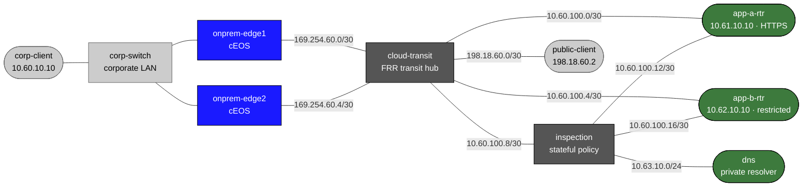

# Cloud and Hybrid Networking — Practice Lab

Build a provider-neutral hybrid path: a dual-attached enterprise reaches a private
cloud application through a transit domain and a centralized inspection point.
The containers run real eBGP, Linux policy routing, nftables conntrack, BIND views,
captures, and TLS; they do **not** reproduce AWS/Azure/GCP control planes, IAM,
billing, or private-circuit provisioning.

## Topology



### Link addressing

| Link | Subnet | Endpoints |
|---|---|---|
| Edge 1 transit attachment | `169.254.60.0/30` | edge1 `.1`, transit `.2` |
| Edge 2 transit attachment | `169.254.60.4/30` | edge2 `.5`, transit `.6` |
| Corporate LAN | `10.60.10.0/24` | edge1 `.1`, edge2 `.2`, client `.10` |
| Transit A/B control links | `10.60.100.0/30`, `10.60.100.4/30` | transit `.1/.5`, App A `.2`, App B `.6` |
| Inspection paths | `10.60.100.8/30`, `.12/30`, `.16/30` | transit `.9`, inspection `.10/.13/.17`, App A `.14`, App B `.18` |
| Private DNS | `10.63.10.0/24` | inspection `.1`, DNS `.53` |
| Untrusted client | `198.18.60.0/30` | transit `.1`, public `.2` |

### Node reference

| Node | Role |
|---|---|
| `onprem-edge1`, `onprem-edge2` | cEOS enterprise edges, AS 65060 |
| `cloud-transit` | FRR transit hub, AS 65100; static routes model explicit propagation |
| `app-a-rtr`, `app-b-rtr` | isolated cloud routing domains, AS 65201/65202 |
| `inspection` | central forwarding and stateful workload policy |
| `dns` | BIND private/untrusted views |

## How to use this lab

This is a **practice lab**, not a tutorial. Each task gives you an **objective** and **hints** — your job is to produce the configuration.

- **Predict before you configure.** Commit to an answer before touching the CLI.
- **Open the hints before the solution.** The solution toggle is the answer key.
- **Verify like an operator.** Prove the state with control-plane and data-plane evidence.

## Deploy

```bash
docker build -t cloud-lab:local labs/cloud-hybrid-networking/
./scripts/lab.sh deploy cloud-hybrid-networking
./scripts/lab.sh cli cloud-hybrid-networking onprem-edge1
```

The local image is built from pinned `quay.io/frrouting/frr@sha256:fc7f…45eeea`.
It adds BIND 9.20.23, nftables 1.1.3, conntrack-tools 1.4.8, curl, tcpdump, and
OpenSSL. Startup provides addresses and the HTTPS listener only; the hybrid
routing, route associations, policy, and DNS views are deliberately absent.

## Task 1 — Inventory the empty control planes (guided)

**Objective:** Identify the initially empty BGP, cloud route-table, DNS, and policy state.

**Predict first:** Which node should own a return-path decision for traffic sourced by `10.61.10.10`?

```bash
./scripts/lab.sh cmd cloud-hybrid-networking cloud-transit -- vtysh -c 'show bgp summary'
./scripts/lab.sh cmd cloud-hybrid-networking app-a-rtr -- ip route show table 101
./scripts/lab.sh cmd cloud-hybrid-networking inspection -- nft list ruleset
./scripts/lab.sh cmd cloud-hybrid-networking corp-client -- dig @10.63.10.53 api.prod.corp
```

<details markdown="1">
<summary>Hints</summary>

- Table 101 is App A's modelled association table.
- An empty result is expected before Tasks 2–6.

</details>

<details markdown="1">
<summary>Solution</summary>

No configuration: record the empty output and your prediction.

</details>

<details markdown="1">
<summary>Check your work</summary>

`show bgp summary` has no established peers; table 101 and the BIND answer are absent.
That separates prebuilt plumbing from the mechanisms you will configure.

</details>

## Task 2 — Build the redundant hybrid attachments

**Objective:** Establish eBGP from both edges to transit, advertise only `10.60.10.0/24`, prefer Edge 1 at transit, and leave Edge 1 a high-distance static backup through Edge 2.

**Predict first:** When Edge 1's transit attachment fails, which BGP path should transit retain and why is the static route not preferred while BGP is healthy?

<details markdown="1">
<summary>Hints</summary>

- Edges are AS 65060; transit is AS 65100. Activate IPv4 unicast and send standard communities on EOS.
- On transit, use an inbound route-map on Edge 1 to set local preference 200.
- `ip route 10.61.10.10/32 10.60.10.2 250` and `ip route 10.63.10.0/24 10.60.10.2 250` are deliberately less preferred than eBGP.

</details>

<details markdown="1">
<summary>Solution</summary>

On Edge 1 configure BGP 65060, neighbor `169.254.60.2 remote-as 65100`, activate
it under IPv4, advertise `10.60.10.0/24`, and add the high-distance App A route via
`10.60.10.2`. Repeat on Edge 2 with neighbor `169.254.60.6`. On `cloud-transit`,
configure BGP 65100 with those two peers and `no bgp ebgp-requires-policy`; apply
`route-map PREFER-EDGE1 permit 10` / `set local-preference 200` inbound on Edge 1.

</details>

<details markdown="1">
<summary>Check your work</summary>

`show ip bgp summary` on both edges is `Estab`. `show bgp summary` on transit lists
both `169.254.60.1` and `.5`; the selected corporate path uses Edge 1.

</details>

## Task 3 — Associate and propagate only approved cloud routes

**Objective:** Advertise each application loopback to transit, then use explicit static propagation through inspection for App A/App B/DNS. Do not install a default route in a cloud routing domain.

**Predict first:** Why does a BGP route learned over App A's direct control link not prove that the application flow uses that link?

<details markdown="1">
<summary>Hints</summary>

- App A and App B are AS 65201 and 65202, with transit peers `.1` and `.5`.
- Advertise `10.61.10.10/32` and `10.62.10.10/32`.
- Transit static propagation is via inspection `10.60.100.10`; redistribute only those static routes to BGP.

</details>

<details markdown="1">
<summary>Solution</summary>

Configure the two App routers as eBGP peers and advertise their loopbacks. On transit
add static routes for App A, App B, and `10.63.10.0/24` through `10.60.100.10`, then
`redistribute static` under IPv4 BGP. On inspection add routes to corporate via
`10.60.100.9`, App A via `.14`, and App B via `.18`. Add App A/App B DNS routes via
inspection (`.13`/`.17`) and add DNS return routes for corporate, cloud, and public
prefixes through `10.63.10.1`.

</details>

<details markdown="1">
<summary>Check your work</summary>

Transit has no data-plane default route. App A's table 101 contains no App B route,
which makes the App A/App B isolation a route-domain property rather than a failed ping.

</details>

## Task 4 — Steer App A symmetrically through inspection

**Objective:** Associate App A source traffic with table 101 and send its corporate return traffic through inspection.

**Predict first:** If the forward SYN goes through inspection but App A uses its direct transit link for the reply, will a stateful firewall necessarily see a complete flow?

<details markdown="1">
<summary>Hints</summary>

- Use `ip rule add from 10.61.10.10/32 table 101 priority 101` on App A.
- Table 101's corporate route must use `10.60.100.13`, not the direct transit peer.
- Inspect with `ip route get 10.60.10.10 from 10.61.10.10`.

</details>

<details markdown="1">
<summary>Solution</summary>

```bash
./scripts/lab.sh cmd cloud-hybrid-networking app-a-rtr -- sh -lc \
  'ip rule add from 10.61.10.10/32 table 101 priority 101; ip route replace table 101 10.60.10.0/24 via 10.60.100.13'
```

</details>

<details markdown="1">
<summary>Check your work</summary>

The route-get command reports `via 10.60.100.13 … table 101`. This is the modelled
route-table association; a main-table host route cannot satisfy the check.

</details>

## Task 5 — Layer stateful and stateless policy

**Objective:** Permit only corporate HTTPS to App A through inspection, then permit both directions explicitly in App A's stateless subnet ACL.

**Predict first:** Which counter changes when the stateful workload policy permits the request, and which changes when the stateless reverse rule is required?

<details markdown="1">
<summary>Hints</summary>

- Inspection `forward` uses `ct state established,related` plus an HTTPS new-flow rule.
- App A uses separate `input` and `output` chains; do not use conntrack there for the HTTPS pair.
- Preserve BGP TCP/179 and DNS/53 exceptions.

</details>

<details markdown="1">
<summary>Solution</summary>

Load an `inet inspection` forward chain with policy `drop`, an established/related
counter rule, a new `10.60.10.0/24 → 10.61.10.10 tcp dport 8443` rule, and DNS/53
exceptions to `10.63.10.53`. On App A, load an `inet app_a_acl` input/output pair
with policy `drop`; permit the same inbound HTTPS tuple and the reverse tuple with
`ip saddr 10.61.10.10 … tcp sport 8443`. Keep the BGP and DNS exceptions described
in the hints.

</details>

<details markdown="1">
<summary>Check your work</summary>

After a request, `nft list chain inet inspection forward` has both a new HTTPS and
an established/related counter. Removing either policy layer produces a distinct
counter and reachability symptom.

</details>

## Task 6 — Publish private split-horizon DNS

**Objective:** Serve `api.prod.corp → 10.61.10.10` to corporate/cloud sources only; untrusted sources must not receive that record.

**Predict first:** What should a query from `198.18.60.2` return if it reaches the same resolver?

<details markdown="1">
<summary>Hints</summary>

- BIND views match the corporate and cloud ranges before `any`.
- The supplied zone data is at `/configs/db.prod.corp`; use a separate empty zone for the untrusted view.

</details>

<details markdown="1">
<summary>Solution</summary>

Copy `/configs/named.conf.solution`, `/configs/db.prod.corp`, and `/configs/db.empty`
to `/etc/bind/`, ensure both zone files are readable by the `named` user (`chmod 644`),
start `named -c /etc/bind/named.conf`, and point the corporate client resolver at
`10.63.10.53`.

</details>

<details markdown="1">
<summary>Check your work</summary>

`dig @10.63.10.53 api.prod.corp +short` returns `10.61.10.10` from corporate/App A/App B,
while the public client gets no private A record. The difference is a source-aware DNS
view, not an unreachable DNS server.

</details>

## Task 7 — Decide the overlap response (open)

**Objective:** Enable the disabled `10.60.10.0/24` App B conflict fixture and choose one response: renumber it, keep it non-transitive, or build tightly scoped translation.

**Predict first:** Which existing enterprise destination becomes ambiguous, and what blast radius follows from leaking the conflicting prefix into transit?

<details markdown="1">
<summary>Hints</summary>

- Start with `ip route show table 102` on App A and `show bgp ipv4 unicast` on transit.
- The simplest validated response is to keep the fixture non-transitive: do not add it to table 102 or redistribute it.

</details>

<details markdown="1">
<summary>Solution</summary>

Keep the conflict fixture isolated: do not install or advertise `10.60.10.0/24` from
App B. Document the rejected overlap and the reason; production alternatives are
renumbering or a narrowly defined NAT boundary, each with materially different operations.

</details>

<details markdown="1">
<summary>Check your work</summary>

`ip route show table 102` has no `10.60.10.0/24`; transit keeps the genuine corporate
prefix and no competing cloud advertisement.

</details>

## Task 8 — Break-It: diagnose an asymmetric return path

**Objective:** Start from an HTTPS symptom, prove why inspection is missing the reply, and make the smallest association repair.

```bash
./labs/cloud-hybrid-networking/break-it.sh
./scripts/lab.sh cmd cloud-hybrid-networking corp-client -- curl -ks https://api.prod.corp:8443
./scripts/lab.sh cmd cloud-hybrid-networking app-a-rtr -- ip route get 10.60.10.10 from 10.61.10.10
./scripts/lab.sh cmd cloud-hybrid-networking inspection -- nft list chain inet inspection forward
./scripts/lab.sh capture cloud-hybrid-networking inspection eth1 'tcp port 8443'
./scripts/lab.sh capture cloud-hybrid-networking inspection eth2 'tcp port 8443'
```

**Predict first:** Why can DNS resolution and the initial SYN both look healthy while policy correctness is still false?

<details markdown="1">
<summary>Hints</summary>

- Compare the route-get next hop with `.13` (inspection) and `.1` (direct transit).
- A successful application response is not sufficient: the intended association and both inspection directions must agree.

</details>

<details markdown="1">
<summary>Solution</summary>

```bash
./labs/cloud-hybrid-networking/repair-break-it.sh
./scripts/lab.sh check cloud-hybrid-networking
```

</details>

<details markdown="1">
<summary>Check your work</summary>

The broken state makes `check.sh` fail its table-101 association assertion even if a
host-route workaround preserves reachability. After repair, route-get uses `.13` and
the inspection request/reply counters advance.

</details>

## Verification

```bash
./scripts/lab.sh check cloud-hybrid-networking
```

The check verifies both BGP sessions, preferred/backup routing, private DNS visibility,
App A HTTPS, App B isolation, stateful inspection evidence, no cloud default route, no
active overlap fixture, and fresh-session primary-attachment failover.

## Provider terminology translation

| Provider-neutral lab term | AWS | Azure | GCP |
|---|---|---|---|
| Application routing domain | VPC route table | VNet/UDR | VPC route domain |
| Transit hub | Transit Gateway | Virtual WAN / hub VNet | Network Connectivity Center |
| Stateful workload policy | Security group | NSG | firewall policy |
| Stateless subnet ACL | NACL | subnet rule/UDR boundary | VPC firewall rule boundary |
| Private DNS view | Route 53 Resolver | Private DNS | Cloud DNS |

## Challenge questions

1. How would you prevent an acquisition overlap from leaking while a renumbering plan is underway?
2. What new failure domains appear when a managed transit hub scales to hundreds of route tables?
3. Where should cloud resolver endpoints sit when applications span regions and on-premises sites?
4. Why does a successful TCP handshake fail to prove that a stateful policy is correctly enforced?
5. Which parts of HA in a managed cloud gateway cannot be inferred from this topology?

## Troubleshooting

| Symptom | Likely evidence | Minimal correction |
|---|---|---|
| No private DNS answer | `dig`, BIND view logs, DNS route | add the source range/route; do not publish the private zone publicly |
| SYN reaches App A but no inspection reply evidence | table-101 route-get and two inspection captures | associate return traffic with `.13` |
| Both cloud apps are reachable | App A table 101 and transit BGP table | remove the unintended propagation; do not add a default route |
| Primary attachment loss breaks a new session | edge BGP summary and Edge 1 route table | restore Edge 2 advertisement/high-distance backup |

## Limitations

This lab is not a provider control plane or a claim about managed-gateway HA,
availability-zone underlay, IAM, billing, Direct Connect/ExpressRoute/Interconnect,
or GUI workflows. The overlap decision is live routing evidence; no production NAT
implementation is claimed as complete.
