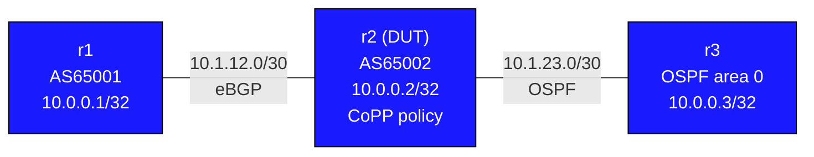

# Control Plane Policing (CoPP) — Practice Lab

You will protect the control plane of **r2** by classifying inbound traffic (BGP, OSPF, ICMP, SSH, ARP) into priority tiers and policing each class to a rate limit. The BGP session to r1 and OSPF adjacency to r3 are already running — your job is to build the CoPP policy on top of the live network without breaking those adjacencies.

---

## Topology



### Link addressing

| Link    | Subnet        | Left             | Right            | Protocol |
|---------|---------------|------------------|------------------|----------|
| r1 — r2 | 10.1.12.0/30  | 10.1.12.1 (r1)   | 10.1.12.2 (r2)   | eBGP     |
| r2 — r3 | 10.1.23.0/30  | 10.1.23.1 (r2)   | 10.1.23.2 (r3)   | OSPF     |

### Node reference

| Node | Loopback     | Role                        | AS / Area  |
|------|--------------|-----------------------------|------------|
| r1   | 10.0.0.1/32  | eBGP peer (traffic source)  | AS65001    |
| r2   | 10.0.0.2/32  | CoPP DUT                    | AS65002    |
| r3   | 10.0.0.3/32  | OSPF neighbor (traffic src) | OSPF area 0|

---

## Background

The **control plane** is the CPU-bound process that handles routing protocols, management sessions, and network infrastructure packets. Without protection, a flood of ICMP, bogus BGP connections, or malformed packets can starve critical protocols (OSPF hellos, BGP keepalives) and cause adjacency drops.

CoPP applies QoS policing to traffic *destined to the control plane* — not transit traffic. The pipeline is:

```
Inbound packet → ACL match → class-map → policy-map → police/permit/drop → CPU
```

EOS applies CoPP via a `policy-map type copp` applied inbound on the `control-plane` pseudo-interface. EOS has a built-in default system CoPP policy (`copp-system-policy`); when you apply your own, it replaces the default for that direction.

---

## Deploy and access

```bash
sudo containerlab deploy -t labs/copp-basics/topology.yml

# Open CLI on r2 (DUT)
docker exec -it clab-copp-basics-r2 Cli

# Or use helper
./scripts/lab.sh Cli copp-basics r2
```

Wait ~15 seconds for BGP and OSPF to converge before starting.

---

## Step 1 — Verify the baseline

Before configuring CoPP, confirm the existing adjacencies are healthy and check whether any CoPP policy is active.

```
show bgp summary
show ip ospf neighbor
show policy-map type copp
```

You should see:
- BGP peer 10.1.12.1 (r1) in `Estab` state
- OSPF neighbor 10.1.23.2 (r3) in `FULL` state
- `show policy-map type copp` may show `copp-system-policy` (EOS default) or nothing

---

## Step 2 — Define ACLs for traffic classification

Create one ACL per traffic type. These ACLs match packets heading to r2's control plane.

### r2

<details>
<summary>Show configuration</summary>

```
ip access-list CoPP-BGP
   permit tcp any any eq bgp
   permit tcp any eq bgp any
!
ip access-list CoPP-OSPF
   permit ospf any any
!
ip access-list CoPP-ICMP
   permit icmp any any
!
ip access-list CoPP-SSH
   permit tcp any any eq 22
!
ip access-list CoPP-ARP
   permit arp any any
```
</details>

Verify:
```
show ip access-lists
```

---

## Step 3 — Define class-maps

A `class-map type copp` classifies packets using the ACLs above. Each class is evaluated in order; the first match wins.

### r2

<details>
<summary>Show configuration</summary>

```
class-map type copp match-any CLASS-BGP
   match ip access-group CoPP-BGP
!
class-map type copp match-any CLASS-OSPF
   match ip access-group CoPP-OSPF
!
class-map type copp match-any CLASS-ICMP
   match ip access-group CoPP-ICMP
!
class-map type copp match-any CLASS-SSH
   match ip access-group CoPP-SSH
!
class-map type copp match-any CLASS-ARP
   match arp access-group CoPP-ARP
```
</details>

Verify:
```
show class-map type copp
```

---

## Step 4 — Build the policy-map

The policy-map assigns a **police rate** to each class. Traffic within the rate is forwarded to the CPU; traffic exceeding it is dropped.

The rates below are deliberately conservative for a lab — in production, BGP and OSPF rates would be higher.

### r2

```
policy-map type copp COPP-POLICY
   class CLASS-BGP
      police rate 1 mbps burst-size 64 kb
   !
   class CLASS-OSPF
      police rate 512 kbps burst-size 32 kb
   !
   class CLASS-ICMP
      police rate 100 kbps burst-size 8 kb
   !
   class CLASS-SSH
      police rate 1 mbps burst-size 64 kb
   !
   class CLASS-ARP
      police rate 256 kbps burst-size 16 kb
   !
   class class-default
      police rate 64 kbps burst-size 8 kb
```

Verify:
```
show policy-map type copp COPP-POLICY
```

---

## Step 5 — Apply the policy to the control plane

### r2

```
control-plane
   service-policy input COPP-POLICY
```

Verify the policy is active:
```
show policy-map type copp
```

You should see `COPP-POLICY` listed as the active input policy on the control-plane.

---

## Step 6 — Verify and watch counters

### Check the policy counters

```
show policy-map type copp
```

Look for the `Matched` and `Dropped` counters per class. Initially they may be low — the next step generates traffic.

### Generate ICMP traffic

From **r3**, send a burst of pings to r2's interface:

```
ping 10.1.23.1 repeat 500 size 1000
ping 10.0.0.2 repeat 500 source 10.0.0.3
```

Then on **r2**, check that `CLASS-ICMP` counters incremented:

```
show policy-map type copp
```

You should see packets matched and (if rate exceeded) dropped in `CLASS-ICMP`.

### Confirm BGP and OSPF are unaffected

```
show bgp summary
show ip ospf neighbor
```

Both adjacencies should remain `Estab` / `FULL`. This is the key validation: CoPP is policing ICMP without impacting the routing protocols.

### Check BGP class counters

BGP keepalives flow every 60 seconds by default. To see them match the `CLASS-BGP` class sooner, lower the keepalive timer temporarily:

```
router bgp 65002
   neighbor 10.1.12.1 timers 5 15
```

Then watch `show policy-map type copp` — `CLASS-BGP` should show increasing match counts.

---

## Experiments

### 1 — Lower the ICMP rate limit and observe drops

Set a very low ICMP rate to force drops:

```
policy-map type copp COPP-POLICY
   class CLASS-ICMP
      police rate 8 kbps burst-size 1 kb
```

Then flood pings from r3:
```
ping 10.1.23.1 repeat 1000 interval 0
```

Watch `show policy-map type copp` — `Dropped` counter for `CLASS-ICMP` should climb while BGP and OSPF remain stable.

### 2 — Remove class-default and observe unclassified traffic

Delete the `class-default` police entry and observe what happens to unclassified traffic (everything not in your named classes). Does it reach the CPU unconstrained? How would you fix this in production?

### 3 — Add a high-priority class for routing protocol traffic

Combine BGP and OSPF into a single `CLASS-ROUTING` class with the highest rate limit. Move it to the top of the policy-map. Does the order of classes matter in CoPP?

### 4 — Simulate a BGP reset attack

From r1, try to repeatedly open raw TCP connections to port 179 on r2:

```
bash -c "for i in $(seq 1 100); do timeout 0.1 bash -c 'echo > /dev/tcp/10.1.12.2/179' 2>/dev/null; done"
```

Watch `CLASS-BGP` counters — does the legitimate BGP session survive?

---

## Verification summary

| Check | Command | Expected |
|-------|---------|----------|
| Active CoPP policy | `show policy-map type copp` | COPP-POLICY input |
| Per-class counters | `show policy-map type copp` | Matched packets per class |
| BGP stays up | `show bgp summary` | Estab |
| OSPF stays up | `show ip ospf neighbor` | FULL |
| ACLs defined | `show ip access-lists` | 4 CoPP-* ACLs |
| Class-maps | `show class-map type copp` | 5 CLASS-* entries |

---

## Troubleshooting

**BGP session dropped after applying CoPP**
- The `CLASS-BGP` rate is too low, or the ACL doesn't match TCP 179 in both directions
- Verify: `show ip access-lists CoPP-BGP` — check both `permit tcp any any eq bgp` AND `permit tcp any eq bgp any` are present
- Temporarily remove CoPP (`no service-policy input` under `control-plane`) to restore the session, then fix the rate

**OSPF neighbor dropped to INIT or DOWN**
- `CLASS-OSPF` rate too low — OSPF hello interval is 10s but hellos must get through reliably
- Increase the OSPF class rate: `police rate 1 mbps burst-size 64 kb`

**`show policy-map type copp` shows no matched packets**
- CoPP ACLs may not be matching — verify ACL syntax and that `match ip access-group` references the correct ACL name
- Send test traffic (ping) and recheck counters

**`class-map type copp` — `match arp` syntax error**
- ARP is not IP, so use `match arp access-group` (not `match ip access-group`) for the ARP class
- Alternatively, skip ARP classification and rely on `class-default` for ARP

**Policy-map changes not taking effect**
- After modifying an active policy-map, the changes apply immediately in EOS — no need to re-apply under `control-plane`
- Confirm with `show policy-map type copp`
