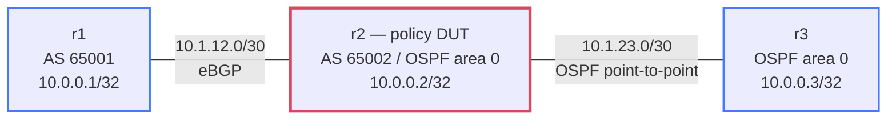

# Control Plane Policing (CoPP) — Practice Lab

Build a software control-plane policing reference on **r2** while live eBGP
and OSPF sessions carry routes around it. You will classify traffic entering
the Linux host, apply per-class token-bucket limits, prove accept and drop
counters with bounded traffic, and demonstrate that transit traffic never
enters the control-plane policy.

This lab deliberately uses Linux `iptables` on a purpose-built FRR image. It
models the classification, rate, counter, and attachment decisions behind
CoPP; it does **not** claim hardware forwarding, ASIC queues, punt paths, or a
specific network vendor's CoPP implementation.

## Topology



### Link addressing

| Link | Subnet | Left address | Right address | Protocol |
|---|---|---|---|---|
| r1 — r2 | `10.1.12.0/30` | r1 `10.1.12.1` | r2 `10.1.12.2` | eBGP |
| r2 — r3 | `10.1.23.0/30` | r2 `10.1.23.1` | r3 `10.1.23.2` | OSPF |

### Node reference

| Node | Loopback | Role | Routing domain |
|---|---|---|---|
| r1 | `10.0.0.1/32` | BGP peer and transit source | AS 65001 |
| r2 | `10.0.0.2/32` | Software control-plane policy DUT | AS 65002 and OSPF area 0 |
| r3 | `10.0.0.3/32` | OSPF peer and local-traffic source | OSPF area 0 |

The supplied routing scaffold redistributes the required loopback routes so a
ping from r1's loopback to r3's loopback crosses r2 in both directions.

## How to use this lab

This is a **practice lab**, not a tutorial. Each task gives you an
**objective** and **hints** — your job is to produce the configuration.

- **Predict before you configure.** When a task asks for a prediction,
  commit to an answer before touching the CLI. Being wrong and finding out
  why is the point.
- **Open the hints before the solution.** The solution toggle is the answer
  key — use it to check your work or when genuinely stuck, not as step one.
- **Verify like an operator.** After each task, prove the state is what you
  think it is with `show` commands before moving on.

## Deploy and access

Build the repository-owned image, then deploy the lab:

```bash
docker build -t copp-lab:local labs/copp-basics/
./scripts/lab.sh deploy copp-basics
```

Open the Linux shell on r2 for `iptables`, and use FRR's CLI for routing
state:

```bash
./scripts/lab.sh shell copp-basics r2
./scripts/lab.sh cli copp-basics r2
```

The image is built from the immutable external base
`quay.io/frrouting/frr@sha256:fc7f887ab4d8da06f481a4f8d59afded88b3c5823f03610a7e808f7eba45eeea`
and adds the exact package versions needed by this lab. Allow a few seconds
for the fast lab BGP and OSPF timers to converge before Task 1.

## Background: INPUT is not FORWARD

Linux presents two different paths that matter here:

```text
packet addressed to r2  -> INPUT   -> r2 processes the packet
packet crossing r2      -> FORWARD -> r2 routes the packet onward
```

The policy you build is reached only from `INPUT`. BGP TCP segments, OSPF
protocol 89 packets, and pings addressed to r2 are control-plane traffic in
this model. A ping from `10.0.0.1` through r2 to `10.0.0.3` is transit data
traffic and belongs to `FORWARD`, even though r2 makes the routing decision.

The `limit` match is a token bucket: an initial burst can be accepted, tokens
refill at the configured average rate, and the following rule decides what
happens when no token is available. Counters on both rules make that behavior
visible.

## Task 1 — Establish the baseline and predict the packet paths

**Objective:** Prove that eBGP, OSPF, and bidirectional loopback transit are
healthy before adding policy. Record which chain should see each of these:
an OSPF hello to r2, a ping to r2's `10.1.23.1`, and a ping through r2 from
`10.0.0.1` to `10.0.0.3`.

**Predict first:** Which two packets enter `INPUT`, which packet enters
`FORWARD`, and why does the forwarding packet not count as control-plane
traffic?

<details markdown="1">
<summary>Hints</summary>

- FRR can show a specific BGP neighbor and the OSPF neighbor table.
- Use a sourced ping between the two loopbacks so the return route is tested,
  not merely the connected links.
- Inspect the initial filter table before adding anything; no `COPP` chain is
  supplied at startup.

</details>

<details markdown="1">
<summary>Solution</summary>

From the repository root:

```bash
./scripts/lab.sh cmd copp-basics r1 -- \
  vtysh -c 'show bgp neighbor 10.1.12.2'
./scripts/lab.sh cmd copp-basics r2 -- \
  vtysh -c 'show ip ospf neighbor'
./scripts/lab.sh cmd copp-basics r1 -- \
  ping -c 3 -w 6 -I 10.0.0.1 10.0.0.3
./scripts/lab.sh cmd copp-basics r3 -- \
  ping -c 3 -w 6 -I 10.0.0.3 10.0.0.1
./scripts/lab.sh cmd copp-basics r2 -- iptables -S INPUT
./scripts/lab.sh cmd copp-basics r2 -- iptables -S FORWARD
```

</details>

<details markdown="1">
<summary>Check your work</summary>

The BGP neighbor state is `Established`, r2 reports router ID `10.0.0.3` as
`Full`, and both sourced pings succeed. The OSPF hello and ping addressed to
r2 are local delivery and therefore enter `INPUT`. The loopback-to-loopback
ping enters `FORWARD`; its destination is r3, not an address owned by r2.

</details>

## Task 2 — Build the classifier chains

**Objective:** On r2, create `COPP` as the dispatcher and three class chains:
`COPP-BGP`, `COPP-OSPF`, and `COPP-ICMP`. Dispatch either direction of
TCP/179 to the BGP class, IP protocol 89 to the OSPF class, and ICMP echo
requests to the ICMP class. Unclassified packets must return to `INPUT`.

**Predict first:** Why must the dispatcher match both source and destination
TCP port 179, while the OSPF classifier needs no UDP or TCP port?

<details markdown="1">
<summary>Hints</summary>

- Create user-defined chains with `iptables -N`; append ordered rules with
  `iptables -A`.
- A BGP connection has one endpoint using TCP/179, so packets in opposite
  directions expose that port in different fields.
- OSPF is IP protocol 89. ICMP echo-request is a specific ICMP type.
- End the dispatcher with the target that returns to its calling chain.

</details>

<details markdown="1">
<summary>Solution</summary>

Run these commands in the **r2 Linux shell**:

```bash
iptables -N COPP
iptables -N COPP-BGP
iptables -N COPP-OSPF
iptables -N COPP-ICMP

iptables -A COPP -p tcp --dport 179 -j COPP-BGP
iptables -A COPP -p tcp --sport 179 -j COPP-BGP
iptables -A COPP -p 89 -j COPP-OSPF
iptables -A COPP -p icmp --icmp-type echo-request -j COPP-ICMP
iptables -A COPP -j RETURN
```

</details>

<details markdown="1">
<summary>Check your work</summary>

`iptables -S COPP` shows four ordered classifier rules followed by `RETURN`.
The three class chains exist but contain no rules yet. Nothing is attached to
`INPUT`, so packet behavior and class counters have not changed. This
separation lets you verify classification structure before enforcing it.

</details>

## Task 3 — Police each class, attach once, and save the healthy state

**Objective:** Give each class an in-rate `ACCEPT` followed by an over-rate
`DROP`. Use generous lab rates for BGP and OSPF, a deliberately low ICMP rate,
then attach the dispatcher exactly once as the first `INPUT` rule and save the
healthy filter table to `/etc/copp.rules.v4`.

**Predict first:** With an ICMP burst of 20 requests, why should both the
`ACCEPT` and `DROP` counters increase without implying that all ICMP is
blocked?

<details markdown="1">
<summary>Hints</summary>

- Put a `limit` match only on the first rule in each class; the next rule is
  the over-rate action.
- Use `60/second` with burst `120` for BGP, `30/second` with burst `60` for
  OSPF, and `2/second` with burst `4` for ICMP.
- Insertion at position 1 makes the dispatcher the first active `INPUT` rule.
- `iptables-save` emits a restorable reference, including the attachment.

</details>

<details markdown="1">
<summary>Solution</summary>

Run these commands in the **r2 Linux shell**:

```bash
iptables -A COPP-BGP \
  -m limit --limit 60/second --limit-burst 120 -j ACCEPT
iptables -A COPP-BGP -j DROP

iptables -A COPP-OSPF \
  -m limit --limit 30/second --limit-burst 60 -j ACCEPT
iptables -A COPP-OSPF -j DROP

iptables -A COPP-ICMP \
  -m limit --limit 2/second --limit-burst 4 -j ACCEPT
iptables -A COPP-ICMP -j DROP

iptables -I INPUT 1 -j COPP
iptables-save > /etc/copp.rules.v4
```

</details>

<details markdown="1">
<summary>Check your work</summary>

`iptables -S INPUT` begins with exactly one `-A INPUT -j COPP`. Each class
shows a token-bucket `ACCEPT` followed immediately by `DROP`, and the saved
file contains the same healthy attachment and definitions. BGP and OSPF rates
are intentionally far above this three-node lab's protocol load; ICMP is low
enough to make both outcomes observable with a bounded burst.

</details>

## Task 4 — Prove local enforcement and the transit boundary

**Objective:** Generate a bounded ICMP burst from r3 to r2, prove positive
accept and drop deltas, then send a sourced transit ping from r1 to r3 and
prove the ICMP class counter does not move. Confirm BGP and OSPF remain
healthy after both tests.

**Predict first:** Will the transit ping succeed even while locally addressed
ICMP requests are being dropped? What counter evidence distinguishes correct
path separation from an ICMP policy that simply sees no traffic?

<details markdown="1">
<summary>Hints</summary>

- Read exact packet counters with `iptables -L <chain> -n -v -x
  --line-numbers` before and after each traffic set.
- Allow the small ICMP bucket to refill before the local burst; keep the test
  finite.
- The local burst must increase both class rules. The transit probe must
  succeed while increasing neither.
- Recheck protocol state after generating traffic, not only before it.

</details>

<details markdown="1">
<summary>Solution</summary>

On r2, record the starting counters:

```bash
sleep 3
iptables -L COPP-ICMP -n -v -x --line-numbers
```

From the repository root, generate only 20 local requests:

```bash
./scripts/lab.sh cmd copp-basics r3 -- \
  ping -c 20 -i 0.02 -w 2 10.1.23.1
```

The burst is expected to report loss. On r2, record the increased accept and
drop counters, then leave that output visible:

```bash
iptables -L COPP-ICMP -n -v -x --line-numbers
```

Send transit traffic and compare the r2 counters again:

```bash
./scripts/lab.sh cmd copp-basics r1 -- \
  ping -c 3 -w 6 -I 10.0.0.1 10.0.0.3
./scripts/lab.sh cmd copp-basics r2 -- \
  iptables -L COPP-ICMP -n -v -x --line-numbers
./scripts/lab.sh cmd copp-basics r2 -- \
  vtysh -c 'show bgp neighbor 10.1.12.1'
./scripts/lab.sh cmd copp-basics r2 -- \
  vtysh -c 'show ip ospf neighbor'
./scripts/lab.sh check copp-basics
```

</details>

<details markdown="1">
<summary>Check your work</summary>

The local burst increases both ICMP rules: available tokens admit some
requests and the following rule drops the over-rate requests. The sourced
r1-to-r3 ping succeeds without changing either ICMP class counter because it
uses `FORWARD`. BGP remains `Established`, OSPF remains `Full`, and the
end-state checker reports **14 passed, 0 failed**.

</details>

## Task 5 — Diagnose an opaque policy-path failure

**Objective:** Inject the supplied scenario, diagnose why the saved policy
definitions and routing health remain correct while bounded runtime behavior
does not, make the smallest repair, and restore all 14 checks.

**Predict first:** If every custom-chain definition is still present, what
additional evidence proves whether packets can actually reach those chains?

<details markdown="1">
<summary>Hints</summary>

- Start with the checker failure; do not rebuild the policy.
- Compare the active `INPUT` path with `/etc/copp.rules.v4`.
- Inspect reference counts and counters on the custom chains, then verify that
  transit reachability and both routing adjacencies are still healthy.
- The minimal repair changes policy-path state, not a classifier, rate, route,
  or routing protocol.

</details>

Run the scenario and gather evidence:

```bash
./labs/copp-basics/break.sh
./scripts/lab.sh check copp-basics
```

<details markdown="1">
<summary>Solution</summary>

On r2, compare the live and saved `INPUT` rules:

```bash
iptables -S INPUT
grep -- '-A INPUT' /etc/copp.rules.v4
iptables -L COPP -n -v -x
```

Restore one first-position attachment without changing the saved healthy
reference:

```bash
while iptables -C INPUT -j COPP 2>/dev/null; do
  iptables -D INPUT -j COPP
done
iptables -I INPUT 1 -j COPP
```

Or apply the bounded repository repair from the host:

```bash
./labs/copp-basics/solution.sh
```

</details>

<details markdown="1">
<summary>Check your work</summary>

The broken checker reports **13 passed, 1 failed**: only `bounded
local-versus-transit enforcement` fails. The repair restores exactly one
first-position jump, preserves the saved policy and every custom-chain
definition, and returns the checker to **14 passed, 0 failed**. BGP, OSPF,
and transit reachability remain healthy throughout.

</details>

## Verification

From the repository root:

```bash
./scripts/lab.sh check copp-basics
./scripts/lab.sh cmd copp-basics r2 -- iptables -S
./scripts/lab.sh cmd copp-basics r2 -- \
  vtysh -c 'show bgp neighbor 10.1.12.1'
./scripts/lab.sh cmd copp-basics r2 -- \
  vtysh -c 'show ip ospf neighbor'
```

The final state has:

- exactly one first-position `INPUT` jump to `COPP`;
- exact BGP, OSPF, and ICMP dispatch plus per-class token-bucket definitions;
- a saved healthy `/etc/copp.rules.v4` reference;
- positive accept and drop deltas for a bounded local ICMP burst;
- no ICMP class delta for successful transit traffic; and
- eBGP `Established` and OSPF `Full` after enforcement.

## Challenge questions

1. A production router punts several additional protocols to its CPU. How
   would you decide which deserve separate classes, and which measurements
   would set their rates and bursts?
2. A BGP peer frequently reconnects during a maintenance window. How could a
   rate that is safe for steady-state keepalives still disrupt reconvergence?
3. If a transit ping increments this lab's ICMP class, which attachment or
   addressing mistakes would you investigate first, and what evidence would
   distinguish them?
4. How would a default-drop control-plane policy change the treatment of
   unclassified traffic, and what rollout safeguards would you require?
5. Which observations in this software reference would transfer to
   hardware CoPP, and which would require vendor-specific queue and punt-path
   telemetry?

## Troubleshooting

| Symptom | Likely cause | What to inspect and repair |
|---|---|---|
| A custom chain already exists while repeating Task 2 | The build commands were partially or fully applied | Inspect `iptables -S`; continue only from the missing rule or redeploy for a clean attempt |
| Local ICMP succeeds but class counters remain unchanged | Traffic did not reach the dispatcher, or the destination was not local to r2 | Compare live and saved `INPUT` rules; confirm the target address belongs to r2 |
| The ICMP accept counter moves but the drop counter does not | The token bucket was not exceeded or the over-rate rule is missing | Verify rule order and use only the documented bounded burst after the refill pause |
| Transit ICMP increments `COPP-ICMP` | The policy is attached to the wrong path, or the test destination is owned by r2 | Inspect filter-table attachment and `ip route get` on the source |
| BGP or OSPF is unhealthy before policy work | The routing scaffold has not converged or setup failed | Check interface addresses, `vtysh -c 'show running-config'`, and container logs before adding policy |
| Definitions are correct but the checker reports one runtime failure | Active policy-path state differs from the saved healthy reference | Compare `iptables -S INPUT` with `/etc/copp.rules.v4` and make the smallest attachment repair |

When finished:

```bash
./scripts/lab.sh destroy copp-basics
```
