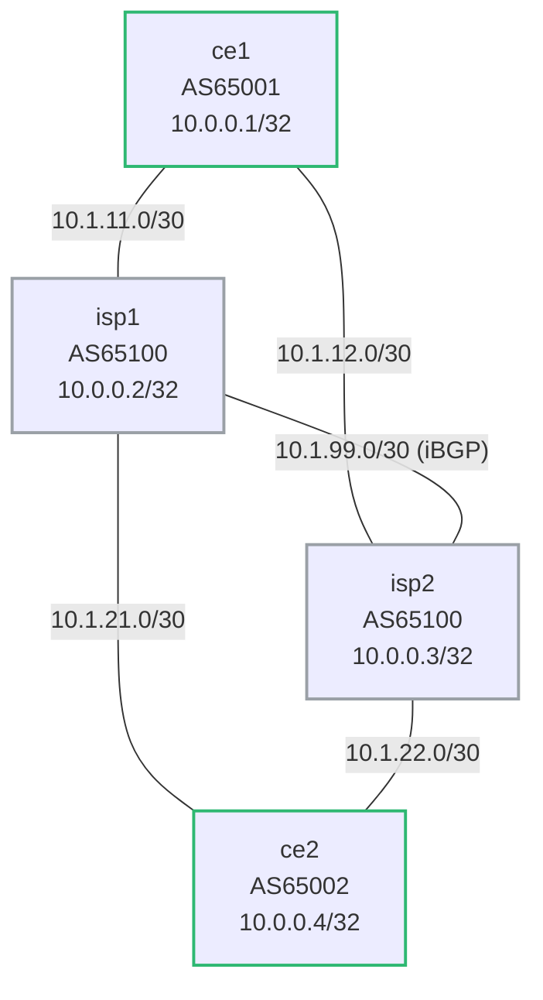

# debug-bgp-path-selection — Broken Local-Preference Policy

AS65100 operates two ISP routers (isp1 and isp2) connecting customer AS65001
(ce1) to customer AS65002 (ce2). The architecture team requires that **isp1
is always the preferred path** for all traffic between the two customers —
isp2 is backup only.

A network engineer implemented a local-preference policy on isp1 to enforce
this. After the change, traffic from ce2 toward ce1 is still flowing through
isp2 rather than isp1. The engineer insists the route-map is configured
correctly, but something is wrong.

Your job: deploy the lab, use show commands to find the fault, and fix it.
**Do not look at the config files yet** — diagnose from symptoms first.

---

## How to use this lab

This is a **practice troubleshooting lab**. A working network was broken by
a small change; you diagnose it from symptoms, not from the config files.
Work the staged hints only when stuck, and reveal the solution last —
the skill being trained is *generating* the diagnosis, not reading it.

## Topology



### Link addressing

| Link        | Subnet        | Left           | Right          |
|-------------|---------------|----------------|----------------|
| ce1 — isp1  | 10.1.11.0/30  | 10.1.11.1 (ce1)  | 10.1.11.2 (isp1) |
| ce1 — isp2  | 10.1.12.0/30  | 10.1.12.1 (ce1)  | 10.1.12.2 (isp2) |
| isp1 — isp2 | 10.1.99.0/30  | 10.1.99.1 (isp1) | 10.1.99.2 (isp2) |
| isp1 — ce2  | 10.1.21.0/30  | 10.1.21.1 (isp1) | 10.1.21.2 (ce2)  |
| isp2 — ce2  | 10.1.22.0/30  | 10.1.22.1 (isp2) | 10.1.22.2 (ce2)  |

| Node | Loopback    | ASN   |
|------|-------------|-------|
| ce1  | 10.0.0.1/32 | 65001 |
| isp1 | 10.0.0.2/32 | 65100 |
| isp2 | 10.0.0.3/32 | 65100 |
| ce2  | 10.0.0.4/32 | 65002 |

---

## Expected behavior (when policy is correct)

- All BGP sessions Established
- On isp2: path for ce1's prefix (10.0.0.1/32) via isp1 (iBGP, localpref 200)
  should be **best** — isp2 exits toward isp1, not directly to ce1
- Traffic from ce2 toward ce1 travels: ce2 → isp2 → isp1 → ce1

---

## Deploy and access

```bash
./scripts/lab.sh deploy debug-bgp-path-selection

./scripts/lab.sh cli debug-bgp-path-selection isp1
./scripts/lab.sh cli debug-bgp-path-selection isp2
```

Wait ~20 seconds after deploy for BGP sessions to establish.

---

## Observed symptoms

**On isp2 — two paths for ce1's prefix:**
```
isp2# show bgp ipv4 unicast 10.0.0.1/32
BGP routing table entry for 10.0.0.1/32
Paths: 2 available
  65001
    10.1.12.1 from 10.1.12.1 (10.0.0.1)
      Origin IGP, metric 0, localpref 100, weight 0, valid, external, best
  65001
    10.1.99.1 from 10.1.99.1 (10.0.0.2)
      Origin IGP, metric 0, localpref 100, weight 0, valid, internal
```

Both paths show `localpref 100` — the LP=200 policy on isp1 is not taking
effect. The eBGP path (direct from ce1) is winning because eBGP > iBGP when
local-preference is equal.

**On isp1 — ce1's prefix has default LP:**
```
isp1# show bgp ipv4 unicast 10.0.0.1/32
BGP routing table entry for 10.0.0.1/32
Paths: 1 available
  65001
    10.1.11.1 from 10.1.11.1 (10.0.0.1)
      Origin IGP, metric 0, localpref 100, weight 0, valid, external, best
```

LP is 100 on isp1 too — the route-map is not setting LP=200 as intended.

---

## Your task

A route-map named `LP-CE1-HIGH` exists on isp1 and is supposed to set
`local-preference 200` for prefixes received from ce1. It's attached to
the correct neighbor but the local-preference is not being applied.

Work through the diagnostic questions:
1. Verify the route-map exists and its set clause is correct
2. Check which direction it's applied to the ce1 neighbor on isp1
3. Local-preference is meaningful in which direction — inbound or outbound?
4. What is wrong, and what is the one-line fix?

---

## Useful show commands

```
! Verify the route-map definition
show route-map LP-CE1-HIGH

! Show what policies are applied to a neighbor and in which direction
show bgp neighbors 10.1.11.1

! Full path detail — check localpref on isp1 and isp2
show bgp ipv4 unicast 10.0.0.1/32

! After fixing, force re-evaluation without dropping sessions
clear bgp neighbors 10.1.11.1 soft-inbound
```

---

## Hints

<details markdown="1">
<summary>Hint 1 — Where to start</summary>

On isp1, run:
```
show bgp neighbors 10.1.11.1
```

Look for the `Route map for outgoing advertisements` and `Route map for
incoming advertisements` lines. Note which direction `LP-CE1-HIGH` is
applied to.

</details>

<details markdown="1">
<summary>Hint 2 — Narrowing it down</summary>

Local-preference is a **local** attribute — it is set when a route is
*received* (inbound), and then propagated to iBGP peers. Applying a
route-map that sets LP in the *outbound* direction means:

1. The LP is set on routes being *sent to* ce1 (not received from ce1)
2. Local-preference is stripped before sending in eBGP anyway — ce1 never sees it
3. The LP value on isp1's own RIB entry for ce1's prefix remains at 100

The route-map is applied in the wrong direction.

</details>

<details markdown="1">
<summary>Hint 3 — The specific problem</summary>

On isp1, `LP-CE1-HIGH` is applied `out` to neighbor 10.1.11.1 (ce1).
It should be applied `in`. Change the direction to inbound so that when
isp1 *receives* ce1's prefix, it sets LP=200 before installing it locally
and propagating via iBGP to isp2.

</details>

---

## Solution

<details markdown="1">
<summary>Show configuration</summary>

On **isp1**:

```
isp1# configure
isp1(config)# router bgp 65100
isp1(config-router-bgp)# address-family ipv4
isp1(config-router-bgp-af)# no neighbor 10.1.11.1 route-map LP-CE1-HIGH out
isp1(config-router-bgp-af)# neighbor 10.1.11.1 route-map LP-CE1-HIGH in
isp1(config-router-bgp-af)# end
isp1# write memory
```

Then re-process inbound routes from ce1:
```
isp1# clear bgp neighbors 10.1.11.1 soft-inbound
```

</details>

---

## Verification

After applying the fix:

```
! On isp1 — ce1's prefix should now have localpref 200
show bgp ipv4 unicast 10.0.0.1/32

! On isp2 — iBGP path from isp1 (localpref 200) should beat direct eBGP (localpref 100)
show bgp ipv4 unicast 10.0.0.1/32
```

Expected on isp2 after fix:
```
isp2# show bgp ipv4 unicast 10.0.0.1/32
BGP routing table entry for 10.0.0.1/32
Paths: 2 available
  65001
    10.1.99.1 from 10.1.99.1 (10.0.0.2)
      Origin IGP, metric 0, localpref 200, weight 0, valid, internal, best
  65001
    10.1.12.1 from 10.1.12.1 (10.0.0.1)
      Origin IGP, metric 0, localpref 100, weight 0, valid, external
```

The iBGP path (LP=200) now wins over the direct eBGP path (LP=100). isp1
is the preferred exit for ce1-destined traffic throughout AS65100.

## Challenge questions

No answers provided — reason them through.

1. The fault here produced a **silent** failure (no error logged) with a
   misleading symptom. Explain *why* this class of misconfig fails silently,
   and the one show command that would have pinpointed it fastest.
2. What single piece of monitoring or assurance (a check, an alert, a
   pre-change validation) would have caught this fault before users did?
3. Generalize: list two *other* one-line changes to this topology that would
   produce a similar "looks healthy locally, broken downstream" symptom, and
   how you'd tell them apart.
4. Write the rollback/change-control habit that would have prevented this
   overnight break in the first place.
