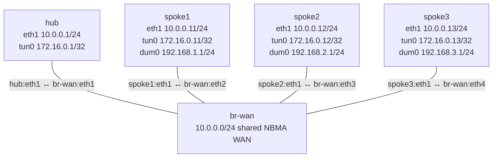

# DMVPN Phase 1 Data-Plane Failure — Practice Lab

A regional service path is down even though DMVPN registration succeeds and
the affected OSPF peer remains visible. Diagnose where adjacency progression,
route installation, and actual mGRE forwarding diverge; make the smallest
live-only repair; then prove that Phase 1 traffic still crosses the hub.

**Prerequisites:** complete `gre-basics` and `dmvpn-phase1` first. You should
be able to distinguish underlay, overlay, and service addresses and read VyOS
NHRP, OSPF-neighbor, and OSPF-route output.

## Topology



| Node | Role | WAN | Overlay | Service |
|------|------|-----|---------|---------|
| `hub` | NHRP server and Phase 1 transit | `10.0.0.1/24` | `172.16.0.1/32` | — |
| `spoke1` | Affected learner node | `10.0.0.11/24` | `172.16.0.11/32` | `192.168.1.1/24` |
| `spoke2` | Healthy comparison spoke | `10.0.0.12/24` | `172.16.0.12/32` | `192.168.2.1/24` |
| `spoke3` | Healthy comparison spoke | `10.0.0.13/24` | `172.16.0.13/32` | `192.168.3.1/24` |
| `br-wan` | Incidental Ethernet bridge and observation point | — | — | — |

| Link | Purpose |
|------|---------|
| `hub:eth1` ↔ `br-wan:eth1` | Hub attachment to the shared NBMA WAN |
| `spoke1:eth1` ↔ `br-wan:eth2` | Affected spoke underlay attachment |
| `spoke2:eth1` ↔ `br-wan:eth3` | Comparison spoke underlay attachment |
| `spoke3:eth1` ↔ `br-wan:eth4` | Comparison spoke underlay attachment |

The four critical router roles use native `vyos:local`. The incidental
bridge uses `ops-lab:local`; it owns no learned routing or DMVPN behavior.
The current image strips part of the intended spoke NHRP state during boot
migration. Each spoke therefore runs the same bounded native post-migration
normalization, saves its source-intended state, and verifies both live and
saved results before deployment completes. This intrinsic platform scaffold
is not a learner task or the incident; do not inspect its helper while
diagnosing. Exact distinct registrations and address correlations remain
required.

## Learning goals

- Separate registration and neighbor discovery from Full adjacency and
  unicast forwarding health.
- Correlate an overlay destination with the NBMA next hop actually used.
- Use a healthy peer as a control while narrowing a one-spoke outage.
- Prefer one-leaf live repair over broad protocol replacement or persistence.
- Prove Phase 1 hub transit with packet evidence, not only route output.

## How to use this lab

This is a **practice lab**, not a tutorial. Each task gives you an
**objective** and **hints** — your job is to produce the configuration.

- **Predict before you configure.** When a task asks for a prediction,
  commit to an answer before touching the CLI. Being wrong and finding out
  why is the point.
- **Open the hints before the solution.** The solution toggle is the answer
  key — use it to check your work or when genuinely stuck, not as step one.
- **Verify like an operator.** After each task, prove the state is what you
  think it is with `show` commands before moving on.

## Deploy

Build the two local images once, then deploy the saved incident:

```bash
# See docs/platforms/vyos.md for the one-time VyOS image workflow.
docker image inspect vyos:local >/dev/null
docker build -t ops-lab:local images/ops-lab/

./scripts/lab.sh deploy debug-dmvpn-phase1
./scripts/lab.sh cli debug-dmvpn-phase1 spoke1
```

Do not inspect repository configuration or helper source during diagnosis.
The scenario is intentionally opaque; use operational and live-configuration
evidence first.

## Scenario

Users behind `spoke1` cannot reach services at the other branches. Operations
reports that the shared WAN is up, the hub still lists every spoke, all three
OSPF peers remain visible, and two branches retain Full adjacency and their
remote routes. `spoke2` and `spoke3` still exchange traffic normally. A small
overnight change touched only `spoke1`; there is no approved route or tunnel
bypass.

Your change window permits the minimum live repair only. Do not save during
the exercise: the intentionally broken startup state must remain available
for repeat practice.

## Task 1 — Establish the failure boundary

**Objective:** Prove which underlay, overlay, and service paths fail, and use
`spoke2` as a control. Record results before inspecting configuration.

**Predict first:** If WAN reachability and NHRP registration succeed and an
OSPF peer remains visible, must a source-specific service ping succeed?
Explain what each test does and does not prove.

This observation task is guided. Run the following from the host shell:

```bash
docker exec clab-debug-dmvpn-phase1-spoke1 \
  ping -I 10.0.0.11 -c 2 -W 1 10.0.0.1
docker exec clab-debug-dmvpn-phase1-spoke1 \
  ping -I 172.16.0.11 -c 2 -W 1 172.16.0.1
docker exec clab-debug-dmvpn-phase1-spoke1 \
  ping -I 192.168.1.1 -c 2 -W 1 192.168.2.1
docker exec clab-debug-dmvpn-phase1-spoke2 \
  ping -I 192.168.2.1 -c 2 -W 1 192.168.3.1
```

<details markdown="1">
<summary>Check your work</summary>

The `spoke1` WAN test passes, while its overlay and service tests fail. The
`spoke2`-to-`spoke3` control passes. That boundary rejects a general WAN,
hub, or fabric-wide outage and points toward forwarding state unique to
`spoke1`.

</details>

## Task 2 — Reconcile partial control-plane evidence

**Objective:** Prove exact NHRP registration, classify each OSPF neighbor
state, and identify which remote routes are absent or retained. Explain how
those facts narrow the failed unicast exchange.

**Predict first:** Which table proves that the hub knows how to return traffic
to `spoke1`, and which table must be inspected on `spoke1` to prove its
unicast path toward the hub?

<details markdown="1">
<summary>Hint 1 — compare roles</summary>

- Compare `sudo vtysh -c "show ip nhrp"` on the hub and affected spoke.
- Treat the hub's dynamic registration and the spoke's static hub row as
  different directional claims.

</details>

<details markdown="1">
<summary>Hint 2 — keep layers separate</summary>

- Use `show ip ospf neighbor` to prove adjacency state.
- Use `show ip route ospf` to prove route ownership and next hop.
- Neither command alone proves the NBMA endpoint used for a unicast GRE packet.

</details>

<details markdown="1">
<summary>Hint 3 — correlate identities</summary>

On `spoke1`, compare every live NHRP line that names the hub's overlay
identity. Ask whether registration, multicast replication, and unicast
mapping are required to use the same NBMA identity.

</details>

Use these operational commands on `hub` and `spoke1`:

```vyos
sudo vtysh -c "show ip nhrp"
show ip ospf neighbor
show ip route ospf
show configuration commands | match "^set protocols nhrp"
```

<details markdown="1">
<summary>Check your work</summary>

The hub has all three correlated dynamic registrations. Its `spoke1` neighbor
is exactly `ExStart/DROther`, while spokes2/3 are `Full/DROther`; spoke1 sees
the hub exactly once in `ExStart/DROther`. The hub learns only the spoke2/3
overlay and service routes. Spoke1 has no remote overlay or service OSPF
routes, while spokes2/3 learn only each other's remote routes through the hub.

The static row used for spoke1 hub-bound unicast does not correlate with the
other two hub-directed NHRP leaves. Multicast hellos still discover the peer,
but unicast database exchange follows the bad resolution and cannot advance
beyond ExStart.

</details>

## Task 3 — Make the failed resolution visible

**Objective:** Correlate one failed overlay ping with WAN neighbor resolution
while re-proving exact NHRP registration, the ExStart boundary, and unaffected
spoke2/3 route ownership.

**Predict first:** Before running the capture, write down the WAN identity you
expect `spoke1` to resolve for a hub-bound unicast packet. What observation
would falsify your answer?

```bash
./labs/debug-dmvpn-phase1/capture.sh fault
```

<details markdown="1">
<summary>Check your work</summary>

The bounded capture shows `spoke1` asking for an unused WAN neighbor and
receiving no reply. The helper independently requires exact hub registration,
spoke1 `ExStart/DROther`, unaffected Full adjacencies, absent spoke1-learned
routes, and retained spoke2/3 routes during the same incident. This is the
missing packet proof: hello multicast reaches the peer, but unicast database
exchange and overlay traffic resolve the hub identity toward the wrong NBMA
endpoint.

</details>

## Task 4 — Repair only the failed leaf

**Objective:** Correct the one live unicast mapping on `spoke1`. Do not delete
the full NHRP subtree, change the NHS or multicast destination, add a static
route, or save configuration.

**Predict first:** Should OSPF need to reconverge after this repair? State the
evidence that supports your answer.

<details markdown="1">
<summary>Hints</summary>

- Work under `protocols nhrp tunnel tun0 map` on `spoke1`.
- Preserve the hub tunnel identity and change only its correlated NBMA value.
- Compare the desired value with the live NHS and multicast leaves.

</details>

<details markdown="1">
<summary>Solution</summary>

Apply the smallest live correction and deliberately omit `save`:

```vyos
configure
set protocols nhrp tunnel tun0 map tunnel-ip '172.16.0.1' nbma '10.0.0.1'
commit
exit
```

The repository helper applies the same live-only repair after rejecting any
unrelated pollution:

```bash
./labs/debug-dmvpn-phase1/repair.sh
```

</details>

<details markdown="1">
<summary>Check your work</summary>

The repair lets the existing OSPF relationship advance from ExStart to Full,
installs the missing overlay and service routes, and restores every service
path without rebuilding NHRP or OSPF configuration. The saved startup
fingerprint remains unchanged.

</details>

## Task 5 — Verify forwarding and repeatability

**Objective:** Prove exact healthy state, show both Phase 1 hub-facing GRE
legs, reject a direct spoke shortcut, and safely re-arm the incident.

```bash
./labs/debug-dmvpn-phase1/check.sh
./labs/debug-dmvpn-phase1/capture.sh healthy

# Repeat the exercise without redeploying.
./labs/debug-dmvpn-phase1/break.sh
./labs/debug-dmvpn-phase1/capture.sh fault
./labs/debug-dmvpn-phase1/repair.sh
```

<details markdown="1">
<summary>Check your work</summary>

The healthy checker requires exact native images, node/link inventory,
generated management state, live and saved learner-owned configuration,
interface/address/route inventories, NHRP correlations, Full OSPF neighbors,
route ownership, and all source-specific service paths. Healthy packet
evidence shows the request entering the hub from `spoke1`, leaving the hub for
`spoke2`, and returning through the corresponding two hub legs. A direct
spoke-to-spoke GRE leg is forbidden.

`break.sh` starts only from exact health, changes only live state, proves the
exact incident, and preserves the saved incident. On normal error or an
`ERR`, `INT`, or `TERM` interruption after mutation, it transactionally
restores health.

</details>

## Failure isolation model

Use this order when a tunnel route exists but traffic fails:

1. Prove the source and destination addresses used by the test.
2. Prove underlay reachability independently from the overlay.
3. Correlate NHRP rows by direction: registration at the hub, unicast map at
   the spoke, and multicast replication for routing protocols.
4. Prove adjacency and route ownership without treating them as packet proof.
5. Observe encapsulation or neighbor resolution at the shared WAN boundary.
6. Repair the smallest contradicted leaf and repeat every earlier test.

## Verification

The supported end state is live-only health with the exact saved incident
still present:

```bash
./labs/debug-dmvpn-phase1/check.sh
```

A fresh deployment intentionally fails only the healthy assertions dependent
on `spoke1`'s unicast map and forwarding. Diagnose that failure before using
`repair.sh` or the collapsed solution.

## Challenge questions

1. Design one assurance check that would catch this failure while NHRP and
   OSPF dashboards remain green. Which source address must it use?
2. If the wrong target did answer ARP but silently discarded GRE, which
   evidence in this lab would change and which conclusions would remain valid?
3. Explain why replacing the entire NHRP subtree is a riskier repair than
   changing one mapping, even when both could restore traffic.
4. Extend the evidence plan to two hubs. How would you prove that each route
   resolves to the intended hub without accidentally accepting a shortcut?
5. Rank the operational value of route output, NHRP output, and packet
   capture for this incident, and defend the order.

## Troubleshooting

| Symptom | Likely cause | Corrective focus |
|---------|--------------|------------------|
| WAN and NHRP are healthy; one peer is `ExStart` and its routes are absent | Unicast overlay exchange cannot reach the registered peer | Compare its static map with the NHS/multicast hub identity and packet resolution |
| Hub registration is missing | NHS, network ID, tunnel source, or underlay path is wrong | Restore registration first; this is not the intended incident |
| NHRP registration is absent and OSPF has no peer | NHS, network ID, tunnel source, or underlay differs | Restore registration before analyzing OSPF |
| OSPF is Full; remote route is absent | Service advertisement, passive interface, or route pollution differs | Compare route ownership and exact protocol configuration |
| Service traffic uses a direct spoke leg | Redirect/shortcut or a bypass route was added | Remove unsupported optimization or static-route pollution |
| Repair helper rejects the topology | Unrelated live/saved pollution is present | Remove the extra state or redeploy; do not overwrite evidence |
| VyOS `show ip nhrp` is incomplete | Current operational grammar needs a subcommand | Use `sudo vtysh -c "show ip nhrp"` |

## Cleanup

```bash
./scripts/lab.sh destroy debug-dmvpn-phase1
```

Destroying removes the live-only repair. The next fresh deploy recreates the
same one-leaf saved incident for another troubleshooting run.
