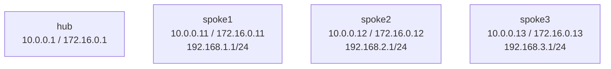

# debug-dmvpn-phase1 — VyOS DMVPN spoke1 fails to register

## Scenario

`hub`, `spoke2`, and `spoke3` are working. `spoke1` is isolated:

- it never appears in the hub NHRP table
- its OSPF adjacency to the hub never forms
- `192.168.1.0/24` is unreachable from the rest of the DMVPN fabric

The fault is on `spoke1` and is specific to the NHRP NBMA target.

## How to use this lab

This is a **practice troubleshooting lab**. A working network was broken by
a small change; you diagnose it from symptoms, not from the config files.
Work the staged hints only when stuck, and reveal the solution last —
the skill being trained is *generating* the diagnosis, not reading it.

## Topology



## Deploy And Access

```bash
sudo containerlab deploy -t labs/debug-dmvpn-phase1/topology.clab.yml

./scripts/lab.sh cli debug-dmvpn-phase1 hub
./scripts/lab.sh cli debug-dmvpn-phase1 spoke1
./scripts/lab.sh cli debug-dmvpn-phase1 spoke2
```

## Symptoms To Observe

On `hub`:

```vyos
show ip nhrp
show ip ospf neighbor
```

Expected broken state:

- `172.16.0.12` and `172.16.0.13` are present
- `172.16.0.11` is missing

On `spoke1`:

```vyos
show ip nhrp
show configuration commands | match nhrp
show ip ospf neighbor
```

## What To Look For

The NHRP configuration has two identities:

- hub tunnel IP: `172.16.0.1`
- hub NBMA WAN IP: `10.0.0.1`

If the spoke points the hub mapping at the wrong NBMA address, the WAN stays reachable but NHRP registration and OSPF over the tunnel fail.

## Fix

On `spoke1`:

<details>
<summary>Solution — reveal only after attempting the lab</summary>

```vyos
configure

delete protocols nhrp tunnel tun0 nhs tunnel-ip '172.16.0.1'
delete protocols nhrp tunnel tun0 map tunnel-ip '172.16.0.1'
delete protocols nhrp tunnel tun0 multicast '10.0.0.254'

set protocols nhrp tunnel tun0 nhs tunnel-ip '172.16.0.1' nbma '10.0.0.1'
set protocols nhrp tunnel tun0 map tunnel-ip '172.16.0.1' nbma '10.0.0.1'
set protocols nhrp tunnel tun0 multicast '10.0.0.1'

commit
save
exit
```

</details>

## Verify

On `hub`:

```vyos
show ip nhrp
show ip ospf neighbor
ping 192.168.1.1 count 3
```

`spoke1` should now register and form OSPF adjacency with the hub.

## Automated Check

The deployed broken state should fail normal DMVPN expectations but pass the debug assertions:

```bash
./scripts/lab.sh check debug-dmvpn-phase1
```

## Challenge questions

No answers provided — reason them through.

1. The fault here produced a **silent** failure (no error logged) with a
   misleading symptom. Explain *why* this class of misconfig fails silently,
   and the one show command that would have pinpointed it fastest.
2. What single piece of monitoring or assurance (a check, an alert, a
   pre-change validation) would have caught this fault before users did?
3. Generalize: list two *other* one-line changes to this topology that would
   produce a similar "looks healthy locally, broken downstream" symptom, and
   how you'd tell them apart.
4. Write the rollback/change-control habit that would have prevented this
   overnight break in the first place.
