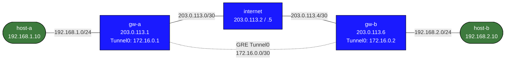

# debug-gre-basics — GRE tunnel unreachable despite interface showing up

## Scenario

A colleague configured GRE tunnels between two gateway routers (gw-a and gw-b) to connect two remote office LANs. After deployment, host-to-host pings fail completely. The tunnel interfaces exist on both gateways and show as UP/UP, but no traffic crosses. WAN reachability between the gateways is confirmed working.

## Topology



## IP / Node Reference

| Node     | Interface  | IP Address        | Role              |
|----------|-----------|-------------------|-------------------|
| host-a   | eth1      | 192.168.1.10/24   | LAN A host        |
| gw-a     | eth1      | 192.168.1.1/24    | LAN A gateway     |
| gw-a     | eth2      | 203.0.113.1/30    | WAN uplink        |
| gw-a     | tun0      | 172.16.0.1/30     | GRE tunnel        |
| internet | eth1      | 203.0.113.2/30    | WAN transit       |
| internet | eth2      | 203.0.113.5/30    | WAN transit       |
| gw-b     | eth1      | 203.0.113.6/30    | WAN uplink        |
| gw-b     | eth2      | 192.168.2.1/24    | LAN B gateway     |
| gw-b     | tun0      | 172.16.0.2/30     | GRE tunnel        |
| host-b   | eth1      | 192.168.2.10/24   | LAN B host        |

## Expected Behavior

- `ping 203.0.113.6` from gw-a succeeds (WAN reachability)
- `ping 172.16.0.2` from gw-a succeeds (tunnel works)
- `ping 192.168.2.10` from host-a succeeds (end-to-end)
- Symmetric: gw-b and host-b can reach gw-a and host-a

## Deploy & Access

```bash
sudo containerlab deploy -t topology.clab.yml

# Access gateways (EOS CLI)
docker exec -it clab-debug-gre-basics-gw-a Cli
docker exec -it clab-debug-gre-basics-gw-b Cli

# Access hosts
docker exec -it clab-debug-gre-basics-host-a bash
docker exec -it clab-debug-gre-basics-host-b bash
```

## Observed Symptoms

```bash
# On host-a:
ping 192.168.2.10
# PING 192.168.2.10: 100% packet loss

# On gw-a — WAN reachability is fine:
ping 203.0.113.6
# 64 bytes from 203.0.113.6: icmp_seq=1 ttl=64 time=0.3 ms

# On gw-a — tunnel fails:
ping 172.16.0.2
# PING 172.16.0.2: 100% packet loss

# On gw-b — WAN reachability is fine:
ping 203.0.113.1
# 64 bytes from 203.0.113.1: icmp_seq=1 ttl=64 time=0.2 ms

# On gw-b — tunnel fails:
ping 172.16.0.1
# PING 172.16.0.1: 100% packet loss
```

## Your Task

Identify the misconfiguration using show commands. Do not look at the `setup.sh` files yet — diagnose from symptoms first.

The tunnel interfaces exist on both gateways. WAN routing is correct. Why does tunnel traffic fail in both directions?

## Useful Show Commands

```text
show interfaces Tunnel0
show running-config section interface Tunnel0
show ip route
ping 203.0.113.1
ping 172.16.0.1
traceroute 172.16.0.1
```

## Hints

<details><summary>Hint 1 — Where to start</summary>

WAN reachability works fine. Compare `show running-config section interface Tunnel0` on **both** gateways.

</details>

<details><summary>Hint 2 — Narrowing it down</summary>

Look at `tunnel destination` under `interface Tunnel0` on each gateway:
- gw-a should show `remote 203.0.113.6` (gw-b's WAN IP)
- gw-b should show `remote 203.0.113.1` (gw-a's WAN IP)

Do the `remote` addresses match what you'd expect? Cross-reference with `ip addr show eth1` on the gateway you're checking against.

</details>

<details><summary>Hint 3 — The specific problem</summary>

On gw-b, `tunnel destination` is `192.168.1.1` (gw-a LAN) instead of `203.0.113.1` (gw-a WAN), so GRE traffic is sent to the wrong endpoint.

</details>

## Solution

<details><summary>Show configuration</summary>

On **gw-b** (EOS CLI):

```text
configure
interface Tunnel0
   tunnel destination 203.0.113.1
```

The correct remote for gw-b's tunnel is gw-a's **WAN** IP: `203.0.113.1`.

</details>

## Verification

After applying the fix on gw-b:

```text
show interfaces Tunnel0
ping 172.16.0.1
```

```bash
docker exec -it clab-debug-gre-basics-host-b ping -c 3 192.168.1.10
```
