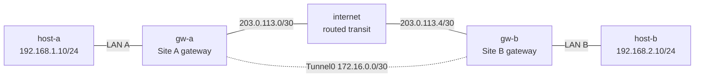

# Debug GRE Basics — Guided Debug Lab

Investigate a two-site GRE outage in which both tunnel interfaces look
operational even though neither tunnel nor private-LAN traffic completes.
You will bound the failure, preserve native EOS and packet evidence, make the
smallest live repair, and prove that the incident can be reproduced without
silently changing its saved starting point.

This lab is the guided troubleshooting companion to
[`gre-basics`](https://github.com/jschless/networkingLabs/tree/main/labs/gre-basics).
Complete that build first so that GRE
endpoint selection, static overlay routing, and clear-text encapsulation are
familiar before you diagnose an unfamiliar failure.

## Topology



### Nodes and roles

| Node | Platform | Role | Preconfigured state |
|------|----------|------|---------------------|
| `host-a` | `ops-lab:local` Linux | Incidental Site A endpoint | `192.168.1.10/24`; default through `gw-a` |
| `gw-a` | Native `ceos:4.35.2F` | Critical learned GRE gateway | Physical, loopback, tunnel, default, and remote-LAN route declarations |
| `internet` | `ops-lab:local` Linux | Incidental routed transit | Both public /30s; IPv4 forwarding |
| `gw-b` | Native `ceos:4.35.2F` | Critical learned GRE gateway | Physical, loopback, tunnel, default, and remote-LAN route declarations |
| `host-b` | `ops-lab:local` Linux | Incidental Site B endpoint | `192.168.2.10/24`; default through `gw-b` |

Linux is retained only for endpoints and routed transit that are incidental to
the GRE troubleshooting objective. Both gateways whose behavior you diagnose
are native EOS.

### Physical links

| Link | Subnet | Left endpoint | Right endpoint |
|------|--------|---------------|----------------|
| `host-a` — `gw-a` | `192.168.1.0/24` | `.10` on `eth1` | `.1` on `Ethernet1` |
| `gw-a` — `internet` | `203.0.113.0/30` | `.1` on `Ethernet2` | `.2` on `eth1` |
| `internet` — `gw-b` | `203.0.113.4/30` | `.5` on `eth2` | `.6` on `Ethernet1` |
| `gw-b` — `host-b` | `192.168.2.0/24` | `.1` on `Ethernet2` | `.10` on `eth1` |

### Overlay and service addresses

| Purpose | Site A | Site B |
|---------|--------|--------|
| Gateway loopback | `10.0.0.1/32` | `10.0.0.2/32` |
| Tunnel address | `172.16.0.1/30` | `172.16.0.2/30` |
| Private LAN | `192.168.1.0/24` | `192.168.2.0/24` |
| Public WAN address | `203.0.113.1/30` | `203.0.113.6/30` |

## How to use this lab

This is a **guided debugging lab**, not a repair transcript. The deployed
network contains a hidden fault; each task gives you an evidence objective and
staged hints, while the diagnosis and answer remain collapsed until you have
committed to a hypothesis.

- **Predict before each test.** Write down which layer you expect to pass and
  which evidence would falsify that hypothesis.
- **Preserve evidence before changing state.** Work from endpoints toward the
  overlay, and compare both gateways rather than guessing from one command.
- **Open hints progressively.** Use the narrowest hint that gets you moving;
  reveal the diagnosis and repair only after you can explain the mechanism.
- **Verify like an operator.** A local up/up label is one signal, not a service
  test. Prove underlay, reciprocal overlay, return path, and user traffic.

The supported exercise repair is deliberately **live and nonpersistent**. Do
not run `write memory` or copy the running configuration to startup. A clean
redeploy must restore the original incident so that the exercise remains
repeatable.

## Prerequisites, deploy, and access

Build the shared incidental-node image and prepare the licensed cEOS image for
your architecture. See the [cEOS platform notes](../../docs/platforms/ceos.md)
for import details.

```bash
docker build -t ops-lab:local images/ops-lab/
./scripts/build-images.sh ceos
./scripts/lab.sh deploy debug-gre-basics
```

The deployment waits for the EOS CLI and for 30 continuous seconds without
the target cEOS forwarding DROP before writing node-specific readiness
markers. Open the two native CLIs and endpoint shells as needed:

```bash
./scripts/lab.sh cli debug-gre-basics gw-a
./scripts/lab.sh cli debug-gre-basics gw-b
./scripts/lab.sh bash debug-gre-basics host-a
./scripts/lab.sh bash debug-gre-basics internet
```

## Task 1 — Reproduce and bound the outage

**Objective:** Reproduce the symptom in both directions and establish whether
the failure boundary is the public underlay, tunnel addressing, or remote LAN
service.

**Predict first:** If both `Tunnel0` interfaces report up/up, which of the six
tests below must still be run before you can claim that GRE works end to end?

Run reciprocal public-WAN and tunnel-address controls from EOS:

```text
# gw-a
show interfaces Tunnel0
ping 203.0.113.6 repeat 3 timeout 1
ping 172.16.0.2 repeat 3 timeout 1

# gw-b
show interfaces Tunnel0
ping 203.0.113.1 repeat 3 timeout 1
ping 172.16.0.1 repeat 3 timeout 1
```

Then reproduce the user-visible symptom from both sites:

```bash
./scripts/lab.sh cmd debug-gre-basics host-a -- ping -c 3 -W 1 192.168.2.10
./scripts/lab.sh cmd debug-gre-basics host-b -- ping -c 3 -W 1 192.168.1.10
```

<details markdown="1">
<summary>Hint 1</summary>

Build a result table with rows for public WAN, tunnel /30, and private LAN;
give each direction its own column. Do not collapse a reciprocal test into
"the tunnel is down."

</details>

<details markdown="1">
<summary>Hint 2</summary>

Treat the far public address as an underlay control. If that passes while both
overlay tests fail, keep the physical routed path out of your leading
hypothesis.

</details>

<details markdown="1">
<summary>Check your work</summary>

Both gateways reach the far public WAN endpoint with no loss, while reciprocal
tunnel-address and private-LAN pings fail. The up/up label therefore describes
local administrative and protocol state; it does not prove that the remote
gateway can return an encapsulated packet. Your next tests should focus on the
dependency between the tunnel declaration and endpoint resolution.

</details>

## Task 2 — Eliminate endpoints, routes, and the routed underlay

**Objective:** Prove that endpoint addressing/defaults, physical gateway
interfaces, the two transit subnets, and reciprocal far-WAN routing are intact
before inspecting the tunnel declaration.

**Predict first:** If a remote-LAN static route points to the correct tunnel
next hop, can the service still fail before that route forwards a packet?

Collect endpoint and transit evidence from the repository shell:

```bash
./scripts/lab.sh cmd debug-gre-basics host-a -- ip -4 address show dev eth1
./scripts/lab.sh cmd debug-gre-basics host-a -- ip -4 route
./scripts/lab.sh cmd debug-gre-basics host-b -- ip -4 address show dev eth1
./scripts/lab.sh cmd debug-gre-basics host-b -- ip -4 route
./scripts/lab.sh cmd debug-gre-basics internet -- ip -4 address show
./scripts/lab.sh cmd debug-gre-basics internet -- sysctl net.ipv4.ip_forward
```

On each gateway, inspect physical and route-selection evidence without making
changes:

```text
show ip interface brief
show ip route
show ip route 203.0.113.1
show ip route 203.0.113.6
show ip route 172.16.0.1
show ip route 172.16.0.2
```

<details markdown="1">
<summary>Hint 1</summary>

Separate the route that carries the user prefix from the route needed to
construct the tunnel's outer packet. The former cannot work if the latter is
recursive, unresolved, or selected through the overlay itself.

</details>

<details markdown="1">
<summary>Hint 2</summary>

Check both far public addresses from both gateways. A one-direction control
cannot eliminate an asymmetric return-path failure.

</details>

<details markdown="1">
<summary>Check your work</summary>

Endpoint addresses/defaults, transit forwarding, physical gateway addresses,
remote-LAN statics, and both far-WAN controls are present. The prediction
answer is yes: a correct service-prefix route can still fail when its next-hop
interface cannot construct a usable outer GRE packet. Preserve that distinction
for the interface-detail comparison.

</details>

## Task 3 — Correlate declarations, runtime detail, and packets

**Objective:** Compare both native tunnel declarations with operational
interface detail, then capture the failed exchange to determine exactly where
the request/reply symmetry breaks.

**Predict first:** On a routed transit node using `tcpdump -i any`, how many
copies of each packet should appear, and what missing direction would identify
the gateway that cannot return traffic?

Collect the two declarations side by side:

```text
show running-config interfaces Tunnel0
show interfaces Tunnel0
```

Run the bounded evidence helper from the repository root while the incident is
still armed:

```bash
labs/debug-gre-basics/capture.sh fault
```

The helper owns and reaps its exact `tcpdump` and timer children, fails closed
on any abnormal capture exit, and validates the packet counts rather than
leaving an open-ended terminal capture.

<details markdown="1">
<summary>Hint 1</summary>

For each gateway, write a four-column row: source interface, resolved local
source address, configured remote endpoint, and the route/interface selected
to reach that remote endpoint.

</details>

<details markdown="1">
<summary>Hint 2</summary>

Read the complete `show interfaces Tunnel0` detail on both sides. Look for a
dependency statement that is more specific than the headline up/up text.

</details>

<details markdown="1">
<summary>Hint 3</summary>

The transit capture sees duplicated ingress/egress copies. In the incident it
proves six forward GRE packets containing readable echo requests and zero
reverse GRE packets or replies. Correlate the absent reverse direction with
the declaration and endpoint-resolution evidence on the receiver.

</details>

<details markdown="1">
<summary>Check your work</summary>

The packet evidence proves that Site A constructs GRE and that the routed
transit delivers those requests toward Site B. The missing reverse GRE/replies
move the failure boundary to Site B's return encapsulation. Because GRE is not
encrypted, the same capture can read the inner tunnel-address ICMP metadata.

</details>

## Task 4 — Diagnose and make the smallest live repair

**Objective:** State the causal defect in one sentence, identify the single
configuration leaf that owns it, change only that live leaf, and preserve both
saved startup configurations byte for byte.

**Predict first:** Should this incident require changing the static LAN route,
physical WAN addressing, both tunnel declarations, or one endpoint leaf? Defend
your choice from the evidence before opening the diagnosis.

Make your own EOS repair first. Do **not** run `write memory`. If you need the
validated helper after attempting the change, run:

```bash
labs/debug-gre-basics/repair.sh
```

<details markdown="1">
<summary>Hint 1</summary>

The forward request proves `gw-a` has a usable source and remote endpoint. The
far-WAN control proves `gw-b` can route to its peer's public address. Compare
only the return tunnel declaration with that proven underlay fact.

</details>

<details markdown="1">
<summary>Hint 2</summary>

The smallest repair changes one `Tunnel0` child on one gateway. It does not
touch addressing, the service-prefix static, or persistent storage.

</details>

<details markdown="1">
<summary>Diagnosis and solution</summary>

`gw-b` has `tunnel destination 192.168.1.1`, the remote private-LAN gateway,
instead of the reciprocal outer endpoint `203.0.113.1`. Its remote-LAN static
uses `Tunnel0`, so resolving that private address for the outer packet leads
back through the same tunnel. EOS reports that the destination next hop is
part of a recursive route-resolution loop/resolves over another tunnel while
the interface headline can remain up/up.

Repair only the live destination on `gw-b`:

```text
configure
interface Tunnel0
   tunnel destination 203.0.113.1
end
```

Do not save. The lab intentionally keeps the faulty startup configuration so a
clean redeploy reproduces the exercise.

</details>

<details markdown="1">
<summary>Check your diagnosis</summary>

After the leaf change, the recursive detail disappears, reciprocal tunnel and
LAN pings succeed, and the public underlay controls remain healthy. That
combination validates the prediction: changing one endpoint leaf repairs the
outer-packet dependency without altering unrelated routes or interfaces.

</details>

## Task 5 — Verify, re-arm, and recover again

**Objective:** Prove the exact healthy inventory and bidirectional packet path,
re-arm the same live-only incident transactionally, reproduce its one-way
boundary, and recover a second time.

**Predict first:** What will a clean redeploy do after a successful live-only
repair, and why is that behavior useful for a guided debug lab?

Grade the complete healthy state and capture the reciprocal packet path:

```bash
labs/debug-gre-basics/check.sh
labs/debug-gre-basics/capture.sh healthy
```

Re-arm the incident, preserve the same packet evidence, then recover:

```bash
labs/debug-gre-basics/break.sh
labs/debug-gre-basics/capture.sh fault
labs/debug-gre-basics/repair.sh
labs/debug-gre-basics/check.sh
```

`break.sh` accepts only the exact healthy state, changes only the live endpoint
leaf, proves the intended failure boundary, and rolls back to the full healthy
checker on `ERR`, `INT`, or `TERM` after mutation.

<details markdown="1">
<summary>Hint 1</summary>

The checker validates exact nodes/images, endpoint and transit setup,
Docker-derived management addresses/routes, readiness, exact canonical
learner-owned interface sections and their operational up/up state, default
routes and exact empty cEOS VRF-route inventories, both live tunnel
declarations, the intentionally unchanged saved incident, absence of
dynamic-routing bypasses, recursion state, underlay controls, and reciprocal
service forwarding.

</details>

<details markdown="1">
<summary>Check your work</summary>

The healthy capture reports six duplicated forward and six duplicated reverse
GRE packets, with six readable requests and six replies. The fault capture
returns to the one-way `6:0:6:0` boundary; the final repair returns the checker
to zero failures. A clean redeploy intentionally re-arms the saved incident:
nonpersistent repair makes the troubleshooting exercise deterministic and
repeatable instead of quietly erasing its starting condition.

</details>

## End-state verification

```bash
labs/debug-gre-basics/check.sh
labs/debug-gre-basics/capture.sh healthy
```

The checker is read-only with respect to learned configuration. It generates
bounded pings, but it does not enter configuration mode or write memory.

Useful native operator evidence remains:

```text
show running-config interfaces Tunnel0
show interfaces Tunnel0
show ip route 203.0.113.1
show ip route 203.0.113.6
show ip route 172.16.0.1
show ip route 172.16.0.2
```

## Challenge questions

No answers are provided.

1. Design a routing policy or VRF boundary that prevents any GRE outer endpoint
   from resolving through the overlay it creates. What trade-off does your
   design impose on failover?
2. If only Site B-to-Site A application traffic failed while reciprocal tunnel
   pings passed, which three pieces of evidence would you collect next, and in
   what order?
3. GRE exposes the inner flow on the transit node. Where would you introduce
   authentication and encryption, and which observations from this lab would
   become unavailable there?
4. Choose two monitoring signals that would detect this incident without
   alerting merely because a local interface stayed up. Explain their likely
   failure and noise modes.

## Troubleshooting

| Symptom | Likely layer | Next evidence or fix |
|---------|--------------|----------------------|
| Deployment waits before becoming ready | cEOS forwarding bootstrap | Allow the bounded CLI/stability helper to finish; inspect its unique marker and target rule |
| EOS drops a tunnel-source declaration | Native CLI syntax | Use `?` under `interface Tunnel0` and include the source form accepted by this image |
| Far public endpoint fails | Routed underlay | Check both /30s, transit forwarding, defaults, and reciprocal return routing before changing GRE |
| Tunnel headline is up but tunnel ping fails | Endpoint resolution or reciprocal declaration | Compare both complete declarations and interface detail; do not trust headline state alone |
| Tunnel ping works but a private LAN fails | Service route, return route, or cEOS LAN forwarding | Check both remote `/24` routes, endpoint defaults, readiness markers, and reciprocal host traffic |
| Capture helper exits nonzero | Wrong incident/healthy state, packet counts, or capture lifecycle | Read its exact error, restore the requested state, and ensure no identical lab-local capture is active |
| Repair helper rejects state | Unrelated live or saved pollution | Remove the unrelated change or cleanly redeploy; the helper changes only the intended live leaf |

## Cleanup

```bash
./scripts/lab.sh destroy debug-gre-basics
```
