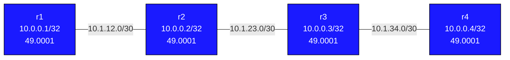

# debug-isis-basics — IS-IS Area ID Mismatch

## Scenario

A colleague finished deploying a four-router IS-IS network using Level-1 routing.
The topology is linear: r1 — r2 — r3 — r4. After deployment, r1 has no reachability
to r3 or r4, and r2 shows no IS-IS neighbors at all, even though the links are clearly
up and the IS-IS process is running.

Your job: deploy the lab, use show commands to find the fault, and fix it.
**Do not look at the config files yet** — diagnose from symptoms first.

---

## How to use this lab

This is a **practice troubleshooting lab**. A working network was broken by
a small change; you diagnose it from symptoms, not from the config files.
Work the staged hints only when stuck, and reveal the solution last —
the skill being trained is *generating* the diagnosis, not reading it.

## Topology



| Node | Loopback    | IS-IS Level |
|------|-------------|-------------|
| r1   | 10.0.0.1/32 | level-1-only |
| r2   | 10.0.0.2/32 | level-1-only |
| r3   | 10.0.0.3/32 | level-1-only |
| r4   | 10.0.0.4/32 | level-1-only |

---

## Expected behavior (when healthy)

- IS-IS adjacencies: r1–r2, r2–r3, r3–r4 all in **Up** state
- All four loopbacks visible in the IS-IS link-state database
- All four loopbacks reachable via `show ip route isis`
- `ping 10.0.0.4 source 10.0.0.1` from r1 succeeds

---

## Deploy and access

```bash
sudo containerlab deploy -t labs/debug-isis-basics/topology.clab.yml

docker exec -it clab-debug-isis-basics-r2 Cli
docker exec -it clab-debug-isis-basics-r3 Cli
```

Wait ~20 seconds after deploy for IS-IS hello timers to expire.

---

## Observed symptoms

**On r2 — no IS-IS neighbors:**
```
r2# show isis neighbor
(no output)
```

**On r3 — only r4 as neighbor:**
```
r3# show isis neighbor
Area CORE:
  System Id           Interface   L  State        Holdtime SNPA
  r4                  eth2        1  Up            26       ...
```

r3 sees r4, but not r2. r2 is completely isolated.

**On r1 — no IS-IS neighbors:**
```
r1# show isis neighbor
(no output)
```

**Routing impact — r1 can't reach r3 or r4:**
```
r1# show ip route isis
(no output)

r1# ping 10.0.0.3 source 10.0.0.1
5 packets transmitted, 0 received, 100% packet loss
```

---

## Your task

IS-IS is running on all routers. The links are up. Yet r2 has zero adjacencies.
IS-IS Level-1 adjacency formation requires both neighbors to be in the **same area**.
The area is encoded in the NET (Network Entity Title) address.

Work through the diagnostic questions:
1. On r2, what is the NET address shown by `show isis summary`?
2. On r3, what is the NET address?
3. What is the area portion of each NET? (First field after `49.`)
4. Do the areas match on both sides of the r2–r3 link?

---

## Useful show commands

```
! Check adjacency state and neighbor system IDs
show isis neighbor

! Show this router's own NET address and IS-IS configuration
show isis summary

! Show the link-state database (LSPs from all neighbors in same area)
show isis database

! Show IS-IS interface state and circuit details
show isis interface

! Routing table entries learned via IS-IS
show ip route isis
```

---

## Hints

<details>
<summary>Hint 1 — Where to start</summary>

On each router, run:
```
show isis summary
```

Look at the `NET:` line. The format is: `49.AAAA.SSSS.SSSS.SSSS.00`

- `49` = AFI (always 49 for private IS-IS)
- `AAAA` = area ID (4 hex digits)
- `SSSS.SSSS.SSSS` = system ID (derived from loopback)

Compare the area portion (the 4 digits after `49.`) on r2, r3, and r1.

</details>

<details>
<summary>Hint 2 — Narrowing it down</summary>

IS-IS L1 adjacencies only form between routers **with the same area ID**. If r2's
area is `0002` and r1/r3 have area `0001`, every hello r2 sends will be rejected —
the area ID in the hello doesn't match.

Check r2's database:
```
show isis database
```

If only r2's own LSP appears (no LSPs from r1, r3, r4), r2 is isolated — it's in
a different area from everyone else.

</details>

<details>
<summary>Hint 3 — The specific problem</summary>

r2's NET is `49.0002.0100.0000.0002.00` — area `0002`. All other routers use area
`0001` (`49.0001.xxxx.xxxx.xxxx.00`). Because Level-1 only operates within a single
area, r2 cannot form any adjacencies. It should be `49.0001.0100.0000.0002.00`.

</details>

---

## Solution

<details>
<summary>Show configuration</summary>

On **r2**:

```
r2# configure terminal
r2(config)# router isis CORE
r2(config-router)# net 49.0001.0100.0000.0002.00
r2(config-router)# end
r2# write memory
```

IS-IS will re-initialize and send new hellos with the corrected area. Adjacencies
with r1 and r3 will form within ~30 seconds (3× hello timer).

</details>

---

## Verification

After applying the fix:

```
! On r2 — both r1 and r3 should appear
show isis neighbor

! On r2 — four LSPs (r1, r2, r3, r4) visible
show isis database

! On r1 — IS-IS routes to r2, r3, r4 loopbacks
show ip route isis

! End-to-end reachability
r1# ping 10.0.0.4 source 10.0.0.1
```

Expected on r2 after fix:
```
r2# show isis neighbor
Area CORE:
  System Id           Interface   L  State        Holdtime SNPA
  r1                  eth1        1  Up            27       ...
  r3                  eth2        1  Up            25       ...
```

Both neighbors Up — all four loopbacks reachable.

## Challenge questions

No answers provided — reason them through.

1. The fault here produced a **silent** failure (no error logged) with a
   misleading symptom. Explain *why* this class of misconfig fails silently,
   and the one show command that would have pinpointed it fastest.
2. What single piece of monitoring or assurance (a check, an alert, a
   pre-change validation) would have caught this fault before users did?
3. Generalize: list two *other* one-line changes to this topology that would
   produce a similar "looks healthy locally, broken downstream" symptom, and
   how you'd tell them apart.
4. Write the rollback/change-control habit that would have prevented this
   overnight break in the first place.
