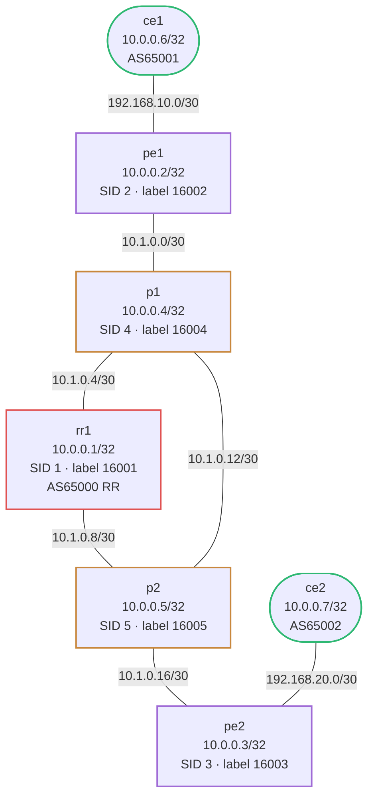

# debug-mpls-sr-isis-bgp — Duplicate SR node-SID causes label collision; L3VPN broken

## Scenario

A colleague deployed an MPLS SR-ISIS + BGP VPNv4 topology that was previously working. After a configuration change to pe2, CE2 can no longer reach CE1 via the VPN. IS-IS converges, MPLS labels are allocated, BGP VPNv4 sessions are up — but traffic forwarding is incorrect. The problem manifests as asymmetric or completely broken VPN reachability.

## How to use this lab

This is a **practice troubleshooting lab**. A working network was broken by
a small change; you diagnose it from symptoms, not from the config files.
Work the staged hints only when stuck, and reveal the solution last —
the skill being trained is *generating* the diagnosis, not reading it.

## Topology



## IP / Node Reference

| Node | Loopback     | SR Node-SID | AS    | Role            |
|------|-------------|-------------|-------|-----------------|
| rr1  | 10.0.0.1/32 | index 1     | 65000 | IS-IS + BGP RR  |
| pe1  | 10.0.0.2/32 | index 2     | 65000 | PE, VRF CUST-A  |
| pe2  | 10.0.0.3/32 | index **?** | 65000 | PE, VRF CUST-A  |
| p1   | 10.0.0.4/32 | index 4     | 65000 | P router        |
| p2   | 10.0.0.5/32 | index 5     | 65000 | P router        |
| ce1  | 10.100.1.1/32 | —         | 65001 | Customer CE     |
| ce2  | 10.100.2.1/32 | —         | 65002 | Customer CE     |

Labels: SRGB base 16000; node label = 16000 + index.

## Expected Behavior

- IS-IS Level-2 adjacencies form on all links
- Each node has a unique SR node-SID; labels 16001–16005 assigned to rr1, pe1, pe2, p1, p2
- BGP VPNv4 sessions between pe1, pe2, and rr1 (RR) are Established
- CE1 (10.100.1.1) can ping CE2 (10.100.2.1) through the L3VPN

## Deploy & Access

```bash
./scripts/lab.sh deploy debug-mpls-sr-isis-bgp

./scripts/lab.sh cli debug-mpls-sr-isis-bgp pe1
./scripts/lab.sh cli debug-mpls-sr-isis-bgp pe2
./scripts/lab.sh cli debug-mpls-sr-isis-bgp rr1
```

## Observed Symptoms

```
# On rr1 — IS-IS SR node list shows duplicate label:
rr1# show isis segment-routing node-list
System ID       IPv4 Addr       SID     Label
rr1             10.0.0.1        1       16001
pe1             10.0.0.2        2       16002
pe2             10.0.0.3        2       16002   ← DUPLICATE
p1              10.0.0.4        4       16004
p2              10.0.0.5        5       16005

# On pe1 — MPLS forwarding table has collision:
pe1# show mpls table
Inbound Label   Type   Nexthop
16002           SR     [ambiguous — two nodes claim this label]

# CE1-to-CE2 VPN fails:
ce1# ping 10.100.2.1
PING 10.100.2.1: 100% packet loss

# BGP VPNv4 sessions are up (not the issue):
pe1# show bgp ipv4 vpn summary
Neighbor    State  Up/Down
10.0.0.1    Establ  00:05:12   ← rr1 OK
```

## Your Task

Identify the misconfiguration using show commands. Do not look at config files yet — diagnose from symptoms first.

IS-IS converges and BGP sessions are up. MPLS labels are the problem. What SR parameter on which router creates a label conflict?

## Useful Show Commands

```
show isis segment-routing node-list
show mpls table
show isis database detail
show bgp ipv4 vpn
show bgp ipv4 vpn summary
show bgp ipv4 vpn <prefix>
```

## Hints

<details markdown="1"><summary>Hint 1 — Where to start</summary>

When L3VPN forwarding is broken but BGP sessions are up, suspect the MPLS data plane. Run `show isis segment-routing node-list` on rr1 to see all node-SIDs in the network. Each node must have a **unique** SID index. Check whether any two nodes share the same index.

</details>

<details markdown="1"><summary>Hint 2 — Narrowing it down</summary>

Run `show isis database detail` to inspect LSPs from all nodes. Look for the "Segment Routing" section in each LSP, specifically the "Prefix-SID" sub-TLV. pe1's LSP should show prefix 10.0.0.2/32 with SID index 2. pe2's LSP should show prefix 10.0.0.3/32 with SID index 3. Do both nodes advertise a different index?

</details>

<details markdown="1"><summary>Hint 3 — The specific problem</summary>

pe2 is advertising its prefix (10.0.0.3/32) with SID index **2** instead of **3**. This is the same index as pe1. Both nodes claim label 16002 (16000 + 2). Routers building their MPLS forwarding tables see conflicting entries — traffic to pe2's loopback gets forwarded to pe1, and the VPN service to CE2 breaks entirely.

</details>

## Solution

<details markdown="1"><summary>Show configuration</summary>

On **pe2** in vtysh:

```
pe2# configure terminal
pe2(config)# router isis CORE
pe2(config-router)# segment-routing prefix 10.0.0.3/32 index 3
pe2(config-router)# end
pe2# write memory
```

After the change, IS-IS will re-flood pe2's LSP with the corrected SID index 3 (label 16003).

</details>

## Verification

```
rr1# show isis segment-routing node-list
System ID       IPv4 Addr       SID     Label
rr1             10.0.0.1        1       16001
pe1             10.0.0.2        2       16002
pe2             10.0.0.3        3       16003   ← correct, unique
p1              10.0.0.4        4       16004
p2              10.0.0.5        5       16005

pe1# show mpls table
(no duplicate entries for 16002)

ce1# ping 10.100.2.1
64 bytes from 10.100.2.1: icmp_seq=1 ttl=62 time=2.1 ms
```

## Challenge questions

No answers provided — reason them through.

1. The fault here produced a **silent** failure (no error logged) with a
   misleading symptom. Explain *why* this class of misconfig fails silently,
   and the one show command that would have pinpointed it fastest.
2. What single piece of monitoring or assurance (a check, an alert, a
   pre-change validation) would have caught this fault before users did?
3. Generalize: list two *other* one-line changes to this topology that would
   produce a similar "looks healthy locally, broken downstream" symptom, and
   how you'd tell them apart.
4. Write the rollback/change-control habit that would have prevented this
   overnight break in the first place.
