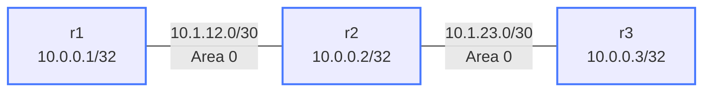

# debug-ospf-auth — Broken OSPF MD5 Authentication

Your network team recently rotated the OSPF MD5 authentication keys across
all three routers. The junior engineer ran the change during a maintenance
window and reported "all done." This morning, users at the r1 site report
intermittent connectivity issues. r3 seems fine but r1 is unreachable from
the rest of the network.

Your job: deploy the lab, use show commands to find the fault, and fix it.
**Do not look at the config files yet** — diagnose from symptoms first.

---

## How to use this lab

This is a **practice troubleshooting lab**. A working network was broken by
a small change; you diagnose it from symptoms, not from the config files.
Work the staged hints only when stuck, and reveal the solution last —
the skill being trained is *generating* the diagnosis, not reading it.

## Topology



### Link addressing

| Link    | Subnet        | Left           | Right          |
|---------|---------------|----------------|----------------|
| r1 — r2 | 10.1.12.0/30  | 10.1.12.1 (r1) | 10.1.12.2 (r2) |
| r2 — r3 | 10.1.23.0/30  | 10.1.23.1 (r2) | 10.1.23.2 (r3) |

| Node | Loopback    | Area   |
|------|-------------|--------|
| r1   | 10.0.0.1/32 | Area 0 |
| r2   | 10.0.0.2/32 | Area 0 |
| r3   | 10.0.0.3/32 | Area 0 |

---

## Expected behavior (when healthy)

- Both adjacencies (r1–r2, r2–r3) in **Full** state
- r1 can `ping 10.0.0.3 source 10.0.0.1` successfully
- All three loopbacks reachable from any router

---

## Deploy and access

```bash
./scripts/lab.sh deploy debug-ospf-auth

./scripts/lab.sh cli debug-ospf-auth r1
./scripts/lab.sh cli debug-ospf-auth r2
```

Wait ~15 seconds after deploy for OSPF to attempt adjacency formation.

---

## Observed symptoms

**On r2:**

```
r2# show ip ospf neighbor
Neighbor ID Instance VRF      Pri State                  Dead Time   Address         Interface
10.0.0.3         1 default     1 Full/DR                  00:01:03   10.1.23.2       Ethernet2
```

Only r3 is present. r1 is completely absent.

**On r1:**

```
r1# show ip ospf neighbor
(no output)
```

**End-to-end:**

```
r1# ping 10.0.0.3 source 10.0.0.1
PING 10.0.0.3 (10.0.0.3): 56 data bytes
^C
--- 10.0.0.3 ping statistics ---
5 packets transmitted, 0 received, 100% packet loss
```

r1 is completely isolated. The r2–r3 adjacency is healthy. The fault is
localized to the r1–r2 link.

---

## Your task

OSPF MD5 authentication is configured on all interfaces. Both r1 and r2
should have matching key configurations on their shared link. Something
differs between what r1 has and what r2 has on that link.

Work through the diagnostic questions:

1. What does `show ip ospf interface Ethernet1` say about auth type and key IDs on r1?
2. What does `show ip ospf interface Ethernet1` say on r2?
3. The auth type and key ID look the same — so what else could cause the failure?
4. Where would you look for clues in the cEOS logs?

---

## Useful show commands

```
! Check adjacency state — who is present and in what state?
show ip ospf neighbor

! Check auth type, key ID, and cryptographic sequence on an interface
show ip ospf interface Ethernet1
```

---

## Hints

<details markdown="1">
<summary>Hint 1 — Where to start</summary>

Run `show ip ospf interface Ethernet1` on both r1 and r2. Compare the output.
Pay attention to:

- Authentication type (should say `MD5`)
- Key ID in use (should match on both sides)

If both look identical in auth type and key ID, the only remaining variable
is the actual key *value*, which show commands don't reveal.

</details>

<details markdown="1">
<summary>Hint 2 — Narrowing it down</summary>

Check the OSPF neighbor log on r2. You can look at the EOS logging output:

```
show logging | grep -i ospf
```

You should see lines indicating authentication failures from 10.1.12.1 (r1).
This confirms: r2 is receiving OSPF packets from r1 (so the link is up),
but the MD5 digest is wrong. The key value on one side doesn't match.

Since r2–r3 is fine, the mismatch is on r2's Ethernet1 key (not Ethernet2).

</details>

<details markdown="1">
<summary>Hint 3 — The specific problem</summary>

r2's Ethernet1 is configured with key `"SecretKey321"` (digits reversed) instead
of `"SecretKey123"`. r1 and r3 both have the correct key. The key rotation
script transposed the digits on r2's Ethernet1 only.

</details>

---

## Solution

<details markdown="1">
<summary>Show configuration</summary>

On **r2**:

```
r2# configure terminal
r2(config)# interface Ethernet1
r2(config-if)# ip ospf message-digest-key 1 md5 SecretKey123
r2(config-if)# end
r2# write memory
```

This overwrites the wrong key value with the correct one. cEOS replaces the
key in-place when you configure the same key ID — no need to remove it first.

The r1–r2 adjacency will re-establish within seconds once the digests match.

</details>

---

## Verification

After applying the fix:

```
! On r2 — both neighbors should now be Full
show ip ospf neighbor

! End-to-end reachability restored
r1# ping 10.0.0.3 source 10.0.0.1
```

Expected:

```
r2# show ip ospf neighbor
Neighbor ID Instance VRF      Pri State                  Dead Time   Address         Interface
10.0.0.1         1 default     1 Full/BDR                 00:00:38   10.1.12.1       Ethernet1
10.0.0.3         1 default     1 Full/DR                  00:00:35   10.1.23.2       Ethernet2
```

Both adjacencies Full — all loopbacks reachable.

## Challenge questions

No answers provided — reason them through.

1. The fault here produced a **silent** failure (no error logged) with a
   misleading symptom. Explain *why* this class of misconfig fails silently,
   and the one show command that would have pinpointed it fastest.
2. What single piece of monitoring or assurance (a check, an alert, a
   pre-change validation) would have caught this fault before users did?
3. Generalize: list two *other* one-line changes to this topology that would
   produce a similar "looks healthy locally, broken downstream" symptom, and
   how you'd tell them apart.
4. Write the rollback/change-control habit that would have prevented this
   overnight break in the first place.
