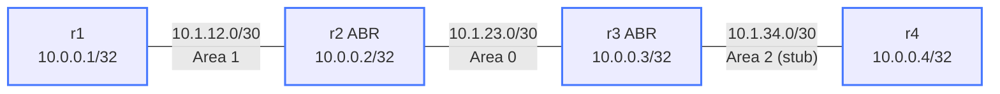

# debug-ospf-multiarea — Broken Multi-Area OSPF

A colleague set up this multi-area OSPF network yesterday and it passed
initial testing. Overnight someone made "a small interface config change"
on one router. This morning r4 is unreachable from the rest of the network
and nobody can figure out why.

Your job: deploy the lab, use show commands to find the fault, and fix it.
**Do not look at the config files yet** — diagnose from symptoms first.

---

## How to use this lab

This is a **practice troubleshooting lab**. A working network was broken by
a small change; you diagnose it from symptoms, not from the config files.
Work the staged hints only when stuck, and reveal the solution last —
the skill being trained is *generating* the diagnosis, not reading it.

## Topology



### Link addressing

| Link    | Subnet        | r-left          | r-right         | Correct area |
|---------|---------------|-----------------|-----------------|--------------|
| r1 — r2 | 10.1.12.0/30  | 10.1.12.1 (r1)  | 10.1.12.2 (r2)  | Area 1       |
| r2 — r3 | 10.1.23.0/30  | 10.1.23.1 (r2)  | 10.1.23.2 (r3)  | Area 0       |
| r3 — r4 | 10.1.34.0/30  | 10.1.34.1 (r3)  | 10.1.34.2 (r4)  | Area 2       |

### Node reference

| Node | Loopback    | Role             | Correct areas |
|------|-------------|------------------|---------------|
| r1   | 10.0.0.1/32 | Area 1 router    | Area 1        |
| r2   | 10.0.0.2/32 | ABR              | Area 0 + 1    |
| r3   | 10.0.0.3/32 | ABR              | Area 0 + 2    |
| r4   | 10.0.0.4/32 | Area 2 stub router | Area 2 (stub) |

---

## Expected behavior (when healthy)

- All three adjacencies (r1–r2, r2–r3, r3–r4) in **Full** state
- r1 can `ping 10.0.0.4 source 10.0.0.1` successfully
- r4 has a default route `0.0.0.0/0` via r3 (injected by the stub ABR)
- r1 and r2 have a Type-3 summary LSA for r4's loopback (10.0.0.4/32)

---

## Deploy and access

```bash
./scripts/lab.sh deploy debug-ospf-multiarea

# Open cEOS CLI on any node
./scripts/lab.sh cli debug-ospf-multiarea r1

# Or use the helper script
./scripts/lab.sh Cli debug-ospf-multiarea r3
```

Wait ~15 seconds after deploy for OSPF to attempt adjacency formation.

---

## Observed symptoms

Run these commands immediately after deploying. This is the broken state
you are starting from.

**On r1:**

```
r1# show ip ospf neighbor
Neighbor ID Instance VRF      Pri State                  Dead Time   Address         Interface
10.0.0.2         1 default     1 Full/-                   00:01:12   10.1.12.2       Ethernet1
```

**On r4:**

```
r4# show ip ospf neighbor
(no output — no neighbors)

r4# show ip route ospf
(no output — no OSPF routes)
```

**End-to-end connectivity:**

```
r1# ping 10.0.0.4 source 10.0.0.1
PING 10.0.0.4 (10.0.0.4): 56 data bytes
^C
--- 10.0.0.4 ping statistics ---
5 packets transmitted, 0 received, 100% packet loss
```

r4 is completely isolated — it has no OSPF neighbors and no routes.
r1–r2 and r2–r3 adjacencies are both healthy.

---

## Your task

Use the show commands below to determine why r3 and r4 are not forming
an OSPF adjacency. The physical link is up — this is a configuration issue.

Work through the diagnostic questions:

1. Which side of the r3–r4 link is failing to participate in OSPF correctly?
2. What does `show ip ospf interface Ethernet2` tell you on r3?
3. What does `show ip ospf interface Ethernet1` tell you on r4?
4. Compare the two outputs — what is different?

---

## Useful show commands

```
! Check all adjacencies — who is missing?
show ip ospf neighbor

! Check what area an interface belongs to and whether OSPF is active on it
show ip ospf interface <ifname>

! Full OSPF database — check which areas have LSAs
show ip ospf database

! Routing table — see which OSPF routes are installed
show ip route ospf
```

Run these on **both r3 and r4** and compare.

---

## Hints

<details markdown="1">
<summary>Hint 1 — Where to start</summary>

The r3–r4 link is up at the IP layer (they can ping each other's interface
addresses directly). The problem is in how OSPF is configured on that link.

Run `show ip ospf interface Ethernet2` on r3 and `show ip ospf interface Ethernet1`
on r4. Look at the **Area** field in each output.

</details>

<details markdown="1">
<summary>Hint 2 — Narrowing it down</summary>

OSPF hellos carry the area ID. If the two ends of a link are configured
with different area IDs, each router will silently discard the other's
hellos — no adjacency ever forms, and no error message is logged.

One side of the r3–r4 link has the wrong area number. Which one?

</details>

<details markdown="1">
<summary>Hint 3 — The specific problem</summary>

On r3, `show ip ospf interface Ethernet2` shows **Area 0.0.0.0** (Area 0).
On r4, `show ip ospf interface Ethernet1` shows **Area 0.0.0.2** (Area 2).

r3's Ethernet2 was misconfigured as `ip ospf area 0` instead of `ip ospf area 2`.
The fix is a single interface command on r3.

</details>

---

## Solution

<details markdown="1">
<summary>Show configuration</summary>

On **r3**:

```
r3# configure terminal
r3(config)# interface Ethernet2
r3(config-if)# ip ospf area 2
r3(config-if)# end
r3# write memory
```

This removes the `ip ospf area 0` assignment and replaces it with the
correct `ip ospf area 2`, making r3 a proper ABR between Area 0 and Area 2.

</details>

---

## Verification

After applying the fix, confirm the network is healthy:

```
! On any node — all three adjacencies should be Full
show ip ospf neighbor

! On r3 — should now show two areas: Area 0 (Ethernet1, Loopback0) and Area 2 (Ethernet2)
show ip ospf interface

! On r4 — should have OSPF routes including a default route 0.0.0.0/0
show ip route ospf

! On r1 — end-to-end reachability restored
ping 10.0.0.4 source 10.0.0.1
```

Expected neighbor table (all nodes):

| Pair    | State |
|---------|-------|
| r1 — r2 | Full  |
| r2 — r3 | Full  |
| r3 — r4 | Full  |

r4 should show a default route in `show ip route ospf`:

```
O IA   0.0.0.0/0 [110/11] via 10.1.34.1, Ethernet1
```

## Challenge questions

No answers provided — reason them through.

1. The fault here produced a **silent** failure (no error logged) with a
   misleading symptom. Explain *why* this class of misconfig fails silently,
   and the one show command that would have pinpointed it fastest.
2. What single piece of monitoring or assurance (a check, an alert, a
   pre-change validation) would have caught this fault before users did?
3. Generalize: list two *other* one-line changes to this topology that would
   produce a similar "looks healthy locally, broken downstream" symptom, and
   how you'd tell them apart.
4. Write the rollback/change-control habit that would have prevented this
   overnight break in the first place.
