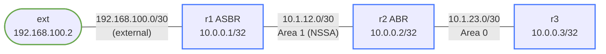

# debug-ospf-nssa — OSPF NSSA adjacency fails; external routes missing everywhere

## Scenario

A colleague was reviewing area configurations and changed a setting on r1, the ASBR inside the NSSA area. Now r1 and r2 won't form an OSPF adjacency. The external subnet (192.168.100.0/30) behind r1 is unreachable from the rest of the OSPF domain.

## How to use this lab

This is a **practice troubleshooting lab**. A working network was broken by
a small change; you diagnose it from symptoms, not from the config files.
Work the staged hints only when stuck, and reveal the solution last —
the skill being trained is *generating* the diagnosis, not reading it.

## Topology



## IP / Node Reference

| Node | Interface | IP Address         | OSPF Area |
|------|-----------|-------------------|-----------|
| ext  | Ethernet1 | 192.168.100.2/30  | —         |
| r1   | Loopback0 | 10.0.0.1/32       | area 1    |
| r1   | Ethernet1 | 192.168.100.1/30  | not in OSPF |
| r1   | Ethernet2 | 10.1.12.1/30      | area 1    |
| r2   | Loopback0 | 10.0.0.2/32       | area 0    |
| r2   | Ethernet1 | 10.1.12.2/30      | area 1    |
| r2   | Ethernet2 | 10.1.23.1/30      | area 0    |
| r3   | Loopback0 | 10.0.0.3/32       | area 0    |
| r3   | Ethernet1 | 10.1.23.2/30      | area 0    |

## Expected Behavior

- r1 and r2 form a Full OSPF adjacency across Area 1
- r1 (ASBR) generates Type-7 NSSA-external LSAs for the 192.168.100.0/30 subnet
- r2 (ABR) translates Type-7 to Type-5 and floods into Area 0
- r3 learns the external route (O E2 192.168.100.0/30)
- ext can ping r3's loopback (10.0.0.3) via the OSPF domain

## Deploy & Access

```bash
./scripts/lab.sh deploy debug-ospf-nssa

./scripts/lab.sh cli debug-ospf-nssa r1
./scripts/lab.sh cli debug-ospf-nssa r2
./scripts/lab.sh cli debug-ospf-nssa r3
```

## Observed Symptoms

```
r2# show ip ospf neighbor
Neighbor ID Instance VRF      Pri State                  Dead Time   Address         Interface
(empty — r1 never appears)

r3# show ip route ospf
(empty — no OSPF routes from area 1)

r2# show ip ospf database
(Type-7 NSSA-external LSA section is empty)

r3# ping 192.168.100.2
PING 192.168.100.2: 100% packet loss
```

## Your Task

Identify the misconfiguration using show commands. Do not look at config files yet — diagnose from symptoms first.

The adjacency between r1 and r2 never forms. What OSPF parameter mismatch could prevent two routers on the same link in the same area from becoming neighbors?

## Useful Show Commands

```
show ip ospf neighbor
show ip ospf interface
show ip ospf interface Ethernet2
show ip ospf database
show ip ospf database nssa-external
```

## Hints

<details markdown="1"><summary>Hint 1 — Where to start</summary>

The adjacency between r1 and r2 is completely absent. When OSPF neighbors fail to form, it is often due to: mismatched hello/dead timers, area ID mismatch, or **area type mismatch**. Verify area assignments first using `show ip ospf interface` on both r1 and r2.

</details>

<details markdown="1"><summary>Hint 2 — Narrowing it down</summary>

Run `show ip ospf interface Ethernet2` on r1 and `show ip ospf interface Ethernet1` on r2. Both should report the same area type for Area 1. Look at the "Area Type" or "Area" field in the output — does one say "Stub Area" while the other says "NSSA"?

</details>

<details markdown="1"><summary>Hint 3 — The specific problem</summary>

r1 has Area 1 configured as a **Stub** area; r2 has Area 1 configured as **NSSA**. OSPF encodes area type in Hello packets via the N-bit (NSSA) and E-bit (external). A stub area sets E=0, N=0. An NSSA area sets E=0, N=1. The N-bit mismatch prevents adjacency formation. Additionally, stub areas cannot redistribute external routes — so even if adjacency formed, r1's `redistribute connected` would silently have no effect.

</details>

## Solution

<details markdown="1"><summary>Show configuration</summary>

On **r1** in Cli:

```
r1# configure terminal
r1(config)# router ospf
r1(config-router)# no area 1 stub
r1(config-router)# area 1 nssa
r1(config-router)# end
r1# write memory
```

</details>

## Verification

```
r2# show ip ospf neighbor
Neighbor ID Instance VRF      Pri State                  Dead Time   Address         Interface
10.0.0.1         1 default     1 Full/DR                  00:00:35   10.1.12.1       Ethernet1

r2# show ip ospf database nssa-external
OSPF Router with ID (10.0.0.2) (Process ID 1)
                NSSA-external Link States (Area 1)
Link ID         ADV Router      Age  Seq#       CkSum  Route
192.168.100.0   10.0.0.1        12   0x80000001 ...    E2 192.168.100.0/30

r3# show ip route ospf
O E2   192.168.100.0/30 [110/20] via 10.1.23.1, Ethernet1
```

## Challenge questions

No answers provided — reason them through.

1. The fault here produced a **silent** failure (no error logged) with a
   misleading symptom. Explain *why* this class of misconfig fails silently,
   and the one show command that would have pinpointed it fastest.
2. What single piece of monitoring or assurance (a check, an alert, a
   pre-change validation) would have caught this fault before users did?
3. Generalize: list two *other* one-line changes to this topology that would
   produce a similar "looks healthy locally, broken downstream" symptom, and
   how you'd tell them apart.
4. Write the rollback/change-control habit that would have prevented this
   overnight break in the first place.
