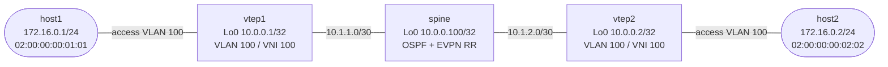

# VXLAN Reachability Incident — Guided Debug Lab

Diagnose an east-west forwarding outage in a small native Arista EVPN/VXLAN
fabric. The routed underlay and EVPN sessions remain healthy, so you must
correlate control-plane next hops, the local tunnel identity, and bounded
UDP/4789 evidence before changing configuration.

This lab assumes the EVPN route types, VTEP role, and VLAN-to-VNI mapping from
the paired [VXLAN EVPN build lab](../../docs/tracks/data-center/vxlan-evpn.md). Complete that lab
first if those concepts are unfamiliar.

## Topology



| Node | Platform | Preconfigured role and addressing |
|------|----------|------------------------------------|
| `spine` | Arista cEOS 4.35.2F | EVPN route reflector; Lo0 `10.0.0.100/32`; Ethernet1 `10.1.1.2/30`; Ethernet2 `10.1.2.2/30` |
| `vtep1` | Arista cEOS 4.35.2F | VTEP; Lo0 `10.0.0.1/32`; Ethernet1 `10.1.1.1/30`; Ethernet2 access VLAN 100 |
| `vtep2` | Arista cEOS 4.35.2F | VTEP; Lo0 `10.0.0.2/32`; Ethernet1 `10.1.2.1/30`; Ethernet2 access VLAN 100 |
| `host1` | `ops-lab:local` Linux | Ethernet1 `172.16.0.1/24`; MAC `02:00:00:00:01:01` |
| `host2` | `ops-lab:local` Linux | Ethernet1 `172.16.0.2/24`; MAC `02:00:00:00:02:02` |

OSPF area 0 provides loopback reachability. The VTEPs form iBGP EVPN
sessions to the spine from Loopback0. VLAN 100 maps to L2 VNI 100, and the
two Linux endpoints have no gateway because they share one bridged segment.

## How to use this lab

This is a **guided debug lab**, not a tutorial. Each task gives you an
**objective** and **hints** — your job is to produce an evidence-backed
diagnosis and the smallest justified repair.

- **Predict before you configure.** When a task asks for a prediction,
  commit to an answer before touching the CLI. Being wrong and finding out
  why is the point.
- **Open the hints before the solution.** The solution toggle is the answer
  key — use it to check your work or when genuinely stuck, not as step one.
- **Verify like an operator.** After each task, prove the state is what you
  think it is with `show` commands before moving on.

Do not inspect the startup configurations or helper scripts until you have
recorded the evidence from Tasks 1–3. Preserve the initial state: a healthy
adjacency is not the same claim as a working tunnel.

## Deploy

Load the cEOS image as described in the [cEOS platform notes](../../docs/platforms/ceos.md)
and build the small incidental Linux image, then deploy:

```bash
docker build -t ops-lab:local images/ops-lab/
./scripts/lab.sh deploy debug-vxlan-evpn
./scripts/lab.sh status debug-vxlan-evpn
```

Deployment starts in the incident state. To re-arm that state after an
attempt, run the opaque, idempotent initializer:

```bash
./labs/debug-vxlan-evpn/break.sh
```

Open device CLIs and host shells as needed:

```bash
./scripts/lab.sh cli debug-vxlan-evpn vtep1
./scripts/lab.sh cli debug-vxlan-evpn vtep2
./scripts/lab.sh bash debug-vxlan-evpn host1
```

Allow up to 45 seconds for OSPF and EVPN to settle before collecting the
starting evidence.

## Initial symptom and success criteria

The reported symptom is: **host1 and host2 cannot exchange traffic across
VNI 100, even though the fabric's routing and EVPN sessions look healthy**.

Do not call the incident resolved until you can prove all of the following:

- each VTEP has one Full OSPF adjacency and can reach the other VTEP's Lo0;
- both VTEPs have an Established EVPN session to the route reflector;
- each EVPN-advertised remote VTEP address agrees with the corresponding
  device's intended native VXLAN source identity;
- VNI 100 has remote IMET and host MAC evidence;
- UDP/4789 evidence is consistent with the working VTEP pair;
- endpoint pings succeed in both directions; and
- `./labs/debug-vxlan-evpn/check.sh` passes.

## Task 1 — Reproduce and bound the failure

**Objective:** Reproduce the endpoint symptom with bounded probes, then
separate host-link, local VLAN, and remote forwarding claims in your notes.

**Hypothesis first:** If both endpoints are up with correct `/24` addresses,
what additional evidence would distinguish a host-access failure from an
overlay failure?

Run these guided observations from the repository root:

```bash
./scripts/lab.sh cmd debug-vxlan-evpn host1 -- ip -brief address show eth1
./scripts/lab.sh cmd debug-vxlan-evpn host2 -- ip -brief address show eth1
./scripts/lab.sh cmd debug-vxlan-evpn host1 -- ping -c 3 -W 2 172.16.0.2
./scripts/lab.sh cmd debug-vxlan-evpn host2 -- ping -c 3 -W 2 172.16.0.1
./scripts/lab.sh cmd debug-vxlan-evpn host1 -- ip neigh show dev eth1
```

On each VTEP, inspect the local attachment without changing it:

```text
show interfaces Ethernet2 status
show interfaces Ethernet2 switchport
show mac address-table vlan 100
```

<details markdown="1">
<summary>Hint 1 — Classify, do not diagnose</summary>

- A failed ARP resolution confirms that the Layer 2 transaction did not
  finish. It does not identify which access port, VNI, tunnel endpoint, or
  return path is responsible.
- Confirm that each deterministic host MAC is learned locally on Ethernet2.

</details>

<details markdown="1">
<summary>Check your work</summary>

Both host interfaces should be UP with their documented IP and MAC, and each
VTEP should learn its directly attached host MAC on Ethernet2 in VLAN 100.
The bounded cross-host pings fail. That combination moves the boundary away
from endpoint addressing and local access attachment, but it does not yet
distinguish control-plane and data-plane causes.

</details>

## Task 2 — Eliminate the underlay and EVPN session

**Objective:** Prove that the routed transport and EVPN peerings satisfy
their intended contracts. Do not treat an Established session as proof that
every route it carries is usable.

**Predict first:** Can an EVPN route reflector session remain Established
while one advertised tunnel endpoint is unusable by a remote VTEP? Write a
yes/no answer and the mechanism you expect before running the commands.

On `vtep1`:

```text
show ip ospf neighbor
show ip route 10.0.0.2
ping 10.0.0.2 source 10.0.0.1 repeat 3 timeout 2
show bgp evpn summary
show bgp evpn route-type imet
```

Repeat the underlay and session checks from `vtep2`, reversing the source
and destination loopbacks, and inspect its local IMET route. On the spine,
confirm that exactly two EVPN peers are Established and inspect what each
peer actually advertised:

```text
show ip ospf neighbor
show bgp evpn summary
show bgp evpn route-type imet
show bgp evpn route-type mac-ip
```

Compare the spine's complete view with the prefix count and route table on
`vtep1`. Record the difference without labeling a cause yet.

<details markdown="1">
<summary>Hint 1 — Keep two identities separate</summary>

- The address used by a BGP session identifies the control-plane peer.
- An EVPN route also carries forwarding information used to find a VTEP.
  Those values commonly agree by design, but the protocol session does not
  force them to agree.

</details>

<details markdown="1">
<summary>Check your work</summary>

Each VTEP should have one Full OSPF neighbor, the spine should have two, and
the documented Lo0 addresses should be mutually reachable. Each VTEP should
have one Established EVPN peer and the spine should have two. The spine has
an IMET advertisement from each VTEP and, after Task 1 traffic, both host MAC
advertisements. `vtep1`, however, receives zero usable remote prefixes and
shows only its local IMET route. This resolves the prediction: the session
and route reflector can be healthy while a remote route fails next-hop
validation at the receiving VTEP.

</details>

## Task 3 — Correlate route, tunnel, and packet evidence

**Objective:** Build an identity table from independent native EOS views,
then use a bounded UDP/4789 observation to test the forwarding consequence.
Do not repair anything until the three views support one explanation.

**Predict first:** For each VTEP, which address should appear in all three
places: the device's intended VTEP identity, its native VXLAN source, and the
next hop/origin seen by the route reflector?

Collect the local identity and import state on both VTEPs:

```text
show ip interface brief
show running-config interfaces Vxlan1
show interfaces Vxlan1
show vxlan vni
show vxlan vtep
show bgp evpn route-type imet
show bgp evpn route-type mac-ip
show vxlan address-table
```

On the spine, use `show bgp evpn route-type imet` and `show bgp evpn
route-type mac-ip` as the authoritative view of what both peers advertised.
This is essential because an unusable next hop can keep a route out of a
receiving VTEP's EVPN table and native remote-VTEP table.

Fill this table before opening a hint:

| Advertising device | Intended VTEP identity | Native VXLAN source | Spine-observed EVPN next hop/origin | Imported by remote VTEP? |
|--------------------|------------------------|---------------------|--------------------------------------|--------------------------|
| `vtep1` | | | | |
| `vtep2` | | | | |

After identifying the forwarding address that needs testing, ask the remote
VTEP for its exact route rather than testing only the known Lo0 addresses:

```text
show ip route <observed-forwarding-address>
```

Make the tunnel visible. In one `vtep1` CLI, start a bounded capture:

```text
bash timeout 10 tcpdump -lni eth1 -c 12 'udp port 4789'
```

While it runs, generate one bounded attempt from another terminal:

```bash
./scripts/lab.sh cmd debug-vxlan-evpn host2 -- ping -c 3 -W 2 172.16.0.1
```

Record the outer source and destination addresses and whether reverse
UDP/4789 traffic is possible. Correlate the capture with `show interfaces
Vxlan1`, which reports the active source address, UDP port 4789, flood-list
source, and any installed head-end replication peer.

<details markdown="1">
<summary>Hint 1 — Locate the first disagreement</summary>

- Compare each control loopback with the source interface named under
  `Vxlan1`.
- Resolve that interface to an address, then compare it with the forwarding
  identity seen on the spine and the remote state actually installed by the
  receiving VTEP.

</details>

<details markdown="1">
<summary>Hint 2 — Test routability, not familiarity</summary>

- One device's three values disagree. Query the receiving VTEP's route to
  the surprising value exactly as displayed.
- An incoming encapsulated frame can still be visible while the reverse
  tunnel is impossible. Account for both directions.

</details>

<details markdown="1">
<summary>Hint 3 — Identify the broken invariant</summary>

`vtep2` sources native VXLAN from `Loopback100` (`10.0.0.22`) while its
intended and underlay-advertised VTEP identity is Loopback0 (`10.0.0.2`).
EVPN can carry `10.0.0.22` as forwarding information while the BGP session
to `10.0.0.100` remains Established. `vtep1` has no route to `10.0.0.22`, so
the UDP/4789 return path cannot be built.

</details>

<details markdown="1">
<summary>Diagnosis and repair</summary>

The smallest repair is to restore the intended source interface and remove
the stray loopback on `vtep2`:

```text
enable
configure
interface Vxlan1
   vxlan source-interface Loopback0
no interface Loopback100
end
```

You can apply the same validated, idempotent change from the repository root:

```bash
./labs/debug-vxlan-evpn/solution.sh
```

</details>

<details markdown="1">
<summary>Check your diagnosis</summary>

The observations form one causal chain. OSPF advertises the documented Lo0
addresses and supports the BGP update sources, so both sessions stay up.
The `Vxlan1` source on `vtep2`, however, selects a different local address;
that address appears in EVPN forwarding evidence even though `vtep1` cannot
route to it. The capture can therefore show a one-way UDP/4789 attempt but
not a usable bidirectional tunnel. Restoring Loopback0 makes control-plane,
EVPN, and native tunnel identities agree and restores the missing return
path. This resolves the prediction from Task 3.

</details>

## Recovery proof

Flush endpoint neighbor state, seed fresh traffic, and repeat the evidence
in the same order used during diagnosis:

```bash
./scripts/lab.sh cmd debug-vxlan-evpn host1 -- ip neigh flush all
./scripts/lab.sh cmd debug-vxlan-evpn host2 -- ip neigh flush all
./scripts/lab.sh cmd debug-vxlan-evpn host1 -- ping -c 5 -W 2 172.16.0.2
./scripts/lab.sh cmd debug-vxlan-evpn host2 -- ping -c 5 -W 2 172.16.0.1
./labs/debug-vxlan-evpn/check.sh
```

On `vtep1`, confirm that `show vxlan vtep`, the remote IMET route, the host2
Type-2 MAC route, and `show vxlan address-table` all associate the remote
state with `10.0.0.2`. On `vtep2`, confirm that `Vxlan1` names Loopback0 as
its source. A solved checker validates the exact platforms and inventory,
host addressing and MACs, access ports, OSPF, EVPN peers, VNI/source mapping,
remote route/MAC evidence, and bidirectional traffic.

While the incident is armed, the platform, host attachment, OSPF, loopback
reachability, and EVPN-session checks should remain green. The solved-source,
remote-VTEP, remote-MAC, and endpoint-forwarding checks are the intentionally
affected subset.

## Challenge questions

No answers are provided. Use the evidence model from this incident.

1. Design an assurance rule that compares OSPF RIB reachability, EVPN IMET
   next hops, and configured VXLAN source addresses without assuming every
   VTEP uses `Loopback0`.
2. If `10.0.0.22/32` were also advertised into OSPF, which evidence from this
   lab would turn green, and what additional test would be needed to prove
   whether the source selection was still operationally wrong?
3. Replace the route reflector with two spines. Which identity invariants
   remain per-VTEP, and which session-count checks must change?
4. A remote Type-2 route is present but `show vxlan address-table` has no
   corresponding entry. Rank three VXLAN-specific causes and state the
   command that would separate each one.
5. Propose a maintenance-window rollback trigger based on UDP/4789 counter
   symmetry and one endpoint transaction. Explain why BGP session state
   alone is an unsafe trigger.

## Troubleshooting the lab environment

| Symptom | Likely cause | Recovery |
|---------|--------------|----------|
| cEOS nodes do not start | `ceos:4.35.2F` is not loaded locally | Follow the [cEOS platform notes](../../docs/platforms/ceos.md), then redeploy |
| Linux hosts do not start | `ops-lab:local` has not been built | Run `docker build -t ops-lab:local images/ops-lab/` |
| OSPF is not Full after 45 seconds | A cEOS interface or startup configuration did not load | Check `show interfaces status`, `show ip interface brief`, and container logs before investigating EVPN |
| EVPN is not Established | Loopback reachability or the RR session has not converged | Prove the relevant Lo0 route and ping, then inspect `show bgp evpn summary` |
| Type-2 route is absent after repair | No fresh endpoint frame has been learned | Flush neighbor state and send a bounded ping before checking the MAC/IP route again |
| UDP capture is empty | Capture ended before traffic or used the host-facing port | Start the bounded capture on the VTEP underlay Ethernet1, then generate one fresh endpoint probe |
| Checker still reports the incident subset | The runtime repair was not applied or did not converge | Run `./labs/debug-vxlan-evpn/solution.sh`, wait for its bounded postcondition, then rerun the checker |

## Cleanup

```bash
./scripts/lab.sh destroy debug-vxlan-evpn
```
