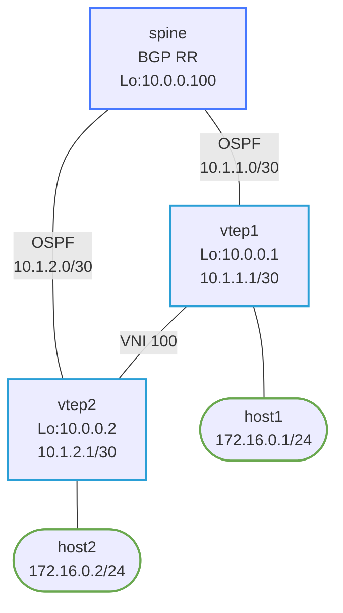

# debug-vxlan-evpn — VXLAN tunnel built with wrong local VTEP IP; host2 unreachable

## Scenario

A colleague deployed a VXLAN/BGP EVPN fabric. host1 and host2 should be on the same Layer 2 segment (VNI 100) and able to ping each other. After deployment, host1 can't reach host2. BGP EVPN routes appear in the table, but frames destined for host2 are never delivered correctly.

## How to use this lab

This is a **practice troubleshooting lab**. A working network was broken by
a small change; you diagnose it from symptoms, not from the config files.
Work the staged hints only when stuck, and reveal the solution last —
the skill being trained is *generating* the diagnosis, not reading it.

## Topology



## IP / Node Reference

| Node  | Loopback     | Uplink (eth1)  | Host port (eth2) | Host IP        |
|-------|-------------|----------------|-----------------|----------------|
| spine | 10.0.0.100/32 | —            | —               | —              |
| vtep1 | 10.0.0.1/32  | 10.1.1.1/30   | br100           | —              |
| vtep2 | 10.0.0.2/32  | 10.1.2.1/30   | br100           | —              |
| host1 | —           | —              | eth1            | 172.16.0.1/24  |
| host2 | —           | —              | eth1            | 172.16.0.2/24  |

## Expected Behavior

- OSPF underlay converges; vtep1 and vtep2 can reach each other's loopbacks
- BGP EVPN session established between vtep1/vtep2 and spine (as route reflector)
- `show bgp l2vpn evpn` shows Type-2 (MAC/IP) routes for host1 and host2
- host1 can ping host2 (172.16.0.2) — Layer 2 across VNI 100

## Deploy & Access

```bash
./scripts/lab.sh deploy debug-vxlan-evpn

./scripts/lab.sh cli debug-vxlan-evpn vtep1
./scripts/lab.sh bash debug-vxlan-evpn vtep2
./scripts/lab.sh bash debug-vxlan-evpn host1
```

## Observed Symptoms

```
# On host1:
ping 172.16.0.2
PING 172.16.0.2: 100% packet loss

# On vtep2 (bash):
ip link show vxlan100
# vxlan100: ... local 10.0.0.1   ← incorrect

# On vtep1 (vtysh):
show bgp l2vpn evpn
# Routes appear for both 172.16.0.1 and 172.16.0.2

# On vtep2 (vtysh):
show bgp l2vpn evpn
# Type-2 routes advertised with next-hop 10.0.0.1 (vtep1's IP!)
# vtep2 is advertising its MAC/IP with vtep1's VTEP address as the next-hop
```

## Your Task

Identify the misconfiguration using show commands. Do not look at setup.sh files yet — diagnose from symptoms first.

The OSPF underlay and BGP EVPN sessions are working. But something about vtep2's tunnel configuration causes its routes to advertise the wrong VTEP IP.

## Useful Show Commands

```
# In vtysh:
show bgp l2vpn evpn
show bgp l2vpn evpn vni 100
show ip ospf neighbor
show ip route ospf

# In bash (docker exec -it ... bash):
ip link show vxlan100
ip addr show vxlan100
bridge fdb show
```

## Hints

<details markdown="1"><summary>Hint 1 — Where to start</summary>

Run `show bgp l2vpn evpn` on vtep1 and vtep2. Look at the "Next Hop" column for routes advertised by vtep2. The next-hop for EVPN Type-2 routes should be the advertising VTEP's own loopback IP. What loopback IP does vtep2 advertise as its next-hop?

</details>

<details markdown="1"><summary>Hint 2 — Narrowing it down</summary>

The BGP EVPN next-hop is derived from the `local` address of the vxlan interface, which should match the VTEP's loopback. Run `ip link show vxlan100` on vtep2 (bash) and look at the `local` field. Compare it to vtep2's loopback (`ip addr show lo`).

</details>

<details markdown="1"><summary>Hint 3 — The specific problem</summary>

vtep2's vxlan100 interface was created with `local 10.0.0.1` — vtep1's loopback IP — instead of `local 10.0.0.2` (vtep2's own loopback). As a result, vtep2 advertises EVPN routes with next-hop 10.0.0.1. Remote VTEPs send traffic toward vtep1 instead of vtep2, so host2's frames are never delivered correctly.

</details>

## Solution

<details markdown="1"><summary>Show configuration</summary>

On **vtep2** (inside container bash):

```bash
# Remove the incorrectly configured vxlan interface
ip link set vxlan100 nomaster
ip link set vxlan100 down
ip link del vxlan100

# Recreate with the correct local IP
ip link add vxlan100 type vxlan id 100 dstport 4789 local 10.0.0.2 nolearning
ip link set vxlan100 up
ip link set vxlan100 master br100
```

Then clear BGP to force re-advertisement:

```
vtep2# clear bgp l2vpn evpn * soft
```

</details>

## Verification

```bash
# On vtep2 (bash):
ip link show vxlan100
# vxlan100: ... local 10.0.0.2  ← correct

# On vtep1 (vtysh):
show bgp l2vpn evpn
# vtep2's routes now show Next Hop: 10.0.0.2

# On host1:
ping 172.16.0.2
# 64 bytes from 172.16.0.2: icmp_seq=1 ttl=64 time=1.1 ms
```

## Challenge questions

No answers provided — reason them through.

1. The fault here produced a **silent** failure (no error logged) with a
   misleading symptom. Explain *why* this class of misconfig fails silently,
   and the one show command that would have pinpointed it fastest.
2. What single piece of monitoring or assurance (a check, an alert, a
   pre-change validation) would have caught this fault before users did?
3. Generalize: list two *other* one-line changes to this topology that would
   produce a similar "looks healthy locally, broken downstream" symptom, and
   how you'd tell them apart.
4. Write the rollback/change-control habit that would have prevented this
   overnight break in the first place.
