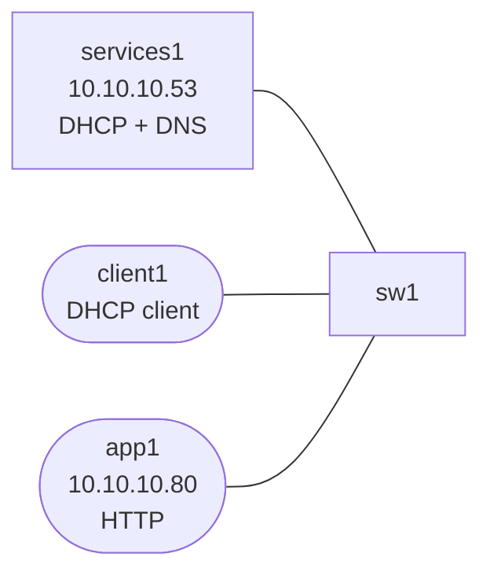

# dhcp-dns-troubleshooting

This lab focuses on two quiet failure domains that break user experience fast:

- DHCP lease delivery
- DNS resolver correctness

## How to use this lab

This is a **practice troubleshooting lab**. Something is broken (or about to
be); your job is to find and fix it from the symptom, not a script. **Form
a hypothesis before each command**, predict what a healthy vs. broken output
looks like, and only then run it. The challenge questions test transfer.

## Topology



## Build and Deploy

```bash
docker build -t ops-lab:local images/ops-lab/
docker import cEOS-lab-4.35.2F.tar ceos:4.35.2F
sudo containerlab deploy -t labs/dhcp-dns-troubleshooting/topology.clab.yml
```

## What Is Prebuilt

- `services1` runs `dnsmasq` for DHCP and DNS
- `app1` hosts HTTP on `10.10.10.80`
- `client1` starts without an address
- the DHCP server is intentionally handing out the wrong DNS server option

## Tasks

### 1. Confirm DHCP works but DNS is wrong

```bash
docker exec clab-dhcp-dns-troubleshooting-client1 udhcpc -i eth1 -q
docker exec clab-dhcp-dns-troubleshooting-client1 cat /etc/resolv.conf
docker exec clab-dhcp-dns-troubleshooting-client1 ping -c 2 10.10.10.80
docker exec clab-dhcp-dns-troubleshooting-client1 dig @10.10.10.53 app.internal.lab A
```

You should see:

- the client gets an address
- the app is reachable by IP
- name resolution via the learned resolver is wrong

### 2. Fix the DHCP option

On `services1`, edit `/etc/dnsmasq.conf` so option 6 points at `10.10.10.53`, then restart dnsmasq:

```bash
docker exec -it clab-dhcp-dns-troubleshooting-services1 sh
pkill dnsmasq
dnsmasq --keep-in-foreground --log-facility=/tmp/dnsmasq.log &
```

### 3. Renew the lease and validate DNS

```bash
docker exec clab-dhcp-dns-troubleshooting-client1 udhcpc -i eth1 -q -n
docker exec clab-dhcp-dns-troubleshooting-client1 cat /etc/resolv.conf
docker exec clab-dhcp-dns-troubleshooting-client1 dig app.internal.lab A
```

## What This Lab Teaches

- successful DHCP does not mean the client learned correct service options
- IP reachability and name resolution fail differently and should be tested separately
- service troubleshooting starts with the lease contents, not guesswork

## Challenge questions

No answers provided — reason them through.

1. A client gets no IP. Lay out the ordered checklist from the client's
   DISCOVER to the server's ACK, and which single missing piece (relay,
   scope, reachability) each step would expose.
2. DHCP works but DNS resolution fails for some names only. What layers
   could cause "some names" specifically, and how do you bisect them?
3. `ip helper-address` forwards DHCP across a routed boundary — what exactly
   does the relay rewrite, and how does the server pick the right subnet to
   offer from?
4. A rogue DHCP server hands out a bad gateway. Why does the client believe
   it, and which L2 feature stops it (tie back to campus-l2-hardening)?
