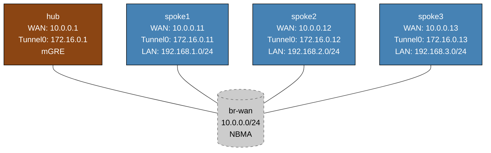

# DMVPN Phase 1 — Arista cEOS Practice Lab

Configure DMVPN Phase 1 hub-and-spoke VPN using mGRE tunnels and NHRP on Arista EOS. The hub is fully pre-configured; you configure NHRP registration and OSPF on each spoke.

DMVPN Phase 1 is used by network operators deploying hub-and-spoke WAN topologies on Arista hardware. This lab uses native EOS `interface Tunnel`, `ip nhrp`, and `router ospf` commands.

---

## Topology



`br-wan` is a Linux bridge simulating the NBMA WAN network (all spokes can reach the hub but not each other directly at the IP layer in Phase 1).

---

## Deploy and access

```bash
sudo containerlab deploy -t labs/dmvpn-ceos/topology.clab.yml

# EOS CLI
docker exec -it clab-dmvpn-ceos-hub    Cli
docker exec -it clab-dmvpn-ceos-spoke1 Cli
```

---

## Step 1 — Verify hub baseline

The hub is fully configured (mGRE Tunnel0, NHRP, OSPF). Check it before configuring spokes:

```
# On hub
show interfaces Tunnel0
show ip nhrp
show ip ospf interface Tunnel0
```

The hub's `show ip nhrp` output will be empty until spokes register.

---

## Step 2 — Configure spoke1 NHRP and OSPF

<details>
<summary>Show configuration</summary>

Enter spoke1 CLI:
```bash
docker exec -it clab-dmvpn-ceos-spoke1 Cli
```

Configure Tunnel0 NHRP:
```
configure
interface Tunnel0
   ip nhrp network-id 1
   ip nhrp holdtime 300
   ip nhrp nhs 172.16.0.1 nbma 10.0.0.1 multicast
   ip nhrp map 172.16.0.1 10.0.0.1
   ip nhrp registration no-unique
   ip ospf network point-to-point
   ip ospf area 0
```

Configure OSPF process:
```
router ospf 1
   router-id 10.0.0.11
   passive-interface Loopback0
   passive-interface Loopback1
```

</details>

### NHRP parameter explanation

| Command | Purpose |
|---------|---------|
| `ip nhrp network-id 1` | Identifies the DMVPN cloud (must match hub) |
| `ip nhrp holdtime 300` | How long the hub keeps this registration |
| `ip nhrp nhs 172.16.0.1 nbma 10.0.0.1 multicast` | Register with hub: tunnel IP=172.16.0.1, WAN IP=10.0.0.1, enable multicast forwarding |
| `ip nhrp map 172.16.0.1 10.0.0.1` | Static mapping so spoke knows how to reach hub |
| `ip nhrp registration no-unique` | Allows re-registration (useful in lab environments) |

---

## Step 3 — Verify spoke1 registration

On hub, check NHRP:
```
show ip nhrp
```

Expected output shows spoke1's tunnel IP (172.16.0.11) mapped to WAN IP (10.0.0.11).

Check OSPF adjacency:
```
show ip ospf neighbor
```

Spoke1 should appear as `Full` neighbor.

---

## Step 4 — Configure spoke2 and spoke3

Repeat Step 2 for spoke2 (router-id 10.0.0.12, tunnel IP 172.16.0.12) and spoke3 (router-id 10.0.0.13, tunnel IP 172.16.0.13). NHRP NHS parameters are the same for all spokes.

---

## Step 5 — Verify routing and connectivity

After all spokes are configured, on hub:
```
show ip ospf neighbor
show ip route
```

You should see routes to all spoke LANs (192.168.1/2/3.0/24) via OSPF.

Test connectivity spoke-to-spoke via hub:
```
# On spoke1
ping 192.168.2.1 repeat 5    ← spoke2 LAN
ping 192.168.3.1 repeat 5    ← spoke3 LAN
```

---

## Key EOS DMVPN concepts

**`tunnel mode gre multipoint`** — creates an mGRE interface that can accept tunnels from any spoke (no single `tunnel destination`). Without this the hub would need a separate tunnel interface per spoke.

**`ip nhrp redirect`** (hub only) — in Phase 1, hub-and-spoke only. In Phase 2/3, the hub sends NHRP redirect messages to tell spokes to build direct spoke-to-spoke tunnels.

**OSPF network types on DMVPN:**
- Hub: `point-to-multipoint` — hub sees all spokes as point-to-point segments, no DR/BDR election
- Spokes: `point-to-point` — each spoke treats its tunnel as a p2p link to the hub

---

## Troubleshooting

**NHRP not registering (`show ip nhrp` empty on hub)**
- Confirm `ip nhrp nhs` and `ip nhrp map` on spoke point to hub's CORRECT IPs
- Check physical WAN reachability: `ping 10.0.0.1` from spoke's WAN interface
- Verify `ip nhrp network-id 1` matches on hub and spoke

**OSPF not forming adjacency**
- After NHRP registers, OSPF should form over the tunnel
- Check `show ip ospf interface Tunnel0` — verify network type matches (p2mp on hub, p2p on spoke)
- `show ip ospf neighbor detail` for timer/state info

**Routes not propagated**
- `show ip ospf database` — check if LSAs from all routers are present
- Passive interfaces (Loopback0, Loopback1) must still be covered by the `network` statement or interface-level `ip ospf area 0`

---

## Cleanup

```bash
sudo containerlab destroy -t labs/dmvpn-ceos/topology.clab.yml --cleanup
```
