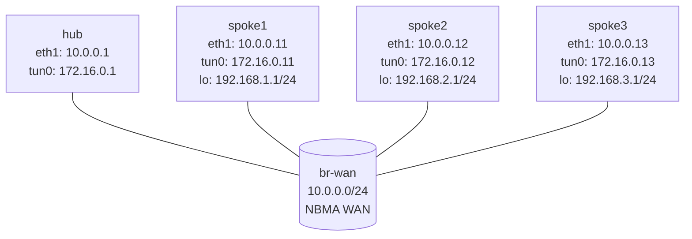

# DMVPN Phase 1 — Practice Lab (VyOS)

DMVPN scales hub-and-spoke VPNs by replacing N static tunnels with one
mGRE interface plus NHRP — a registration protocol that maps overlay
tunnel IPs to underlay WAN (NBMA) addresses. In Phase 1, spokes register
with the hub and all spoke-to-spoke traffic routes *through* it. The hub
is pre-built; you finish each spoke's NHRP and OSPF and prove the Phase 1
forwarding behavior.

## Topology



| Node   | WAN (`eth1`) | Tunnel (`tun0`) | LAN / loopback |
|--------|---------------|-----------------|----------------|
| hub    | 10.0.0.1/24   | 172.16.0.1/32   | none           |
| spoke1 | 10.0.0.11/24  | 172.16.0.11/32  | 192.168.1.1/24 |
| spoke2 | 10.0.0.12/24  | 172.16.0.12/32  | 192.168.2.1/24 |
| spoke3 | 10.0.0.13/24  | 172.16.0.13/32  | 192.168.3.1/24 |

**Pre-built:** hub WAN/mGRE, hub NHRP server, hub OSPF
point-to-multipoint, spoke WAN IPs, spoke loopback LANs, spoke GRE
interfaces. **You configure:** each spoke's NHRP cloud membership, NHS
mapping to the hub, OSPF over the tunnel, and LAN advertisement.

## How to use this lab

This is a **practice lab**, not a tutorial. Each task gives you an
**objective** and **hints** — your job is to produce the configuration.

- **Predict before you configure**, **open hints before the solution**,
  and **verify** with `show ip nhrp` and `show ip ospf neighbor`.

## Deploy

```bash
sudo containerlab deploy -t labs/dmvpn-phase1/topology.clab.yml
./scripts/lab.sh cli dmvpn-phase1 hub      # `configure` to enter config; `run` for show
```

---

## Task 1 — Read the hub, predict what the spokes need

**Objective:** On the hub, inspect its NHRP and OSPF state before
configuring any spoke.

**Predict first:** `show ip nhrp` on the hub is empty right now. NHRP is a
*registration* protocol. Which side initiates registration — does the hub
reach out to spokes, or do spokes register to the hub? What does that
imply about which device's config you must complete?

```vyos
show ip nhrp
show ip ospf neighbor
show ip ospf interface brief
```

<details>
<summary>Check your work</summary>

NHRP is empty and OSPF has no neighbors — the hub is a *server* waiting to
be contacted. Spokes initiate: each registers its tunnel-IP↔NBMA mapping
to the hub (the NHS), which is why the hub's table fills only as you
configure spokes. The hub can't bootstrap the relationship; it doesn't
know spokes exist until they call in. That's the whole asymmetry of
NHRP and why your work is entirely on the spokes.

</details>

---

## Task 2 — Configure spoke1 (NHRP + OSPF)

**Objective:** Make spoke1 register to the hub via NHRP and form an OSPF
adjacency over `tun0`, advertising its LAN.

**Predict first:** the NHS line points at the hub by *tunnel* IP
(172.16.0.1) with an *NBMA* (10.0.0.1) mapping. Why does NHRP need
*both* addresses for the hub — what does each one resolve?

<details>
<summary>Hints</summary>

- NHRP: `protocols nhrp tunnel tun0` with `network-id 1`, `nhs tunnel-ip
  172.16.0.1 nbma 10.0.0.1`, a matching static `map`, `multicast
  10.0.0.1`, and `registration-no-unique`.
- OSPF: router-id 10.0.0.11, advertise the tunnel /32 and the LAN,
  `tun0` network type `point-to-multipoint`, `eth1` passive.

</details>

<details>
<summary>Solution</summary>

On **spoke1**:
```vyos
configure
set protocols nhrp tunnel tun0 network-id '1'
set protocols nhrp tunnel tun0 holdtime '300'
set protocols nhrp tunnel tun0 nhs tunnel-ip '172.16.0.1' nbma '10.0.0.1'
set protocols nhrp tunnel tun0 map tunnel-ip '172.16.0.1' nbma '10.0.0.1'
set protocols nhrp tunnel tun0 multicast '10.0.0.1'
set protocols nhrp tunnel tun0 registration-no-unique
set protocols ospf parameters router-id '10.0.0.11'
set protocols ospf area 0 network '172.16.0.11/32'
set protocols ospf area 0 network '192.168.1.0/24'
set protocols ospf interface eth1 passive
set protocols ospf interface tun0 network 'point-to-multipoint'
commit
save
```

</details>

<details>
<summary>Check your work</summary>

The hub's `show ip nhrp` now lists 172.16.0.11 via NBMA 10.0.0.11, and
spoke1 forms a Full OSPF adjacency. Prediction answer: the **tunnel IP**
is the overlay identity (what OSPF and your LAN routes resolve to), while
the **NBMA IP** is where on the real WAN to actually send the
encapsulated packet. NHRP's entire job is maintaining that overlay→
underlay mapping dynamically — it's "ARP for the tunnel." `multicast
10.0.0.1` is what lets OSPF hellos (multicast) reach the hub at all over
a non-broadcast medium.

</details>

---

## Task 3 — Configure spoke2 and spoke3

**Objective:** Repeat the pattern with each spoke's own router-id, tunnel
/32, and LAN — the NHS values stay the same (the hub doesn't change).

| Node   | Router ID  | Tunnel /32     | LAN subnet        |
|--------|------------|----------------|-------------------|
| spoke2 | 10.0.0.12  | 172.16.0.12/32 | 192.168.2.0/24    |
| spoke3 | 10.0.0.13  | 172.16.0.13/32 | 192.168.3.0/24    |

<details>
<summary>Solution</summary>

Same as Task 2 with the per-node values above; NHS remains tunnel-ip
172.16.0.1 / nbma 10.0.0.1 on every spoke.

</details>

<details>
<summary>Check your work</summary>

The hub's NHRP table now has all three spokes; every spoke is Full with
the hub. Note that spokes do **not** peer with each other — there's one
adjacency per spoke, all to the hub. That single-hub control plane is
what makes DMVPN scale: adding spoke #500 is one more registration, not
499 new tunnels.

</details>

---

## Task 4 — Prove Phase 1 forwarding (and its limit)

**Objective:** From spoke1, reach spoke2's LAN and traceroute the path.

**Predict first:** spoke1 and spoke2 are both on the same NBMA WAN — they
*could* in principle talk directly. In **Phase 1**, will spoke1→spoke2
traffic go direct, or through the hub? How many hops in the traceroute?

```vyos
ping 192.168.2.1 count 3
traceroute 192.168.2.1
```

<details>
<summary>Check your work</summary>

Reachability works, but the traceroute shows the path going **through the
hub** (172.16.0.1) — spoke-to-spoke is *not* direct in Phase 1. The hub
advertises remote spoke LANs with itself as the next hop, so every
spoke's only route to another spoke points at the hub. This is Phase 1's
defining limitation and exactly what Phase 2/3 (the next labs) solve by
letting NHRP build dynamic spoke-to-spoke shortcuts. The hub being a
forwarding chokepoint *and* a single point of failure is the motivation
for the whole DMVPN evolution.

</details>

---

## Reference — why each NHRP knob matters

| VyOS command | Purpose |
|--------------|---------|
| `network-id 1` | DMVPN cloud ID (must match on all members) |
| `nhs tunnel-ip 172.16.0.1 nbma 10.0.0.1` | Identifies the hub by overlay + underlay |
| `map tunnel-ip ... nbma ...` | Static resolution entry for the hub |
| `multicast 10.0.0.1` | Sends OSPF hellos (multicast) toward the hub |
| `registration-no-unique` | Allows re-registration without unique-NBMA enforcement |

## Verification

```vyos
show ip nhrp
show ip ospf neighbor
show ip route ospf
show interfaces tunnel tun0
```

```bash
./scripts/lab.sh check dmvpn-phase1
```

---

## Challenge questions

No answers provided — reason them through.

1. Phase 1 routes spoke-to-spoke through the hub. Quantify the cost for
   two spokes exchanging a large file via a distant hub (latency,
   bandwidth, hub load), and explain precisely what Phase 2 changes in
   NHRP to allow a direct shortcut.
2. The hub is a single point of failure. Sketch a dual-hub Phase 1
   design — what changes on the spokes (NHS entries, OSPF), and how do
   you make one hub primary without splitting traffic?
3. `multicast 10.0.0.1` was required for OSPF to work. Explain why a
   non-broadcast medium breaks OSPF's default hello behavior, and what
   the `point-to-multipoint` network type does to compensate.
4. You want to encrypt this DMVPN. Given the gre-ipsec lab, describe
   exactly what you'd add (mode, selector) and why per-spoke IPsec peers
   to the hub preserve Phase 1 behavior while protecting the WAN.

## Cleanup

```bash
sudo containerlab destroy -t labs/dmvpn-phase1/topology.clab.yml --cleanup
```
