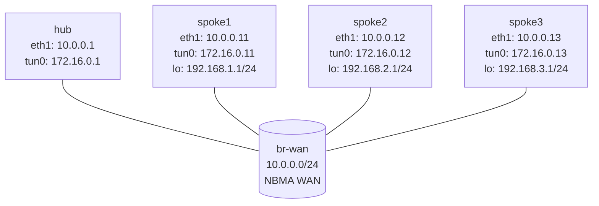

# DMVPN Phase 1 — VyOS Practice Lab

Configure DMVPN Phase 1 on VyOS using mGRE, NHRP, and OSPF. The hub is already configured; each spoke has only its WAN IP, loopback LAN, and base GRE tunnel. Your job is to finish the NHRP and OSPF configuration on the spokes.

This refactor keeps the original learning goal intact, but the operator model is now VyOS-native:

- `configure`
- `set ...`
- `commit`
- `save`

## Topology



`br-wan` is a shared NBMA segment. DMVPN uses NHRP to map overlay tunnel addresses to underlay WAN addresses.

## Addressing

| Node   | WAN (`eth1`) | Tunnel (`tun0`) | LAN / loopback |
|--------|---------------|-----------------|----------------|
| hub    | 10.0.0.1/24   | 172.16.0.1/32   | none           |
| spoke1 | 10.0.0.11/24  | 172.16.0.11/32  | 192.168.1.1/24 |
| spoke2 | 10.0.0.12/24  | 172.16.0.12/32  | 192.168.2.1/24 |
| spoke3 | 10.0.0.13/24  | 172.16.0.13/32  | 192.168.3.1/24 |

## Deploy And Access

```bash
sudo containerlab deploy -t labs/dmvpn-phase1/topology.clab.yml

./scripts/lab.sh cli dmvpn-phase1 hub
./scripts/lab.sh cli dmvpn-phase1 spoke1
```

`lab.sh cli` drops you into the VyOS admin shell. Use `configure` to enter config mode. Use `run <op-command>` from config mode for show commands.

## What Is Pre-Configured

- Hub WAN IP and mGRE tunnel
- Hub NHRP server role
- Hub OSPF point-to-multipoint over `tun0`
- Spoke WAN IPs
- Spoke loopback LANs
- Spoke GRE tunnel interfaces with source set to `eth1`

## Your Task

Configure on each spoke:

1. NHRP cloud membership
2. NHS mapping toward the hub
3. OSPF over the tunnel
4. OSPF advertisement of the local LAN

## Step 1 — Verify The Hub

On `hub`:

```vyos
show ip nhrp
show ip ospf neighbor
show ip ospf interface brief
show configuration commands | match nhrp
```

Expected before spoke work:

- `show ip nhrp` is empty or nearly empty
- `tun0` is present on the hub
- OSPF is configured on `tun0` as point-to-multipoint

## Step 2 — Configure `spoke1`

On `spoke1`:

```vyos
configure

set protocols nhrp tunnel tun0 network-id '1'
set protocols nhrp tunnel tun0 holdtime '300'
set protocols nhrp tunnel tun0 nhs tunnel-ip '172.16.0.1' nbma '10.0.0.1'
set protocols nhrp tunnel tun0 map tunnel-ip '172.16.0.1' nbma '10.0.0.1'
set protocols nhrp tunnel tun0 multicast '10.0.0.1'
set protocols nhrp tunnel tun0 registration-no-unique

set protocols ospf parameters router-id '10.0.0.11'
set protocols ospf area 0 network '172.16.0.11/32'
set protocols ospf area 0 network '192.168.1.0/24'
set protocols ospf interface eth1 passive
set protocols ospf interface tun0 network 'point-to-multipoint'

commit
save
exit
```

Key values:

- Hub tunnel IP: `172.16.0.1`
- Hub WAN NBMA IP: `10.0.0.1`
- Spoke1 tunnel IP: `172.16.0.11`

## Step 3 — Verify `spoke1`

On `spoke1`:

```vyos
show ip nhrp
show ip ospf neighbor
show ip route ospf
ping 172.16.0.1 count 3
```

On `hub`:

```vyos
show ip nhrp
show ip ospf neighbor
```

Expected:

- Hub learns `172.16.0.11` via NBMA `10.0.0.11`
- `spoke1` forms a Full OSPF adjacency with the hub
- `spoke1` learns remote LANs through OSPF once other spokes are configured

## Step 4 — Repeat For `spoke2` And `spoke3`

Use the same pattern with these values:

| Node   | Router ID  | Tunnel /32     | LAN subnet        |
|--------|------------|----------------|-------------------|
| spoke2 | 10.0.0.12  | 172.16.0.12/32 | 192.168.2.0/24    |
| spoke3 | 10.0.0.13  | 172.16.0.13/32 | 192.168.3.0/24    |

The hub NHS values remain the same for every spoke:

- tunnel IP `172.16.0.1`
- NBMA IP `10.0.0.1`

## Step 5 — End-To-End Verification

On `hub`:

```vyos
show ip nhrp
show ip ospf neighbor
show ip route ospf
ping 192.168.1.1 count 3
ping 192.168.2.1 count 3
ping 192.168.3.1 count 3
```

On `spoke1`:

```vyos
show ip route ospf
ping 192.168.2.1 count 3
ping 192.168.3.1 count 3
traceroute 192.168.2.1
```

Phase 1 behavior:

- spokes do not form direct data-plane shortcuts
- spoke-to-spoke traffic goes through the hub
- OSPF next hop for remote spoke LANs should resolve through the hub side of the tunnel

## Why These NHRP Commands Matter

| VyOS command | Purpose |
|--------------|---------|
| `network-id 1` | Defines the DMVPN cloud ID |
| `nhs tunnel-ip 172.16.0.1 nbma 10.0.0.1` | Tells the spoke which overlay and underlay identity belongs to the hub |
| `map tunnel-ip 172.16.0.1 nbma 10.0.0.1` | Creates the static resolution entry for the hub |
| `multicast 10.0.0.1` | Sends multicast traffic such as OSPF hellos toward the hub NBMA address |
| `registration-no-unique` | Allows registration updates without enforcing unique NBMA ownership |

## Operational Commands

Useful op-mode commands during the lab:

```vyos
show ip nhrp
show ip ospf neighbor
show ip ospf route
show ip route ospf
show interfaces tunnel tun0
show configuration commands | match ospf
show configuration commands | match nhrp
```

If you are already in config mode, prefix them with `run`.

## Automation Note

For this lab, `config.boot` is the cleanest source of truth and `vbash` op commands are the simplest way to validate state. If you later automate spoke bring-up, VyOS's HTTP API maps naturally to the same workflow:

- open a config session
- load or send `set` commands
- `commit`
- `save`

That is closer to a Junos-style candidate configuration flow than an IOS line-by-line CLI scraper.

## Troubleshooting

If the hub never learns a spoke:

- Confirm `show ip nhrp` on the spoke contains the hub mapping
- Confirm the spoke `nhs` uses hub tunnel IP `172.16.0.1`, not WAN IP `10.0.0.1`
- Confirm `multicast` points at `10.0.0.1`
- Confirm all nodes use `network-id 1`

If OSPF does not come up:

- Check `show ip ospf neighbor`
- Check `show ip ospf interface brief`
- Confirm `tun0` uses `point-to-multipoint`
- Confirm `eth1` is passive

If routes are missing:

- Check `show ip route ospf`
- Check each spoke advertises its LAN subnet, not just the tunnel /32

## Automated Check

After configuring all spokes:

```bash
./scripts/lab.sh check dmvpn-phase1
```

## Cleanup

```bash
sudo containerlab destroy -t labs/dmvpn-phase1/topology.clab.yml --cleanup
```
