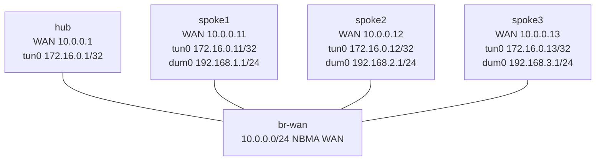

# DMVPN Phase 1 — Build Lab

Build the spoke side of a native VyOS DMVPN Phase 1 cloud. You will make
three mGRE spokes register with one NHRP next-hop server, exchange service
routes with OSPF, prove that every spoke-to-spoke packet traverses the hub,
and isolate a failure that leaves NHRP healthy while OSPF fails.

**Prerequisites:** complete `gre-basics` and `ospf-multiarea` first. This lab
assumes you can distinguish an underlay address from an overlay address and
can interpret OSPF neighbor and route state.

## Topology



| Node | Role | WAN (`eth1`) | Overlay (`tun0`) | Service (`dum0`) |
|------|------|--------------|------------------|------------------|
| hub | NHRP server and Phase 1 transit | 10.0.0.1/24 | 172.16.0.1/32 | — |
| spoke1 | NHRP/OSPF learner node | 10.0.0.11/24 | 172.16.0.11/32 | 192.168.1.1/24 |
| spoke2 | NHRP/OSPF learner node | 10.0.0.12/24 | 172.16.0.12/32 | 192.168.2.1/24 |
| spoke3 | NHRP/OSPF learner node | 10.0.0.13/24 | 172.16.0.13/32 | 192.168.3.1/24 |
| br-wan | Incidental Ethernet bridge | — | — | — |

All four routers use native `vyos:local`; the incidental bridge uses
`ops-lab:local`. The hub NHRP/OSPF definition, all addresses, and all mGRE
interfaces are pre-built. The learned NHRP and OSPF subtrees are absent from
the spokes. The hub explicitly carries the platform-normalized NHRP-server
default `registration-no-unique`; the exact healthy table still requires
three distinct spoke tunnel/NBMA registrations, and spokes do not use that
server-side leaf.

## How to use this lab

This is a **Build lab**, not a tutorial. Each task gives you an
**objective** and **hints** — your job is to produce the configuration.

- **Predict before you configure.** When a task asks for a prediction,
  commit to an answer before touching the CLI. Being wrong and finding out
  why is the point.
- **Open the hints before the solution.** The solution toggle is the answer
  key — use it to check your work or when genuinely stuck, not as step one.
- **Verify like an operator.** After each task, prove the state is what you
  think it is with `show` commands before moving on.

## Deploy

Build the two local images once, then deploy:

```bash
# See docs/platforms/vyos.md for the one-time VyOS image workflow.
docker image inspect vyos:local >/dev/null
docker build -t ops-lab:local images/ops-lab/

./scripts/lab.sh deploy dmvpn-phase1
./scripts/lab.sh cli dmvpn-phase1 spoke1
```

## Task 1 — Establish the empty control-plane baseline

**Objective:** Inspect the pre-built hub and spoke interfaces, then prove
that an unconfigured spoke has underlay reachability but no NHRP registration,
OSPF neighbor, or remote service route.

**Predict first:** Does bringing up mGRE itself tell the hub which tunnel IP
belongs to `10.0.0.11`, or must another protocol supply that mapping?

This setup-only task is guided. Run these commands on the indicated nodes:

```vyos
# hub and spoke1
show interfaces tunnel tun0
show configuration commands | match protocols
sudo vtysh -c "show ip nhrp"
show ip ospf neighbor
show ip route ospf

# spoke1 only
ping 10.0.0.1 count 3
ping 172.16.0.1 count 3
```

<details markdown="1">
<summary>Check your work</summary>

WAN ping succeeds, but the tunnel ping fails. The hub has no dynamic spoke
registration and no OSPF neighbor; spoke1 has neither learned protocol
configured.
mGRE supplies a multipoint encapsulation interface, not the overlay-to-NBMA
mapping. A spoke must register that mapping through NHRP before the hub can
return tunnel traffic.

`show ip nhrp` is incomplete in the VyOS operational grammar of the validated
rolling image. Direct `vtysh -c "show ip nhrp"` is the authoritative native
FRR view used in this lab.

</details>

## Task 2 — Register all three spokes with NHRP

**Objective:** Configure each spoke with cloud ID 1, the hub's tunnel/NBMA
mapping, the hub as NHS, and multicast replication to the hub. Success means
the hub has exactly three dynamic registrations and each spoke has only its
local row plus one static hub mapping.

**Predict first:** Why are both `172.16.0.1` and `10.0.0.1` required to name
one hub, and which address is present in the outer GRE header?

<details markdown="1">
<summary>Hints</summary>

- Work under `protocols nhrp tunnel tun0` on every spoke.
- Use `network-id`, `holdtime`, `nhs tunnel-ip ... nbma ...`, `map tunnel-ip
  ... nbma ...`, and `multicast`.
- The hub is the only NHS and multicast destination. Phase 1 needs neither
  redirect nor shortcut behavior.

</details>

<details markdown="1">
<summary>Solution</summary>

Apply this on each spoke; the values are identical because all spokes use the
same hub:

```vyos
configure
delete protocols nhrp
set protocols nhrp tunnel tun0 network-id '1'
set protocols nhrp tunnel tun0 holdtime '300'
set protocols nhrp tunnel tun0 nhs tunnel-ip '172.16.0.1' nbma '10.0.0.1'
set protocols nhrp tunnel tun0 map tunnel-ip '172.16.0.1' nbma '10.0.0.1'
set protocols nhrp tunnel tun0 multicast '10.0.0.1'
commit
save
```

</details>

<details markdown="1">
<summary>Check your work</summary>

```vyos
sudo vtysh -c "show ip nhrp"
ping 172.16.0.1 count 3
```

The hub has one local row plus exactly three dynamic `T` rows correlating
`172.16.0.11/12/13` with `10.0.0.11/12/13`. Each spoke has exactly its local
row and the static `172.16.0.1` to `10.0.0.1` hub mapping. The tunnel address
is the overlay identity; the NBMA address is the outer GRE destination. The
hub's normalized `registration-no-unique` server default does not weaken this
lab's cardinality/correlation contract: extra, missing, or duplicate spoke
rows fail verification.

</details>

## Task 3 — Build the OSPF service plane

**Objective:** Form one Full OSPF relationship from every spoke to the hub and
advertise each native dummy service subnet. Every spoke must learn the other
two service /24s through next hop `172.16.0.1`.

**Predict first:** If the hub preserves itself as next hop, will a remote
service route on spoke1 point to spoke2 or to the hub?

<details markdown="1">
<summary>Hints</summary>

- Use router IDs `10.0.0.11`, `.12`, and `.13` on the matching spokes.
- Advertise each spoke's tunnel /32 and `192.168.N.0/24` in area 0.
- Make `dum0` passive and set `tun0` to `point-to-multipoint`.

</details>

<details markdown="1">
<summary>Solution</summary>

The complete spoke1 definition is below. Repeat it on spoke2/spoke3 with
router ID `.12`/`.13`, tunnel `/32` `.12`/`.13`, and service subnet
`192.168.2.0/24`/`192.168.3.0/24`.

```vyos
configure
delete protocols ospf
set protocols ospf parameters router-id '10.0.0.11'
set protocols ospf area 0 network '172.16.0.11/32'
set protocols ospf area 0 network '192.168.1.0/24'
set protocols ospf interface dum0 passive
set protocols ospf interface tun0 network 'point-to-multipoint'
commit
save
```

The repository answer helper deterministically replaces both learned subtrees
on all spokes:

```bash
./labs/dmvpn-phase1/solution.sh
```

</details>

<details markdown="1">
<summary>Check your work</summary>

```vyos
show ip ospf neighbor
show ip route ospf
ping 192.168.2.1 source-address 192.168.1.1 count 3
```

The hub has exactly three Full neighbors. Each spoke has exactly one Full
neighbor, router ID `10.0.0.1` at `172.16.0.1`. On spoke1, both remote service
routes use `172.16.0.1` on `tun0`, and the source-specific ping succeeds. The
hub remains next hop even though the underlay could carry a direct spoke leg.

</details>

## Task 4 — Prove hub-only forwarding on the wire

**Objective:** Observe the outer headers for a spoke1 service ping across the
shared WAN and prove that the hub terminates one GRE leg and originates the
next while no direct spoke leg appears.

**Predict first:** Which two outer source/destination pairs should be visible
for the echo request? Which direct pair must be absent?

<details markdown="1">
<summary>Hints</summary>

- Capture IP protocol 47 bridge-wide on `br-wan` while sourcing traffic from
  `192.168.1.1` to `192.168.2.1`.
- Bound both packet count and runtime so a missing packet cannot hang the lab.

</details>

<details markdown="1">
<summary>Solution</summary>

```bash
./labs/dmvpn-phase1/capture-phase1.sh
```

</details>

<details markdown="1">
<summary>Check your work</summary>

The request appears first as outer `10.0.0.11 > 10.0.0.1`, then as
`10.0.0.1 > 10.0.0.12`. The reverse reply also has two hub-facing legs.
There is no outer `10.0.0.11 > 10.0.0.12` packet. That packet evidence—not
just route output—proves Phase 1 hub transit and absence of a shortcut. The
bridge-wide `any` view prints every outer packet once on ingress and again on
egress; those duplicates are observation points, not duplicate network
transmissions.

</details>

## Task 5 — Diagnose an opaque partial control-plane outage

**Objective:** Arm one controlled fault without inspecting its helper, then
determine why spoke1 loses remote service routes even though its WAN, tunnel
ping, and NHRP registration remain healthy. Repair only the failed leaf.

**Predict first:** Which evidence would distinguish an NHRP registration
failure from one that affects only OSPF hello exchange?

```bash
./labs/dmvpn-phase1/break.sh
```

<details markdown="1">
<summary>Hints</summary>

- Compare hub and spoke1 NHRP tables before comparing OSPF neighbors.
- On spoke1, distinguish `Init` from `Full`; on the hub, correlate the missing
  router ID with a still-present NHRP registration.
- Compare the NHRP NHS/map leaves with the multicast replication leaf.

</details>

<details markdown="1">
<summary>Solution</summary>

The fault changes only spoke1's live NHRP multicast replication target from
the hub to unused `10.0.0.254`. Restore the correct target without disturbing
the NHS or static hub map:

```vyos
configure
delete protocols nhrp tunnel tun0 multicast '10.0.0.254'
set protocols nhrp tunnel tun0 multicast '10.0.0.1'
commit
save
```

Or use the minimal repository repair:

```bash
./labs/dmvpn-phase1/repair.sh
```

</details>

<details markdown="1">
<summary>Check your work</summary>

In the faulted state, the hub retains spoke1's dynamic NHRP row, WAN and hub
tunnel pings pass, and spokes2/spoke3 remain Full and exchange service
traffic. The hub has only two Full neighbors; spoke1 sees the hub in `Init`
and has no remote service routes. The wrong multicast target sends spoke1's
OSPF hellos away from the hub while unicast NHS registration still works.
Repair returns the complete checker to green.

</details>

## Verification

```bash
./labs/dmvpn-phase1/check.sh
./labs/dmvpn-phase1/capture-phase1.sh
```

The checker requires exact node/images, live and saved learned configuration,
NHRP row types and correlations, OSPF neighbor IDs and addresses, service and
tunnel routes with correct next hops, absence of shortcuts/static-route
cheats, bridge forwarding, six source-specific service pings, and bounded
hub-only packet evidence.

## Challenge questions

1. Quantify the hub bandwidth consumed by a 500 Mbit/s spoke-to-spoke flow in
   Phase 1. Which directions and interfaces carry that load?
2. Design a dual-hub version without creating direct spoke shortcuts. What
   NHRP, OSPF cost, and failure-detection choices would you make?
3. If NHRP registrations are healthy but every OSPF neighbor is in `Init`,
   rank the three first checks you would perform and justify their order.
4. How would encrypting the GRE underlay change the packet evidence in Task 4,
   and which Phase 1 forwarding fact could still be proven?

## Troubleshooting

| Symptom | Likely cause | Corrective focus |
|---------|--------------|------------------|
| WAN ping works; hub tunnel ping fails | Missing/wrong NHS registration or static hub map | Correlate tunnel and NBMA addresses in both NHRP tables |
| NHRP is healthy; OSPF is `Init` | Spoke multicast replication does not reach the hub | Restore only `multicast 10.0.0.1` |
| OSPF Full; service route absent | Wrong advertised /24 or non-passive service interface | Correct area network and `dum0 passive` |
| Service ping works but next hop is another spoke | Shortcut/redirect or static-route pollution | Remove Phase 2/3 behavior and learned-plane route cheats |
| `show ip nhrp` is incomplete | Current VyOS operational parser requires a subcommand | Use `sudo vtysh -c "show ip nhrp"` |

All spoke tunnels intentionally remain mGRE (`remote any`). During the
platform probe, adding a fixed GRE remote and then enabling native NHRP caused
`nhrpd` to terminate in `nhrp_interface_update_nbma` on the validated VyOS
rolling image. Phase 1 behavior here is therefore enforced by hub-only route
next hops and the absence of NHRP redirect/shortcut state, not by describing
the spoke interface as point-to-point.

## Cleanup

```bash
./scripts/lab.sh destroy dmvpn-phase1
```
