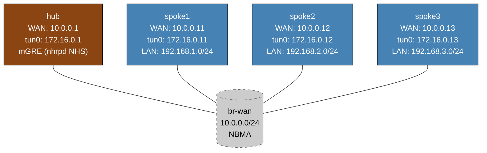

# DMVPN Phase 1 — Linux/FRR Practice Lab

Configure DMVPN Phase 1 hub-and-spoke VPN using mGRE tunnels and NHRP. The hub is fully pre-configured; you configure NHRP registration and OSPF on each spoke using FRR's `vtysh`.

> **Platform note:** This lab uses Linux containers with FRR's `nhrpd` daemon. Arista EOS does not support `ip nhrp`, so the lab runs on `frr-lab:local` with nhrpd v8.4.

---

## Topology



`br-wan` is a Linux bridge simulating the NBMA WAN. All four routers share the same L2 segment; NHRP is what enables address resolution.

### Addressing

| Node   | eth1 (WAN)   | tun0 (tunnel) | lo extras           |
|--------|-------------|----------------|---------------------|
| hub    | 10.0.0.1/24 | 172.16.0.1/24  | 10.0.0.1/32         |
| spoke1 | 10.0.0.11/24| 172.16.0.11/24 | 10.0.0.11/32, 192.168.1.1/24 |
| spoke2 | 10.0.0.12/24| 172.16.0.12/24 | 10.0.0.12/32, 192.168.2.1/24 |
| spoke3 | 10.0.0.13/24| 172.16.0.13/24 | 10.0.0.13/32, 192.168.3.1/24 |

---

## Deploy and access

```bash
sudo containerlab deploy -t labs/dmvpn-phase1/topology.clab.yml

# vtysh on any node
./scripts/lab.sh cli dmvpn-phase1 hub
./scripts/lab.sh cli dmvpn-phase1 spoke1
```

---

## Step 1 — Verify hub baseline

The hub is fully configured (tun0 mGRE, nhrpd as NHS, OSPF point-to-multipoint). Verify before configuring spokes:

```
# On hub (vtysh)
show interface tun0
show ip nhrp
show ip ospf interface tun0
```

`show ip nhrp` will be empty until spokes register. `show ip ospf interface tun0` should show network type `POINT_TO_MULTIPOINT`.

---

## Step 2 — Configure spoke1 NHRP and OSPF

Enter spoke1 vtysh:
```bash
./scripts/lab.sh cli dmvpn-phase1 spoke1
```

Configure NHRP and OSPF on the tunnel:
```
configure terminal
interface tun0
 ip nhrp network-id 1
 ip nhrp holdtime 300
 ip nhrp nhs 172.16.0.1 nbma 10.0.0.1 multicast
 ip nhrp registration no-unique
 ip ospf network point-to-multipoint
 ip ospf area 0.0.0.0
exit
router ospf
 ospf router-id 10.0.0.11
 passive-interface lo
 passive-interface eth1
 network 192.168.1.0/24 area 0
end
write
```

### NHRP parameter explanation

| Command | Purpose |
|---------|---------|
| `ip nhrp network-id 1` | Identifies the DMVPN cloud — must match hub |
| `ip nhrp holdtime 300` | How long the hub keeps this registration (seconds) |
| `ip nhrp nhs 172.16.0.1 nbma 10.0.0.1 multicast` | Register with hub: NHS tunnel IP = 172.16.0.1, hub NBMA (WAN) IP = 10.0.0.1; `multicast` forwards OSPF hellos to hub |
| `ip nhrp registration no-unique` | Allows re-registration from the same NBMA address |
| `ip ospf network point-to-multipoint` | Must match hub's network type — hub is NH for all spokes, no DR/BDR |

---

## Step 3 — Verify spoke1 registration

On hub:
```
show ip nhrp
```

Expected: spoke1's tunnel IP (172.16.0.11) mapped to WAN IP (10.0.0.11).

Check OSPF adjacency:
```
show ip ospf neighbor
```

Spoke1 should appear as `Full`.

---

## Step 4 — Configure spoke2 and spoke3

Repeat Step 2 for spoke2 (router-id `10.0.0.12`, tunnel `172.16.0.12`, LAN `192.168.2.0/24`) and spoke3 (router-id `10.0.0.13`, tunnel `172.16.0.13`, LAN `192.168.3.0/24`). NHS parameters are identical for all spokes.

---

## Step 5 — Verify routing and connectivity

After all spokes are configured, on hub:
```
show ip ospf neighbor
show ip route
```

You should see routes to all spoke LANs (192.168.1/2/3.0/24) via OSPF.

Test spoke-to-spoke (all traffic routes through hub in Phase 1):
```
# On spoke1
ping 192.168.2.1    ← spoke2 LAN (via hub)
ping 192.168.3.1    ← spoke3 LAN (via hub)

# On hub
ping 192.168.1.1    ← spoke1 LAN
ping 192.168.2.1    ← spoke2 LAN
```

Verify Phase 1 routing: the path from spoke1 to spoke2 LAN goes **through the hub**:
```
# On spoke1
ip route show 192.168.2.0/24   ← next-hop should be 172.16.0.1 (hub tunnel IP)
```

---

## Key DMVPN Phase 1 concepts

**mGRE (multipoint GRE):** The hub creates a single GRE tunnel with no fixed `remote`. Linux does this with `ip tunnel add tun0 mode gre local 10.0.0.1 ttl 64 dev eth1`. The hub can accept GRE from any source and nhrpd programs kernel routes back to each spoke.

**NHRP roles:**
- Hub = NHS (Next Hop Server): receives registration packets, maintains NBMA→tunnel-IP mapping table
- Spoke = NHC (Next Hop Client): sends registration to NHS, receives resolution responses

**`ip nhrp redirect`** (hub only): In Phase 1, all traffic is hub-and-spoke so redirect is configured but not actively used. In Phase 2/3, the hub sends redirect messages to trigger spoke-to-spoke shortcuts.

**OSPF `point-to-multipoint`:** On both hub and spokes. p2mp means each spoke sees the hub as a point-to-point neighbor; the hub is always the next-hop for inter-spoke traffic (no shortcut routing in Phase 1).

---

## Troubleshooting

**`show ip nhrp` empty on hub after spoke config**
- Verify WAN reachability: `ping 10.0.0.1` from spoke1's shell (`ip netns exec` not needed — just `ping 10.0.0.1 -I eth1`)
- Confirm `ip nhrp network-id 1` matches on both hub and spoke
- Check nhrpd is running: `systemctl status frr` or `show ip nhrp nhs`

**OSPF not forming**
- `show ip ospf interface tun0` on spoke — network type must be `POINT_TO_MULTIPOINT`
- OSPF hellos are forwarded by nhrpd from spoke to hub via `multicast` keyword in `ip nhrp nhs`
- Ensure `network 0.0.0.0/0 area 0` OR `ip ospf area 0.0.0.0` is set on tun0

**Routes not propagated**
- `show ip ospf database` — check if LSAs from all routers are present
- Verify `passive-interface eth1` so OSPF doesn't try to form neighbours on the WAN link

---

## Cleanup

```bash
sudo containerlab destroy -t labs/dmvpn-phase1/topology.clab.yml --cleanup
```
