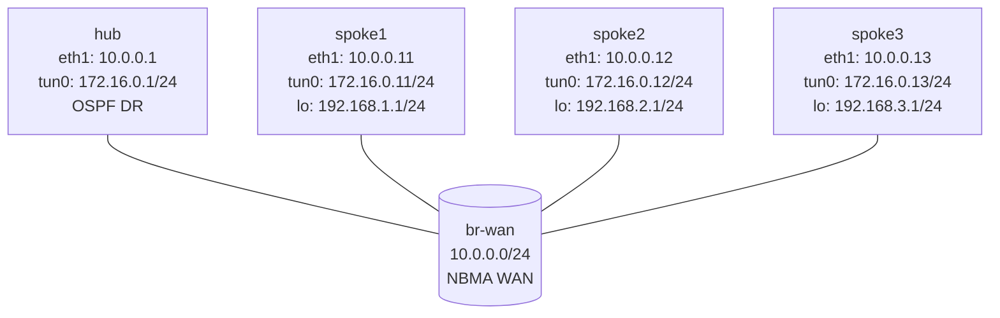

# DMVPN Phase 2 — Practice Lab (VyOS)

Phase 1 forced all spoke-to-spoke traffic through the hub. Phase 2 fixes
that: with NHRP `shortcut`/`redirect` and OSPF carrying the *remote
spoke's* tunnel IP as the next hop, spokes resolve each other on demand and
build **direct** spoke-to-spoke tunnels. You finish the spokes and watch
the first packet take the hub path while NHRP carves a shortcut behind it.

## Topology



**Pre-built:** hub WAN/mGRE, hub NHRP NHS with `redirect`, hub OSPF
**broadcast** mode at priority 10, spoke WAN IPs, spoke LANs, spoke GRE
interfaces. **You configure:** each spoke's NHRP (with `shortcut`) and
OSPF (broadcast, priority 0 so spokes never win DR).

## How to use this lab

This is a **practice lab**, not a tutorial.

- **Predict before you configure**, **open hints before the solution**,
  **verify** with `show ip nhrp` and `traceroute`.

> If you haven't done the **dmvpn-phase1** lab, do it first — the NHRP/
> NHS mechanics are introduced there; this lab assumes them.

## Deploy

```bash
./scripts/lab.sh deploy dmvpn-phase2
./scripts/lab.sh cli dmvpn-phase2 spoke1
```

---

## Task 1 — Configure the spokes for shortcuts

**Objective:** On each spoke add NHRP (network-id 1, NHS to the hub,
multicast, and `shortcut`) and OSPF in **broadcast** mode with
**priority 0**, advertising the tunnel /24 and the LAN.

**Predict first:** the hub runs OSPF broadcast at priority 10 and spokes
at priority 0. On a broadcast network OSPF elects a DR. Which device will
*always* be the DR here, and why is it essential that no spoke ever wins
that election?

<details markdown="1">
<summary>Hints</summary>

- NHRP as in Phase 1, **plus** `protocols nhrp tunnel tun0 shortcut`.
- OSPF: `interface tun0 network 'broadcast'` and `interface tun0 priority
  '0'`; advertise `172.16.0.0/24` and the LAN; `eth1` passive.

</details>

<details markdown="1">
<summary>Solution</summary>

On **spoke1** (spoke2/spoke3 mirror with their router-id, LAN):
```vyos
configure
set protocols nhrp tunnel tun0 network-id '1'
set protocols nhrp tunnel tun0 holdtime '300'
set protocols nhrp tunnel tun0 nhs tunnel-ip '172.16.0.1' nbma '10.0.0.1'
set protocols nhrp tunnel tun0 map tunnel-ip '172.16.0.1' nbma '10.0.0.1'
set protocols nhrp tunnel tun0 multicast '10.0.0.1'
set protocols nhrp tunnel tun0 registration-no-unique
set protocols nhrp tunnel tun0 shortcut
set protocols ospf parameters router-id '10.0.0.11'
set protocols ospf area 0 network '172.16.0.0/24'
set protocols ospf area 0 network '192.168.1.0/24'
set protocols ospf interface eth1 passive
set protocols ospf interface tun0 network 'broadcast'
set protocols ospf interface tun0 priority '0'
commit
save
```

</details>

<details markdown="1">
<summary>Check your work</summary>

`show ip ospf neighbor` on the hub shows it as DR and every spoke as
DROTHER. Prediction answer: the hub must *always* be DR because it's the
only node with full reachability to every spoke on the NBMA — if a spoke
(which can't reach all the others at boot) won DR, OSPF adjacencies would
break. Priority 0 makes spokes ineligible. The big difference from Phase
1: OSPF now hands spokes the *remote spoke's* tunnel IP as the next hop
(not the hub's), which is the prerequisite for a direct shortcut.

</details>

---

## Task 2 — Watch a spoke-to-spoke shortcut form

**Objective:** From spoke1, reach spoke2's LAN repeatedly and observe the
path change as NHRP resolves a direct tunnel.

**Predict first:** the *first* packet from spoke1 to spoke2 — does it go
direct or via the hub? What does NHRP do in response, and what will a
*second* traceroute (a few seconds later) show?

```vyos
traceroute 192.168.2.1
show ip nhrp
traceroute 192.168.2.1
```

<details markdown="1">
<summary>Check your work</summary>

The first traceroute goes **through the hub**; the hub sends an NHRP
**redirect** telling spoke1 "resolve spoke2 directly." spoke1 NHRP-
resolves spoke2's tunnel→NBMA mapping, installs it (`show ip nhrp` now
lists spoke2 directly), and the *second* traceroute goes **direct** —
spoke1 to spoke2, no hub. That's the Phase 2 win: the hub bootstraps the
relationship, then steps out of the data path. The tradeoff vs. Phase 3
(next lab): in Phase 2 the spokes still need full routing detail for
remote LANs; Phase 3 lets the hub summarize and relies entirely on NHRP
for the specifics.

</details>

---

## Task 3 — Break it: kill the hub after the shortcut exists

**Objective:** Once a spoke1↔spoke2 shortcut is established, shut the hub
(or its tunnel) and test whether existing spoke-to-spoke traffic survives.

**Predict first:** with a direct shortcut already built, does spoke1→
spoke2 keep working when the hub goes away, or does it break? What about
spoke1→spoke3 (no shortcut yet)?

<details markdown="1">
<summary>What you should observe</summary>

An *established* shortcut keeps forwarding for as long as its NHRP entry
lives — the data plane is direct and doesn't need the hub. But anything
requiring *new* resolution (spoke1→spoke3 with no prior shortcut, or the
shortcut expiring and needing refresh) fails, because only the hub can
broker new mappings and run the OSPF control plane. So the hub is no
longer in the *data* path but is still essential to the *control* plane —
which is precisely why production DMVPN runs dual hubs. Restore the hub
and confirm new shortcuts can form again.

</details>

---

## Verification

```vyos
show ip nhrp
show ip ospf neighbor
show ip route ospf
traceroute 192.168.2.1
```

```bash
./scripts/lab.sh check dmvpn-phase2
```

---

## Challenge questions

No answers provided — reason them through.

1. Phase 2 uses OSPF **broadcast** with the hub as forced DR; Phase 3 (next
   lab) uses **point-to-multipoint** plus summarization. What problem does
   broadcast-mode Phase 2 have as the number of spokes grows into the
   hundreds, and how does Phase 3 sidestep it?
2. A spoke-to-spoke shortcut is direct, but the two spokes may sit behind
   different NAT devices. Explain why spoke-to-spoke shortcuts are
   notoriously fragile across NAT, and what the hub still has to do.
3. NHRP entries have a holdtime (300s here). Walk through what happens to
   an idle shortcut after holdtime expires, and the user-visible effect on
   the first packet of a renewed conversation.
4. Compare Phase 2's "full routes + direct data plane" with Phase 3's
   "summary route + NHRP-driven specifics." Which scales the spoke routing
   table better, and what does each cost in convergence behavior?

## Cleanup

```bash
./scripts/lab.sh destroy dmvpn-phase2
```
